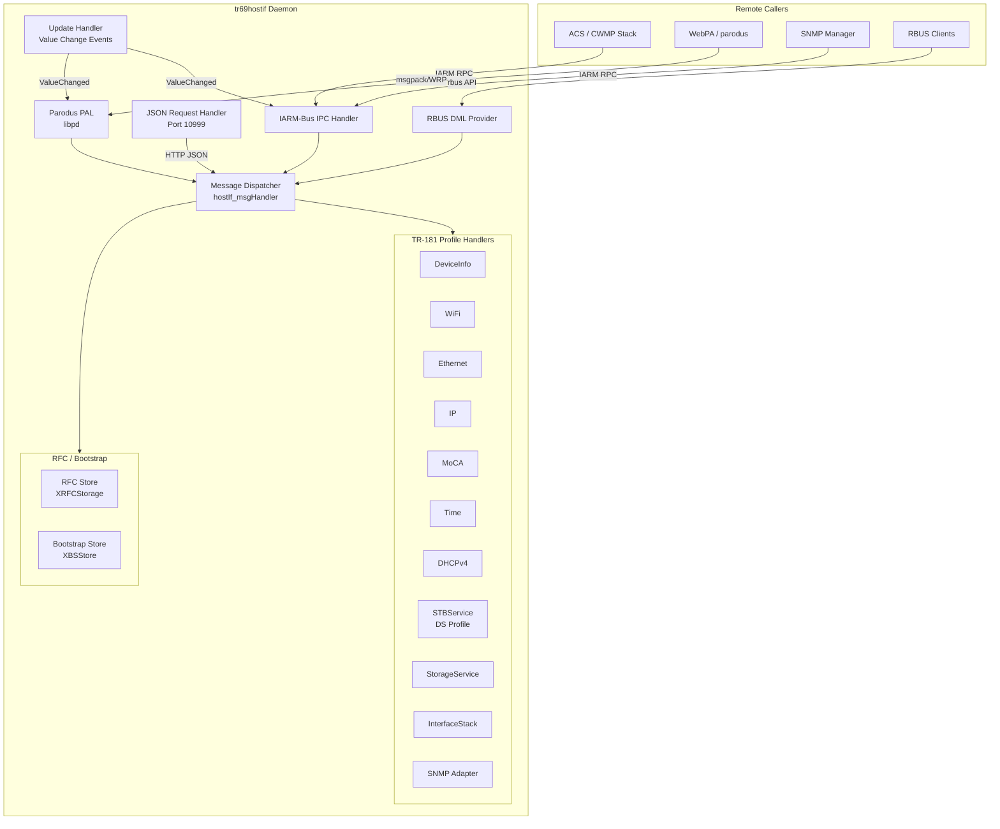
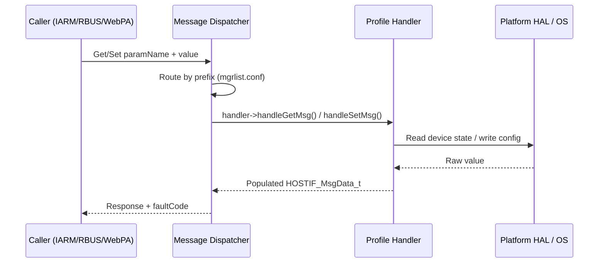
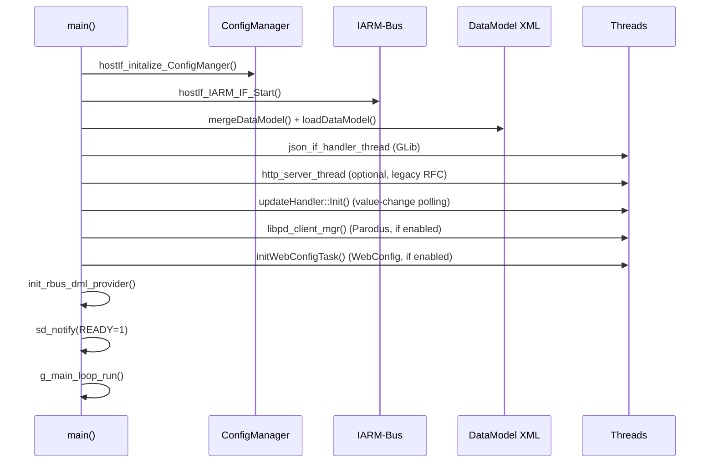

# tr69hostif — TR-069 Host Interface Manager

[](LICENSE)
[](CHANGELOG.md)

## Overview

`tr69hostif` is the **TR-069 Host Interface Manager** for RDK-based devices. It acts as the central broker between remote management infrastructure (ACS, WebPA/Parodus) and the TR-181 data model implemented on the device. Any component that needs to read or write TR-181 parameters — including the CWMP stack, WebPA gateway, RFC override system, and SNMP bridge — routes its requests through `tr69hostif`.

The daemon runs as a persistent systemd service, initializes all TR-181 profile handlers at startup, and then services get/set requests over multiple IPC channels simultaneously.

## Architecture

### High-Level Component Diagram



### Request Flow



### Startup Sequence



## Key Components

### Core Daemon (`src/hostif/src/`)

| File | Purpose |
|------|---------|
| `hostIf_main.cpp` | `main()` entry point: argument parsing, signal handling, thread lifecycle, GLib main loop |
| `hostIf_utils.cpp` | Utility helpers: type conversion, reset state machine, gateway connectivity |
| `IniFile.cpp` | INI file parser used by RFC and Bootstrap stores |

### Request Handlers (`src/hostif/handlers/`)

| Handler | IARM Bus Manager Token | TR-181 Subtree |
|---------|----------------------|----------------|
| `hostIf_DeviceClient_ReqHandler` | `deviceMgr` | `Device.DeviceInfo.*` |
| `hostIf_WiFi_ReqHandler` | `wifiMgr` | `Device.WiFi.*` |
| `hostIf_EthernetClient_ReqHandler` | `ethernetMgr` | `Device.Ethernet.*` |
| `hostIf_IPClient_ReqHandler` | `ipMgr` | `Device.IP.*` |
| `hostIf_MoCAClient_ReqHandler` | `mocaMgr` | `Device.MoCA.*` |
| `hostIf_TimeClient_ReqHandler` | `timeMgr` | `Device.Time.*` |
| `hostIf_DHCPv4Client_ReqHandler` | `dhcpv4Mgr` | `Device.DHCPv4.*` |
| `hostIf_dsClient_ReqHandler` | `dsMgr` | `Device.Services.STBService.*` |
| `hostIf_StorageSrvc_ReqHandler` | `storageSrvcMgr` | `Device.Services.StorageService.*` |
| `hostIf_InterfaceStackClient_ReqHandler` | `intfStackMgr` | `Device.InterfaceStack.*` |
| `hostIf_SNMPClient_ReqHandler` | `snmpAdapterMgr` | `Device.X_RDKCENTRAL-COM.*` (SNMP bridge) |
| `hostIf_rbus_Dml_Provider` | — | Exposes all registered params over RBUS |
| `hostIf_updateHandler` | — | Polls profiles for value changes; publishes IARM events |
| `hostIf_NotificationHandler` | — | Queues value-change notifications to Parodus |

All handlers inherit from the abstract `msgHandler` base class. The `hostIf_msgHandler.cpp` dispatcher instantiates each handler at startup and routes requests by matching the parameter name prefix against the manager map loaded from `tr69hostIf.conf`.

### TR-181 Profiles (`src/hostif/profiles/`)

Each subdirectory implements one or more TR-181 objects. Profiles contain the business logic: they read HAL APIs (IARM Device Settings, wifihal, platform sysfs, etc.) and translate results to/from `HOSTIF_MsgData_t`.

| Profile Directory | TR-181 Object | Key Dependencies |
|-------------------|---------------|-----------------|
| `DeviceInfo/` | `Device.DeviceInfo` | IARM, rfcapi, rfcdefaults, partners\_defaults.json |
| `wifi/` | `Device.WiFi` | wifihal (libwifi) |
| `Ethernet/` | `Device.Ethernet` | sysfs, IARM |
| `IP/` | `Device.IP` | netlink / sysfs |
| `moca/` | `Device.MoCA` | IARM mocaMgr |
| `Time/` | `Device.Time` | NTP daemon, chrony |
| `DHCPv4/` | `Device.DHCPv4` | udhcpc / dnsmasq |
| `STBService/` | `Device.Services.STBService` | IARM Device Settings (DS) |
| `StorageService/` | `Device.Services.StorageService` | sysfs block devices |
| `InterfaceStack/` | `Device.InterfaceStack` | sysfs |
| `Device/` | `Device.*` (root object) | — |

### RFC & Bootstrap Subsystem (`src/hostif/profiles/DeviceInfo/`)

| Class | File | Purpose |
|-------|------|---------|
| `XRFCStorage` | `XrdkCentralComRFC.cpp` | Persists RFC override values in an INI file under `/opt/secure/RFC/` |
| `XBSStore` | `XrdkCentralComBSStore.cpp` | Loads per-partner bootstrap defaults from `partners_defaults.json`; owns the background partner-ID resolution thread |
| `XBSStoreJournal` | `XrdkCentralComBSStoreJournal.cpp` | Append-only journal for bootstrap value changes |

RFC parameter precedence (highest to lowest):

```
RFC Override (/opt/secure/RFC/) > WebPA Set > Bootstrap Default > Firmware Default
```

### Parodus / WebPA Client (`src/hostif/parodusClient/pal/`)

| File | Purpose |
|------|---------|
| `libpd.cpp` | Connects to `parodus` process; manages the recv-wait thread |
| `webpa_adapter.cpp` | Translates libparodus WRP messages to `HOSTIF_MsgData_t` |
| `webpa_parameter.cpp` | GetParam / SetParam over WebPA |
| `webpa_attribute.cpp` | GetAttr / SetAttr over WebPA |
| `webpa_notification.cpp` | Pushes value-change events back to parodus |

### HTTP Server (`src/hostif/httpserver/`)

An optional Mongoose-based HTTP server (disabled when `NEW_HTTP_SERVER_DISABLE` is defined or when the Legacy RFC feature flag is active). Provides a local REST endpoint used during RFC migration. Controlled at runtime by `/opt/RFC/.RFC_LegacyRFCEnabled.ini`.

### SNMP Adapter (`src/hostif/snmpAdapter/`)

Maps selected `Device.X_RDKCENTRAL-COM.*` parameters to SNMP OIDs defined in `conf/tr181_snmpOID.conf`. Enabled at build time with `--enable-snmp-adapter`.

## Threading Model

| Thread | Name | How Created | Purpose |
|--------|------|------------|---------|
| Main | `main` | OS | Init, GLib main loop |
| Shutdown | `shutdown_thread` | `pthread_create` | Waits on semaphore; calls `exit_gracefully()` on signal |
| JSON Handler | `json_if_handler_thread` | `g_thread_try_new` | Services JSON-over-socket requests |
| HTTP Server | `http_server_thread` | `g_thread_try_new` | Optional legacy HTTP RFC endpoint |
| Update Handler | `updateHandler` | `g_thread_try_new` | Polls profiles for value changes; fires IARM / Parodus events |
| Parodus Init | `parodus_init_tid` | `pthread_create` | Connects to parodus daemon, starts recv loop |
| WebConfig | `webconfig_threadId` | `pthread_create` | Handles WebConfig Lite document processing |
| Partner ID | `partnerIdThread` | `std::thread` (inside `XBSStore`) | Resolves partner ID asynchronously at boot |

### Synchronization

```c
// Signal → shutdown path
sem_t       shutdown_thread_sem;          // Main signals shutdown thread
pthread_mutex_t graceful_exit_mutex;      // Protects shutdown sequence

// HTTP server startup handshake
std::mutex              mtx_httpServerThreadDone;
std::condition_variable cv_httpServerThreadDone;

// Bootstrap store
static recursive_mutex  XBSStore::mtx;   // Guards m_dict cache
static mutex            XBSStore::mtx_stopped;
static condition_variable XBSStore::cv;

// Notification queue (lock-free)
GAsyncQueue* NotificationHandler::notificationQueue;
```

**Lock ordering**: No nested lock acquisitions exist across manager threads; each subsystem owns its own mutex. The GLib `GAsyncQueue` is used for the notification path to avoid blocking the update handler.

## Data Structures

### `HOSTIF_MsgData_t` — the universal request/response envelope

```c
typedef struct _HostIf_MsgData_t {
    char   paramName[4096];     // Full TR-181 parameter path
    char   paramValue[4096];    // Value as string
    char  *paramValueLong;      // Heap buffer for values > 4096 bytes
    char   transactionID[256];  // Correlation ID (WebPA / CWMP)
    short  paramLen;            // Byte length of paramValue
    short  instanceNum;         // Object instance number
    HostIf_ParamType_t  paramtype;   // String/Int/Bool/DateTime/ULong
    HostIf_ReqType_t    reqType;     // GET / SET / GETATTRIB / SETATTRIB
    faultCode_t         faultCode;   // TR-069 fault code (0 = success)
    HostIf_Source_Type_t requestor;  // WEBPA / RFC / IARM / DEFAULT
    HostIf_Source_Type_t bsUpdate;   // Bootstrap source level
    bool isLengthyParam;             // true → use paramValueLong
} HOSTIF_MsgData_t;
```

### Fault Codes

| Code | Name | Meaning |
|------|------|---------|
| 0 | `fcNoFault` | Success |
| 9000 | `fcMethodNotSupported` | RPC not implemented |
| 9001 | `fcRequestDenied` | Access denied |
| 9002 | `fcInternalError` | Unexpected internal failure |
| 9003 | `fcInvalidArguments` | Bad arguments |
| 9004 | `fcResourcesExceeded` | Resource limit hit |
| 9005 | `fcInvalidParameterName` | Unknown parameter |
| 9006 | `fcInvalidParameterType` | Type mismatch |
| 9007 | `fcInvalidParameterValue` | Value out of range or invalid |
| 9008 | `fcAttemptToSetaNonWritableParameter` | Read-only parameter |

## Configuration

### `conf/tr69hostIf.conf`

```ini
[HOSTIF_DM_PROFILE_MGR]
Device.DeviceInfo=deviceMgr
Device.Services.STBService=dsMgr
Device.Services.StorageService=storageSrvcMgr
Device.MoCA=mocaMgr
Device.Ethernet=ethernetMgr
Device.IP=ipMgr
Device.Time=timeMgr
Device.WiFi=wifiMgr

[HOSTIF_JSON_CONFIG]
PORT=10999

[HOSTIF_CONFIG]
REBOOT_SCR="/rebootNow.sh -s tr69hostIfReset"
RDK_SCR_PATH=/lib/rdk
NTP_FILE_NAME=/opt/persistent/firstNtpTime
FW_DWN_FILE_PATH=/opt/fwdnldstatus.txt
```

The `[HOSTIF_DM_PROFILE_MGR]` section defines which manager handles each TR-181 subtree prefix. The dispatcher matches incoming parameter names against these prefixes to route requests.

### Runtime Feature Flags (RFC)

| Path | Feature |
|------|---------|
| `/opt/RFC/.RFC_LegacyRFCEnabled.ini` | Enable legacy HTTP server instead of new HTTP server |
| `/opt/secure/RFC/.RFC_<FEATURE>.ini` | General RFC feature toggles (created by `XRFCStorage`) |
| `/opt/debug.ini` | RDK logger configuration |

### Build-Time Feature Flags (`configure.ac`)

| Configure Flag | Preprocessor Define | Effect |
|----------------|--------------------|----|
| `--enable-parodus` | `PARODUS_ENABLE` | Enable WebPA/Parodus client |
| `--disable-new-http-server` | `NEW_HTTP_SERVER_DISABLE` | Remove internal HTTP server |
| `--enable-snmp-adapter` | `SNMP_ADAPTER_ENABLED` | Include SNMP OID bridge |
| `--enable-webpa-rfc` | `WEBPA_RFC_ENABLED` | Guard service on RFC flag |
| `--enable-rbus` | *(rbus linkage)* | Enable RBUS DML provider |
| `--enable-t2` | `T2_EVENT_ENABLED` | Telemetry 2.0 markers |
| `--enable-webconfig` | `WEB_CONFIG_ENABLED` | WebConfig multipart support |
| `--enable-webconfig-lite` | `WEBCONFIG_LITE_ENABLE` | WebConfig Lite |
| `--enable-wifi` | `USE_WIFI_PROFILE` | WiFi profile handlers |
| `--enable-moca` | *(moca linkage)* | MoCA profile handlers |

## Build & Install

### Prerequisites

| Dependency | Minimum Version | Notes |
|------------|----------------|-------|
| GCC / G++ | 7+ | C++17 required |
| GLib 2 | 2.32+ | GThread, GMainLoop, GAsyncQueue |
| libcurl | 7.65+ | Used by DeviceInfo utilities |
| IARM Bus | — | RDK platform IPC |
| libparodus | — | Required with `--enable-parodus` |
| rbus | — | Required with `--enable-rbus` |
| safec | — | Safe string functions (`strcpy_s`, etc.) |
| cJSON | — | JSON parsing |
| OpenSSL | 1.1.1+ | TLS for HTTP server |

### Build Steps

```bash
# Generate build system
autoreconf -iv

# Configure (example for a typical RDK broadband build)
./configure \
    --enable-parodus \
    --enable-rbus \
    --enable-wifi \
    --enable-moca \
    --enable-t2

# Build
make -j$(nproc)

# Install
make install
```

### Run

```bash
# Typical invocation (as managed by systemd)
/usr/bin/tr69hostIf -c /etc/tr69hostIf.conf -p 10000

# Options
#  -c <file>   Configuration file path
#  -p <port>   IARM listen port
#  -s <port>   HTTP server port (legacy mode only)
#  -l <file>   Log file path
#  -h          Show usage
```

The provided systemd unit files are:
- `tr69hostif.service` — standard deployment
- `tr69hostif_no_new_http_server.service` — deployment with `NEW_HTTP_SERVER_DISABLE`

## Testing

### Unit Tests

```bash
# Build and run unit tests
./run_ut.sh
```

Unit tests live under `src/unittest/` and `src/hostif/**/gtest/`. They use **Google Test** and rely on stub headers under `src/unittest/stubs/` to isolate the daemon from IARM, DS, and other platform dependencies.

Key test areas:

| Test Suite | Location | Coverage |
|------------|----------|----------|
| RFC Store | `profiles/DeviceInfo/gtest/` | `XRFCStorage` get/set/clear |
| Bootstrap Store | `profiles/DeviceInfo/gtest/` | `XBSStore` partner loading |
| JSON Handler | `handlers/src/gtest/` | Request parsing and routing |
| IARM Handler | `handlers/src/gtest/` | IARM RPC dispatch |
| IniFile | `src/gtest/` | INI parser correctness |

### Integration / L2 Tests

```bash
# Run L2 integration tests (requires Docker)
./run_l2.sh
```

L2 tests live under `src/integrationtest/` (configuration fixtures) and `test/functional-tests/` (Behave BDD scenarios). They exercise the full daemon end-to-end against mock IARM and RFC infrastructure.

## Directory Reference

```
tr69hostif/
├── configure.ac                   # Autoconf top-level
├── Makefile.am                    # Top-level Automake
├── conf/                          # Runtime configuration
│   ├── tr69hostIf.conf            # Manager-to-prefix mapping
│   ├── mgrlist.conf               # Manager list
│   ├── tr181_snmpOID.conf         # SNMP OID mappings
│   └── rfcdefaults/
│       └── tr69hostif.ini         # RFC default values
├── src/
│   ├── backgroundrun.c            # Helper to run scripts in background
│   └── hostif/
│       ├── src/                   # Core daemon source
│       ├── include/               # Core public headers
│       ├── handlers/              # Request dispatching layer
│       ├── profiles/              # TR-181 object implementations
│       ├── parodusClient/         # WebPA / Parodus PAL
│       ├── httpserver/            # Optional HTTP server
│       └── snmpAdapter/           # SNMP bridge
├── test/
│   └── functional-tests/          # BDD integration tests (Behave)
└── scripts/
    └── validateDataModel.py       # Data model XML validation utility
```

## Logging

tr69hostif uses the RDK Logger (`rdk_debug.h`). Log levels map to standard RDK levels: `FATAL`, `ERROR`, `WARN`, `NOTICE`, `INFO`, `DEBUG`, `TRACE1/2`.

The log category is `LOG_TR69HOSTIF`. To enable verbose logging at runtime, add the following to `/opt/debug.ini`:

```ini
LOG.RDK.TR69HOSTIF = DEBUG
```

Telemetry 2.0 markers (when `T2_EVENT_ENABLED` is defined) are emitted via `t2_event_s()` / `t2_event_d()` for key lifecycle events.

## Platform Notes

### RDKB (Broadband Gateway)
- Uses IARM-Bus for all cross-process communication.
- WiFi parameters delegate to the `wifihal` abstraction layer.
- RFC overrides stored under `/opt/secure/RFC/`.
- Bootstrap defaults loaded from `/etc/partners_defaults.json` or `/opt/partners_defaults.json`.

### RDKV (Video/STB)
- `RDKV_TR69` compile flag activates STB-specific code paths.
- DS (Device Settings) profile enabled; STBService provides HDMI, FPD, audio, and video object support.
- Base data model file: `/etc/data-model.xml` merged with device-type overlays at startup.

### General Constraints
- Minimum 64 MB RAM recommended.
- ARMv7 or better CPU.
- GLib 2 event loop required (no bare POSIX event loop replacement).

## Contributing

See [CONTRIBUTING.md](CONTRIBUTING.md). All contributions require signing the RDK Contributor License Agreement.

## License

Licensed under the [Apache License, Version 2.0](LICENSE).

Copyright 2016 RDK Management.

## See Also

- [CHANGELOG](CHANGELOG.md) — Release history
- [conf/tr69hostIf.conf](conf/tr69hostIf.conf) — Runtime configuration reference
- [run_ut.sh](run_ut.sh) — Unit test runner
- [run_l2.sh](run_l2.sh) — L2 integration test runner
