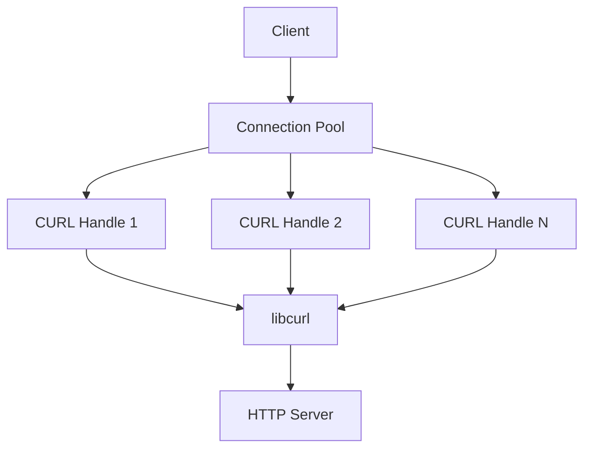
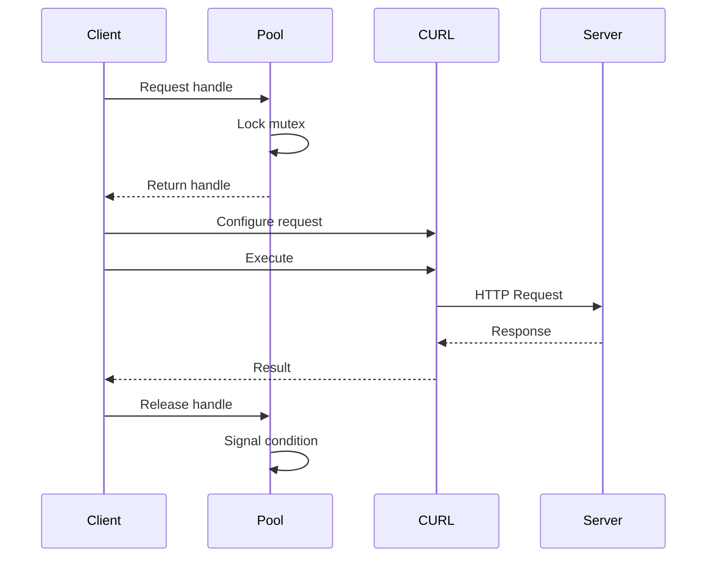
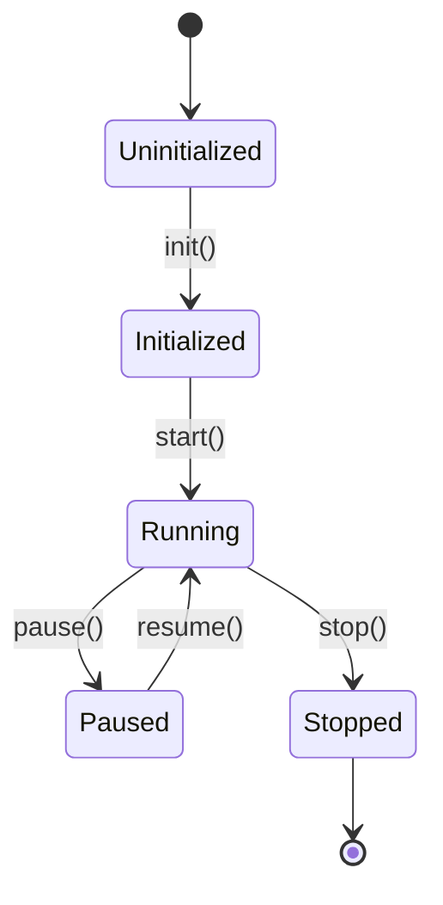
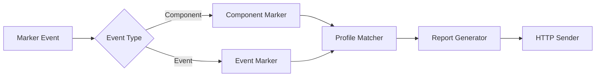
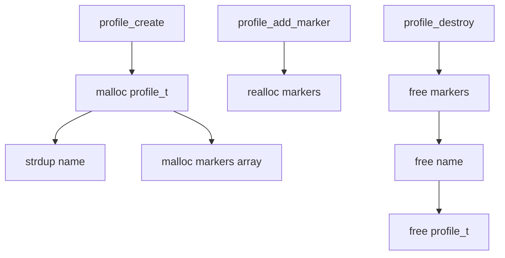

# Technical Documentation Writer for Embedded Systems

## Purpose

Create clear, comprehensive, and maintainable technical documentation for embedded C/C++ projects, with focus on architecture, APIs, threading models, memory management, and platform integration.

## Usage

Invoke this skill when:
- Documenting new features or components
- Creating system architecture documentation
- Writing API reference documentation
- Documenting threading and synchronization models
- Creating developer onboarding guides
- Documenting debugging procedures
- Writing integration guides for platform vendors

## Documentation Structure

### Directory Layout

```
project/
├── README.md                          # Project overview, quick start
├── docs/                              # General documentation
│   ├── README.md                      # Documentation index
│   ├── architecture/                  # System architecture
│   │   ├── overview.md               # High-level architecture
│   │   ├── component-diagram.md      # Component relationships
│   │   ├── threading-model.md        # Threading architecture
│   │   └── data-flow.md              # Data flow diagrams
│   ├── api/                          # API documentation
│   │   ├── public-api.md            # Public API reference
│   │   └── internal-api.md          # Internal API reference
│   ├── integration/                  # Integration guides
│   │   ├── build-setup.md           # Build environment setup
│   │   ├── platform-porting.md      # Porting to new platforms
│   │   └── testing.md               # Test procedures
│   └── troubleshooting/             # Debug guides
│       ├── memory-issues.md         # Memory debugging
│       ├── threading-issues.md      # Thread debugging
│       └── common-errors.md         # Common error solutions
└── source/                           # Source code
    └── docs/                         # Component-specific docs
        ├── bulkdata/                 # Mirrors source structure
        │   ├── README.md            # Component overview
        │   └── profile-management.md
        ├── protocol/
        │   ├── README.md
        │   └── http-architecture.md
        └── scheduler/
            ├── README.md
            └── scheduling-algorithm.md
```

### Document Types

#### 1. **Architecture Documentation** (`docs/architecture/`)
- System overview and design principles
- Component relationships and dependencies
- Threading and concurrency models
- Data flow and state machines
- Memory management strategies
- Platform abstraction layers

#### 2. **API Documentation** (`docs/api/`)
- Public API reference with examples
- Internal API documentation
- Function contracts and preconditions
- Thread-safety guarantees
- Memory ownership semantics
- Error handling conventions

#### 3. **Component Documentation** (`source/docs/`)
- Per-component technical details
- Algorithm explanations
- Implementation notes
- Performance characteristics
- Resource usage (memory, CPU, threads)
- Dependencies and interfaces

#### 4. **Integration Guides** (`docs/integration/`)
- Build system setup
- Platform porting guides
- Configuration options
- Testing procedures
- Deployment checklists

#### 5. **Troubleshooting Guides** (`docs/troubleshooting/`)
- Common error scenarios
- Debug techniques
- Log analysis
- Memory profiling
- Thread race detection

## Documentation Process

### Step 1: Analyze the Code

Before writing documentation:

1. **Read the source code** - Understand implementation
2. **Identify key abstractions** - Classes, structs, modules
3. **Map dependencies** - What calls what, data flow
4. **Find synchronization** - Mutexes, conditions, atomics
5. **Trace resource lifecycle** - Allocations, ownership, cleanup
6. **Review existing docs** - Check for patterns and style

### Step 2: Create Structure

For each component:

```markdown
# Component Name

## Overview
Brief 2-3 sentence description of purpose and role.

## Architecture
High-level design with diagrams.

## Key Components
List main structures, functions, modules.

## Threading Model
How threads interact, synchronization primitives.

## Memory Management
Allocation patterns, ownership, lifecycle.

## API Reference
Public functions with signatures and examples.

## Usage Examples
Common use cases with code snippets.

## Error Handling
Error codes, failure modes, recovery.

## Performance Considerations
Resource usage, bottlenecks, optimization tips.

## Platform Notes
Platform-specific behavior or requirements.

## Testing
How to test, test coverage, known issues.

## See Also
Cross-references to related documentation.
```

### Step 3: Add Diagrams

Use Mermaid for visual documentation:

#### Component Diagram


#### Sequence Diagram


#### State Diagram


#### Data Flow Diagram


### Step 4: Add Code Examples

Provide clear, compilable examples:

#### Good Example Structure
```markdown
### Example: Creating a Profile

This example shows how to create and configure a telemetry profile.

**Prerequisites:**
- Telemetry system initialized
- Valid configuration file

**Code:**
```c
#include "profile.h"
#include <stdio.h>

int main(void) {
    profile_t* profile = NULL;
    int ret = 0;
    
    // Create profile with name and interval
    ret = profile_create("MyProfile", 60, &profile);
    if (ret != 0) {
        fprintf(stderr, "Failed to create profile: %d\n", ret);
        return -1;
    }
    
    // Add marker to profile
    ret = profile_add_marker(profile, "Component.Status", 
                            MARKER_TYPE_COMPONENT);
    if (ret != 0) {
        fprintf(stderr, "Failed to add marker: %d\n", ret);
        profile_destroy(profile);
        return -1;
    }
    
    // Activate profile
    ret = profile_activate(profile);
    if (ret != 0) {
        fprintf(stderr, "Failed to activate profile: %d\n", ret);
        profile_destroy(profile);
        return -1;
    }
    
    printf("Profile created and activated successfully\n");
    
    // Cleanup
    profile_destroy(profile);
    return 0;
}
```

**Expected Output:**
```
Profile created and activated successfully
```

**Notes:**
- Always check return values
- Call profile_destroy() even on error paths
- Profile name must be unique
```
\`\`\`

### Step 5: Document APIs

For each public function:

```markdown
### profile_create()

Creates a new telemetry profile.

**Signature:**
```c
int profile_create(const char* name, 
                  unsigned int interval_sec,
                  profile_t** out_profile);
```

**Parameters:**
- `name` - Unique profile name (max 63 chars, non-NULL)
- `interval_sec` - Reporting interval in seconds (min: 60, max: 86400)
- `out_profile` - Output pointer to created profile (must be non-NULL)

**Returns:**
- `0` - Success
- `-EINVAL` - Invalid parameter (NULL name/out_profile, invalid interval)
- `-ENOMEM` - Memory allocation failed
- `-EEXIST` - Profile with same name already exists

**Thread Safety:**
Thread-safe. Uses internal mutex for profile list management.

**Memory:**
Allocates memory for profile structure and name copy. Caller must call 
`profile_destroy()` to free resources.

**Example:**
See [Example: Creating a Profile](#example-creating-a-profile)

**See Also:**
- profile_destroy()
- profile_activate()
- profile_add_marker()
```

### Step 6: Document Threading

For multi-threaded components:

```markdown
## Threading Model

### Thread Overview

| Thread Name | Purpose | Priority | Stack Size |
|------------|---------|----------|------------|
| Main | Initialization, message loop | Normal | Default |
| XConf Fetch | Configuration retrieval | Low | 64KB |
| Report Send | HTTP report transmission | Low | 64KB |
| Event Receiver | Marker event processing | High | 32KB |

### Synchronization Primitives

```c
// Global mutexes
static pthread_mutex_t pool_mutex = PTHREAD_MUTEX_INITIALIZER;
static pthread_mutex_t profile_mutex = PTHREAD_MUTEX_INITIALIZER;

// Condition variables
static pthread_cond_t pool_cond = PTHREAD_COND_INITIALIZER;
static pthread_cond_t xconf_cond = PTHREAD_COND_INITIALIZER;
```

### Lock Ordering

To prevent deadlocks, always acquire locks in this order:

1. `profile_mutex` (profile list)
2. `pool_mutex` (connection pool)
3. Individual profile locks

**Example:**
```c
// CORRECT: Proper lock ordering
pthread_mutex_lock(&profile_mutex);
profile_t* p = find_profile_locked(name);
pthread_mutex_lock(&pool_mutex);
// ... use both resources ...
pthread_mutex_unlock(&pool_mutex);
pthread_mutex_unlock(&profile_mutex);

// WRONG: Deadlock risk!
pthread_mutex_lock(&pool_mutex);
pthread_mutex_lock(&profile_mutex);  // May deadlock!
```

### Thread Safety Guarantees

| Function | Thread Safety | Notes |
|----------|---------------|-------|
| profile_create() | Thread-safe | Uses profile_mutex |
| profile_destroy() | Thread-safe | Uses profile_mutex |
| profile_add_marker() | Not thread-safe | Call before activation only |
| send_report() | Thread-safe | Uses pool_mutex |
```

### Step 7: Document Memory Management

```markdown
## Memory Management

### Allocation Patterns



### Ownership Rules

1. **profile_t**: Owned by caller after profile_create()
2. **Marker strings**: Copied; caller retains original ownership
3. **Report data**: Owned by sender; freed after transmission

### Lifecycle Example

```c
// Creation phase
profile_t* prof = NULL;
profile_create("test", 60, &prof);  // Allocates memory

// Configuration phase
profile_add_marker(prof, "mark1", TYPE_EVENT);  // May realloc
profile_add_marker(prof, "mark2", TYPE_EVENT);  // May realloc

// Active phase - no allocations
profile_activate(prof);

// Destruction phase
profile_destroy(prof);  // Frees all memory
prof = NULL;            // Prevent use-after-free
```

### Memory Budget

Typical memory usage per component:

| Component | Static | Dynamic (per item) | Notes |
|-----------|--------|-------------------|-------|
| Profile | 128 bytes | +32 bytes/marker | Preallocated list |
| Connection Pool | 512 bytes | +256 bytes/handle | Max 5 handles |
| Report Buffer | 0 | 64KB | Temporary, freed after send |

**Total typical footprint**: ~150KB (5 profiles, 3 connections, 1 report)
```

## Best Practices

### Writing Style

1. **Be Concise**: Get to the point quickly
2. **Be Specific**: Use exact terms, not vague descriptions
3. **Be Accurate**: Test all code examples
4. **Be Complete**: Don't leave critical details unstated
5. **Be Consistent**: Follow established patterns

### Code Examples

- **Always compile-test** examples before documenting
- **Show error handling** - embedded systems need robust code
- **Include cleanup** - demonstrate proper resource management
- **Add context** - explain when/why to use the code
- **Keep focused** - one example, one concept

### Diagrams

- **Use Mermaid** for all diagrams (version control friendly)
- **Keep simple** - max 10-12 nodes per diagram
- **Label clearly** - all arrows and nodes need names
- **Show flow** - make direction obvious
- **Add legends** - explain symbols if needed

### Cross-References

Link related documentation:

```markdown
## See Also

- [Threading Model](../architecture/threading-model.md) - Overall thread architecture
- [Connection Pool API](connection-pool.md) - Pool management functions
- [Error Codes](../api/error-codes.md) - Complete error code reference
- [Build Guide](../integration/build-setup.md) - Compilation instructions
```

### Platform-Specific Notes

Always document platform variations:

```markdown
## Platform Notes

### Linux
- Uses pthread for threading
- Requires libcurl 7.65.0+
- mTLS via OpenSSL 1.1.1+

### RDKB Devices
- Integration with RDK logger (rdk_debug.h)
- Uses RBUS for IPC when available
- Memory constraints: limit to 8 profiles max

### Constraints
- **Memory**: Tested with 64MB minimum
- **CPU**: ARMv7 or better
- **Storage**: 1MB for logs and cache
```

## Output Format

### Component Documentation Template

```markdown
# [Component Name]

## Overview

[2-3 sentence description]

## Architecture

[High-level design explanation]

### Component Diagram
```mermaid
[Component relationship diagram]
```

## Key Components

### [Structure/Type Name]

[Description]

```c
typedef struct {
    // Fields with comments
} structure_t;
```

## Threading Model

[Thread safety and synchronization]

## Memory Management

[Allocation patterns and ownership]

## API Reference

### [function_name()]

[Full API documentation]

## Usage Examples

### Example: [Use Case]

[Complete working example]

## Error Handling

[Error codes and recovery]

## Performance

[Resource usage and bottlenecks]

## Testing

[Test procedures and coverage]

## See Also

[Cross-references]
```

## Quality Checklist

Before considering documentation complete:

- [ ] All public APIs documented with signatures
- [ ] At least one working code example per major function
- [ ] Thread safety explicitly stated
- [ ] Memory ownership clearly documented
- [ ] Error codes and meanings listed
- [ ] Diagrams for complex flows
- [ ] Cross-references to related docs
- [ ] Platform-specific notes included
- [ ] Code examples compile and run
- [ ] Grammar and spelling checked
- [ ] Reviewed by component author

## Maintenance

Documentation is code:

1. **Update with code changes** - docs and code change together
2. **Version documentation** - tag with releases
3. **Review periodically** - ensure accuracy quarterly
4. **Fix broken links** - validate references
5. **Deprecate carefully** - mark old features clearly

### Deprecation Notice Template

```markdown
## DEPRECATED: old_function()

⚠️ **This function is deprecated as of v2.1.0**

**Reason**: Memory leak risk in error paths

**Alternative**: Use new_function() instead

**Migration Example**:
```c
// Old way (deprecated)
old_function(param);

// New way
new_function(param);
```

**Removal**: Scheduled for v3.0.0 (Est. Q2 2026)
```

## Tools Integration

### Generate API Docs from Code

Use Doxygen-style comments in code:

```c
/**
 * @brief Create a new telemetry profile
 * 
 * Creates and initializes a profile structure. The caller is responsible
 * for destroying the profile with profile_destroy() when done.
 * 
 * @param[in]  name         Unique profile name (max 63 chars)
 * @param[in]  interval_sec Reporting interval (60-86400 seconds)
 * @param[out] out_profile  Pointer to receive created profile
 * 
 * @return 0 on success, negative errno on failure
 * @retval 0        Success
 * @retval -EINVAL  Invalid parameter
 * @retval -ENOMEM  Memory allocation failed
 * @retval -EEXIST  Profile already exists
 * 
 * @note Thread-safe
 * @see profile_destroy(), profile_activate()
 * 
 * @par Example:
 * @code
 * profile_t* prof = NULL;
 * int ret = profile_create("MyProfile", 300, &prof);
 * if (ret == 0) {
 *     // Use profile...
 *     profile_destroy(prof);
 * }
 * @endcode
 */
int profile_create(const char* name, 
                  unsigned int interval_sec,
                  profile_t** out_profile);
```

### Diagram Tools

- **Mermaid Live Editor**: https://mermaid.live
- **VS Code Markdown Preview**: Built-in mermaid support
- **Documentation generators**: Can embed mermaid in output

## Troubleshooting Common Documentation Issues

### Issue: Code example doesn't compile

**Solution**: Always test examples in isolation
```bash
# Extract example to test file
cat > test_example.c << 'EOF'
[paste example code]
EOF

# Compile with project flags
gcc -Wall -Wextra -I../include test_example.c -o test_example

# Run to verify
./test_example
```

### Issue: Diagram is too complex

**Solution**: Break into multiple diagrams
- One high-level overview diagram
- Multiple focused detail diagrams
- Link them together in text

### Issue: Outdated documentation

**Solution**: Add CI check
```bash
# Check for TODOs in docs
grep -r "TODO\|FIXME\|XXX" docs/ && exit 1

# Check for broken links
markdown-link-check docs/**/*.md
```

## Examples From This Project

See existing documentation for reference:
- [CURL Architecture](../../../source/docs/protocol/curl_usage_architecture.md) - Good example of architecture doc with diagrams
- [Memory Safety Skill](../memory-safety-analyzer/SKILL.md) - Example skill documentation
- [Build Instructions](../../../.github/instructions/build-system.instructions.md) - Integration guide example
