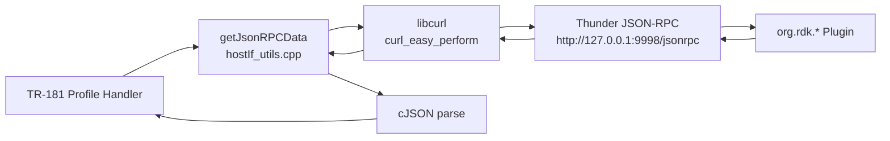
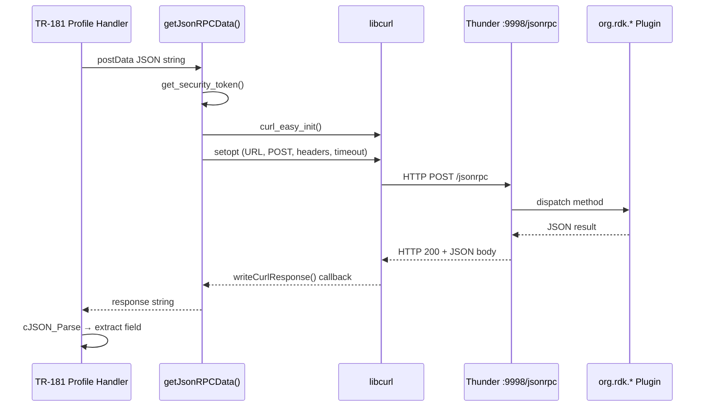

# Thunder Plugin Interfaces via curl

## Overview

tr69hostif communicates with the Thunder (WPEFramework) runtime over a local JSON-RPC HTTP
endpoint using `libcurl`. All TR-181 parameter handlers that require live device state—network,
Wi-Fi, authentication, privacy—issue JSON-RPC 2.0 POST requests to Thunder and parse the
JSON response before returning the parameter value to the TR-069/CWMP stack.

**At a glance:** 5 Thunder plugins · 13 methods · 21 TR-181 parameters

## Architecture



## Request/Response Infrastructure

### Endpoint

```
http://127.0.0.1:9998/jsonrpc
```

Defined as `JSONRPC_URL` in [src/hostif/include/hostIf_utils.h](../../src/hostif/include/hostIf_utils.h).

### Request Format

All calls follow JSON-RPC 2.0:

```json
{
  "jsonrpc": "2.0",
  "id": "<request-id>",
  "method": "<plugin>.<method>",
  "params": { "<key>": "<value>" }
}
```

### Authentication

Every request carries a Bearer token in the `Authorization` header:

```
Authorization: Bearer <token>
Content-Type: application/json
```

The token is fetched at call time via `get_security_token()` (same file).

### Core Helper Function

```cpp
// src/hostif/include/hostIf_utils.h
string getJsonRPCData(std::string postData);
```

**Behaviour:**

1. Calls `get_security_token()` and builds the Authorization header.
2. Initialises a `CURL` handle via `curl_easy_init()`.
3. Sets `CURLOPT_POST`, `CURLOPT_POSTFIELDS`, `CURLOPT_HTTPHEADER`,
   `CURLOPT_WRITEFUNCTION` / `CURLOPT_WRITEDATA`.
4. Sets `CURLOPT_CONNECTTIMEOUT = 5 s`, `CURLOPT_TIMEOUT = 10 s`.
5. Calls `curl_easy_perform()` and returns the raw response string.
6. On failure returns an empty string; callers must check before parsing.

**Thread Safety:** Not thread-safe; each call allocates and frees its own `CURL` handle.

**Memory:** The returned `string` is owned by the caller. No persistent allocation.

---

## Plugin Interfaces

### org.rdk.NetworkManager

**Used in:** [Device_DeviceInfo.cpp](../../src/hostif/profiles/DeviceInfo/Device_DeviceInfo.cpp),
[Device_WiFi.cpp](../../src/hostif/profiles/wifi/Device_WiFi.cpp),
[Device_WiFi_EndPoint.cpp](../../src/hostif/profiles/wifi/Device_WiFi_EndPoint.cpp),
[Device_WiFi_EndPoint_Security.cpp](../../src/hostif/profiles/wifi/Device_WiFi_EndPoint_Security.cpp),
[Device_WiFi_SSID.cpp](../../src/hostif/profiles/wifi/Device_WiFi_SSID.cpp)

> **Build flags:** WiFi Thunder paths are active only when `RDKV_NM` is **not** defined.
> The DeviceInfo IP path requires `MEDIA_CLIENT` defined and `RDKV_TR69` **not** defined.

#### TR-181 Parameters — org.rdk.NetworkManager

| TR-181 Parameter | Dir | Handler Function | Thunder Method | Response Field |
|------------------|-----|-----------------|----------------|----------------|
| `Device.DeviceInfo.X_COMCAST-COM_STB_IP` | GET | `get_Device_DeviceInfo_X_COMCAST_COM_STB_IP()` | `GetPrimaryInterface` → `GetIPSettings` | `result.interface` → `result.ipaddress` |
| `Device.DeviceInfo.X_RDKCENTRAL-COM_xOpsDeviceMgmt.ReverseSSH.xOpsReverseSshArgs` | SET | `set_xOpsReverseSshArgs()` | `GetPrimaryInterface` → `GetIPSettings` | `result.ipaddress` |
| `Device.WiFi.X_RDKCENTRAL-COM_WiFiEnable` | GET | `get_Device_WiFi_EnableWiFi()` | `GetAvailableInterfaces` | `interfaces[WIFI].enabled` |
| `Device.WiFi.X_RDKCENTRAL-COM_WiFiEnable` | SET | `set_Device_WiFi_EnableWiFi()` | `EnableInterface` / `DisableInterface` | `result.success` |
| `Device.WiFi.SSID.{i}.BSSID` | GET | `get_Device_WiFi_SSID_BSSID()` | `GetConnectedSSID` | `result.bssid` |
| `Device.WiFi.SSID.{i}.SSID` | GET | `get_Device_WiFi_SSID_SSID()` | `GetConnectedSSID` | `result.ssid` |
| `Device.WiFi.SSID.{i}.Name` | GET | `get_Device_WiFi_SSID_Name()` | `GetConnectedSSID` | `result.ssid` |
| `Device.WiFi.SSID.{i}.Enable` | GET | `get_Device_WiFi_SSID_Enable()` | `GetAvailableInterfaces` | `interfaces[WIFI].enabled` |
| `Device.WiFi.SSID.{i}.MACAddress` | GET | `get_Device_WiFi_SSID_MACAddress()` | `GetAvailableInterfaces` | `interfaces[WIFI].mac` |
| `Device.WiFi.SSID.{i}.Status` | GET | `get_Device_WiFi_SSID_Status()` | `GetWifiState` | `result.state` (mapped to string) |
| `Device.WiFi.Endpoint.{i}.Enable` | GET | `get_Device_WiFi_EndPoint_Enable()` | `GetAvailableInterfaces` ¹ | `interfaces[WIFI].enabled` |
| `Device.WiFi.Endpoint.{i}.Status` | GET | `get_Device_WiFi_EndPoint_Status()` | `GetAvailableInterfaces` ¹ | derived from `enabled` |
| `Device.WiFi.Endpoint.{i}.SSIDReference` | GET | `get_Device_WiFi_EndPoint_SSIDReference()` | `GetConnectedSSID` | `result.ssid` |
| `Device.WiFi.Endpoint.{i}.Stats.SignalStrength` | GET | `get_Device_WiFi_EndPoint_Stats_SignalStrength()` | `GetConnectedSSID` | `result.strength` |
| `Device.WiFi.Endpoint.{i}.Security.ModesEnabled` | GET | `get_hostIf_WiFi_EndPoint_Security_ModesEnabled()` | `GetConnectedSSID` | `result.securityMode` |

> ¹ `Device_WiFi_EndPoint.cpp` calls the versioned form `org.rdk.NetworkManager.1.GetAvailableInterfaces`.

#### GetPrimaryInterface

Returns the name of the currently active network interface.

**Request:**
```json
{
  "jsonrpc": "2.0",
  "id": "42",
  "method": "org.rdk.NetworkManager.GetPrimaryInterface"
}
```

**Response fields used:** `result.interface` (string)

**TR-181 use:** Intermediate step — resolves interface name before querying `GetIPSettings`.

---

#### GetIPSettings

Returns IP configuration for a named interface.

**Request:**
```json
{
  "jsonrpc": "2.0",
  "id": "42",
  "method": "org.rdk.NetworkManager.GetIPSettings",
  "params": { "interface": "<ifc>" }
}
```

**Response fields used:** `result.ipaddress` (string)

**TR-181 use:**
- `Device.DeviceInfo.X_COMCAST-COM_STB_IP` GET
- `Device.DeviceInfo.X_RDKCENTRAL-COM_xOpsDeviceMgmt.ReverseSSH.xOpsReverseSshArgs` SET (IP lookup)

---

#### GetAvailableInterfaces

Returns all network interfaces with type, MAC, and enabled state.

**Request:**
```json
{
  "jsonrpc": "2.0",
  "id": "42",
  "method": "org.rdk.NetworkManager.GetAvailableInterfaces"
}
```

**Response fields used (WIFI array element):**

| Field | Type | Description |
|-------|------|-------------|
| `type` | string | Interface type — match on `"WIFI"` |
| `mac` | string | MAC address |
| `enabled` | bool/int | Whether the interface is active |

**TR-181 use:**
- `Device.WiFi.X_RDKCENTRAL-COM_WiFiEnable` GET
- `Device.WiFi.SSID.{i}.Enable`, `Device.WiFi.SSID.{i}.MACAddress`
- `Device.WiFi.Endpoint.{i}.Enable`, `Device.WiFi.Endpoint.{i}.Status`

---

#### GetConnectedSSID

Returns details of the currently associated Wi-Fi network.

**Request:**
```json
{
  "jsonrpc": "2.0",
  "id": "42",
  "method": "org.rdk.NetworkManager.GetConnectedSSID"
}
```

**Response fields used:**

| Field | Type | Description |
|-------|------|-------------|
| `ssid` | string | Connected SSID name |
| `bssid` | string | Access point BSSID |
| `strength` | number | Signal strength |
| `securityMode` | string | Security mode (e.g. `"WPA2"`) |

**TR-181 use:**
- `Device.WiFi.SSID.{i}.SSID`, `Device.WiFi.SSID.{i}.BSSID`, `Device.WiFi.SSID.{i}.Name`
- `Device.WiFi.Endpoint.{i}.SSIDReference`, `Device.WiFi.Endpoint.{i}.Stats.SignalStrength`
- `Device.WiFi.Endpoint.{i}.Security.ModesEnabled`

---

#### GetWifiState

Returns an integer state code for the Wi-Fi subsystem.

**Request:**
```json
{
  "jsonrpc": "2.0",
  "id": "42",
  "method": "org.rdk.NetworkManager.GetWifiState"
}
```

**Response fields used:** `result.state` (number — mapped to string status)

**TR-181 use:** `Device.WiFi.SSID.{i}.Status`

---

#### EnableInterface / DisableInterface

Enables or disables the Wi-Fi interface.

**Request (enable):**
```json
{
  "jsonrpc": "2.0",
  "id": "42",
  "method": "org.rdk.NetworkManager.EnableInterface",
  "params": { "type": "WIFI" }
}
```

**Request (disable):** same with `"DisableInterface"`.

**Response fields used:** `result.success` (bool)

**TR-181 use:** `Device.WiFi.X_RDKCENTRAL-COM_WiFiEnable` SET handler.

---

### org.rdk.AuthService

**Used in:** [Device_DeviceInfo.cpp](../../src/hostif/profiles/DeviceInfo/Device_DeviceInfo.cpp)

#### TR-181 Parameters — org.rdk.AuthService

| TR-181 Parameter | Dir | Handler Function | Thunder Method | Transport |
|------------------|-----|-----------------|----------------|-----------|
| `Device.DeviceInfo.X_RDKCENTRAL-COM_Syndication.PartnerId` | SET | `set_Device_DeviceInfo_X_RDKCENTRAL_COM_Syndication_PartnerId()` | `setPartnerId` | Direct `curl_easy_perform` |
| `Device.DeviceInfo.X_RDKCENTRAL-COM_RFC.Feature.AccountInfo.AccountID` | GET | `get_xRDKCentralComRFCAccountId()` | `getServiceAccountId` | `getJsonRPCData()` |
| `Device.DeviceInfo.X_RDKCENTRAL-COM_Experience` | GET | `get_X_RDKCENTRAL_COM_experience()` | `getExperience` | `getJsonRPCData()` |

#### setPartnerId

Updates the partner ID on the device. This is the **only** interface that bypasses
`getJsonRPCData()` and constructs its own `CURL` handle directly (fire-and-forget SET;
HTTP 200 is all that is checked — no JSON body is consumed).

**Request:**
```json
{
  "jsonrpc": "2.0",
  "id": "3",
  "method": "org.rdk.AuthService.setPartnerId",
  "params": { "partnerId": "<id>" }
}
```

**Response:** HTTP 200 OK only — no JSON fields read.

**TR-181 use:** `Device.DeviceInfo.X_RDKCENTRAL-COM_Syndication.PartnerId` SET.

---

#### getServiceAccountId

Returns the service account identifier for this device.

**Request:**
```json
{
  "jsonrpc": "2.0",
  "id": "3",
  "method": "org.rdk.AuthService.getServiceAccountId"
}
```

**Response fields used:** `result` — account ID string.

**TR-181 use:** `Device.DeviceInfo.X_RDKCENTRAL-COM_RFC.Feature.AccountInfo.AccountID` GET
(called only when the locally stored value is empty or `"unknown"`).

---

#### getExperience

Returns the UX experience type provisioned on the device.

**Request:**
```json
{
  "jsonrpc": "2.0",
  "id": "3",
  "method": "org.rdk.AuthService.getExperience"
}
```

**Response fields used:** `result` — experience string (e.g. `"X1"`, `"XiOne"`).

**TR-181 use:** `Device.DeviceInfo.X_RDKCENTRAL-COM_Experience` GET.

---

### org.rdk.System

**Used in:** [Device_DeviceInfo.cpp](../../src/hostif/profiles/DeviceInfo/Device_DeviceInfo.cpp)

> **Build flag:** The `getPrivacyMode` call is compiled only when `PRIVACYMODES_CONTROL` is defined.

#### TR-181 Parameters — org.rdk.System

| TR-181 Parameter | Dir | Handler Function | Thunder Method | Notes |
|------------------|-----|-----------------|----------------|-------|
| `Device.DeviceInfo.X_RDKCENTRAL-COM_xOpsDeviceMgmt.ReverseSSH.xOpsReverseSshTrigger` | SET | `set_xOpsReverseSshTrigger()` | `getPrivacyMode` | Gate check only — returns `NOK` if `privacyMode == "DO_NOT_SHARE"` |

#### getPrivacyMode

Returns the current privacy mode setting. Used as a **pre-condition gate** — the SSH
trigger is blocked if the device is in `DO_NOT_SHARE` mode.

**Request:**
```json
{
  "jsonrpc": "2.0",
  "id": "3",
  "method": "org.rdk.System.getPrivacyMode"
}
```

**Response fields used:** `result.privacyMode` (string)

| Value | Meaning |
|-------|---------|
| `"SHARE"` | Privacy sharing enabled — SSH trigger proceeds |
| `"DO_NOT_SHARE"` | Privacy restricted — SSH trigger blocked, returns `NOK` |

**TR-181 use:** `Device.DeviceInfo.X_RDKCENTRAL-COM_xOpsDeviceMgmt.ReverseSSH.xOpsReverseSshTrigger` SET.

---

### org.rdk.MigrationPreparer

**Used in:** [Device_DeviceInfo.cpp](../../src/hostif/profiles/DeviceInfo/Device_DeviceInfo.cpp)

#### TR-181 Parameters — org.rdk.MigrationPreparer

| TR-181 Parameter | Dir | Handler Function | Thunder Method | Response Field |
|------------------|-----|-----------------|----------------|----------------|
| `Device.DeviceInfo.MigrationPreparer.MigrationReady` | GET | `get_Device_DeviceInfo_MigrationPreparer_MigrationReady()` | `getComponentReadiness` | `result.ComponentList` |

#### getComponentReadiness

Returns a list of system components and their migration readiness state.

**Request:**
```json
{
  "jsonrpc": "2.0",
  "id": "3",
  "method": "org.rdk.MigrationPreparer.getComponentReadiness"
}
```

**Response fields used:** `result.ComponentList` (array)

**TR-181 use:** `Device.DeviceInfo.MigrationPreparer.MigrationReady` GET.

---

### org.rdk.Account

**Used in:** [Device_DeviceInfo.cpp](../../src/hostif/profiles/DeviceInfo/Device_DeviceInfo.cpp)

#### TR-181 Parameters — org.rdk.Account

Both parameters call the **same** Thunder method; they differ only in how `resetTime` is interpreted.

| TR-181 Parameter | Dir | Handler Function | Thunder Method | Response Field | Return Type |
|------------------|-----|-----------------|----------------|----------------|-------------|
| `Device.DeviceInfo.X_RDKCENTRAL-COM_xAccount.HotelCheckout.LastResetTime` | GET | `get_HotelCheckoutLastResetTime()` | `getLastCheckoutResetTime` | `result.resetTime` | `UnsignedLong` (epoch) |
| `Device.DeviceInfo.X_RDKCENTRAL-COM_xAccount.HotelCheckout.Status` | GET | `get_HotelCheckoutStatus()` | `getLastCheckoutResetTime` | `result.resetTime` | `String` (`"success"` if >0, else `"unknown"`) |

#### getLastCheckoutResetTime

Returns the UNIX timestamp of the last hotel checkout or factory reset event.

**Request:**
```json
{
  "jsonrpc": "2.0",
  "id": "3",
  "method": "org.rdk.Account.getLastCheckoutResetTime"
}
```

**Response fields used:** `result.resetTime` (number — stored as `unsigned long`)

| Handler | Interpretation |
|---------|----------------|
| `get_HotelCheckoutLastResetTime()` | Returns raw epoch timestamp as `UnsignedLong` |
| `get_HotelCheckoutStatus()` | Returns `"success"` if `resetTime > 0`, otherwise `"unknown"` |

**TR-181 use:**
- `Device.DeviceInfo.X_RDKCENTRAL-COM_xAccount.HotelCheckout.LastResetTime` GET
- `Device.DeviceInfo.X_RDKCENTRAL-COM_xAccount.HotelCheckout.Status` GET

---

## Call Flow Sequence



---

## Timeout and Error Handling

| Setting | Value | Notes |
|---------|-------|-------|
| `CURLOPT_CONNECTTIMEOUT` | 5 s | Connection establishment |
| `CURLOPT_TIMEOUT` | 10 s | Total request time |
| On `curl_easy_init()` failure | Returns `""` | Logged at `RDK_LOG_ERROR` |
| On `curl_easy_setopt()` failure | Returns `""` early | Each option checked individually |
| On empty / NULL response | Caller checks `response.empty()` | Logs error and returns `NOK` |
| HTTP status code | Checked via `CURLINFO_RESPONSE_CODE` | Only `setPartnerId` enforces HTTP 200 |

---

## Summary Table

### By Plugin and Method (13 methods)

| Plugin | Method | TR-181 Parameter(s) | Dir |
|--------|--------|---------------------|-----|
| `org.rdk.NetworkManager` | `GetPrimaryInterface` | `Device.DeviceInfo.X_COMCAST-COM_STB_IP` *(intermediate)* | GET |
| `org.rdk.NetworkManager` | `GetIPSettings` | `Device.DeviceInfo.X_COMCAST-COM_STB_IP`<br>`…xOpsReverseSshArgs` | GET |
| `org.rdk.NetworkManager` | `GetAvailableInterfaces` | `Device.WiFi.X_RDKCENTRAL-COM_WiFiEnable`<br>`Device.WiFi.SSID.{i}.Enable`<br>`Device.WiFi.SSID.{i}.MACAddress`<br>`Device.WiFi.Endpoint.{i}.Enable`<br>`Device.WiFi.Endpoint.{i}.Status` | GET |
| `org.rdk.NetworkManager` | `GetConnectedSSID` | `Device.WiFi.SSID.{i}.SSID`<br>`Device.WiFi.SSID.{i}.BSSID`<br>`Device.WiFi.SSID.{i}.Name`<br>`Device.WiFi.Endpoint.{i}.SSIDReference`<br>`Device.WiFi.Endpoint.{i}.Stats.SignalStrength`<br>`Device.WiFi.Endpoint.{i}.Security.ModesEnabled` | GET |
| `org.rdk.NetworkManager` | `GetWifiState` | `Device.WiFi.SSID.{i}.Status` | GET |
| `org.rdk.NetworkManager` | `EnableInterface` | `Device.WiFi.X_RDKCENTRAL-COM_WiFiEnable` | SET |
| `org.rdk.NetworkManager` | `DisableInterface` | `Device.WiFi.X_RDKCENTRAL-COM_WiFiEnable` | SET |
| `org.rdk.AuthService` | `setPartnerId` | `Device.DeviceInfo.X_RDKCENTRAL-COM_Syndication.PartnerId` | SET |
| `org.rdk.AuthService` | `getServiceAccountId` | `Device.DeviceInfo.X_RDKCENTRAL-COM_RFC.Feature.AccountInfo.AccountID` | GET |
| `org.rdk.AuthService` | `getExperience` | `Device.DeviceInfo.X_RDKCENTRAL-COM_Experience` | GET |
| `org.rdk.System` | `getPrivacyMode` | `Device.DeviceInfo.…ReverseSSH.xOpsReverseSshTrigger` *(gate)* | SET |
| `org.rdk.MigrationPreparer` | `getComponentReadiness` | `Device.DeviceInfo.MigrationPreparer.MigrationReady` | GET |
| `org.rdk.Account` | `getLastCheckoutResetTime` | `Device.DeviceInfo.…HotelCheckout.LastResetTime`<br>`Device.DeviceInfo.…HotelCheckout.Status` | GET |

### By TR-181 Parameter (21 parameters)

| # | TR-181 Parameter | Plugin | Method | Dir | Build Flag |
|---|-----------------|--------|--------|-----|------------|
| 1 | `Device.DeviceInfo.X_COMCAST-COM_STB_IP` | NetworkManager | GetPrimaryInterface + GetIPSettings | GET | `MEDIA_CLIENT` + `!RDKV_TR69` |
| 2 | `Device.DeviceInfo.X_RDKCENTRAL-COM_xOpsDeviceMgmt.ReverseSSH.xOpsReverseSshArgs` | NetworkManager | GetPrimaryInterface + GetIPSettings | SET | `MEDIA_CLIENT` + `!RDKV_TR69` |
| 3 | `Device.DeviceInfo.X_RDKCENTRAL-COM_Syndication.PartnerId` | AuthService | setPartnerId | SET | — |
| 4 | `Device.DeviceInfo.X_RDKCENTRAL-COM_RFC.Feature.AccountInfo.AccountID` | AuthService | getServiceAccountId | GET | — |
| 5 | `Device.DeviceInfo.X_RDKCENTRAL-COM_Experience` | AuthService | getExperience | GET | — |
| 6 | `Device.DeviceInfo.X_RDKCENTRAL-COM_xOpsDeviceMgmt.ReverseSSH.xOpsReverseSshTrigger` | System | getPrivacyMode | SET | `PRIVACYMODES_CONTROL` |
| 7 | `Device.DeviceInfo.MigrationPreparer.MigrationReady` | MigrationPreparer | getComponentReadiness | GET | — |
| 8 | `Device.DeviceInfo.X_RDKCENTRAL-COM_xAccount.HotelCheckout.LastResetTime` | Account | getLastCheckoutResetTime | GET | — |
| 9 | `Device.DeviceInfo.X_RDKCENTRAL-COM_xAccount.HotelCheckout.Status` | Account | getLastCheckoutResetTime | GET | — |
| 10 | `Device.WiFi.X_RDKCENTRAL-COM_WiFiEnable` | NetworkManager | GetAvailableInterfaces / Enable\|DisableInterface | GET+SET | `!RDKV_NM` |
| 11 | `Device.WiFi.SSID.{i}.BSSID` | NetworkManager | GetConnectedSSID | GET | `!RDKV_NM` |
| 12 | `Device.WiFi.SSID.{i}.SSID` | NetworkManager | GetConnectedSSID | GET | `!RDKV_NM` |
| 13 | `Device.WiFi.SSID.{i}.Name` | NetworkManager | GetConnectedSSID | GET | `!RDKV_NM` |
| 14 | `Device.WiFi.SSID.{i}.Enable` | NetworkManager | GetAvailableInterfaces | GET | `!RDKV_NM` |
| 15 | `Device.WiFi.SSID.{i}.MACAddress` | NetworkManager | GetAvailableInterfaces | GET | `!RDKV_NM` |
| 16 | `Device.WiFi.SSID.{i}.Status` | NetworkManager | GetWifiState | GET | `!RDKV_NM` |
| 17 | `Device.WiFi.Endpoint.{i}.Enable` | NetworkManager | GetAvailableInterfaces ¹ | GET | `!RDKV_NM` |
| 18 | `Device.WiFi.Endpoint.{i}.Status` | NetworkManager | GetAvailableInterfaces ¹ | GET | `!RDKV_NM` |
| 19 | `Device.WiFi.Endpoint.{i}.SSIDReference` | NetworkManager | GetConnectedSSID | GET | `!RDKV_NM` |
| 20 | `Device.WiFi.Endpoint.{i}.Stats.SignalStrength` | NetworkManager | GetConnectedSSID | GET | `!RDKV_NM` |
| 21 | `Device.WiFi.Endpoint.{i}.Security.ModesEnabled` | NetworkManager | GetConnectedSSID | GET | `!RDKV_NM` |

> ¹ Uses versioned method `org.rdk.NetworkManager.1.GetAvailableInterfaces`.

### Count by Plugin

| Plugin | Methods | TR-181 Parameters |
|--------|---------|-------------------|
| `org.rdk.NetworkManager` | 7 | **15** (2 DeviceInfo + 13 WiFi) |
| `org.rdk.AuthService` | 3 | **3** |
| `org.rdk.Account` | 1 | **2** |
| `org.rdk.System` | 1 | **1** |
| `org.rdk.MigrationPreparer` | 1 | **1** |
| **Total** | **13** | **21** |

---

## See Also

- [hostIf_utils.h](../../src/hostif/include/hostIf_utils.h) — `getJsonRPCData()` and `JSONRPC_URL`
- [hostIf_utils.cpp](../../src/hostif/src/hostIf_utils.cpp) — curl implementation
- [Device_DeviceInfo.cpp](../../src/hostif/profiles/DeviceInfo/Device_DeviceInfo.cpp) — DeviceInfo profile handlers
- [Device_WiFi.cpp](../../src/hostif/profiles/wifi/Device_WiFi.cpp) — WiFi enable/disable
- [Device_WiFi_SSID.cpp](../../src/hostif/profiles/wifi/Device_WiFi_SSID.cpp) — SSID profile
- [Device_WiFi_EndPoint.cpp](../../src/hostif/profiles/wifi/Device_WiFi_EndPoint.cpp) — EndPoint profile
- [Device_WiFi_EndPoint_Security.cpp](../../src/hostif/profiles/wifi/Device_WiFi_EndPoint_Security.cpp) — Security profile
- [public-api.md](public-api.md) — Overall public API reference
- [data-flow.md](../architecture/data-flow.md) — System-level data flow
