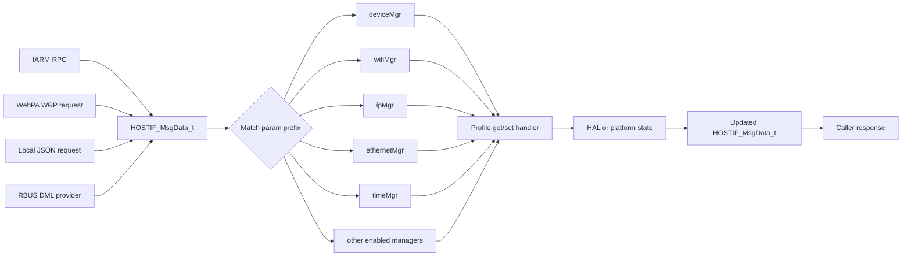
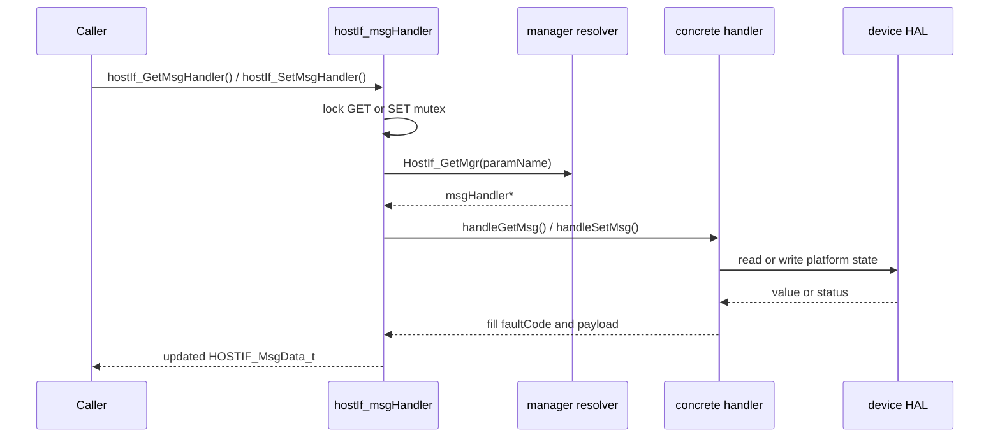
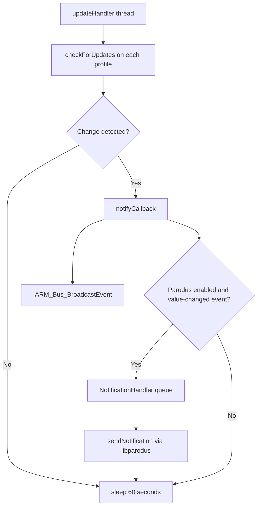

# Data Flow

## Request Routing

All ingress paths converge on the same internal contract: a populated `HOSTIF_MsgData_t` structure plus a request type. The dispatcher resolves the manager from the parameter name prefix and forwards the call to the appropriate profile handler.



## Manager Resolution

The manager map is configured in `conf/tr69hostIf.conf` and test environments copy an equivalent file to `/etc/mgrlist.conf`. Representative mappings include:

| Parameter prefix | Manager |
|------------------|---------|
| `Device.DeviceInfo` | `deviceMgr` |
| `Device.Services.STBService` | `dsMgr` |
| `Device.Services.StorageService` | `storageSrvcMgr` |
| `Device.Ethernet` | `ethernetMgr` |
| `Device.IP` | `ipMgr` |
| `Device.Time` | `timeMgr` |
| `Device.WiFi` | `wifiMgr` |

If no manager owns the parameter path, the request fails through the normal fault-code path and the caller sees an invalid-parameter-style result.

## Synchronous GET and SET Flow



## Notification Flow

Profiles that support update callbacks register with `updateHandler::Init()`. The update thread polls them once per minute and rebroadcasts changes over IARM and, when enabled, over Parodus notifications.



## RFC and Bootstrap Precedence

The DeviceInfo RFC/bootstrap subsystem applies values from multiple sources. The effective precedence is:

```text
RFC override > explicit WebPA set > bootstrap default > firmware default
```

This matters because request flow may appear identical at the dispatcher layer while the DeviceInfo profile resolves values from persistent RFC or bootstrap stores instead of querying a live HAL source.

## Memory Ownership

### Request envelope

- `paramName`, `paramValue`, and `transactionID` are inline buffers owned by the caller or current stack frame.
- `paramValueLong` is heap-backed and is used for lengthy values. Any code that allocates it is responsible for the matching cleanup path.
- `faultCode` is the canonical result field for remote callers.

### Parodus messages

- Incoming WRP messages are owned by the receive loop until processed and released.
- Response and notification messages allocate transient payload metadata such as source, destination, and content type strings.
- `wrp_free_struct()` is the final release point for those messages.

## Error Propagation

The daemon distinguishes two layers of failure reporting:

- local handler return status such as `OK` or `NOK`
- TR-069 fault codes stored in `HOSTIF_MsgData_t.faultCode`

This allows protocol adapters to return a transport-level response while preserving the device-management-specific cause of failure.

## See Also

- [System Overview](overview.md)
- [Threading Model](threading-model.md)
- [Public API](../api/public-api.md)