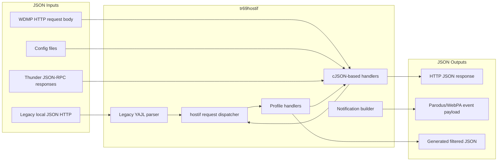

# JSON Usage In tr69hostif

## Overview

`tr69hostif` uses JSON in multiple independent paths rather than through a single shared abstraction. The current codebase mixes three patterns:

- request ingress over local HTTP interfaces
- configuration and state ingestion from JSON files on disk
- outbound and internal service integration through JSON notifications and JSON-RPC payloads

The implementation is also split across two parser stacks:

- `cJSON` for most production JSON parsing and serialization
- `YAJL` for the legacy local JSON request thread in `src/hostif/handlers/`

This document maps the active JSON contracts, the source files that own them, and the robustness gaps that matter for the planned user story: robust handling of JSON objects in `tr69hostif`.

## Architecture

### JSON Boundary Diagram



### JSON Usage Categories

| Category | Primary modules | Library | Direction |
|----------|-----------------|---------|-----------|
| Legacy local HTTP requests | `src/hostif/handlers/src/hostIf_jsonReqHandlerThread.cpp` | `YAJL` | inbound + outbound |
| Current WDMP HTTP server | `src/hostif/httpserver/src/http_server.cpp` | `cJSON` | inbound + outbound |
| Parodus and startup config files | `src/hostif/parodusClient/startParodus/startParodus.cpp`, `src/hostif/parodusClient/pal/libpd.cpp`, `src/hostif/parodusClient/pal/webpa_notification.cpp` | `cJSON` | inbound |
| Device defaults and bootstrap data | `src/hostif/profiles/DeviceInfo/XrdkCentralComBSStore.cpp` | `cJSON` | inbound |
| Thunder JSON-RPC consumers | `src/hostif/src/hostIf_utils.cpp`, `src/hostif/profiles/DeviceInfo/Device_DeviceInfo.cpp`, `src/hostif/profiles/wifi/*.cpp` | `cJSON` | outbound request + inbound response |
| Parodus notifications | `src/hostif/handlers/src/hostIf_NotificationHandler.cpp` | `cJSON` | outbound |

## Request And Response Contracts

### 1. Legacy Local JSON HTTP Path

**Owner:** `src/hostif/handlers/src/hostIf_jsonReqHandlerThread.cpp`

This is the older local HTTP interface started by the JSON handler thread. It uses YAJL callbacks instead of `cJSON`.

**Accepted request shape:**

```json
{
  "paramList": [
    { "name": "Device.DeviceInfo.Manufacturer" },
    { "name": "Device.DeviceInfo.ModelName" }
  ]
}
```

**Returned response shape:**

```json
{
  "paramList": [
    {
      "name": "Device.DeviceInfo.Manufacturer",
      "value": "ExampleVendor"
    }
  ]
}
```

**Behavior notes:**

- only `paramList[].name` is extracted from the request
- other fields are ignored by the parser state machine
- `DateTime` values are serialized as the literal string `"Unknown"`
- there is no explicit schema error payload beyond the HTTP status code

### 2. Current WDMP HTTP JSON Path

**Owner:** `src/hostif/httpserver/src/http_server.cpp`

This is the newer local HTTP interface. It accepts JSON request bodies, converts them into `req_struct`, routes them through the common dispatcher, then rebuilds a WDMP-style JSON response.

**GET request pattern:**

```json
{
  "names": [
    "Device.DeviceInfo.Manufacturer",
    "Device.DeviceInfo.SerialNumber"
  ]
}
```

**POST request pattern:**

```json
{
  "parameters": [
    {
      "name": "Device.Time.NTPServer1",
      "value": "time.example.net",
      "dataType": 0
    }
  ]
}
```

**Response pattern:**

```json
{
  "statusCode": 0,
  "parameters": [
    {
      "name": "Device.DeviceInfo.Manufacturer",
      "value": "ExampleVendor",
      "message": "Success"
    }
  ]
}
```

**Behavior notes:**

- the top-level `statusCode` is post-processed after WDMP response generation
- field-level schema validation is largely delegated to the WDMP helper layer
- malformed JSON returns HTTP `400 Bad Request`
- missing `CallerID` is tolerated for GET and rejected for POST

### 3. Thunder JSON-RPC Path

**Owners:**

- `src/hostif/src/hostIf_utils.cpp`
- `src/hostif/profiles/DeviceInfo/Device_DeviceInfo.cpp`
- `src/hostif/profiles/wifi/Device_WiFi.cpp`
- `src/hostif/profiles/wifi/Device_WiFi_SSID.cpp`
- `src/hostif/profiles/wifi/Device_WiFi_EndPoint.cpp`
- `src/hostif/profiles/wifi/Device_WiFi_EndPoint_Security.cpp`

`getJsonRPCData()` sends JSON-RPC POST bodies to the Thunder endpoint and returns a response string which is then parsed by profile code.

**Representative request pattern:**

```json
{
  "jsonrpc": "2.0",
  "id": 3,
  "method": "DeviceInfo.1.getPrivacyMode"
}
```

**Representative response pattern:**

```json
{
  "jsonrpc": "2.0",
  "id": 3,
  "result": {
    "privacyMode": "Disabled"
  }
}
```

**Observed response fields currently consumed by profiles:**

| Consumer | Expected JSON path |
|----------|--------------------|
| DeviceInfo primary interface | `result.interface` |
| DeviceInfo IP settings | `result.ipaddress` |
| DeviceInfo privacy mode | `result.privacyMode` |
| DeviceInfo component readiness | `result.ComponentList[]` |
| DeviceInfo service account | `result.serviceAccountId` |
| DeviceInfo checkout reset time | `result` as number |
| DeviceInfo experience | `result.experience` |
| WiFi interface list | `result.interfaces[]` |
| WiFi endpoint security | `result.securityMode` |
| WiFi enable or disable result | `result.success` |

### 4. JSON File Inputs

#### WebPA and Parodus runtime config

**Owners:**

- `src/hostif/parodusClient/startParodus/startParodus.cpp`
- `src/hostif/parodusClient/pal/libpd.cpp`

**Observed keys:**

```json
{
  "ServerIP": "https://example.endpoint",
  "acquire-jwt": 1,
  "DeviceNetworkInterface": "erouter0",
  "ServerPort": 6666,
  "MaxPingWaitTimeInSec": 30,
  "ParodusURL": "tcp://127.0.0.1:6666",
  "ParodusClientURL": "tcp://127.0.0.1:6667"
}
```

#### Notify-on config

**Owner:** `src/hostif/parodusClient/pal/webpa_notification.cpp`

**Observed shape:**

```json
{
  "Notify": [
    "Device.DeviceInfo.X_RDKCENTRAL-COM_RFCExtensions.Enable",
    "Device.Time.NTPServer1"
  ]
}
```

#### Partner defaults and bootstrap data

**Owner:** `src/hostif/profiles/DeviceInfo/XrdkCentralComBSStore.cpp`

**Observed shape:**

```json
{
  "default": {
    "Device.Time.NTPServer1": "time.example.net"
  },
  "partnerA": {
    "Device.Time.NTPServer1": "time.partner.example.net"
  }
}
```

#### Reboot reason file

**Owners:**

- `src/hostif/parodusClient/startParodus/startParodus.cpp`
- `src/hostif/profiles/DeviceInfo/Device_DeviceInfo.cpp`

**Observed shape:**

```json
{
  "reason": "software-reset"
}
```

#### Generated filtered JSON

**Owner:** `src/hostif/profiles/DeviceInfo/Device_DeviceInfo.cpp`

This path reads a local JSON object-of-objects and emits a compact JSON object whose values are arrays of field names. It is a transformation step rather than an external contract.

### 5. Outbound Notification Payloads

**Owner:** `src/hostif/handlers/src/hostIf_NotificationHandler.cpp`

The notification layer uses `cJSON_CreateObject()` and `cJSON_PrintUnformatted()` to build WebPA or Parodus event payloads.

**Representative device status payload:**

```json
{
  "device_id": "mac:112233445566",
  "status": "reboot-pending",
  "boot-time": 1710000000,
  "reboot-reason": "software-reset",
  "delay": 30
}
```

## Threading And Ownership Notes

### Threading Model

| Path | Thread context |
|------|----------------|
| Legacy JSON server | JSON handler thread created from `hostIf_main.cpp` |
| New HTTP JSON server | dedicated HTTP server thread |
| Parodus config and notify config | startup and Parodus-related worker paths |
| Thunder JSON-RPC parsing | caller thread inside profile GET or SET execution |
| Notification payload generation | update and notification execution paths |

### Memory Ownership Rules In Current Code

| Object type | Expected owner action |
|-------------|-----------------------|
| `cJSON_Parse()` return value | must be released with `cJSON_Delete()` |
| `cJSON_CreateObject()` or `cJSON_CreateArray()` return value | must be released with `cJSON_Delete()` |
| `cJSON_Print()` or `cJSON_PrintUnformatted()` return value | must be released with `free()` |
| YAJL parser or generator handles | must be released with `yajl_free()` or `yajl_gen_free()` |

Current code does not consistently honor these ownership rules across all JSON paths.

## Current Gaps And Issues

The following items are the main input for the planned robustness story.

### High Priority Gaps

| Gap | Affected files | Why it matters |
|-----|----------------|----------------|
| `getJsonRPCData()` does not accumulate the HTTP response body because the curl write callback takes the output string by value | `src/hostif/src/hostIf_utils.cpp` | Most Thunder JSON-RPC consumers effectively parse an empty string, which breaks the central JSON-RPC integration path |
| Nested JSON members are dereferenced without consistent null and type checks | `src/hostif/profiles/DeviceInfo/Device_DeviceInfo.cpp`, `src/hostif/profiles/wifi/Device_WiFi_EndPoint_Security.cpp` | Malformed or changed JSON can cause crashes or invalid reads |
| Parsed JSON roots are not deleted on many success and error paths | `src/hostif/parodusClient/startParodus/startParodus.cpp`, `src/hostif/parodusClient/pal/libpd.cpp`, `src/hostif/parodusClient/pal/webpa_notification.cpp`, `src/hostif/profiles/DeviceInfo/XrdkCentralComBSStore.cpp` | Long-running service code accumulates avoidable leaks |
| The notify config parser dereferences `notify_cfg` before verifying parse success | `src/hostif/parodusClient/pal/webpa_notification.cpp` | Invalid JSON can turn into null dereference or inconsistent startup behavior |

### Medium Priority Gaps

| Gap | Affected files | Why it matters |
|-----|----------------|----------------|
| The legacy YAJL path only extracts `paramList[].name` and silently ignores unexpected structure | `src/hostif/handlers/src/hostIf_jsonReqHandlerThread.cpp` | Callers receive weak feedback and malformed requests can appear valid |
| HTTP server error reporting is mostly transport-level and depends on lower layers for schema detail | `src/hostif/httpserver/src/http_server.cpp` | Operational debugging is harder when request shape is wrong |
| File-backed JSON readers do not consistently distinguish file I/O failure, empty file, parse failure, and schema failure | startup, Parodus, DeviceInfo bootstrap files | Error handling is not precise enough for quick triage |
| Several config readers assume strings or numbers without validating the exact JSON type | Parodus config, bootstrap config, reboot reason parsing | Schema drift produces undefined behavior instead of explicit rejection |

### Low Priority Gaps

| Gap | Affected files | Why it matters |
|-----|----------------|----------------|
| The legacy JSON response path emits `"Unknown"` for `DateTime` values | `src/hostif/handlers/src/hostIf_jsonReqHandlerThread.cpp` | Response semantics are inconsistent with the rest of the module |
| JSON handling is spread across YAJL, `cJSON`, and WDMP helpers without a shared validation helper layer | multiple modules | Maintenance cost is high and behavior differs by path |

## Testing Gaps

| Area | Current state | Gap |
|------|---------------|-----|
| WDMP HTTP server | basic unit coverage exists | response schema and error-body assertions are thin |
| Thunder JSON-RPC | smoke coverage exists | current tests do not reliably catch the broken response accumulation path |
| DeviceInfo JSON contracts | a few response-shape assumptions are implied in tests | field-by-field schema validation coverage is missing |
| WiFi JSON-RPC contracts | partial coverage | malformed-response cases are largely untested |
| Notify config parsing | shape is covered in Parodus tests | malformed JSON, mixed array types, and cleanup failure paths are not well covered |

## Recommended Scope For The Robust JSON User Story

### Functional Hardening Goals

1. Normalize parse and validation behavior for all `cJSON` inputs.
2. Reject malformed or schema-invalid JSON with explicit logs and deterministic return codes.
3. Eliminate parse-tree and printed-string ownership leaks.
4. Protect all nested-object access with null and type checks.
5. Add contract-focused unit tests for every external JSON shape the daemon accepts or emits.

### Suggested Acceptance Criteria

1. All production `cJSON_Parse()` call sites check for parse failure before dereferencing the root.
2. All accessed JSON members are validated with the correct `cJSON_Is*()` predicate before use.
3. All parsed or constructed `cJSON` trees are deleted on every success and failure path.
4. `getJsonRPCData()` returns the full HTTP response body and has a regression test.
5. Invalid `webpa_cfg.json`, `notify_webpa_cfg.json`, `partners_defaults.json`, or reboot reason JSON produces actionable error logs and safe failure behavior.
6. Legacy JSON and WDMP HTTP interfaces document and enforce their accepted request schema.

## Existing Documentation To Reuse

- `src/hostif/httpserver/docs/README.md` documents the newer WDMP HTTP JSON flow.
- `src/hostif/handlers/docs/README.md` documents the legacy JSON request handler and notification flow.
- `src/hostif/parodusClient/docs/README.md` documents WebPA orchestration and JSON config files.
- `src/hostif/docs/README.md` already records the `getJsonRPCData()` response handling defect.
- `src/hostif/profiles/wifi/docs/README.md` documents the non-RDKV WiFi JSON-RPC path.
- `src/hostif/profiles/DeviceInfo/docs/README.md` documents partner-default JSON and bootstrap behavior.

## See Also

- [System Overview](overview.md)
- [Threading Model](threading-model.md)
- [Data Flow](data-flow.md)
- [Public API](../api/public-api.md)
- [Build Setup](../integration/build-setup.md)
- [Common Errors](../troubleshooting/common-errors.md)