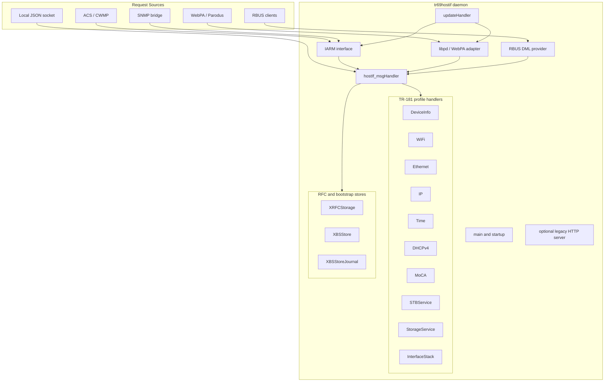
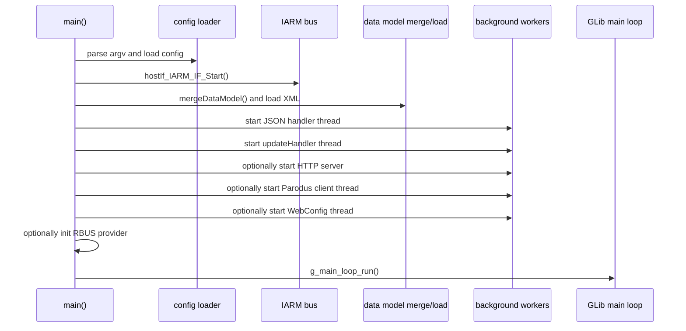

# System Overview

## Overview

`tr69hostif` is the TR-069 host interface daemon for RDK devices. It accepts TR-181 get/set traffic from multiple front ends, routes each request to the matching profile handler, and normalizes the response into a shared `HOSTIF_MsgData_t` envelope.

At runtime the daemon combines several responsibilities: IPC termination over IARM and WebPA/Parodus, local request dispatch, profile-specific HAL translation, optional HTTP/RBUS integration, and change-notification fanout.

## Component Diagram

## Startup Sequence

## Major Subsystems

| Subsystem | Primary files | Responsibility |
|-----------|---------------|----------------|
| Core startup | `src/hostif/src/hostIf_main.cpp` | Argument parsing, signal handling, worker startup, GLib main loop |
| Request dispatcher | `src/hostif/handlers/src/hostIf_msgHandler.cpp` | Maps parameter names to manager handlers and serializes GET/SET entry points |
| Request contract | `src/hostif/include/hostIf_tr69ReqHandler.h` | Shared request/response structure, fault codes, and IARM event definitions |
| Change monitoring | `src/hostif/handlers/src/hostIf_updateHandler.cpp` | Periodically checks profiles for value changes and emits notifications |
| WebPA/Parodus | `src/hostif/parodusClient/pal/libpd.cpp` | Connects to Parodus, receives WRP requests, and sends notifications |
| TR-181 profiles | `src/hostif/profiles/*` | Object-specific get/set logic and HAL translation |
| Optional HTTP server | `src/hostif/httpserver/` | Legacy RFC-related local HTTP endpoint |
| SNMP adapter | `src/hostif/snmpAdapter/` | Maps selected TR-181 parameters to SNMP OIDs |

## Configuration Sources

| File | Role |
|------|------|
| `conf/tr69hostIf.conf` | Manager name to parameter-prefix mapping and runtime defaults |
| `conf/mgrlist.conf` | Manager map copied into test and deployment environments |
| `/etc/data-model-*.xml` | Platform data-model fragments merged at startup |
| `/tmp/data-model.xml` | Effective merged model used by WebPA path |
| `/opt/secure/RFC/*.ini` | RFC overrides, bootstrap values, and journals |
| `partners_defaults.json` | Partner-specific default values consumed by bootstrap store |

## Design Notes

- The daemon uses a shared request envelope so IARM, WebPA, and internal call sites all converge on the same handler contract.
- Request routing is prefix-based. A parameter path is matched to a logical manager, then delegated to a concrete handler instance.
- Value-change notifications are decoupled from synchronous request handling. Profiles expose update callbacks, and a dedicated polling thread fans out changes.
- WebPA support is optional at build time and runtime. The Parodus path is isolated in the PAL layer under `src/hostif/parodusClient/pal/`.

## Platform Notes

- Linux pthreads, GLib threads, and GLib main loop are all used in the current implementation.
- Several feature areas are compile-time gated through `configure.ac`, including WiFi, DHCPv4, StorageService, InterfaceStack, MoCA, WebPA RFC, telemetry, and systemd notify.
- The daemon is packaged as a long-running systemd service using the unit files in the repository root.

## See Also

- [Threading Model](threading-model.md)
- [Data Flow](data-flow.md)
- [Build Setup](../integration/build-setup.md)
- [Public API](../api/public-api.md)