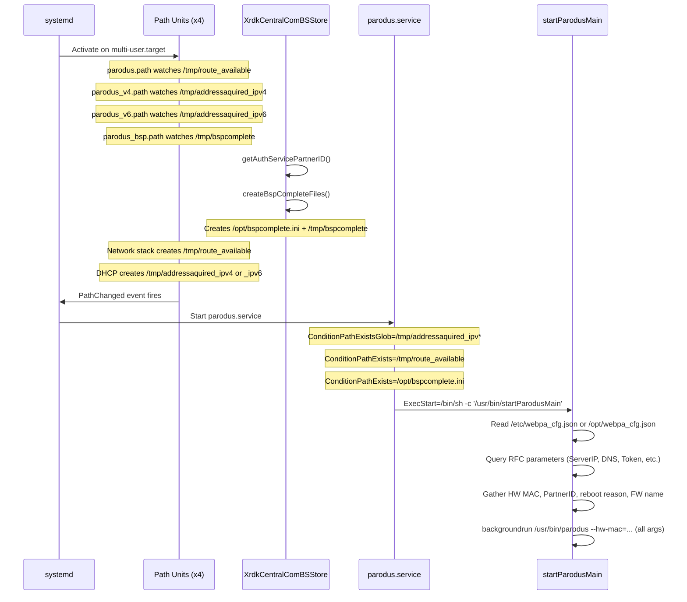
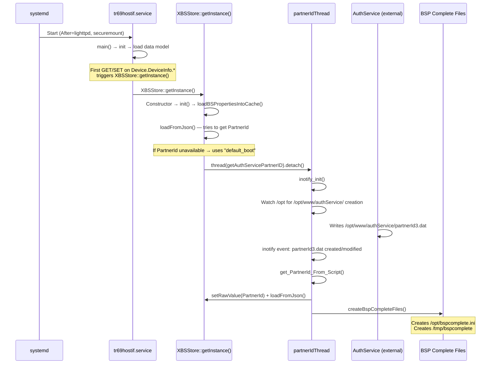
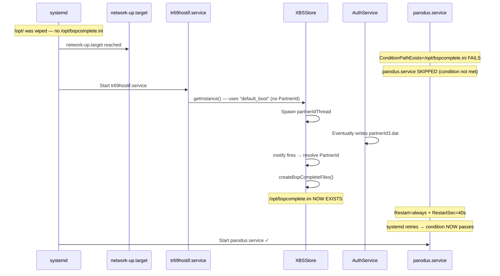
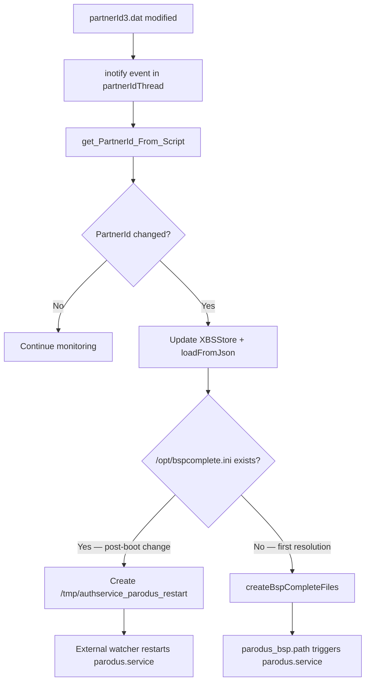
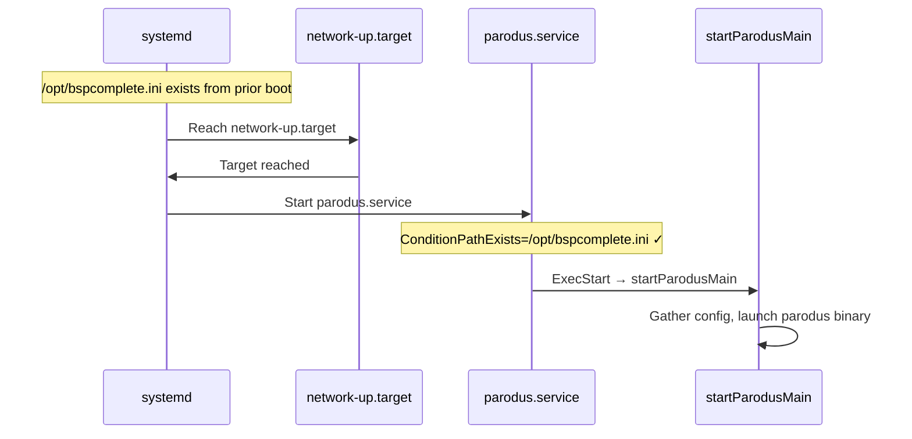
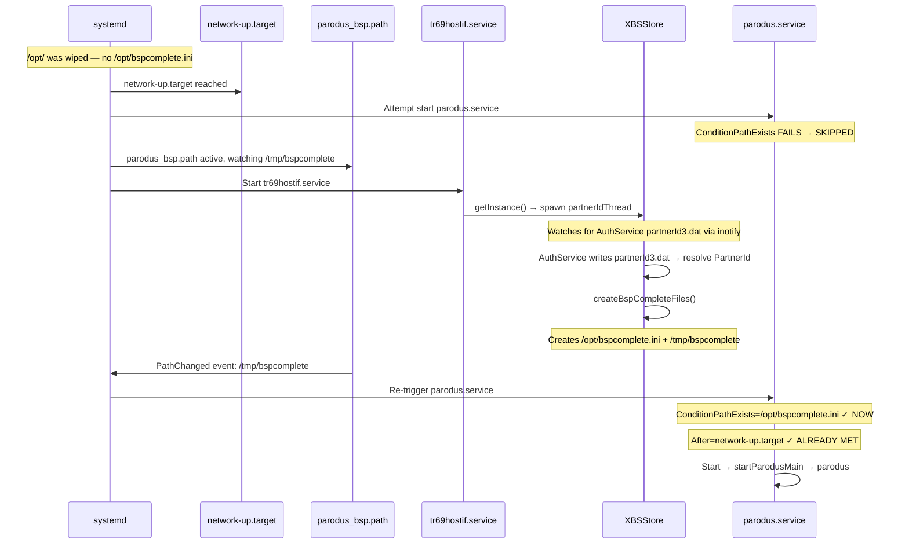

# Parodus Systemd Startup Flow Analysis

## Overview

This document captures the current parodus systemd startup flow in `src/hostif/parodusClient/` and provides the technical context for a proposed change: **move parodus.service to start independently on `network-up.target` and remove the path-based units**.

## Current Architecture

### Units Involved

| Unit File | Type | Purpose |
|-----------|------|---------|
| `parodus.service` | Service | Runs `/usr/bin/startParodusMain` via `backgroundrun` |
| `parodus.path` | Path | Watches `/tmp/route_available` → triggers `parodus.service` |
| `parodus_v4.path` | Path | Watches `/tmp/addressaquired_ipv4` → triggers `parodus.service` |
| `parodus_v6.path` | Path | Watches `/tmp/addressaquired_ipv6` → triggers `parodus.service` |
| `parodus_bsp.path` | Path | Watches `/tmp/bspcomplete` → triggers `parodus.service` |

### Current Startup Sequence Diagram



### Path-Based Trigger Detail

All four `.path` units share common properties:

```ini
[Unit]
DefaultDependencies=false
OnFailure=path-fail-notifier@%n.service

[Path]
PathChanged=<watched-file>
Unit=parodus.service

[Install]
WantedBy=multi-user.target
```

The path units use `PathChanged=` which fires when the watched file is **created or modified**. Any one of the four path units can trigger `parodus.service`.

### Service Conditions (Gate)

Even after a path unit triggers, `parodus.service` will only actually start if **all three** conditions are satisfied:

```ini
ConditionPathExistsGlob=/tmp/addressaquired_ipv*
ConditionPathExists=/tmp/route_available
ConditionPathExists=/opt/bspcomplete.ini
```

This means:
1. **IP address acquired** (IPv4 or IPv6) — created by DHCP/network scripts
2. **Default route available** — created by routing scripts
3. **BSP complete** — created by `XBSStore::createBspCompleteFiles()` after partner ID resolution

### Service Dependencies

```ini
After=update-device-details.service update-reboot-info.service
```

The service orders itself after these two units but does not require them (no `Requires=` or `Wants=`).

### Restart Behavior

```ini
RestartSec=40s
Restart=always
```

If parodus exits, systemd will restart it after 40 seconds unconditionally.

## Deep Dive: When Does BSP Complete Become Ready?

### What is BSP Complete?

BSP ("Bootstrap") Complete is a gate that ensures partner-specific configuration has been resolved before parodus connects to the cloud. Two files are involved:

| File | Location | Persistence | Purpose |
|------|----------|-------------|---------|
| `/opt/bspcomplete.ini` | Persistent storage | **Survives reboot** | Gate checked by `parodus.service` via `ConditionPathExists` |
| `/tmp/bspcomplete` | Volatile tmpfs | **Lost on reboot** | Triggers `parodus_bsp.path` via `PathChanged` |

### Why BSP Complete Exists

Parodus sends the device's **PartnerId** to the cloud in its connection handshake. If parodus starts before the PartnerId is resolved, it would connect with either no partner or a stale partner, causing incorrect configuration delivery.

The BSP complete flag guarantees:
1. AuthService has written `/opt/www/authService/partnerId3.dat`
2. `XBSStore` has resolved the PartnerId and loaded partner-specific bootstrap defaults
3. It is safe for parodus to connect with the correct identity

### BSP Complete Creation Chain



### Key Code Path: `getAuthServicePartnerID()`

This function (`XrdkCentralComBSStore.cpp:120`) runs as a **detached thread** spawned by `XBSStore::getInstance()`. It:

1. Sets up `inotify` watches on `/opt` → `/opt/www` → `/opt/www/authService` → `partnerId3.dat`
2. Handles the case where directories/files already exist (skips to watching for modifications)
3. When `partnerId3.dat` is created or modified:
   - Calls `get_PartnerId_From_Script()` to extract the value
   - Updates the bootstrap store with the new PartnerId
   - Calls `loadFromJson()` to reload partner-specific defaults
   - **If `/opt/bspcomplete.ini` does NOT exist** → calls `createBspCompleteFiles()` (first boot)
   - **If `/opt/bspcomplete.ini` DOES exist** (partner changed post-boot) → creates `/tmp/authservice_parodus_restart` to signal an external watcher to restart parodus
4. Runs in an infinite `inotify` loop — continues monitoring for subsequent partner changes

### Timing: BSP Complete vs Network Readiness

The critical question is: **Does `network-up.target` arrive before or after BSP complete?**

#### Boot Timeline Analysis

```
Boot Phase               | What Happens                              | Approx Timing
-------------------------|-------------------------------------------|--------------
Early boot               | systemd reaches sysinit.target             | T+0s
Network stack init       | NetworkManager starts, DHCP begins         | T+5-15s
network-up.target    | IP acquired, routes established            | T+10-30s
lighttpd.service         | Web server starts                          | T+15-25s
tr69hostif.service       | Daemon starts (After=lighttpd)             | T+20-30s
XBSStore::getInstance()  | First parameter access triggers singleton  | T+20-35s
AuthService writes       | partnerId3.dat written                     | T+25-60s (varies)
BSP complete created     | /opt/bspcomplete.ini written               | T+25-60s
```

**Key insight:** On a normal boot (non-first-boot), `/opt/bspcomplete.ini` **already exists** from the previous boot because it persists in `/opt/`. Therefore:

| Scenario | `/opt/bspcomplete.ini` at boot | `network-up.target` timing | Parodus can start? |
|----------|-------------------------------|-------------------------------|-------------------|
| **Normal reboot** | Already exists | Arrives normally | Yes, as soon as network is up |
| **First boot (new device)** | Does NOT exist | Arrives before BSP complete | No — must wait for AuthService + XBSStore |
| **Factory reset (clears /opt/)** | Does NOT exist | Arrives before BSP complete | No — must wait for AuthService + XBSStore |
| **Firmware update (preserves /opt/)** | Already exists | Arrives normally | Yes, as soon as network is up |

### Factory Reset Scenarios

#### What Happens to `/opt/bspcomplete.ini` During Reset?

**Within the tr69hostif codebase**: No code path deletes `/opt/bspcomplete.ini`. The file is only ever **created**, never removed:

| Code Path | Deletes `bspcomplete.ini`? | What It Actually Deletes |
|-----------|---------------------------|-------------------------|
| `resetCacheAndStore()` | **No** | Only `bootstrap.ini` and journal file |
| `clearRfcValues()` | **No** | Only rewrites `bootstrap.ini` |
| `XRFCStore::clearAll()` | **No** | Only truncates `tr181store.ini` |
| `triggerResetScript()` | **Delegates** | Calls external `/lib/rdk/*.sh` scripts |
| Service stop/start | **No** | No cleanup in unit files |
| IPK install/remove | **No** | Only manages service state |

**The external reset scripts** (`/lib/rdk/factory-reset.sh`, `/lib/rdk/coldfactory-reset.sh`, etc.) are **not part of this repository**. These platform-level scripts typically perform broad `/opt/` cleanup. The behavior depends on the platform:

| Reset Type | Script | Likely Clears `/opt/`? | Reboots? |
|-----------|--------|----------------------|---------|
| Cold Factory Reset | `coldfactory-reset.sh` | **Yes** — full wipe | Yes |
| Factory Reset | `factory-reset.sh` | **Yes** — user data wipe | Yes |
| Warehouse Reset | `warehouse-reset.sh` | **Partial** — depends on platform | No |
| Customer Reset | `customer-reset.sh` | **Yes** — user data wipe | Yes |

#### Post-Factory-Reset Boot Sequence



**Problem:** With `network-up.target` ordering alone (no path units), after a factory reset:
- `parodus.service` attempts to start when `network-up.target` is reached
- `ConditionPathExists=/opt/bspcomplete.ini` fails because the file was wiped
- systemd marks the condition as not met and **does NOT retry on its own**
- Only `Restart=always` on a *running* service triggers retries — a condition failure prevents the service from starting at all
- **The service will not start until manually triggered or the system reboots again**

### The Condition vs Restart Problem

This is a critical subtlety of systemd behavior:

- `ConditionPathExists=` — If the condition fails at activation time, systemd **skips** the unit silently. It does not retry.
- `Restart=always` — Only applies when the service **was running and exited**. It does not apply to condition failures.

This means after a factory reset, if `network-up.target` is reached before `bspcomplete.ini` is created, parodus will **never start** during that boot cycle without an additional mechanism.

### Solution Options for the Factory Reset Gap

#### Option A: Use `ExecStartPre` Polling Instead of `ConditionPathExists`

Replace the condition with a polling script that waits for BSP complete:

```ini
[Service]
ExecStartPre=/bin/sh -c 'timeout=300; while [ ! -f /opt/bspcomplete.ini ] && [ $timeout -gt 0 ]; do sleep 5; timeout=$((timeout-5)); done; test -f /opt/bspcomplete.ini'
ExecStart=/bin/sh -c '/usr/bin/startParodusMain'
```

**Pros:** Service blocks until BSP is ready, then starts. Works after factory reset.
**Cons:** Ties up a systemd service slot for up to 5 minutes. Could delay shutdown.

#### Option B: Retain a Single Path Unit for BSP Complete

Keep only `parodus_bsp.path` watching `/tmp/bspcomplete` and remove the network-related path units:

```ini
# parodus_bsp.path — RETAINED
[Path]
PathChanged=/tmp/bspcomplete
Unit=parodus.service

# parodus.service
[Unit]
After=network-up.target
Wants=network-up.target
# No ConditionPathExists — the path unit handles the BSP gate
```

**Pros:** Clean separation — network handled by target, BSP by path unit. No polling.
**Cons:** Still requires one path unit (but eliminates the fragile network sentinel files).

#### Option C: systemd Timer-Based Retry

Add a `.timer` unit that periodically attempts to start `parodus.service`:

```ini
# parodus-retry.timer
[Timer]
OnBootSec=60
OnUnitInactiveSec=30
Unit=parodus.service

[Install]
WantedBy=multi-user.target
```

**Pros:** Handles condition-not-yet-met gracefully. No path units needed.
**Cons:** Adds delay (up to 30s between retries). Additional unit file.

#### Option D: Move BSP Complete Check Into `startParodusMain`

Remove the systemd-level condition entirely and let the startup binary wait:

```ini
[Unit]
After=network-up.target
Wants=network-up.target
# No ConditionPathExists

[Service]
ExecStart=/bin/sh -c '/usr/bin/startParodusMain'
```

Then modify `startParodusMain` to poll for `/opt/bspcomplete.ini` before launching parodus.

**Pros:** All logic in one place. Service starts, waits internally.
**Cons:** Requires C++ code change. Service appears "running" while actually waiting.

### Recommended Approach

**Option B** (retain `parodus_bsp.path` only) is the cleanest solution because:

1. It eliminates the 3 network-related path units and their `/tmp` sentinel file dependencies
2. It preserves the existing BSP gate mechanism that works correctly for factory reset
3. `network-up.target` handles network readiness (replacing `parodus.path`, `parodus_v4.path`, `parodus_v6.path`)
4. `parodus_bsp.path` handles the BSP readiness gate (factory reset / first boot case)
5. No polling, no timers, no code changes to `startParodusMain`

### Partner ID Change: Parodus Restart Flow

When the PartnerId changes while the system is running (e.g., re-provisioning):



Note: The `/tmp/authservice_parodus_restart` file is a signal to an **external component not in this repo** that watches for it and calls `systemctl restart parodus.service`. This flow is unaffected by the proposed changes.

## Problems with Current Approach

### 1. Race Conditions with Path Units

Multiple path units all point to the same `Unit=parodus.service`. If files appear at different times, systemd may attempt to start the service multiple times. The `ConditionPath*` checks prevent premature start, but the repeated trigger/fail/retry cycle produces noise in system logs.

### 2. Fragile Tmp-File Dependencies

The mechanism relies on sentinel files in `/tmp/` created by external scripts and components:
- `/tmp/route_available` — routing script
- `/tmp/addressaquired_ipv4` / `_ipv6` — DHCP scripts
- `/tmp/bspcomplete` — `XrdkCentralComBSStore` in tr69hostif itself

These files persist across service restarts but not reboots. Any component that cleans `/tmp` can break the startup chain.

### 3. Coupling Between tr69hostif and Parodus Startup

The BSP complete file (`/opt/bspcomplete.ini`) is created by `XrdkCentralComBSStore::createBspCompleteFiles()` which runs inside tr69hostif itself. This creates a circular coupling: tr69hostif must run to allow parodus to start, but the parodus client within tr69hostif needs parodus to be running.

### 4. No Standard systemd Network Readiness Integration

The current design does not use systemd's native `network-up.target` ordering, relying instead on custom sentinel files. This makes it non-portable and harder to debug with standard systemd tooling.

### 5. `DefaultDependencies=false` Risk

The path units disable default dependencies, which means they have no implicit ordering against `sysinit.target`, `shutdown.target`, etc. This can lead to unexpected behavior during shutdown or early boot.

## Proposed Change: Move to `network-up.target`

### Target State (Recommended: Option B)

Remove the three **network-related** `.path` units, **retain** `parodus_bsp.path`, and modify `parodus.service`:

**`parodus.service` (modified):**

```ini
[Unit]
Description=Webpa parodus Daemon
After=network-up.target update-device-details.service update-reboot-info.service
Wants=network-up.target
ConditionPathExists=/opt/bspcomplete.ini

[Service]
SyslogIdentifier="parodus"
EnvironmentFile=/etc/device.properties
Type=forking
PIDFile=/run/parodus.pid
ExecStart=/bin/sh -c '/usr/bin/startParodusMain'
ExecStop=/bin/kill -2 $MAINPID
RestartSec=40s
Restart=always

[Install]
WantedBy=multi-user.target
```

**`parodus_bsp.path` (retained, updated):**

```ini
[Unit]
Description=Webpa parodus BSPComplete
OnFailure=path-fail-notifier@%n.service

[Path]
PathChanged=/tmp/bspcomplete
Unit=parodus.service

[Install]
WantedBy=multi-user.target
```

Changes to `parodus_bsp.path`: Remove `DefaultDependencies=false` (restore safe shutdown ordering).

### Changes Summary

| Item | Current | Proposed |
|------|---------|----------|
| Network readiness | `ConditionPathExistsGlob=/tmp/addressaquired_ipv*` + `ConditionPathExists=/tmp/route_available` + `parodus.path` + `parodus_v4.path` + `parodus_v6.path` | `After=network-up.target` + `Wants=network-up.target` |
| BSP gate | `ConditionPathExists=/opt/bspcomplete.ini` (service) + `parodus_bsp.path` | `ConditionPathExists=/opt/bspcomplete.ini` (retained) + `parodus_bsp.path` (retained) |
| Path units | 4 path units | **3 removed**, `parodus_bsp.path` **retained** |
| Trigger mechanism | File-watch via `PathChanged` for both network and BSP | `network-up.target` for network; `PathChanged` for BSP only |
| Install section | Missing from service | Service gets `[Install] WantedBy=multi-user.target` |
| Network condition checks | `ConditionPathExistsGlob=/tmp/addressaquired_ipv*` + `ConditionPathExists=/tmp/route_available` | **Removed** (handled by `network-up.target`) |

### Files to Delete

- `src/hostif/parodusClient/parodus.path`
- `src/hostif/parodusClient/parodus_v4.path`
- `src/hostif/parodusClient/parodus_v6.path`

### Files to Modify

- `src/hostif/parodusClient/parodus.service` — add `[Install]` section, replace network `ConditionPath*` with target dependency, add `Wants=network-up.target`
- `src/hostif/parodusClient/parodus_bsp.path` — remove `DefaultDependencies=false`

### Why Retain `parodus_bsp.path`?

The BSP complete path unit is essential for the **factory reset** and **first boot** scenarios:

1. After factory reset, `/opt/bspcomplete.ini` is deleted by platform reset scripts
2. `parodus.service` reaches activation (network is up) but `ConditionPathExists` fails
3. systemd **skips** the service silently — `Restart=always` does NOT apply to condition failures
4. `parodus_bsp.path` watches `/tmp/bspcomplete` via `PathChanged`
5. When `XBSStore` creates `/tmp/bspcomplete` (after AuthService resolves PartnerId), the path unit fires
6. This triggers `parodus.service` activation — by now `/opt/bspcomplete.ini` also exists
7. Both the condition and network ordering are satisfied → parodus starts

Without `parodus_bsp.path`, parodus would **never start after factory reset** during the current boot cycle.

### Code Impact: BSP Complete File Creation

`XrdkCentralComBSStore::createBspCompleteFiles()` in `src/hostif/profiles/DeviceInfo/XrdkCentralComBSStore.cpp` currently creates both:
- `/opt/bspcomplete.ini` — persistent (survives reboot) → checked by `ConditionPathExists`
- `/tmp/bspcomplete` — volatile (triggers `parodus_bsp.path`) → **still needed** for factory reset trigger

Both file creations must be **retained** with this approach.

### Startup Flow After Change

#### Normal Reboot (BSP complete already exists)



#### Factory Reset / First Boot (BSP complete does NOT exist)



## Risk Assessment

| Risk | Mitigation |
|------|-----------|
| `network-up.target` may not be available on all RDK platforms | Verify `NetworkManager-wait-online.service` or equivalent is enabled; fall back to platform-specific network target if needed |
| BSP complete file does not exist on first boot / factory reset | `parodus_bsp.path` handles re-triggering when BSP completes |
| Existing recipes install all 4 path units | Recipe/packaging changes needed to stop installing 3 deleted `.path` files |
| Devices relying on path-unit restart semantics for network | `Restart=always` in service handles process restarts; `network-up.target` ensures network is up before first attempt |
| External platform reset scripts may not clean `/opt/bspcomplete.ini` consistently | Verify each platform's `factory-reset.sh` and `coldfactory-reset.sh` actually remove the file; document expected behavior |
| `/tmp/authservice_parodus_restart` consumed by external watcher | Unaffected by this change — this signal path is independent of systemd unit changes |

## Acceptance Criteria for Ticket

1. `parodus.service` uses `After=network-up.target` + `Wants=network-up.target` for network readiness
2. Three network-related `.path` unit files (`parodus.path`, `parodus_v4.path`, `parodus_v6.path`) removed from source and packaging
3. `parodus_bsp.path` retained (with `DefaultDependencies=false` removed)
4. Service retains `ConditionPathExists=/opt/bspcomplete.ini` gate
5. Service gains `[Install] WantedBy=multi-user.target`
6. `Restart=always` + `RestartSec=40s` behavior preserved
7. `createBspCompleteFiles()` continues to create both `/opt/bspcomplete.ini` and `/tmp/bspcomplete`
8. No regression in parodus connectivity on normal reboot
9. Parodus starts correctly after factory reset (verified via `parodus_bsp.path` trigger)
10. Parodus starts correctly on first boot of a new device
11. Packaging recipes updated to not install deleted `.path` units
12. Integration test covers: normal reboot, factory reset, and first-boot scenarios

## References

- [parodus.service](../../src/hostif/parodusClient/parodus.service)
- [parodus.path](../../src/hostif/parodusClient/parodus.path)
- [parodus_bsp.path](../../src/hostif/parodusClient/parodus_bsp.path)
- [parodus_v4.path](../../src/hostif/parodusClient/parodus_v4.path)
- [parodus_v6.path](../../src/hostif/parodusClient/parodus_v6.path)
- [startParodus.cpp](../../src/hostif/parodusClient/startParodus/startParodus.cpp)
- [XrdkCentralComBSStore.cpp](../../src/hostif/profiles/DeviceInfo/XrdkCentralComBSStore.cpp) — `createBspCompleteFiles()`
- [Parodus Client Docs](../../src/hostif/parodusClient/docs/README.md)
