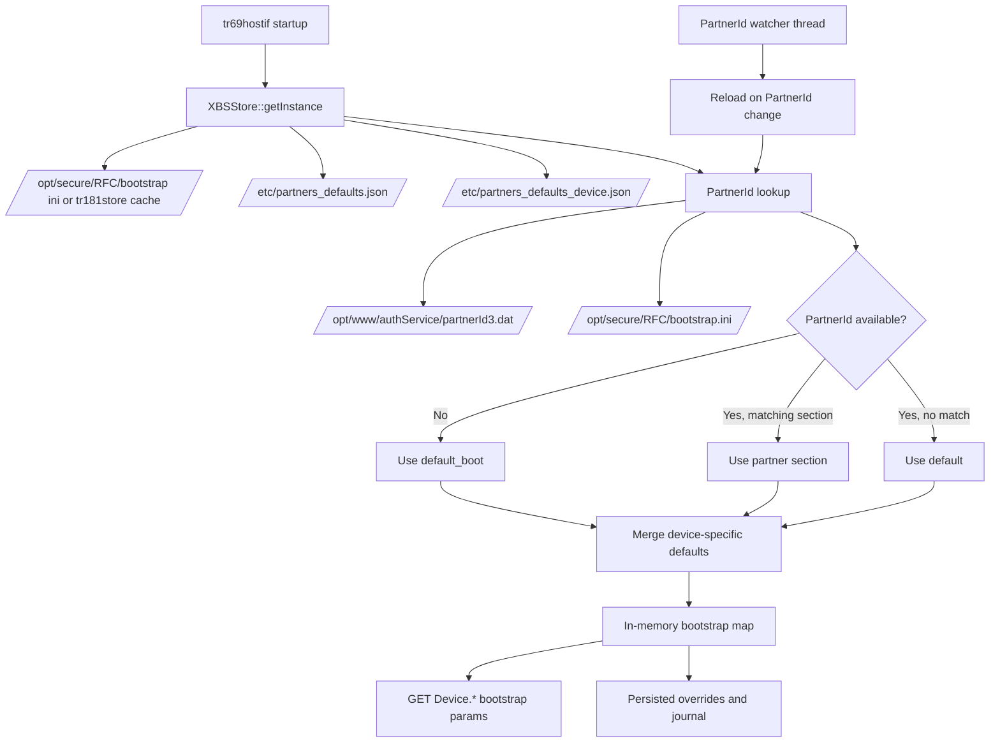
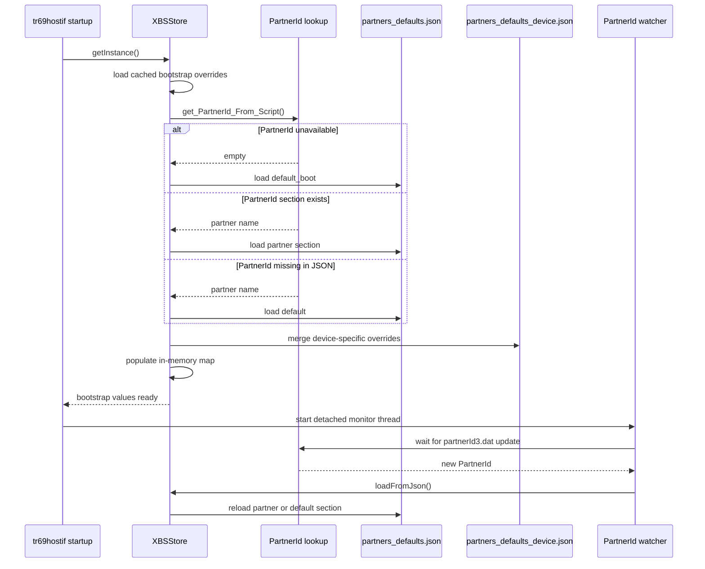

# Partner Defaults Workflow

## Overview

`tr69hostif` resolves partner-specific bootstrap defaults through `XBSStore`, which loads JSON defaults from `partners_defaults.json`, merges any device-specific additions from `partners_defaults_device.json`, overlays persisted bootstrap overrides, and reloads when PartnerId becomes available later in boot.

This workflow exists because the daemon may start before AuthService has written the runtime PartnerId. In that early-boot window, the code intentionally uses a reduced `default_boot` section. Once the actual PartnerId is discovered, the store reloads and switches to either the matching partner section or the generic `default` section.

## Architecture

### Component Diagram

## Key Components

### `XBSStore`

`XBSStore` owns bootstrap default resolution, in-memory storage, persisted override handling, and the PartnerId monitoring thread. The startup path is implemented in `XBSStore::getInstance()`, `init()`, `loadBSPropertiesIntoCache()`, and `loadFromJson()`.

### `partners_defaults.json`

This file contains the generic and per-partner bootstrap defaults. The current layout includes at least these top-level sections:

- `default_boot` for early-boot fallback values
- `default` for generic steady-state defaults when a resolved partner block is unavailable
- one or more partner-specific sections such as `community`

### `partners_defaults_device.json`

If present, this file overlays device-specific values on top of the selected partner configuration. Existing keys are replaced; missing keys are appended.

### `XRFCStore`

`XRFCStore` is a separate singleton that manages RFC Feature parameters, distinct from the bootstrap store. It reads from `tr181store.ini` (path configured by `TR181_STORE_FILENAME` in `/etc/rfc.properties`), with `/etc/rfcdefaults/*.ini` files as a lowest-priority fallback for missing entries.

Bootstrap parameters under `Device.DeviceInfo.X_RDKCENTRAL-COM_RFC.Bootstrap.*` are handled exclusively by `XBSStore`. RFC Feature parameters under `Device.DeviceInfo.X_RDKCENTRAL-COM_RFC.Feature.*` and related paths are handled exclusively by `XRFCStore`. There is no cross-store fallback between these two at GET time.

### PartnerId sources

The store resolves PartnerId in this order:

1. `/opt/www/authService/partnerId3.dat`
2. `/opt/secure/RFC/bootstrap.ini`

If neither source yields a value during startup, the code falls back to `default_boot`.

## Workflow Phases

### 1. Startup Cache Load

At startup, `XBSStore::getInstance()` constructs the singleton, loads any persisted bootstrap values from disk, then calls `loadFromJson()` to apply firmware defaults.

Persisted values are read before JSON defaults so the store can preserve runtime overrides and remove only stale firmware-default entries during a firmware update.

### 2. PartnerId Resolution

`loadFromJson()` calls `hostIf_DeviceInfo::get_PartnerId_From_Script()` to resolve the current PartnerId.

Possible outcomes:

1. PartnerId is available and matches a JSON section: use that section.
2. PartnerId is available but no matching section exists: fall back to `default`.
3. PartnerId is not available yet: fall back to `default_boot`.

This is the key distinction between `default_boot` and `default`:

- `default_boot` is a temporary early-boot profile used only when PartnerId is not yet known.
- `default` is the generic steady-state fallback used after PartnerId resolution when the partner block is missing.

### 3. Device-Specific Overlay

After selecting the base configuration, `getPartnerDeviceConfig()` optionally reads `partners_defaults_device.json` and merges those entries into the chosen partner object.

Overlay rules:

1. If a key already exists in the selected base object, the device-specific file replaces it.
2. If a key does not exist, the device-specific file adds it.
3. If the device-specific file does not exist, startup continues without error.

### 4. Store Population

The merged JSON object is iterated and each key-value pair is written into the in-memory bootstrap map through `setRawValue(..., HOSTIF_SRC_DEFAULT)`.

During this phase, the code also:

1. marks initial update state when the persistent bootstrap file does not yet exist
2. removes obsolete firmware-default entries that disappeared from the new JSON but were not overridden by RFC or WebPA
3. updates journal state through `XBSStoreJournal`

### 5. Runtime Reload When PartnerId Appears

After singleton creation, `XBSStore` starts a detached watcher thread that monitors `/opt/www/authService/partnerId3.dat` with `inotify`.

When the file is created or modified:

1. the thread re-reads PartnerId
2. compares it to the stored PartnerId value
3. updates the PartnerId bootstrap entry if it changed
4. calls `loadFromJson()` again to rebuild defaults using the resolved partner section

This is how the daemon transitions from `default_boot` to the partner-specific or `default` steady-state configuration.

## Sequence Diagram

## Threading Model

The partner-defaults workflow uses two execution contexts:

| Context | Purpose | Notes |
|---------|---------|-------|
| Startup thread | Initial bootstrap load | Runs during singleton initialization |
| Detached PartnerId watcher thread | Watches for `partnerId3.dat` creation or modification | Calls `loadFromJson()` again when PartnerId changes |

Synchronization notes:

1. `XBSStore` uses a recursive mutex around store access and reload operations.
2. The watcher thread updates the in-memory store only after detecting a changed PartnerId.
3. `default_boot` is intentionally temporary and may be replaced later in the same process lifetime.

## Memory And Persistence Model

### Ownership

1. JSON objects parsed with `cJSON` are temporary and released after reload completes.
2. Effective bootstrap values are copied into the in-memory dictionary.
3. Persisted runtime overrides remain on disk and survive daemon restart.

### Persistence Layers

Effective value precedence for bootstrap-backed parameters is:

1. persisted RFC or WebPA override
2. device-specific overlay from `partners_defaults_device.json` when present
3. selected partner default from `partners_defaults.json`

Operationally, the JSON files provide firmware defaults, while runtime changes are kept in the bootstrap store and journal under `/opt/secure/RFC/`.

### How `bootstrap.ini` Is Created And Updated

The bootstrap store file is owned by `tr69hostif` itself. The file path is obtained from `/etc/rfc.properties` through the `BS_STORE_FILENAME` property, and in the current environment that path resolves to `/opt/secure/RFC/bootstrap.ini`.

The creation and update flow is:

1. `XBSStore::init()` loads the configured bootstrap-store filename.
2. `loadBSPropertiesIntoCache()` attempts to read the existing file into the in-memory dictionary.
3. If the file does not yet exist, startup continues and `loadFromJson()` marks the bootstrap load as an initial update.
4. During the initial update, each selected JSON default is written through `setRawValue()`, which creates the `/opt/secure/RFC` directory if needed and appends `key=value` entries into `bootstrap.ini`.
5. After initial creation, later updates rewrite the full file from the in-memory dictionary so the persistent store remains synchronized with the active bootstrap cache.

This means the firmware JSON files are the source of default values, but `bootstrap.ini` is the persistent runtime copy managed by `XBSStore`.

### PartnerId Read Dependency On `bootstrap.ini`

When AuthService has not yet created `/opt/www/authService/partnerId3.dat`, PartnerId lookup falls back to `/opt/secure/RFC/bootstrap.ini`.

That fallback matters in two ways:

1. it allows a previously persisted PartnerId to survive reboot
2. if no PartnerId is present in either location, the system remains in the `default_boot` path until a later reload occurs

## Error Handling And Fallbacks

| Condition | Behavior |
|-----------|----------|
| `partnerId3.dat` missing at startup | use `default_boot` |
| PartnerId resolved but no matching JSON section | use `default` |
| `partners_defaults_device.json` missing | continue without device-specific overlay |
| malformed JSON in partner defaults file | `loadFromJson()` fails and logs an error |
| malformed JSON in device-specific defaults file | device-specific merge fails and logs an error |

One deliberate behavior is that the firmware initial management notification is skipped when the store is still using `default_boot`. That notification is sent only once the active configuration is no longer the boot-time fallback.

## Xconf Integration and RFC Parameter Delivery

### Role of XconfUrl in Bootstrap Parameters

The Xconf server URL is stored as a bootstrap parameter at `Device.DeviceInfo.X_RDKCENTRAL-COM_RFC.Bootstrap.XconfUrl`. This value is populated from `partners_defaults.json` during `loadFromJson()` and persisted in `bootstrap.ini`. While the device is still in the `default_boot` phase, the Xconf URL placeholder is an empty string, meaning no RFC fetch can occur until the partner section loads and provides an actual URL.

### Who Fetches From Xconf

`tr69hostif` does not initiate Xconf connections directly. A separate RFC script or service on the device performs the actual fetch:

1. The service reads the `XconfUrl` bootstrap parameter from the TR-181 data model via `tr69hostif`.
2. The service contacts the Xconf server using that URL and device identity.
3. The Xconf server returns the list of RFC and bootstrap parameter key-value pairs configured for that device.
4. The service delivers those parameters back into `tr69hostif` via TR-181 SET operations.

This means the Xconf fetch cannot succeed until `XconfUrl` is populated, which requires the partner section to have loaded from `partners_defaults.json`.

### How Xconf-Delivered Parameters Are Pushed Into tr69hostif

The RFC service delivers fetched Xconf parameters via TR-181 SET operations, using the HTTP server or WebPA parodus channel with `HOSTIF_SRC_RFC` as the requestor type. Two parameter namespaces are updated independently:

**Bootstrap namespace** (`Device.DeviceInfo.X_RDKCENTRAL-COM_RFC.Bootstrap.*`):

1. SET `Device.DeviceInfo.X_RDKCENTRAL-COM_RFC.Bootstrap.Control.ClearDB` signals `XBSStore::overrideValue()` to begin an RFC update batch.
2. Individual bootstrap parameters are SET with `HOSTIF_SRC_RFC`; each call goes through `overrideValue()` and `setRawValue()`, which rewrites `bootstrap.ini`.
3. SET `Device.DeviceInfo.X_RDKCENTRAL-COM_RFC.Bootstrap.Control.ClearDBEnd` signals the end of the batch and triggers cleanup of stale RFC-only values via `clearRfcValues()`.

**RFC Feature namespace** (`Device.DeviceInfo.X_RDKCENTRAL-COM_RFC.*`):

1. SET `Device.DeviceInfo.X_RDKCENTRAL-COM_RFC.Control.ClearDB` → `XRFCStore::clearAll()` truncates `tr181store.ini`.
2. Individual RFC Feature parameters are SET; each goes to `XRFCStore::setValue()` and is written into `tr181store.ini`.
3. SET `Device.DeviceInfo.X_RDKCENTRAL-COM_RFC.Control.ClearDBEnd` → `XRFCStore::reloadCache()` merges any local WebPA overrides back and rebuilds the in-memory map.

### Where Xconf-Fetched Values Are Stored

| Parameter Type | Store | Persistent File |
|---|---|---|
| `Bootstrap.*` (NTPServer, XconfUrl, PartnerName, etc.) | `XBSStore` | `bootstrap.ini` |
| `Feature.*` and other RFC Feature params | `XRFCStore` | `tr181store.ini` |
| `Feature.NonPersistent.*` | `XRFCStore` | `tr181store_nonpersist.ini` |

### How GET Requests Read Bootstrap Parameters

When a GET request arrives for a bootstrap parameter such as `Device.DeviceInfo.X_RDKCENTRAL-COM_RFC.Bootstrap.NTPServer1`, the following path executes:

1. The request routes to `hostIf_DeviceInfo::get_xRDKCentralComBootstrap()`.
2. That calls `XBSStore::getValue()`.
3. `getValue()` looks up the key in the in-memory dictionary `m_dict`.
4. `m_dict` is loaded from `bootstrap.ini` at startup via `loadBSPropertiesIntoCache()`.

There is no live consultation of `partners_defaults.json` during a GET call. The `partners_defaults.json` defaults are written into `bootstrap.ini` by `loadFromJson()` at startup and on each PartnerId change. Once `bootstrap.ini` is created, it is the sole persistent source that backs the bootstrap store.

### What Happens If a Bootstrap Parameter Is Not in bootstrap.ini

If a requested parameter is absent or has an empty string value in `bootstrap.ini`, `getValue()` returns `fcInternalError`. There is no automatic fallback to `partners_defaults.json` at GET time.

A parameter can be absent from `bootstrap.ini` only if:

- It was absent from the active partner section in `partners_defaults.json` when `loadFromJson()` last ran.
- The device is still in the `default_boot` phase and that section covers only the early-boot reduced key set.

The `partners_defaults.json` defaults are re-applied to `bootstrap.ini` by `loadFromJson()` only in two cases:

1. The device runs for the first time and `bootstrap.ini` does not yet exist.
2. `loadFromJson()` is triggered again after a PartnerId change, and the parameter is not already protected by a higher-precedence RFC or WebPA source.

## Scenario Guide

### Scenario 1: First Boot With No PartnerId Available Yet

In this case:

1. `/opt/www/authService/partnerId3.dat` does not exist yet
2. `/opt/secure/RFC/bootstrap.ini` either does not exist yet or does not contain a PartnerId
3. `loadFromJson()` falls back to `default_boot`

Expected behavior:

- `XBSStore` populates the cache from the `default_boot` section
- `bootstrap.ini` is created if this is the first persistent bootstrap load
- only the reduced early-boot parameter set is available

This is the intended startup-safe behavior, not an error condition by itself.

### Scenario 2: Parameter Exists In JSON But Has An Empty Default Value

Some `default_boot` parameters intentionally use empty strings as placeholders.

For a GET request, `XBSStore::getValue()` checks whether the resolved value length is greater than zero. If the stored value is an empty string, the code treats the request the same way it treats a missing value.

Expected behavior:

- the parameter may exist in the selected JSON section
- the stored value may still be empty
- the GET path returns an internal-error-style result because `getValue()` requires a non-empty string to treat the lookup as successful

This behavior most commonly appears during the `default_boot` stage for parameters such as early NTP or URL placeholders.

### Scenario 3: Parameter Missing From `default_boot` But Present In `default`

If the system is still using `default_boot`, only keys present in that section are loaded into the bootstrap cache.

Expected behavior:

- parameters missing from `default_boot` are not available yet
- the same parameter may become available later after PartnerId resolution reloads the store into a partner-specific section or `default`

This explains why a parameter can appear unavailable early in boot and available later without any manual repair step.

### Scenario 4: PartnerId Resolves Later And Store Reloads

Once the watcher thread detects creation or modification of `partnerId3.dat`, it re-reads PartnerId and compares it with the currently stored PartnerId value.

If the value changed:

1. the stored PartnerId entry is updated
2. `loadFromJson()` runs again
3. the active bootstrap configuration moves from `default_boot` to either the matching partner section or `default`

Expected behavior:

- more steady-state parameters become available
- placeholder empty defaults may be replaced by actual partner defaults
- firmware-initial notification is allowed once the active configuration is no longer `default_boot`

### Scenario 5: Unknown Partner In `partners_defaults.json`

If PartnerId is resolved successfully but the base defaults file does not contain a matching partner block, `XBSStore` falls back to the `default` section.

Expected behavior:

- the daemon stays operational
- the bootstrap store uses generic steady-state defaults
- no partner-specific entries from the missing section are applied

This is a base-defaults fallback, not a bootstrap-store corruption case.

### Scenario 6: Unknown Partner In `partners_defaults_device.json`

The device-specific overlay file is processed separately from the base partner-defaults file.

If the resolved PartnerId is absent only in `partners_defaults_device.json`:

- base partner selection may still succeed normally from `partners_defaults.json`
- the device-specific overlay path falls back to `default` inside the device-specific file
- generic device-specific overrides are applied instead of partner-specific device overrides

This scenario means the overlay file is incomplete for that partner. It does not necessarily mean the main partner-defaults file is wrong.

### Scenario 7: Persisted Overrides Present

If RFC or WebPA has previously overridden bootstrap-backed values, those persisted values remain active even when firmware defaults are reloaded.

Expected behavior:

- the runtime override remains the effective value
- firmware defaults are still refreshed in the journal as reference values
- a firmware update does not silently replace the higher-precedence override

This is why runtime behavior may differ from the raw value currently visible in `partners_defaults.json`.

### Scenario 8: Xconf Delivers a Bootstrap Parameter Override After Boot

After the device has resolved its PartnerId and the partner section has loaded, the Xconf service becomes active:

1. The Xconf service reads `Device.DeviceInfo.X_RDKCENTRAL-COM_RFC.Bootstrap.XconfUrl` from the TR-181 data model.
2. The Xconf server returns an updated value for a bootstrap parameter such as `NTPServer1`.
3. The RFC service issues a Bootstrap ClearDB start, SETs the new `NTPServer1` value with `HOSTIF_SRC_RFC`, and issues a Bootstrap ClearDB end.
4. `XBSStore::setRawValue()` detects that the new source is `HOSTIF_SRC_RFC`, which takes precedence over the firmware default `HOSTIF_SRC_DEFAULT`, and writes the new value into `bootstrap.ini`.
5. The journal records the original `partners_defaults.json` firmware value as a dormant reference.

From this point forward, any GET for `NTPServer1` returns the Xconf-delivered value from `bootstrap.ini`. The partners_defaults.json default is preserved in the journal but does not become active again unless the RFC override is explicitly cleared.

### Scenario 9: GET Request When a Bootstrap Parameter Is Not Yet Populated

If the device is still in the `default_boot` phase and a GET is requested for a parameter such as `NTPServer3` that is absent from the `default_boot` section:

1. GET routes to `XBSStore::getValue()`.
2. `bootstrap.ini` has no entry for `NTPServer3` because `default_boot` does not define it.
3. `getValue()` returns `fcInternalError`.
4. There is no fallback to `partners_defaults.json`.

After the watcher thread detects a PartnerId and `loadFromJson()` reloads with a partner section or `default`, if that section includes `NTPServer3`, the value is written into `bootstrap.ini` and subsequent GETs succeed.

## Troubleshooting Without Logs

When investigating partner-default behavior, validate the following in order:

1. `/etc/rfc.properties` points `BS_STORE_FILENAME` to the expected bootstrap file.
2. `/etc/partners_defaults.json` contains the expected `default_boot`, `default`, and partner-specific sections.
3. `/etc/partners_defaults_device.json` contains the expected partner section if device-specific overrides are required.
4. `/opt/secure/RFC/bootstrap.ini` exists and contains the persisted bootstrap state expected for that device.
5. `/opt/www/authService/partnerId3.dat` exists when the device is expected to have completed PartnerId discovery.

If a parameter appears unavailable, determine which of these cases applies first:

1. the system is still in `default_boot`
2. the parameter is present but intentionally empty
3. the parameter is absent from the currently selected section
4. PartnerId resolved to a section that does not exist and the system fell back to `default`
5. the device-specific overlay is missing the active partner section

## Operational Notes

### Why `default_boot` exists

Early boot may not have AuthService output yet, but some parameters still need safe values so dependent services can start. The `default_boot` section provides that minimum set.

### Why `default` is separate

Once PartnerId is known, falling back to `default` means the device has entered its steady-state configuration path, even if there is no explicit partner section for that ID.

### Typical Parameters In Each Section

In the current repository version:

- `default_boot` contains a reduced set of NTP, Xconf, WebPA, and locale-related keys.
- `default` contains the broader partner bootstrap and feature baseline, including multiple NTP servers and several RFC feature flags.

## Testing

Relevant unit-test coverage exists for the bootstrap-store behavior in `src/hostif/profiles/DeviceInfo/gtest/gtest_main.cpp`, including:

1. reading bootstrap values before PartnerId becomes available
2. reading bootstrap values after PartnerId is resolved
3. device-specific merge behavior through `getPartnerDeviceConfig()`
4. missing device-specific file handling

The current tests validate the reload path and merge helpers, but they do not fully document every production JSON section. When partner-default content changes, update both the JSON fixtures and the documentation.

## See Also

- [System Overview](overview.md)
- [Data Flow](data-flow.md)
- [JSON Usage](json-usage.md)
- [DeviceInfo Profile](../../src/hostif/profiles/DeviceInfo/docs/README.md)