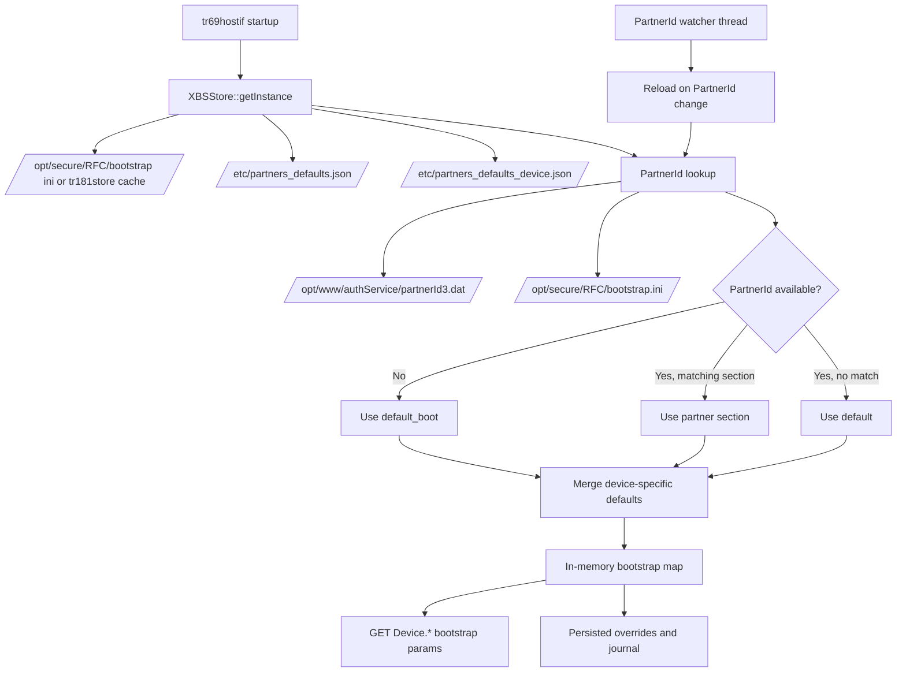
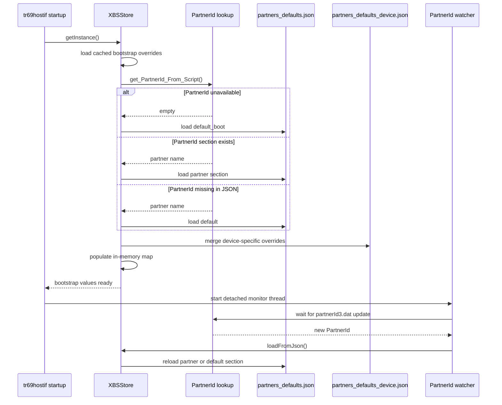

# Partner Defaults Workflow

## Overview

`tr69hostif` resolves partner-specific bootstrap defaults through `XBSStore`, which loads JSON defaults from `partners_defaults.json`, merges any device-specific additions from `partners_defaults_device.json`, overlays persisted bootstrap overrides, and reloads when PartnerId becomes available later in boot.

This workflow exists because the daemon may start before AuthService has written the runtime PartnerId. In that early-boot window, the code intentionally uses a reduced `default_boot` section. Once the actual PartnerId is discovered, the store reloads and switches to either the matching partner section or the generic `default` section.

## Architecture

### Component Diagram

## Key Components

### `XBSStore`

`XBSStore` owns bootstrap default resolution, in-memory storage, persisted override handling, and the PartnerId monitoring thread. The startup path is implemented in `XBSStore::getInstance()`, `init()`, `loadBSPropertiesIntoCache()`, and `loadFromJson()`.

### `partners_defaults.json`

This file contains the generic and per-partner bootstrap defaults. The current layout includes at least these top-level sections:

- `default_boot` for early-boot fallback values
- `default` for generic steady-state defaults when a resolved partner block is unavailable
- one or more partner-specific sections such as `community`

### `partners_defaults_device.json`

If present, this file overlays device-specific values on top of the selected partner configuration. Existing keys are replaced; missing keys are appended.

### PartnerId sources

The store resolves PartnerId in this order:

1. `/opt/www/authService/partnerId3.dat`
2. `/opt/secure/RFC/bootstrap.ini`

If neither source yields a value during startup, the code falls back to `default_boot`.

## Workflow Phases

### 1. Startup Cache Load

At startup, `XBSStore::getInstance()` constructs the singleton, loads any persisted bootstrap values from disk, then calls `loadFromJson()` to apply firmware defaults.

Persisted values are read before JSON defaults so the store can preserve runtime overrides and remove only stale firmware-default entries during a firmware update.

### 2. PartnerId Resolution

`loadFromJson()` calls `hostIf_DeviceInfo::get_PartnerId_From_Script()` to resolve the current PartnerId.

Possible outcomes:

1. PartnerId is available and matches a JSON section: use that section.
2. PartnerId is available but no matching section exists: fall back to `default`.
3. PartnerId is not available yet: fall back to `default_boot`.

This is the key distinction between `default_boot` and `default`:

- `default_boot` is a temporary early-boot profile used only when PartnerId is not yet known.
- `default` is the generic steady-state fallback used after PartnerId resolution when the partner block is missing.

### 3. Device-Specific Overlay

After selecting the base configuration, `getPartnerDeviceConfig()` optionally reads `partners_defaults_device.json` and merges those entries into the chosen partner object.

Overlay rules:

1. If a key already exists in the selected base object, the device-specific file replaces it.
2. If a key does not exist, the device-specific file adds it.
3. If the device-specific file does not exist, startup continues without error.

### 4. Store Population

The merged JSON object is iterated and each key-value pair is written into the in-memory bootstrap map through `setRawValue(..., HOSTIF_SRC_DEFAULT)`.

During this phase, the code also:

1. marks initial update state when the persistent bootstrap file does not yet exist
2. removes obsolete firmware-default entries that disappeared from the new JSON but were not overridden by RFC or WebPA
3. updates journal state through `XBSStoreJournal`

### 5. Runtime Reload When PartnerId Appears

After singleton creation, `XBSStore` starts a detached watcher thread that monitors `/opt/www/authService/partnerId3.dat` with `inotify`.

When the file is created or modified:

1. the thread re-reads PartnerId
2. compares it to the stored PartnerId value
3. updates the PartnerId bootstrap entry if it changed
4. calls `loadFromJson()` again to rebuild defaults using the resolved partner section

This is how the daemon transitions from `default_boot` to the partner-specific or `default` steady-state configuration.

## Sequence Diagram

## Threading Model

The partner-defaults workflow uses two execution contexts:

| Context | Purpose | Notes |
|---------|---------|-------|
| Startup thread | Initial bootstrap load | Runs during singleton initialization |
| Detached PartnerId watcher thread | Watches for `partnerId3.dat` creation or modification | Calls `loadFromJson()` again when PartnerId changes |

Synchronization notes:

1. `XBSStore` uses a recursive mutex around store access and reload operations.
2. The watcher thread updates the in-memory store only after detecting a changed PartnerId.
3. `default_boot` is intentionally temporary and may be replaced later in the same process lifetime.

## Memory And Persistence Model

### Ownership

1. JSON objects parsed with `cJSON` are temporary and released after reload completes.
2. Effective bootstrap values are copied into the in-memory dictionary.
3. Persisted runtime overrides remain on disk and survive daemon restart.

### Persistence Layers

Effective value precedence for bootstrap-backed parameters is:

1. persisted RFC or WebPA override
2. device-specific overlay from `partners_defaults_device.json` when present
3. selected partner default from `partners_defaults.json`

Operationally, the JSON files provide firmware defaults, while runtime changes are kept in the bootstrap store and journal under `/opt/secure/RFC/`.

## Error Handling And Fallbacks

| Condition | Behavior |
|-----------|----------|
| `partnerId3.dat` missing at startup | use `default_boot` |
| PartnerId resolved but no matching JSON section | use `default` |
| `partners_defaults_device.json` missing | continue without device-specific overlay |
| malformed JSON in partner defaults file | `loadFromJson()` fails and logs an error |
| malformed JSON in device-specific defaults file | device-specific merge fails and logs an error |

One deliberate behavior is that the firmware initial management notification is skipped when the store is still using `default_boot`. That notification is sent only once the active configuration is no longer the boot-time fallback.

## Operational Notes

### Why `default_boot` exists

Early boot may not have AuthService output yet, but some parameters still need safe values so dependent services can start. The `default_boot` section provides that minimum set.

### Why `default` is separate

Once PartnerId is known, falling back to `default` means the device has entered its steady-state configuration path, even if there is no explicit partner section for that ID.

### Typical Parameters In Each Section

In the current repository version:

- `default_boot` contains a reduced set of NTP, Xconf, WebPA, and locale-related keys.
- `default` contains the broader partner bootstrap and feature baseline, including multiple NTP servers and several RFC feature flags.

## Testing

Relevant unit-test coverage exists for the bootstrap-store behavior in `src/hostif/profiles/DeviceInfo/gtest/gtest_main.cpp`, including:

1. reading bootstrap values before PartnerId becomes available
2. reading bootstrap values after PartnerId is resolved
3. device-specific merge behavior through `getPartnerDeviceConfig()`
4. missing device-specific file handling

The current tests validate the reload path and merge helpers, but they do not fully document every production JSON section. When partner-default content changes, update both the JSON fixtures and the documentation.

## See Also

- [System Overview](overview.md)
- [Data Flow](data-flow.md)
- [JSON Usage](json-usage.md)
- [DeviceInfo Profile](../../src/hostif/profiles/DeviceInfo/docs/README.md)