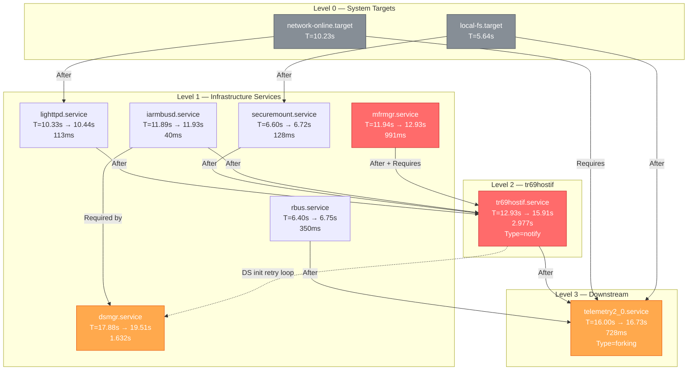
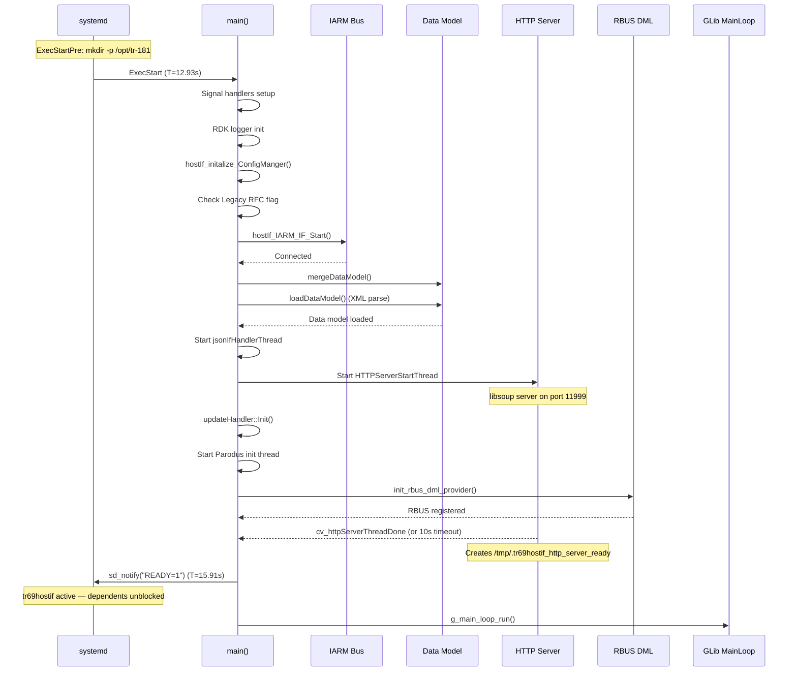
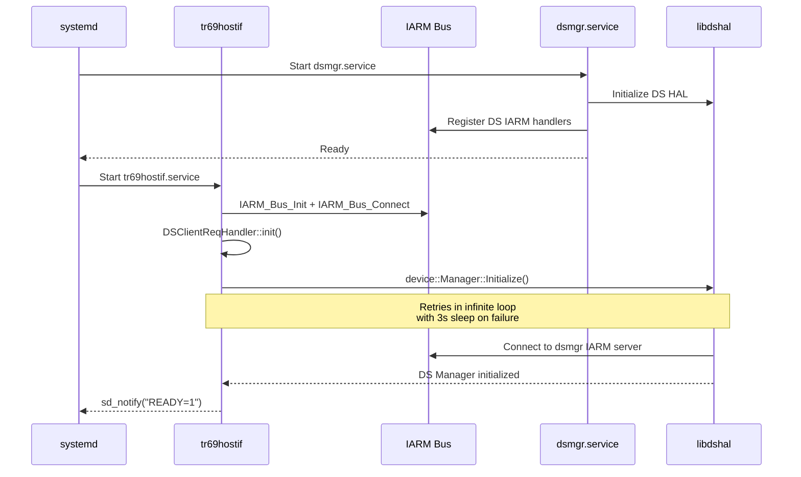
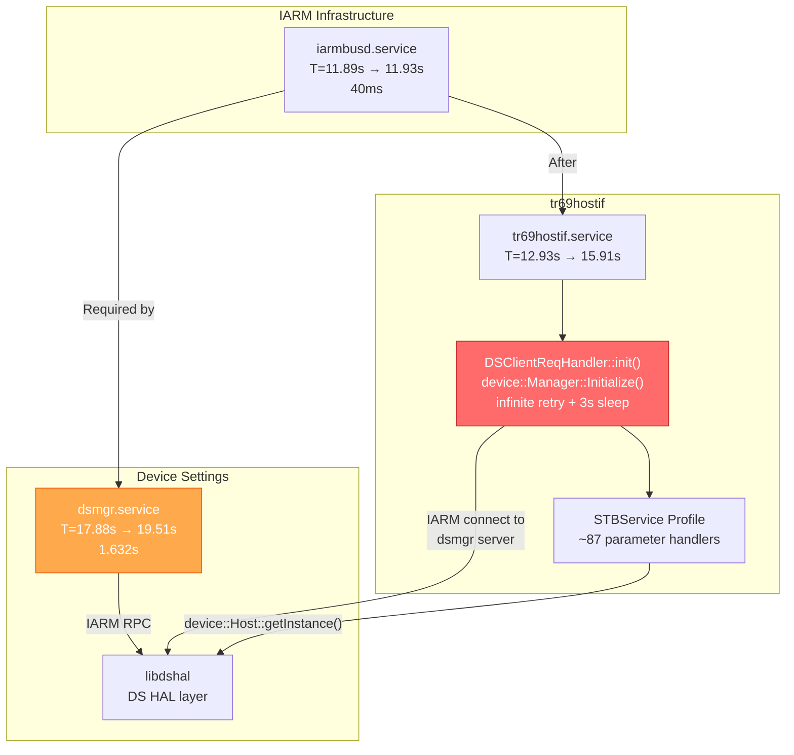
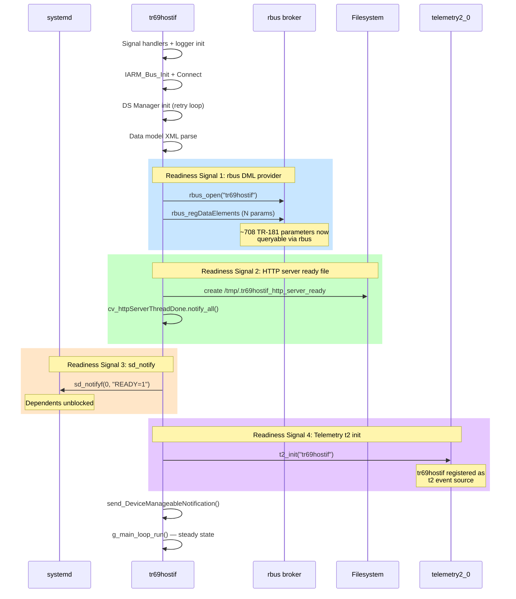
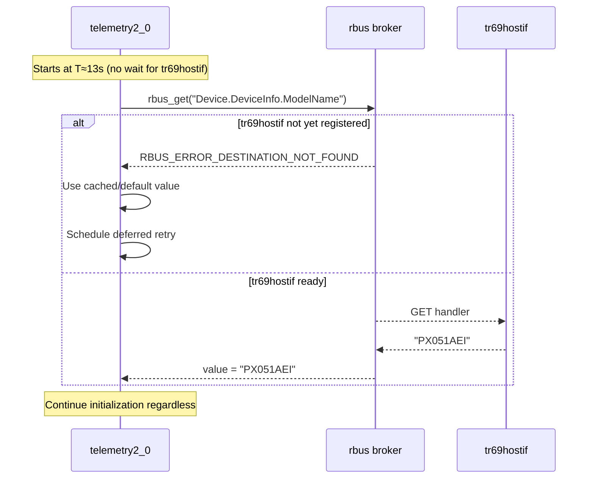

# tr69hostif Systemd Bootup Order Analysis

## Overview

This document analyzes the systemd boot dependency chain for `tr69hostif.service` on RDK
devices (xione-bcm-flex2 platform). It identifies the critical path from kernel to
`tr69hostif` readiness, documents how downstream services (notably `telemetry2_0.service`)
are delayed by this dependency chain, and proposes optimization strategies.

The analysis is based on `systemd-analyze plot` output captured from a live device
(see [boot_analysis.svg](../../boot_analysis.svg)).

**Total boot time**: 3.050s (kernel) + 46.703s (userspace) = **49.753s**

---

## Service Unit Files

### tr69hostif.service (deployed)

The deployed unit on xione-bcm-flex2 combines the base template with a drop-in override:

```ini
# /lib/systemd/system/tr69hostif.service
[Unit]
Description=TR69 Host Interface Daemon
After=lighttpd.service securemount.service iarmbusd.service

[Service]
Type=notify
SyslogIdentifier="tr69hostif"
EnvironmentFile=/etc/device.properties
ExecStartPre=/bin/mkdir -p /opt/tr-181
ExecStart=/bin/sh -c '/usr/bin/tr69hostif -c /etc/mgrlist.conf -p 10999 -s 11999'
ExecStop=/bin/kill -9 $MAINPID
RestartSec=10s
Restart=always
TimeoutStopSec=5

[Install]
WantedBy=multi-user.target
```

```ini
# /lib/systemd/system/tr69hostif.service.d/tr69hostif.conf (drop-in override)
[Unit]
After=mfrmgr.service
Requires=mfrmgr.service
```

**Effective ordering after merge**:
```
After=lighttpd.service securemount.service iarmbusd.service mfrmgr.service
Requires=mfrmgr.service
```

### telemetry2_0.service (downstream consumer)

```ini
[Unit]
Description=To start telemetry2_0
After=local-fs.target nvram.service previous-log-backup.service network-online.target
      systemd-timesyncd.service tr69hostif.service rbus.service
Requires=network-online.target

[Service]
Type=forking
ExecStart=/usr/bin/telemetry2_0
ExecStop=/usr/bin/killall telemetry2_0
ExecStopPost=/bin/rm -rf /tmp/.t2ReadyToReceiveEvents /tmp/telemetry_initialized_bootup /tmp/.t2ConfigReady
Restart=always

[Install]
WantedBy=multi-user.target
```

---

## Boot Timeline (from systemd-analyze plot)

The following timestamps are extracted from `boot_analysis.svg`. All times are relative
to the start of userspace (T=0.0s). The x-coordinate in the SVG maps as `x / 100 = seconds`.

### Service Activation Timeline

| Service | Activating Start | Active (Ready) | Duration | Critical Path? |
|---|---|---|---|---|
| nvram.service | 4.25s | 4.70s | 446ms | |
| local-fs.target | 5.64s | 5.64s | — | |
| previous-log-backup.service | 5.66s | 7.60s | 1.939s | |
| rbus.service | 6.40s | 6.75s | 350ms | |
| securemount.service | 6.60s | 6.72s | 128ms | Yes |
| rbus_session_mgr.service | 7.05s | 7.05s | — | |
| **network-online.target** | **10.23s** | **10.23s** | — | Yes |
| **lighttpd.service** | **10.33s** | **10.44s** | 113ms | Yes |
| **iarmbusd.service** | **11.89s** | **11.93s** | 40ms | Yes |
| **mfrmgr.service** | **11.94s** | **12.93s** | 991ms | **Yes (bottleneck)** |
| **tr69hostif.service** | **12.93s** | **15.91s** | **2.977s** | **Yes (bottleneck)** |
| **telemetry2_0.service** | **16.00s** | **16.73s** | 728ms | Blocked by above |
| systemd-timesyncd.service | 17.29s | 19.14s | 1.844s | |
| dsmgr.service | 17.88s | 19.51s | 1.632s | Late start (see [dsmgr section](#the-dsmgr-dependency--device-settings-manager)) |

### Critical Path Visualization

```
T=0.0s                    T=5.6s        T=10.2s    T=12.9s         T=15.9s  T=16.7s
  |                         |              |          |               |        |
  |  [kernel + early init]  |              |          |               |        |
  |                         |              |          |               |        |
  |                         v              |          |               |        |
  |                    local-fs.target     |          |               |        |
  |                                        v          |               |        |
  |                              network-online.target|               |        |
  |                                   lighttpd (113ms)|               |        |
  |                                                   v               |        |
  |                              iarmbusd (40ms)      |               |        |
  |                              mfrmgr (991ms)------>|               |        |
  |                                                   |               |        |
  |                              securemount (128ms)  |               |        |
  |                                                   |               |        |
  |                                                   v               v        |
  |                                              tr69hostif (2.977s)  |        |
  |                                                                   v        v
  |                                                          telemetry2_0 (728ms)
  |
```

---

## Dependency Chain Analysis

### tr69hostif Dependency Graph



### Effective Dependency Chain (Critical Path)

The longest path to tr69hostif readiness:

```
kernel (3.05s)
  → userspace start (T=0)
    → network-online.target (T=10.23s)                      [~10.2s wait]
      → lighttpd.service (T=10.33s, 113ms activation)       [0.1s]
        → iarmbusd.service (T=11.89s, 40ms activation)      [~1.5s gap]
          → mfrmgr.service (T=11.94s, 991ms activation)     [~1.0s]
            → tr69hostif.service (T=12.93s, 2.977s activation) [~3.0s]
              → telemetry2_0.service (T=16.00s)              [blocked until here]
```

**Total wall-clock from userspace start to telemetry ready**: ~16.7s

---

## tr69hostif Internal Initialization Sequence

`tr69hostif.service` uses `Type=notify`, meaning systemd waits for the daemon to call
`sd_notify("READY=1")` before considering it active. The internal sequence is:



**Key observation**: The 2.977s activation time includes data model XML parsing,
RBUS DML provider registration (~708 parameters), and waiting for the HTTP server
thread readiness (up to 10s timeout).

---

## Impact on telemetry2_0.service

### Why telemetry is delayed

`telemetry2_0.service` declares:
```ini
After=... tr69hostif.service rbus.service ...
```

Since `After=` is an ordering constraint, systemd will not start telemetry2_0 until
tr69hostif transitions to the `active` state (i.e., after `sd_notify("READY=1")`).

### Delay Breakdown

| Phase | Time | Delay Contribution |
|---|---|---|
| Kernel → userspace start | 0 → 3.05s | 3.05s (unavoidable) |
| Userspace start → network-online.target | 0 → 10.23s | 10.23s (network DHCP) |
| network-online → lighttpd ready | 10.23 → 10.44s | 0.21s |
| lighttpd → iarmbusd ready | 10.44 → 11.93s | 1.49s |
| iarmbusd → mfrmgr ready | 11.93 → 12.93s | **1.00s** |
| mfrmgr → tr69hostif ready | 12.93 → 15.91s | **2.98s** |
| tr69hostif ready → telemetry starts | 15.91 → 16.00s | 0.09s |
| telemetry activation | 16.00 → 16.73s | 0.73s |
| **Total: userspace → telemetry ready** | **0 → 16.73s** | **16.73s** |

**tr69hostif accounts for ~3.0s** of the 16.7s total path — approximately **18%** of the
userspace boot time to telemetry readiness.

Combined with its hard-required dependency `mfrmgr.service` (991ms), the
`mfrmgr → tr69hostif` chain accounts for **~4.0s (24%)** of the critical path.

### Comparison with SVG

The attached [boot_analysis.svg](../../boot_analysis.svg) (generated by `systemd-analyze plot`)
visually confirms this bottleneck. The tr69hostif bar (red=activating) spans from x=1293
to x=1591 (12.93s to 15.91s), and telemetry2_0 begins immediately after at x=1600 (16.00s).

---

## The dsmgr Dependency — Device Settings Manager

### What is dsmgr?

`dsmgr.service` (Device Settings Manager) is the RDK daemon that owns the hardware AV
subsystem. It initialises the Device Settings HAL (`libdshal`) and hosts the IARM-based
RPC server that other processes use to query or control HDMI ports, audio outputs, video
decoders, display devices, and power state.

tr69hostif uses dsmgr to implement the entire `Device.Services.STBService.1.*` parameter
tree (~87 handlers across 9 source files). Without a running dsmgr, every STBService
parameter GET/SET returns an error.

### How tr69hostif connects to dsmgr



The connection path is:

1. tr69hostif calls `hostIf_IARM_IF_Start()` → `IARM_Bus_Init()` + `IARM_Bus_Connect()`
2. Inside that, `DSClientReqHandler::getInstance()->init()` is called
3. `DSClientReqHandler::init()` calls `device::Manager::Initialize()` in an **infinite
   retry loop** with 3-second sleeps on failure:

```cpp
// src/hostif/handlers/src/hostIf_dsClient_ReqHandler.cpp
bool DSClientReqHandler::init()
{
    while(true)
    {
       try {
          device::Manager::Initialize();
       }
       catch(const std::exception &e) {
          RDK_LOG(RDK_LOG_ERROR, LOG_TR69HOSTIF,
              "Exception thrown while initializing device manager %s\n", e.what());
          sleep(3);
          continue;
       }
       break;
    }
    return true;
}
```

> **Risk**: If dsmgr is not running when tr69hostif starts, the infinite retry loop
> delays `sd_notify("READY=1")`, which blocks all downstream services (including
> telemetry2_0). Each retry adds a 3-second penalty.

### Build path: `@DSMGR_DEPENDENCY@` variable

The base service template [tr69hostif.service](../../tr69hostif.service) uses a build-time
variable for the DS dependency:

```ini
After=lighttpd.service securemount.service @DSMGR_DEPENDENCY@
```

This variable is substituted at build time by the platform recipe. On the
xione-bcm-flex2 device captured in the SVG, it resolved to `iarmbusd.service`:

```ini
# Deployed on device:
After=lighttpd.service securemount.service iarmbusd.service
```

The rationale: on newer platforms, dsmgr itself depends on iarmbusd, so ordering
tr69hostif after iarmbusd is sufficient. On older platforms, `@DSMGR_DEPENDENCY@`
resolves directly to `dsmgr.service`.

#### Platform resolution summary

| Platform Era | `@DSMGR_DEPENDENCY@` resolves to | Effective chain |
|---|---|---|
| Legacy (tr69bus) | `dsmgr.service` | tr69hostif → dsmgr (direct) |
| Current (rbus/IARM) | `iarmbusd.service` | tr69hostif → iarmbusd → (dsmgr starts independently) |

### Removal of hard dsmgr dependency (PR #168)

Per [CHANGELOG.md](../../CHANGELOG.md) entry in release 1.1.8:

> *Rdkemw 4383 remove dsmgr dependency [#168](https://github.com/rdkcentral/tr69hostif/pull/168)*

This PR changed the systemd dependency from a hard `After=dsmgr.service` to the
configurable `@DSMGR_DEPENDENCY@` variable, allowing the platform recipe to control the
ordering. On platforms where dsmgr takes a long time to start, this decouples the two
services — tr69hostif starts after iarmbusd and the DS retry loop handles the race.

### dsmgr Boot Timing (from SVG)

From the `systemd-analyze plot` data in [boot_analysis.svg](../../boot_analysis.svg):

| Service | Activating Start | Active (Ready) | Duration |
|---|---|---|---|
| iarmbusd.service | 11.89s | 11.93s | 40ms |
| **dsmgr.service** | **17.88s** | **19.51s** | **1.632s** |

Key observation: **dsmgr starts at T=17.88s** — almost 5 seconds *after* tr69hostif
begins activating (T=12.93s). This means `device::Manager::Initialize()` inside
`DSClientReqHandler::init()` is called before dsmgr is ready.

```
T=12.93s          T=15.91s     T=17.88s          T=19.51s
   |                  |            |                  |
   |  tr69hostif      |            |                  |
   |  activating      |            |   dsmgr          |
   |  (2.977s)        |            |   activating     |
   |                  |            |   (1.632s)       |
   v                  v            v                  v
   tr69hostif start   tr69hostif   dsmgr starts      dsmgr ready
                      READY                           (DS HAL up)
```

This timeline reveals that on this device:
- tr69hostif finishes activation and signals READY at T=15.91s
- dsmgr doesn't even begin activating until T=17.88s
- `device::Manager::Initialize()` likely succeeds on a retry (after one 3s sleep cycle)
  during the tr69hostif activation window, **or** the `#ifndef RDKV_TR69` code path is
  taken where DS init happens in a detached background thread

### Code Path Variations

The DS initialization path depends on the `RDKV_TR69` compile flag:

```cpp
// src/hostif/handlers/src/hostIf_IARM_ReqHandler.cpp
bool hostIf_IARM_IF_Start()
{
    if (TR69_HostIf_Mgr_Init() && TR69_HostIf_Mgr_Connect() && ...) {
        #ifdef RDKV_TR69
        // Synchronous: init DS in main thread (blocks sd_notify)
        pMsgHandler = DSClientReqHandler::getInstance();
        pMsgHandler->init();
        #endif
        // ...
    }
}

#ifndef RDKV_TR69
void hostIf_getPwrContInterface()
{
    sleep(10); // Wait for WPEframework
    pMsgHandler = DSClientReqHandler::getInstance();
    pMsgHandler->init();  // Runs in detached thread — does NOT block sd_notify
    PowerController_Init();
    PowerController_Connect(); // retry loop
}
#endif
```

| Build Flag | DS Init Path | Blocks sd_notify? | dsmgr Impact |
|---|---|---|---|
| `RDKV_TR69` defined | Synchronous in `hostIf_IARM_IF_Start()` | **Yes** — infinite retry loop | dsmgr must be ready, or activation time increases by 3s per retry |
| `RDKV_TR69` not defined | Detached thread `hostIf_getPwrContInterface()` | **No** — background thread | dsmgr can start later; 10s initial sleep + retry loop happens in background |

### STBService Parameters Backed by dsmgr

The following `Device.Services.STBService.1.*` parameters all require a running dsmgr
via `device::Manager::Initialize()`:

| Component | Source File | DS HAL Classes Used |
|---|---|---|
| Capabilities | `Capabilities.cpp` | `device::Host`, `device::VideoDevice` |
| AudioOutput.{i} | `Components_AudioOutput.cpp` | `device::Host`, `device::AudioOutputPort` |
| HDMI.{i} | `Components_HDMI.cpp` | `device::Host`, `device::VideoOutputPort` |
| HDMI.{i}.DisplayDevice | `Components_DisplayDevice.cpp` | `device::VideoOutputPort::Display` |
| SPDIF.{i} | `Components_SPDIF.cpp` | `device::Host`, `device::AudioOutputPort` |
| VideoDecoder.{i} | `Components_VideoDecoder.cpp` | `device::Host`, `device::VideoDevice`, `device::VideoOutputPort` |
| VideoOutput.{i} | `Components_VideoOutput.cpp` | `device::Host`, `device::VideoOutputPort`, `device::VideoDevice` |
| X_RDKCENTRAL-COM_eMMCFlash | `Components_XrdkEMMC.cpp` | `rdkStorageMgr` HAL (not dsmgr) |
| X_RDKCENTRAL-COM_SDCard | `Components_XrdkSDCard.cpp` | `rdkStorageMgr` HAL (not dsmgr) |

The routing is configured in [conf/mgrlist.conf](../../conf/mgrlist.conf):
```
Device.Services.STBService dsMgr
```

The `hostIf_msgHandler` maps the `dsMgr` token to `HOSTIF_DSMgr` enum, which dispatches
to `DSClientReqHandler::getInstance()`.

### Dependency Graph with dsmgr



---

## Alternative Service Configurations

### tr69hostif_no_new_http_server.service (legacy variant)

```ini
[Unit]
Description=TR69 Host Interface Daemon
After=lighttpd.service tr69bus.service dsmgr.service
Requires=tr69bus.service

[Service]
Type=notify
ExecStart=/usr/bin/tr69hostif -c /etc/mgrlist.conf -p 10999
```

Key differences:
- Uses `tr69bus.service` instead of `rbus.service`
- No `-s 11999` flag (HTTP server port not passed — hence no new HTTP server)
- Direct `After=dsmgr.service` — guarantees dsmgr is ready before tr69hostif starts
- `Requires=tr69bus.service` — hard dependency on legacy IPC bus

### parodus.service

```ini
[Unit]
After=update-device-details.service update-reboot-info.service
ConditionPathExistsGlob=/tmp/addressaquired_ipv*
ConditionPathExists=/tmp/route_available
ConditionPathExists=/opt/bspcomplete.ini

[Service]
Type=forking
```

Parodus has no direct `After=tr69hostif` dependency — it starts independently and
connects to tr69hostif via a libpd socket. However, tr69hostif starts the Parodus
init thread internally.

---

## Optimization Recommendations

### Recommendation 1: Decouple telemetry2_0 from tr69hostif service dependency

**Impact: High (removes ~3s from telemetry critical path)**

See the dedicated section [Decoupling telemetry2_0 from tr69hostif](#decoupling-telemetry2_0-from-tr69hostif)
below for the full analysis, readiness signaling inventory, migration strategies, and
implementation steps.

### Recommendation 2: Reduce tr69hostif activation time

**Impact: Medium (reduce ~3s → <1s)**

The 2.977s activation includes:
- Data model XML parsing (potentially hundreds of parameters)
- RBUS DML provider registration (~708 parameters)
- HTTP server thread startup + readiness wait (up to 10s timeout)

Potential optimizations:
1. **Lazy data model loading** — Register critical parameters first, load remaining in background
2. **Reduce HTTP server wait timeout** — The 10s `cv_httpServerThreadDone` timeout is excessive; libsoup typically binds in <100ms
3. **Parallel initialization** — RBUS registration and data model loading could overlap more

### Recommendation 3: Decouple mfrmgr from tr69hostif

**Impact: Medium (removes ~1s from chain)**

The drop-in override adds:
```ini
After=mfrmgr.service
Requires=mfrmgr.service
```

If tr69hostif only needs mfrmgr for a subset of parameters (e.g., SerialNumber, ModelName),
consider lazy-querying mfrmgr on first parameter access rather than requiring it at startup.

### Recommendation 4: Use `After=` instead of `Requires=` for mfrmgr

**Impact: Low (improves resilience)**

`Requires=mfrmgr.service` means if mfrmgr fails, tr69hostif is also stopped. Switching
to just `After=mfrmgr.service` with `Wants=mfrmgr.service` would allow tr69hostif to
continue even if mfrmgr has issues (returning defaults for missing hardware info).

### Summary of Potential Savings

| Optimization | Time Saved | Telemetry Start |
|---|---|---|
| Current baseline | — | 16.00s |
| Decouple telemetry from tr69hostif (Option A) | ~5.0s | ~10.9s |
| Reduce tr69hostif activation (3s → 1s) | ~2.0s | ~14.0s |
| Decouple mfrmgr (lazy query) | ~1.0s | ~15.0s |
| All combined | ~6–7s | ~9–10s |

---

## Decoupling telemetry2_0 from tr69hostif

This section provides a complete analysis of how to remove the hard
`After=tr69hostif.service` dependency from `telemetry2_0.service` and replace it with
runtime readiness detection.

### Problem Statement

`telemetry2_0.service` currently declares:

```ini
After=... tr69hostif.service rbus.service ...
```

This forces systemd to wait for tr69hostif to signal `READY=1` (via `sd_notify`) before
starting telemetry. Since tr69hostif takes **2.977s** to activate, telemetry startup is
delayed by at least that amount — from T=12.93s to T=16.00s on the xione-bcm-flex2
platform.

The question is: **does telemetry2_0 actually need tr69hostif to be fully initialized
at startup time, or can it start independently and discover tr69hostif readiness at
runtime?**

### tr69hostif Readiness Signals Inventory

tr69hostif exposes multiple readiness signals at different stages of initialization.
Any of these can serve as a runtime synchronization point for telemetry:



#### Signal Details

| # | Signal | Mechanism | Location | When | What It Means |
|---|---|---|---|---|---|
| 1 | **rbus DML provider** | `rbus_regDataElements()` | [hostIf_rbus_Dml_Provider.cpp](../../src/hostif/handlers/src/hostIf_rbus_Dml_Provider.cpp#L560) | After XML parse + rbus_open | All ~708 TR-181 params queryable via `rbuscli` / `rbus_get` |
| 2 | **HTTP server ready file** | `ofstream("/tmp/.tr69hostif_http_server_ready")` | [http_server.cpp](../../src/hostif/httpserver/src/http_server.cpp#L263) | After libsoup binds port 11999 | HTTP/WDMP-C interface accepting requests |
| 3 | **sd_notify READY=1** | `sd_notifyf(0, "READY=1\n...")` | [hostIf_main.cpp](../../src/hostif/src/hostIf_main.cpp#L517) | After HTTP ready + 10s timeout | systemd considers service active; all init complete |
| 4 | **t2_init** | `t2_init("tr69hostif")` | [hostIf_main.cpp](../../src/hostif/src/hostIf_main.cpp#L301) | Early — right after logger init | tr69hostif registered as telemetry event source |
| 5 | **DeviceManageable notification** | `hostIf_SetMsgHandler()` via detached thread | [Device_DeviceInfo.cpp](../../src/hostif/profiles/DeviceInfo/Device_DeviceInfo.cpp#L5210) | After sd_notify + webpa ready | Signals device is fully manageable (ACS + WebPA) |

#### rbus Events Published (runtime)

These are **not** startup signals but runtime events that could be subscribed to:

| Event Name | Trigger | Source |
|---|---|---|
| `RRD_SET_ISSUE_EVENT` | SET parameter issue detected | Device_DeviceInfo.cpp |
| `RRD_WEBCFG_ISSUE_EVENT` | WebConfig SET issue | Device_DeviceInfo.cpp |
| `Device.DeviceInfo.X_RDKCENTRAL-COM_RFC.Feature.RebootStop.Enable` | Reboot stop toggle | Device_DeviceInfo.cpp |
| `RDM_DOWNLOAD_EVENT` | RDM download triggered | Device_DeviceInfo.cpp |

### Why the Dependency Exists

telemetry2_0 likely depends on tr69hostif for one or more of these reasons:

1. **TR-181 parameter reads at startup** — Telemetry profiles may reference TR-181
   parameters (e.g., `Device.DeviceInfo.ModelName`) that are only available once
   tr69hostif's rbus DML provider is registered.

2. **RFC parameter reads** — Telemetry configuration may come from RFC parameters
   served by tr69hostif's `XRFCVarStore` (e.g., `RFC_ENABLE_*` keys via HTTP port
   11999).

3. **Historical ordering** — The dependency may have been added as a safety measure
   during integration without verifying whether telemetry actually blocks on
   tr69hostif-provided data at startup.

### Strategy: Replace systemd Ordering with Runtime Discovery

#### Option A: rbus Availability Check (Recommended)

**How it works**: telemetry2_0 removes `After=tr69hostif.service` and instead uses
`rbus_get()` with retry/fallback when it needs TR-181 parameters.



**telemetry2_0.service change**:
```ini
# BEFORE
[Unit]
After=local-fs.target nvram.service previous-log-backup.service network-online.target
      systemd-timesyncd.service tr69hostif.service rbus.service
Requires=network-online.target

# AFTER — tr69hostif.service removed from After=
[Unit]
After=local-fs.target nvram.service previous-log-backup.service network-online.target
      systemd-timesyncd.service rbus.service
Requires=network-online.target
```

**telemetry2_0 code change** (pseudo-code):
```c
// Instead of assuming tr69hostif is ready, handle RBUS_ERROR_DESTINATION_NOT_FOUND
rbusError_t rc = rbus_get(handle, "Device.DeviceInfo.ModelName", &value);
if (rc == RBUS_ERROR_DESTINATION_NOT_FOUND) {
    // tr69hostif not registered yet — use fallback
    log_info("tr69hostif not ready, using cached value");
    use_cached_or_default_value();
    schedule_deferred_refresh(30); // retry after 30s
} else if (rc == RBUS_ERROR_SUCCESS) {
    use_value(value);
}
```

**Pros**: No file polling, leverages existing rbus infrastructure, parameters become
available the instant tr69hostif registers them.

**Cons**: Requires code change in telemetry2_0 to handle `RBUS_ERROR_DESTINATION_NOT_FOUND`.

#### Option B: Ready-File Polling

**How it works**: telemetry2_0 removes the systemd dependency and instead polls for
`/tmp/.tr69hostif_http_server_ready` (or a new ready sentinel) in a background thread.

```c
// Background thread in telemetry2_0
void* wait_for_tr69hostif(void* arg) {
    const char* ready_file = "/tmp/.tr69hostif_http_server_ready";
    int retries = 0;
    while (access(ready_file, F_OK) != 0 && retries < 60) {
        sleep(1);
        retries++;
    }
    if (retries < 60) {
        refresh_tr181_parameters(); // Now safe to query
    }
    return NULL;
}
```

**telemetry2_0.service change**: Same as Option A (remove `After=tr69hostif.service`).

**Pros**: Simple, no rbus error handling needed, works even if rbus is not available.

**Cons**: Polling delay (up to 1s granularity), file-based coupling, does not
guarantee rbus DML registration is complete (file is created before `sd_notify`).

#### Option C: rbus Event Subscription

**How it works**: tr69hostif publishes a new rbus event when it reaches READY state.
telemetry2_0 subscribes to this event and triggers deferred initialization upon receipt.

**tr69hostif change** (add to `hostIf_main.cpp` after `sd_notify`):
```cpp
#define TR69HOSTIF_READY_EVENT "Device.DeviceInfo.X_RDKCENTRAL-COM_tr69hostif.Ready"

// After sd_notify:
rbusValue_t val;
rbusValue_Init(&val);
rbusValue_SetBoolean(val, true);
rbusEvent_t event = {0};
rbusObject_t data;
rbusObject_Init(&data, NULL);
rbusObject_SetValue(data, "value", val);
event.name = TR69HOSTIF_READY_EVENT;
event.data = data;
event.type = RBUS_EVENT_VALUE_CHANGED;
rbusEvent_Publish(rbusHandle, &event);
rbusValue_Release(val);
rbusObject_Release(data);
```

**telemetry2_0 subscriber**:
```c
void tr69hostif_ready_handler(rbusHandle_t handle, rbusEvent_t const* event,
                               rbusEventSubscription_t* subscription) {
    log_info("tr69hostif is ready — refreshing TR-181 parameters");
    refresh_tr181_parameters();
}

// At init:
rbusEvent_Subscribe(handle, TR69HOSTIF_READY_EVENT,
                    tr69hostif_ready_handler, NULL, 0);
```

**Pros**: Event-driven (no polling), precise timing, clean decoupling.

**Cons**: Requires code changes in **both** tr69hostif and telemetry2_0. If
telemetry2_0 subscribes after the event fires, it misses it (needs rbus retained
events or a fallback poll).

### Recommendation

**Use Option A (rbus availability check)** as the primary strategy:

1. It requires changes only in telemetry2_0 (not tr69hostif)
2. It handles the race condition naturally (`RBUS_ERROR_DESTINATION_NOT_FOUND`)
3. It leverages the existing rbus infrastructure — no new events or files needed
4. Parameters become available the instant they're registered (no polling delay)

Combine with Option B as a fallback for RFC parameters that go through the HTTP
server (port 11999) rather than rbus.

### Implementation Checklist

#### Phase 1: Audit telemetry2_0 startup dependencies

- [ ] Identify all TR-181 parameter reads during `telemetry2_0` startup
- [ ] Classify each as **required at init** vs **can be deferred**
- [ ] Check if any startup code calls `http://127.0.0.1:11999` (HTTP/WDMP-C path)
- [ ] Identify RFC_* key reads that go through tr69hostif XRFCVarStore

#### Phase 2: Add graceful fallback in telemetry2_0

- [ ] Wrap rbus_get calls with `RBUS_ERROR_DESTINATION_NOT_FOUND` handling
- [ ] Add retry/refresh logic for deferred parameters (timer or rbus subscription)
- [ ] Add `/tmp/.tr69hostif_http_server_ready` poll for HTTP-path parameters
- [ ] Add unit tests for the fallback path

#### Phase 3: Remove systemd dependency

- [ ] Remove `tr69hostif.service` from `After=` in telemetry2_0.service
- [ ] Run `systemd-analyze verify telemetry2_0.service` to check for broken deps
- [ ] Run `systemd-analyze critical-chain telemetry2_0.service` to verify the new path
- [ ] Measure boot time improvement with `systemd-analyze plot`

#### Phase 4: Validate

- [ ] Cold boot: verify telemetry2_0 starts and collects data without errors
- [ ] Verify TR-181 parameters eventually become available to telemetry
- [ ] Stress test: verify no race conditions under heavy boot load
- [ ] Verify `t2_event_d` / `t2_event_s` markers from tr69hostif still arrive

### Expected Boot Timeline After Decoupling

```
BEFORE (current):
  T=0    ...    T=12.9        T=15.9   T=16.0        T=16.7
  |              |              |        |              |
  |         tr69hostif start   |   telemetry start    |
  |              |              |        |              |
  |              | activating   |        | activating   |
  |              | (2.977s)     |        | (728ms)      |
  |              v              v        v              v
  |         tr69hostif     tr69hostif  t2 start      t2 ready
  |         activating     READY=1


AFTER (decoupled):
  T=0    ...    T=10.2   T=10.9        T=12.9        T=15.9
  |              |        |              |              |
  |         net-online   |         tr69hostif start   |
  |              |  telemetry start     |              |
  |              |  (after rbus only)   | activating   |
  |              |        |              | (2.977s)     |
  |              v        v              v              v
  |         net ready   t2 ready   tr69hostif     tr69hostif
  |                     (rbus      activating     READY=1
  |                      fallback               (t2 refreshes
  |                      mode)                   TR-181 params)
```

**Estimated savings**: telemetry2_0 starts at ~T=10.9s instead of ~T=16.0s (**~5s earlier**),
because it only waits for `rbus.service` (ready at T=6.75s) and `network-online.target`
(ready at T=10.23s).

### Verification Commands

```bash
# After removing the dependency, verify the new critical chain:
systemd-analyze critical-chain telemetry2_0.service
# Expected output should NOT show tr69hostif in the chain

# Verify telemetry starts before tr69hostif is ready:
systemctl show -p ActiveEnterTimestamp telemetry2_0.service
systemctl show -p ActiveEnterTimestamp tr69hostif.service
# telemetry timestamp should be earlier

# Check telemetry logs for graceful fallback:
journalctl -u telemetry2_0 | grep -i "not ready\|fallback\|retry\|DESTINATION_NOT_FOUND"

# Verify parameters eventually resolve:
rbuscli getvalues Device.DeviceInfo.ModelName
# Should succeed once tr69hostif is active

# Generate new boot plot for comparison:
systemd-analyze plot > boot_analysis_after.svg
```

---

## Diagnostic Commands

Use these commands on a device to reproduce and analyze the boot timeline:

```bash
# Generate the SVG boot plot
systemd-analyze plot > boot_analysis.svg

# Show critical chain to tr69hostif
systemd-analyze critical-chain tr69hostif.service

# Show critical chain to telemetry
systemd-analyze critical-chain telemetry2_0.service

# Show effective unit file (base + drop-ins merged)
systemctl cat tr69hostif.service

# Check dependency tree
systemctl list-dependencies tr69hostif.service

# Check reverse dependencies (who depends on tr69hostif)
systemctl list-dependencies --reverse tr69hostif.service

# Verify unit file correctness
systemd-analyze verify tr69hostif.service

# Blame list (services sorted by activation time)
systemd-analyze blame | head -20
```

---

## See Also

- [Architecture Overview](overview.md) — High-level tr69hostif component diagram
- [Threading Model](threading-model.md) — Internal thread architecture
- [Data Flow](data-flow.md) — Request routing from callers to profile handlers
- [boot_analysis.svg](../../boot_analysis.svg) — Raw `systemd-analyze plot` output
