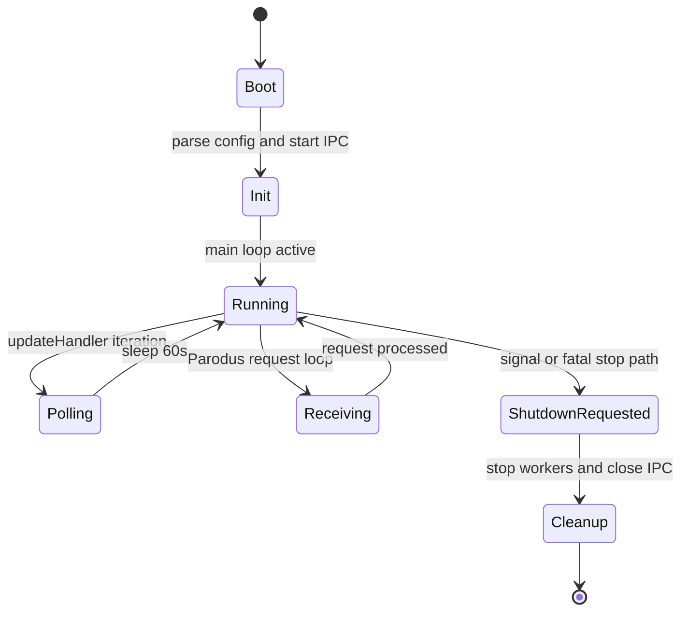
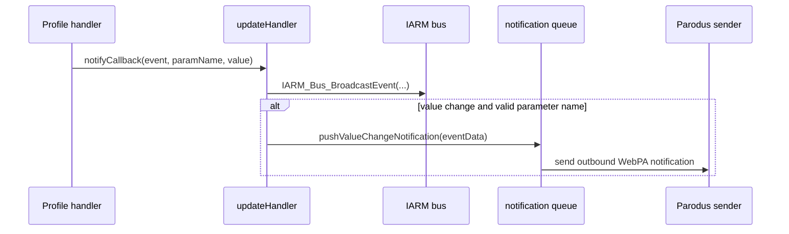

# Threading Model

## Overview

`tr69hostif` mixes GLib-managed threads, POSIX threads, and one standard C++ thread in the bootstrap store. The design keeps long-running I/O and polling work off the main loop while preserving a single shared request contract for all front ends.

## Thread Inventory

| Thread | Creation site | Type | Purpose | Shutdown behavior |
|--------|---------------|------|---------|-------------------|
| Main thread | process start | OS main thread | Initializes services and runs `g_main_loop_run()` | Exits through `exit_gracefully()` |
| Shutdown thread | `hostIf_main.cpp` | `pthread_create()` | Waits on `shutdown_thread_sem` and triggers graceful exit on signal | Woken by signal handler path |
| JSON handler thread | `hostIf_main.cpp` | `g_thread_try_new()` | Handles JSON request traffic on configured socket | Stops during daemon shutdown |
| HTTP server thread | `hostIf_main.cpp` | `g_thread_try_new()` | Serves optional legacy HTTP RFC endpoint | Controlled by runtime and feature gating |
| Update handler | `updateHandler::Init()` | `g_thread_new()` | Polls profiles for changes and emits add/remove/value-changed events | Stops when `updateHandler::stopped` becomes true |
| Parodus init/receive thread | `pthread_create()` into `libpd_client_mgr()` | POSIX thread | Connects to Parodus and stays in receive/send loop | Self-detaches in `connect_parodus()` |
| WebConfig thread | `hostIf_main.cpp` | `pthread_create()` | Handles WebConfig Lite processing when enabled | Feature-gated |
| Partner ID worker | `XBSStore` | `std::thread` | Resolves bootstrap partner identity asynchronously | Store-specific lifecycle |

## Synchronization Primitives

| Primitive | Location | Role |
|-----------|----------|------|
| `pthread_mutex_t graceful_exit_mutex` | `hostIf_main.cpp` | Serializes graceful shutdown path |
| `sem_t shutdown_thread_sem` | `hostIf_main.cpp` | Wakes the dedicated shutdown thread |
| `std::mutex get_handler_mutex` | `hostIf_msgHandler.cpp` | Serializes synchronous GET dispatch |
| `std::mutex set_handler_mutex` | `hostIf_msgHandler.cpp` | Serializes synchronous SET dispatch |
| `std::mutex mtx_httpServerThreadDone` + `std::condition_variable cv_httpServerThreadDone` | `hostIf_main.cpp` | Coordinates HTTP server startup completion |
| `pthread_mutex_t parodus_lock` + `pthread_cond_t parodus_cond` | `libpd.cpp` | Implements timed wait/retry behavior in Parodus receive loop |
| `GAsyncQueue* notificationQueue` | notification handler | Asynchronous queue for outbound change notifications |
| bootstrap store mutexes and condition variable | `XBSStore` | Guard bootstrap dictionaries and stop notifications |

## Concurrency Rules

### Request handling

- GET requests are serialized by `get_handler_mutex`.
- SET requests are serialized by `set_handler_mutex`.
- GET and SET paths use different mutexes, so one GET and one SET can proceed concurrently unless a downstream handler introduces tighter serialization.
- Attribute operations delegate through the same manager resolution path but do not add their own top-level mutex in `hostIf_msgHandler.cpp`.

### Update monitoring

The update handler is a single polling thread. It calls the profile-specific `checkForUpdates()` hooks in sequence and sleeps for 60 seconds between polling passes. This keeps notification generation predictable, but also means update latency is polling-based rather than interrupt-driven for most profiles.

### Parodus behavior

The Parodus worker thread calls `pthread_detach(pthread_self())` inside `connect_parodus()`. That makes it explicitly non-joinable and means shutdown logic must signal it to exit rather than attempt a `pthread_join()`.

## Lifecycle Diagram

## Notification Path

## Shutdown Notes

- Signals are converted into a semaphore wakeup for the dedicated shutdown thread.
- The update thread is cooperative and stops on a shared boolean flag.
- The Parodus receive loop exits when `exit_parodus_recv` is set and the condition variable is signaled.
- Detached workers must be shut down by signaling and resource cleanup, not by thread joining.

## Operational Risks

- Because update polling is single-threaded and sequential, a slow profile `checkForUpdates()` implementation can delay notifications for every other profile.
- The top-level GET/SET serialization simplifies safety but limits request concurrency under heavy management traffic.
- The Parodus path depends on external service availability and deliberately retries with exponential backoff.

## See Also

- [System Overview](overview.md)
- [Data Flow](data-flow.md)
- [Common Errors](../troubleshooting/common-errors.md)