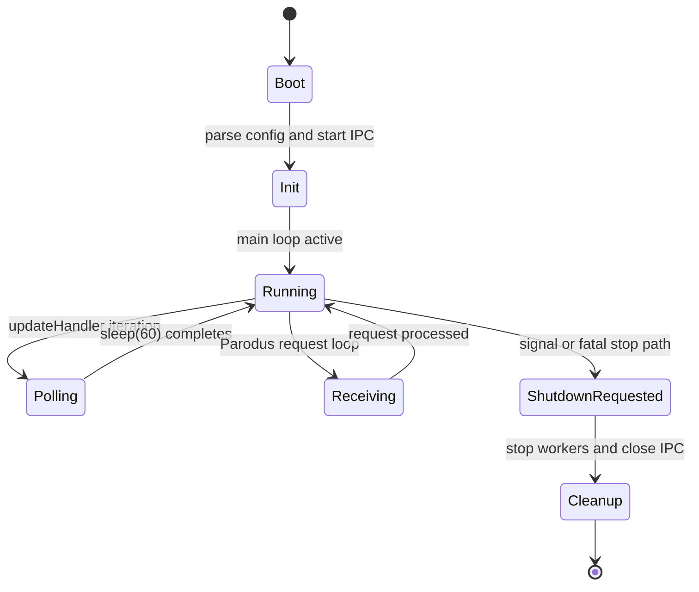
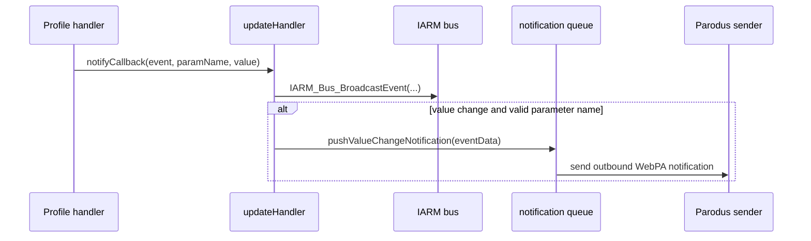

# Threading Model

## Overview

`tr69hostif` mixes GLib-managed threads, POSIX threads, and C++ `std::thread` across the codebase. The design keeps long-running I/O and polling work off the main loop while preserving a single shared request contract for all front ends. The threading model has grown organically and contains several undocumented detached threads, an uninitialized mutex on the critical shutdown path, and missed-signal races that represent the highest operational risk areas.

## Thread Inventory

### Daemon-level threads

| Thread | Creation site | Type | ID stored? | Join / Detach at shutdown |
|--------|---------------|------|-----------|--------------------------|
| Main thread | process start | OS main thread | n/a | `g_main_loop_quit()` unblocks it |
| Shutdown thread | [hostIf_main.cpp:338](../../src/hostif/src/hostIf_main.cpp) | `pthread_create()` | `shutdown_thread` (static) | **Never joined, never detached.** Exits when `exit_gracefully()` calls process exit. |
| JSON handler thread | [hostIf_main.cpp:442](../../src/hostif/src/hostIf_main.cpp) | `g_thread_try_new()` | `hostIf_JsonIfThread` | `g_thread_join()` in `main()` after loop returns |
| HTTP server thread | [hostIf_main.cpp:451](../../src/hostif/src/hostIf_main.cpp) | `g_thread_try_new()` | `HTTPServerThread` | `g_thread_join()` in `main()` after loop returns |
| Parodus init/receive thread | [hostIf_main.cpp:482](../../src/hostif/src/hostIf_main.cpp) | `pthread_create()` | `parodus_init_tid` | **⚠ Never joined.** Self-detaches via `pthread_detach(pthread_self())` inside `connect_parodus()` |
| WebConfig thread | [hostIf_main.cpp:495](../../src/hostif/src/hostIf_main.cpp) | `pthread_create()` | `webconfig_threadId` | **Never joined in cleanup** |
| Update handler | [hostIf_updateHandler.cpp:102](../../src/hostif/handlers/src/hostIf_updateHandler.cpp) | `g_thread_new()` | `updateHandler::thread` | **Not joined, not detached.** `stop()` only sets `stopped=true`; waits up to 60 s for sleep to complete |

### Ad-hoc and profile-level detached threads

These threads are created at request time or at profile initialization and are immediately detached. None are tracked or joined at shutdown.

| Thread function | Creation site | Detach mechanism | Shutdown tracking |
|----------------|---------------|-----------------|------------------|
| `getPwrContInterface` | [hostIf_IARM_ReqHandler.cpp:161](../../src/hostif/handlers/src/hostIf_IARM_ReqHandler.cpp) | `pwrThread.detach()` at line 164 | None |
| `ResetFunc` | [Device_DeviceInfo.cpp:2515](../../src/hostif/profiles/DeviceInfo/Device_DeviceInfo.cpp) | `PTHREAD_CREATE_DETACHED` attr | None |
| `executeRfcMgr` | [Device_DeviceInfo.cpp:4907](../../src/hostif/profiles/DeviceInfo/Device_DeviceInfo.cpp) | `.detach()` at line 4908 | None |
| `triggerRPCReboot` | [Device_DeviceInfo.cpp:5385](../../src/hostif/profiles/DeviceInfo/Device_DeviceInfo.cpp) | `.detach()` at line 5386 | None |
| `systemMgmtTimePathMonitorThr` | [Device_DeviceInfo.cpp:5622](../../src/hostif/profiles/DeviceInfo/Device_DeviceInfo.cpp) | `.detach()` at line 5623 | None |
| `getAuthServicePartnerID` | [XrdkCentralComBSStore.cpp:832](../../src/hostif/profiles/DeviceInfo/XrdkCentralComBSStore.cpp) | `.detach()` immediately | None |

## Synchronization Primitives

### Daemon-level primitives

| Primitive | Location | Type | Init | Destroy | Notes |
|-----------|----------|------|------|---------|-------|
| `graceful_exit_mutex` | [hostIf_main.cpp:145](../../src/hostif/src/hostIf_main.cpp) | `pthread_mutex_t` | **⚠ Never initialized** — no `PTHREAD_MUTEX_INITIALIZER` and no `pthread_mutex_init()` call | Never | Used on the critical shutdown path; undefined behavior |
| `shutdown_thread_sem` | [hostIf_main.cpp:143](../../src/hostif/src/hostIf_main.cpp) | `sem_t` | `sem_init(…, 0, 0)` at line 332 | Never explicitly destroyed | Wakes shutdown thread from signal handler |
| `mtx_httpServerThreadDone` | [hostIf_main.cpp:120](../../src/hostif/src/hostIf_main.cpp) | `std::mutex` | Default-constructed | Never | Guards `httpServerThreadDone` flag |
| `cv_httpServerThreadDone` | [hostIf_main.cpp:121](../../src/hostif/src/hostIf_main.cpp) | `std::condition_variable` | Default-constructed | Never | Wait uses lambda predicate against `httpServerThreadDone` — spurious-wake-safe |
| `get_handler_mutex` | [hostIf_msgHandler.cpp](../../src/hostif/handlers/src/hostIf_msgHandler.cpp) | `std::mutex` | Default-constructed | Never | Serializes all synchronous GET dispatches |
| `set_handler_mutex` | [hostIf_msgHandler.cpp](../../src/hostif/handlers/src/hostIf_msgHandler.cpp) | `std::mutex` | Default-constructed | Never | Serializes all synchronous SET dispatches |

### Parodus primitives

| Primitive | Location | Type | Init | Notes |
|-----------|----------|------|------|-------|
| `parodus_lock` | [libpd.cpp:71](../../src/hostif/parodusClient/pal/libpd.cpp) | `pthread_mutex_t` | `PTHREAD_MUTEX_INITIALIZER` | Guards `pthread_cond_timedwait` path |
| `parodus_cond` | [libpd.cpp:70](../../src/hostif/parodusClient/pal/libpd.cpp) | `pthread_cond_t` | `PTHREAD_COND_INITIALIZER` | **⚠ Signaled without holding `parodus_lock`** — missed-signal risk |

### Profile and component primitives

| Primitive | Location | Type | Init | Notes |
|-----------|----------|------|------|-------|
| `hostIf_DeviceInfo::m_mutex` | [Device_DeviceInfo.cpp:142](../../src/hostif/profiles/DeviceInfo/Device_DeviceInfo.cpp) | `pthread_mutex_t` | Initialized as `PTHREAD_MUTEX_ERRORCHECK` via `pthread_once` at line 290 | Re-initialized after static-init; intent is correct |
| `XBSStore::g_instance_mutex` | [XrdkCentralComBSStore.cpp:63](../../src/hostif/profiles/DeviceInfo/XrdkCentralComBSStore.cpp) | `std::mutex` | Default-constructed | Guards singleton creation |
| `XBSStore::mtx_stopped` + `cv` | [XrdkCentralComBSStore.cpp:61–62](../../src/hostif/profiles/DeviceInfo/XrdkCentralComBSStore.cpp) | `std::mutex` + `std::condition_variable` | Default-constructed | Guards `m_stopped` flag |
| `IPClientReqHandler::m_mutex` | [hostIf_IPClient_ReqHandler.cpp:55](../../src/hostif/handlers/src/hostIf_IPClient_ReqHandler.cpp) | `std::mutex` | Default-constructed | Guards singleton |
| `g_db_mutex` | [waldb.cpp:65](../../src/hostif/parodusClient/waldb/waldb.cpp) | `std::mutex` | Default-constructed | Guards WAL DB access |
| Profile `GMutex` instances (per-object) | Time, IP, Ethernet, InterfaceStack, STBService profiles | `GMutex` | `g_mutex_init()` | Generally `g_mutex_clear()` in destructor where present |

## Concurrency Rules

### Request handling

- GET requests are serialized by `get_handler_mutex`.
- SET requests are serialized by `set_handler_mutex`.
- GET and SET paths use different mutexes, so one GET and one SET can proceed concurrently unless a downstream handler introduces tighter serialization.
- Attribute operations delegate through the same manager resolution path but do not add their own top-level mutex in `hostIf_msgHandler.cpp`.

### Update monitoring

The update handler is a single polling thread. It calls the profile-specific `checkForUpdates()` hooks in sequence, then calls `sleep(60)`. This is not a condition variable wait, so the thread cannot respond to a stop signal until the full 60-second sleep completes. A stop signal issued while the thread is sleeping will take up to 60 seconds to take effect. There is no mutex protecting the profile iteration sequence inside `run()`.

### Parodus behavior

The Parodus worker thread calls `pthread_detach(pthread_self())` inside `connect_parodus()`. That makes it explicitly non-joinable. Shutdown logic must signal it via `stop_parodus_recv_wait()` rather than attempting a `pthread_join()`. The actual exit signal is sent by setting `exit_parodus_recv = true` and calling `pthread_cond_signal()`, both without holding `parodus_lock`.

### Lock ordering

No confirmed AB/BA (lock-inversion) deadlock patterns are present in current production paths. Notable proximity:

- Inside `exit_gracefully()`: `graceful_exit_mutex` is held while `XBSStore::stop()` is called, which internally takes `mtx_stopped`. These are distinct mutex instances on different objects, so no inversion exists. However, if this pattern is extended, the ordering rule must be: acquire `graceful_exit_mutex` before `mtx_stopped`.

## Lifecycle Diagram



## Shutdown Sequence

Signal path: `SIGINT / SIGTERM / SIGHUP` → `quit_handler()` → `sem_post(&shutdown_thread_sem)` → `shutdown_thread_entry` wakes from `sem_wait` → calls `exit_gracefully(sig)`.

`exit_gracefully()` operations in order:

1. Non-atomic read of `static int isShutdownTriggered` (no fence, no atomic)
2. `pthread_mutex_trylock(&graceful_exit_mutex)` — **mutex is never initialized; this is undefined behavior**
3. Set `isShutdownTriggered = 1`
4. `t2_uninit()` (conditional on `T2_EVENT_ENABLED`)
5. `WiFiDevice::shutdown()` (conditional on `USE_WIFI_PROFILE`)
6. `stop_parodus_recv_wait()` — sets `exit_parodus_recv = true` and calls `pthread_cond_signal()` **without holding `parodus_lock`**
7. `hostIf_HttpServerStop()` — stops HTTP and JSON handler threads
8. `updateHandler::stop()` — sets `stopped = true` only; thread is not joined; may still be sleeping
9. `XBSStore::getInstance()->stop()` — sets `m_stopped = true` and calls `cv.notify_one()`
10. `fclose(logfile)`
11. `g_hash_table_destroy(paramMgrhash)` — destroyed while handler threads are possibly still live
12. `hostIf_IARM_IF_Stop()`
13. `g_main_loop_quit(main_loop)` — unblocks `g_main_loop_run()` in `main()`
14. `HttpServerStop()` (conditional, legacy HTTP)
15. `pthread_mutex_unlock(&graceful_exit_mutex)`

Back in `main()` after `g_main_loop_run` returns:

16. `g_thread_join(hostIf_JsonIfThread)` — if non-NULL
17. `g_thread_join(HTTPServerThread)` — if non-NULL

**Threads not joined at process exit:** `shutdown_thread`, `parodus_init_tid`, `webconfig_threadId`, `updateHandler::thread`, and all ad-hoc detached threads listed in the thread inventory.

## Notification Path



## Signal Handling

| Location | Signal | Handler | Safety |
|----------|--------|---------|--------|
| [hostIf_main.cpp:349](../../src/hostif/src/hostIf_main.cpp) | `SIGINT` | `quit_handler` | Safe — writes `int`, calls `sem_post` (async-signal-safe) |
| [hostIf_main.cpp:350](../../src/hostif/src/hostIf_main.cpp) | `SIGTERM` | `quit_handler` | Safe |
| [hostIf_main.cpp:351](../../src/hostif/src/hostIf_main.cpp) | `SIGHUP` | `quit_handler` | Safe |
| [hostIf_main.cpp:352](../../src/hostif/src/hostIf_main.cpp) | `SIGPIPE` | `SIG_IGN` | Safe |
| [startParodus.cpp:300](../../src/hostif/parodusClient/startParodus/startParodus.cpp) | `SIGTERM` | `processExit` | **⚠ Unsafe** — calls `printf()` which is not async-signal-safe |
| [startParodus.cpp:301](../../src/hostif/parodusClient/startParodus/startParodus.cpp) | `SIGKILL` | `processExit` | **⚠ Invalid** — `SIGKILL` cannot be caught; this `signal()` call is silently ignored |
| [startParodus.cpp:302](../../src/hostif/parodusClient/startParodus/startParodus.cpp) | `SIGABRT` | `processExit` | **⚠ Unsafe** — `printf()` in handler |

## Gaps and High-Risk Areas

This section documents specific defects, undocumented behaviors, and patterns that present risk of crashes, hangs, or undefined behavior. Items are rated by severity.

### Risk Summary

| ID | Area | Severity | Risk type |
|----|------|----------|-----------|
| T-1 | `graceful_exit_mutex` uninitialized | **Critical** | Undefined behavior / crash |
| T-2 | Parodus missed-signal race | **High** | Thread hang / incorrect exit |
| T-3 | `paramMgrhash` destroyed while threads live | **High** | Use-after-free / crash |
| T-4 | `updateHandler::stopped` not atomic | **High** | Stale read / thread never stops |
| T-5 | `isShutdownTriggered` not atomic | **Medium** | Stale read / double shutdown |
| T-6 | `httpServerThreadDone` pre-read without lock | **Medium** | Race condition |
| T-7 | `startParodus.cpp` signal handler `printf` | **Medium** | Signal-handler safety violation |
| T-8 | `SIGKILL` registered but cannot be caught | **Medium** | Programmer error, misleading code |
| T-9 | `libparodus_instance` unguarded | **Medium** | Data race |
| T-10 | `updateHandler` uses `sleep(60)` not cond-wait | **Medium** | Slow shutdown response |
| T-11 | Multiple ad-hoc threads without shutdown tracking | **Medium** | Resource leak, undefined teardown |
| T-12 | Static cache buffers in DeviceInfo without locks | **Low** | Stale read / torn write |

---

### T-1 — `graceful_exit_mutex` is never initialized (Critical)

**File:** [hostIf_main.cpp:145](../../src/hostif/src/hostIf_main.cpp)

`graceful_exit_mutex` is declared as a `pthread_mutex_t` but is neither assigned `PTHREAD_MUTEX_INITIALIZER` nor passed to `pthread_mutex_init()`. Using it via `pthread_mutex_trylock()` and `pthread_mutex_unlock()` in `exit_gracefully()` is undefined behavior on all POSIX platforms and can cause a crash or silent no-op depending on the memory contents at startup.

**Required fix:** Add `= PTHREAD_MUTEX_INITIALIZER` at the declaration, or call `pthread_mutex_init(&graceful_exit_mutex, NULL)` at daemon startup before any signal can arrive.

---

### T-2 — Parodus missed-signal race (High)

**File:** [libpd.cpp:87–88](../../src/hostif/parodusClient/pal/libpd.cpp)

`stop_parodus_recv_wait()` sets `exit_parodus_recv = true` and immediately calls `pthread_cond_signal(&parodus_cond)` without holding `parodus_lock`. The receiving thread checks `exit_parodus_recv` at the top of the loop, then enters `pthread_cond_timedwait` — if the signal arrives in the window between the flag check and the wait entry, it is lost. The thread then blocks for the full 5-second timeout before rechecking.

```
Thread A (stop)              Thread B (receiver loop)
─────────────────────        ────────────────────────────
exit_parodus_recv = true      /* passes while(!exit_parodus_recv) */
pthread_cond_signal(...)      /* signal arrives here, lost */
                              pthread_cond_timedwait(...)  ← blocks 5s
```

**Required fix:** Acquire `parodus_lock` before setting the flag and before calling `pthread_cond_signal()`, matching the standard condition variable pattern.

---

### T-3 — `paramMgrhash` destroyed while handler threads remain live (High)

**File:** [hostIf_main.cpp — exit_gracefully() step 11](../../src/hostif/src/hostIf_main.cpp)

`updateHandler::stop()` only sets `stopped = true`. The update thread is not joined before `g_hash_table_destroy(paramMgrhash)` is called. If the update thread is mid-iteration calling profile `checkForUpdates()` handlers that dereference `paramMgrhash`, the result is use-after-free.

**Required fix:** Either join the update thread (or wait on a completion semaphore) before destroying the hash table, or ensure `paramMgrhash` is not dereferenced from the update thread path after the stop signal.

---

### T-4 — `updateHandler::stopped` is a plain `bool`, not `std::atomic<bool>` (High)

**File:** [hostIf_updateHandler.cpp:68](../../src/hostif/handlers/src/hostIf_updateHandler.cpp)

`stopped` is written on the shutdown thread and read on the update thread without any synchronization fence. The C++ memory model does not guarantee the update thread will ever observe a write to a plain `bool` from another thread. The compiler is also permitted to hoist the read outside the loop.

**Required fix:** Change `static bool stopped` to `static std::atomic<bool> stopped{false}` and replace `stopped = true` with `stopped.store(true, std::memory_order_release)`.

---

### T-5 — `isShutdownTriggered` is a plain `static int`, not atomic (Medium)

**File:** [hostIf_main.cpp:106](../../src/hostif/src/hostIf_main.cpp)

Written on the shutdown thread, read on the same thread. Risk is low in practice because `exit_gracefully()` runs only on the dedicated shutdown thread. However, if a second signal fires before shutdown completes, `isShutdownTriggered` could be read stale on a re-entry. Using `std::atomic<int>` or `volatile sig_atomic_t` would make the intent explicit.

---

### T-6 — `httpServerThreadDone` read outside lock before `wait_for` (Medium)

**File:** [hostIf_main.cpp:508 vs 511–514](../../src/hostif/src/hostIf_main.cpp)

`httpServerThreadDone` is checked at line 508 without holding `mtx_httpServerThreadDone`, then the mutex is acquired and `wait_for` is called. Although `wait_for` uses a lambda predicate that rechecks the flag safely under the lock, the pre-read at line 508 is a data race against the write in `http_server.cpp` under the lock. The race is benign in practice because the fast path is only taken when the daemon starts, but it is technically undefined behavior.

**Recommended fix:** Remove the pre-lock check and rely solely on the `wait_for` predicate.

---

### T-7 — Signal handler in `startParodus.cpp` calls `printf()` (Medium)

**File:** [startParodus.cpp:300–302](../../src/hostif/parodusClient/startParodus/startParodus.cpp)

`processExit`, registered for `SIGTERM` and `SIGABRT`, calls `printf()`. `printf()` is not async-signal-safe (POSIX.1-2017 §2.4.3). If the signal fires while the process is inside `malloc`, `printf`, or any other non-reentrant function, the result is undefined behavior, commonly a deadlock on the internal `flockfile()` mutex.

**Required fix:** Replace `printf()` in `processExit` with `write(STDOUT_FILENO, …)` or remove the output entirely.

---

### T-8 — `SIGKILL` cannot be caught (Medium)

**File:** [startParodus.cpp:301](../../src/hostif/parodusClient/startParodus/startParodus.cpp)

`signal(SIGKILL, processExit)` is silently ignored by the kernel. The intent (run cleanup before a forced kill) cannot be achieved. The call gives a false impression that cleanup will run on `SIGKILL` and should be removed to avoid confusing future readers.

---

### T-9 — `libparodus_instance` accessed from multiple threads without a lock (Medium)

**File:** [libpd.cpp:67](../../src/hostif/parodusClient/pal/libpd.cpp)

The handle is written in `connect_parodus()` (Parodus thread) and read in `parodus_receive_wait()` and `sendNotification()` which can be called from the main loop context. No mutex guards concurrent access. In practice, `connect_parodus()` completes before the receive loop is used, but the absence of any memory fence means the compiler or CPU is free to reorder the write such that readers see a stale or partial value.

---

### T-10 — `updateHandler` uses `sleep(60)`, not a timed condition wait (Medium)

**File:** [hostIf_updateHandler.cpp:188](../../src/hostif/handlers/src/hostIf_updateHandler.cpp)

The thread calls `sleep(60)` between profile polls. A stop signal issued while the thread is in `sleep()` will not interrupt it; the thread will exit only after the current sleep period completes, delaying clean shutdown by up to 60 seconds. Additionally, there is no lock protecting the profile iteration sequence inside `run()`.

**Recommended fix:** Replace `sleep(60)` with:

```cpp
std::unique_lock<std::mutex> lk(stop_mutex);
stop_cv.wait_for(lk, std::chrono::seconds(60), []{ return stopped.load(); });
```

---

### T-11 — Ad-hoc detached threads have no shutdown tracking (Medium)

Six `std::thread` or `pthread_t` instances in `Device_DeviceInfo.cpp` and `XrdkCentralComBSStore.cpp` are detached immediately after creation and are not tracked anywhere in the daemon. If the daemon shuts down while these threads are active they continue running against deallocated or freed resources (profile objects, IPC handles, curl handles).

**Recommended fix:** For long-running threads, store the `std::thread` and call `.join()` in the owning object's destructor. For truly fire-and-forget operations, ensure any shared resources they touch are either reference-counted or outlive the thread lifetime.

---

### T-12 — Static cache buffers in DeviceInfo accessed without locks (Low)

**File:** [Device_DeviceInfo.cpp:~155](../../src/hostif/profiles/DeviceInfo/Device_DeviceInfo.cpp)

Several `static char[]` buffers (e.g., `stbMacCache`) are written and read inside functions such as `get_Device_DeviceInfo_X_COMCAST_COM_STB_MAC()` that can be called concurrently during GET handling. No lock is held. In practice, concurrent MAC queries are rare, but a torn write to the static buffer produces a corrupted string without any error indication.

---

## Operational Risks (Summary)

- An uninitialized mutex on the shutdown path (`graceful_exit_mutex`) is the highest single-point defect.
- The Parodus missed-signal race can cause the Parodus thread to linger active for up to 5 seconds after the daemon has destroyed shared resources.
- The update handler's use of `sleep()` for polling and absence of a join in shutdown allows up to 60 seconds of post-shutdown execution and potential access to freed data.
- GET/SET serialization at the top level simplifies safety but limits request concurrency under heavy management traffic.
- Six untracked detached threads in `Device_DeviceInfo.cpp` can outlive the daemon's structured teardown.

## See Also

- [System Overview](overview.md)
- [Data Flow](data-flow.md)
- [JSON Usage](json-usage.md)
- [Common Errors](../troubleshooting/common-errors.md)