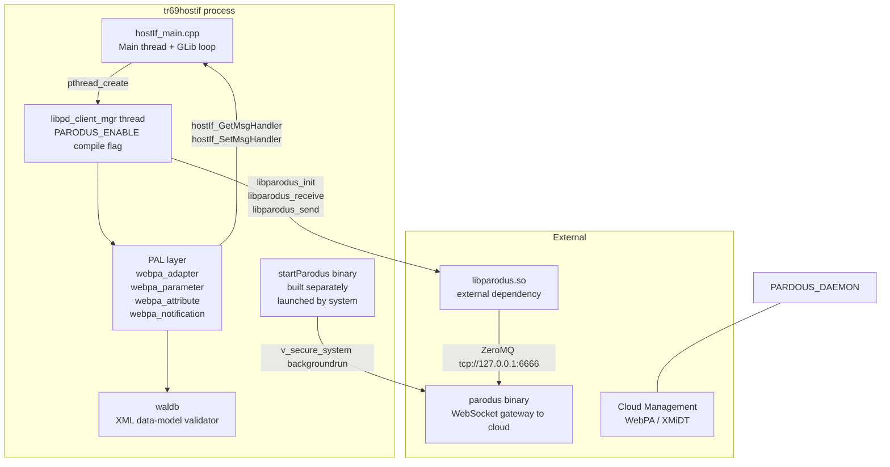
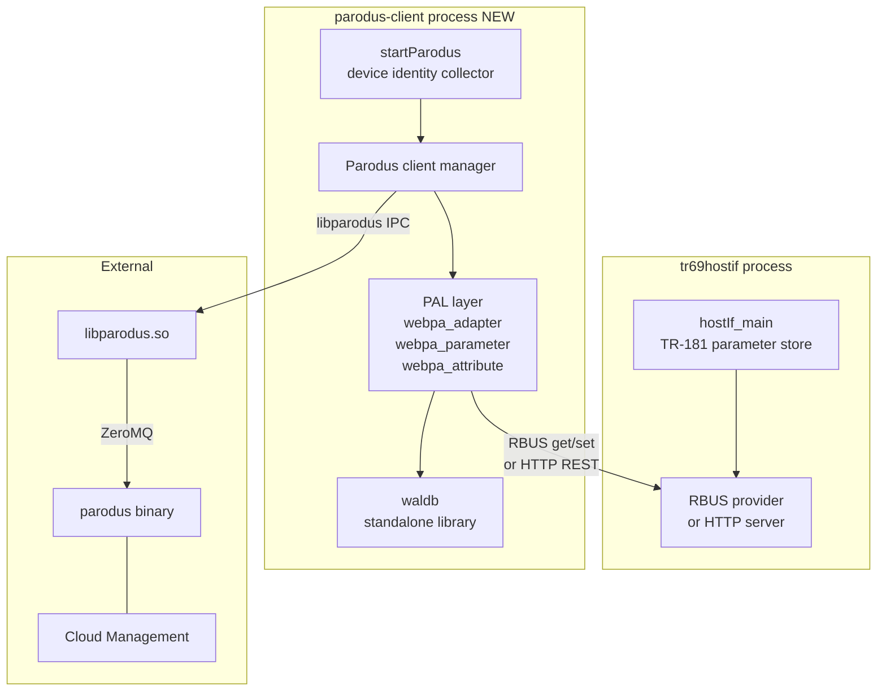

# Parodus Module Analysis

## Overview

`tr69hostif` currently embeds the Parodus client directly as a compiled-in subsystem. This document explains why the integration is structured the way it is today, what problems that creates operationally, and what a separation into an independent module would look like.

---

## 1. Why It Is the Way It Is Today

### 1.1 Historical Context

Parodus is the WebPA client gateway that connects RDK devices to the cloud-side management infrastructure over a persistent WebSocket. When WebPA was introduced into the RDK ecosystem, `tr69hostif` was already the resident TR-181 parameter manager. The shortest path to expose TR-181 parameters over WebPA was to embed the Parodus client library connection directly into `tr69hostif` so it could call `hostIf_GetMsgHandler()` and `hostIf_SetMsgHandler()` without any IPC.

### 1.2 Current Architecture



### 1.3 Component Inventory

| Component | Where it lives | Role |
|---|---|---|
| `libpd.cpp` | `parodusClient/pal/` | Entry point for the Parodus IPC thread. Owns `libparodus_init`, receive loop, and `sendNotification`. |
| `webpa_adapter.cpp` | `parodusClient/pal/` | WRP message router. Calls `wdmp_parse_request` and dispatches GET/SET/GETATTR/SETATTR to `webpa_parameter` and `webpa_attribute`. |
| `webpa_parameter.cpp` | `parodusClient/pal/` | Translates WDMP GET/SET into `HOSTIF_MsgData_t` and calls `hostIf_GetMsgHandler()` / `hostIf_SetMsgHandler()`. |
| `webpa_attribute.cpp` | `parodusClient/pal/` | Translates WDMP GETATTR/SETATTR into notify-flag operations via `hostIf_GetAttributesMsgHandler`. |
| `webpa_notification.cpp` | `parodusClient/pal/` | Builds notification WRP events and calls `sendNotification()`. Reads notify config from `notify_webpa_cfg.json`. |
| `waldb.cpp` | `parodusClient/waldb/` | Parses the XML data model (`/tmp/data-model.xml`) to validate parameter names and resolve wildcard paths. Linked as `libwaldb.la` into the main binary. |
| `startParodus.cpp` | `parodusClient/startParodus/` | Separate binary. Collects device identity (MAC, serial, partner ID, firmware version) and launches the `parodus` daemon via `v_secure_system`. |

### 1.4 Thread Lifecycle

The Parodus subsystem is spawned from `hostIf_main.cpp` behind the `PARODUS_ENABLE` compile-time flag:

```c
// hostIf_main.cpp:482
if(0 == pthread_create(&parodus_init_tid, NULL, libpd_client_mgr, NULL))
```

Inside `libpd_client_mgr`:

1. `checkDataModelStatus()` validates the XML data model via `waldb`.
2. `connect_parodus()` calls `pthread_detach(pthread_self())` — **the thread detaches itself** — then retries `libparodus_init()` with exponential backoff until the parodus daemon is reachable over ZeroMQ.
3. Once connected, `registerNotifyCallback()` and `setInitialNotify()` configure change notifications.
4. `parodus_receive_wait()` runs a blocking receive loop, dispatching every `WRP_MSG_TYPE__REQ` to `processRequest()`.

Because `connect_parodus()` detaches the thread, the main thread cannot `pthread_join(parodus_init_tid)` during shutdown. Any attempt to do so causes a crash (see the `pthread_detach_crash_fix` user memory note).

### 1.5 startParodus Coupling

`startParodus` is a separate compiled binary but lives inside the same source tree and build system. Its job is to read device identity parameters — many of which are TR-181 parameters — and launch the `parodus` daemon with them as command-line arguments. It reads several values via `getRFCParameter()` (serial number, boot time, server URL, token server URL) and reads partner ID directly from `/opt/www/authService/partnerId3.dat`, replicating the same PartnerId resolution logic that already exists in `XBSStore`.

---

## 2. Drawbacks and Issues with the Current Design

### 2.1 Thread Detachment Causes Crash-Risk on Shutdown

`connect_parodus()` calls `pthread_detach(pthread_self())` at the start of its retry loop. The thread is therefore detached for its entire lifetime. The `parodus_init_tid` handle stored in `hostIf_main.cpp` is invalid for joining after that point. Any future refactor that adds `pthread_join(parodus_init_tid, NULL)` to the shutdown path will crash in `__pthread_clockjoin_ex`.

### 2.2 Blocking Receive Loop Holds an Entire Thread Permanently

`parodus_receive_wait()` is a `while(1)` loop that calls `libparodus_receive(libparodus_instance, &wrp_msg, 2000)`. If the parodus daemon becomes unreachable (network failure, daemon restart), the loop falls into a 5-second `pthread_cond_timedwait` retry cycle. The thread never exits cleanly and never participates in structured shutdown.

The exit flag `exit_parodus_recv` is set by `stop_parodus_recv_wait()`, but that function is only called during normal daemon shutdown. If the receive call itself hangs (latent ZeroMQ socket behavior), the flag check is never reached.

### 2.3 processRequest Is Synchronous and Blocks the Receive Thread

`processRequest()` is called directly from the receive loop on the same Parodus thread. It calls through `webpa_parameter.cpp` → `hostIf_GetMsgHandler()` → concrete profile handlers, some of which make HAL calls that can take hundreds of milliseconds. During that time, no new WRP messages can be received. A slow HAL or a hung IARM call causes the entire WebPA channel to back up.

### 2.4 waldb Is Linked Into the Main Binary

`libwaldb.la` is linked directly into `tr69hostif`. This means the XML data-model XML is loaded into the same process address space and parsed at startup. The data model XML is large; loading it costs RSS memory even when the Parodus channel is not in use. If Parodus is not needed on a platform, the memory is still consumed because the library is unconditionally linked (even if `PARODUS_ENABLE` guards the thread creation, the library symbols are always resolved).

### 2.5 Duplicate PartnerId Resolution in startParodus

`startParodus.cpp` re-implements PartnerId reading from `/opt/www/authService/partnerId3.dat` and falls back to `getRFCParameter()` for `Device.DeviceInfo.X_RDKCENTRAL-COM_Syndication.PartnerId`. This duplicates the same logic that already exists in `Device_DeviceInfo.cpp::get_PartnerId_From_Script()` and `XBSStore`. There are now three independent code paths that each read PartnerId independently, each with their own fallback handling and file-open retry logic.

### 2.6 Configuration Is Fragmented Across Multiple Files

The Parodus subsystem reads configuration from at least four separate sources:

| Parameter | Source |
|---|---|
| Parodus ZeroMQ URL | `/etc/webpa_cfg.json` or `/opt/webpa_cfg.json` |
| Client ZeroMQ URL | `/etc/webpa_cfg.json` or `/opt/webpa_cfg.json` |
| WebPA server IP | `getRFCParameter("Device.X_RDK_WebPA_Server.URL")` |
| Notification config | `/etc/notify_webpa_cfg.json` or `/opt/notify_webpa_cfg.json` |
| JWT key path | Hardcoded `/etc/ssl/certs/webpa-rs256.pem` |
| CRUD config | Hardcoded `/opt/secure/parodus_cfg.json` |
| Partner ID | File → RFC parameter fallback (duplicated) |

There is no single configuration object that a test or integration environment can substitute cleanly.

### 2.7 No Independent Testability

Because the PAL layer calls `hostIf_GetMsgHandler()` / `hostIf_SetMsgHandler()` directly (function calls into the same process), it is impossible to unit-test the Parodus request dispatch path without bringing up the full `tr69hostif` subsystem. The unit tests in `parodusClient/gtest/` stub out waldb and the IPC layer but cannot test a real parameter GET through the Parodus path without the entire profile manager being initialized.

### 2.8 Build Flag Inconsistency

Some platform builds define `PARODUS_ENABLE` to include the receive thread but do not define `WEB_CONFIG_ENABLED` or `WEBCONFIG_LITE_ENABLE`, leaving the startParodus binary unused but still compiled. The compile-time flag guards only the thread creation, not the library linkage, which means object files and their static data are always included.

---

## 3. Potential Solution: Separating Parodus as an Independent Module

### 3.1 Target Architecture

The core idea is to decouple the Parodus client from the `tr69hostif` process entirely. Instead of calling `hostIf_GetMsgHandler()` directly, the Parodus module communicates with `tr69hostif` through the existing RBUS or HTTP server interface.



### 3.2 What Changes

**Replace direct function calls with IPC:**

`webpa_parameter.cpp` currently calls `hostIf_GetMsgHandler()` and `hostIf_SetMsgHandler()` directly. In the separated design, those calls are replaced with RBUS `rbusValue_Get` / `rbusValue_Set` calls, or with HTTP REST calls to `tr69hostif`'s HTTP server. The PAL layer becomes protocol-agnostic.

**Move waldb out of tr69hostif linkage:**

`libwaldb.la` should be a dependency of the parodus-client process only. It is removed from `tr69hostif_LDADD`. This reduces the resident memory of `tr69hostif` on platforms that do not use WebPA.

**Consolidate PartnerId reading:**

`startParodus.cpp` should query PartnerId via a single TR-181 GET (`Device.DeviceInfo.X_RDKCENTRAL-COM_Syndication.PartnerId`) through the IPC interface instead of reading the file directly. `tr69hostif` already owns the canonical resolution path.

**Give the thread a clean shutdown path:**

Remove `pthread_detach(pthread_self())` from `connect_parodus()`. The calling context — now the parodus-client process's own `main()` — can manage the thread lifecycle and call `pthread_join` cleanly.

**Unify configuration loading:**

All Parodus configuration is consolidated into a single structure loaded from `/etc/parodus_client.json` (or the existing `webpa_cfg.json` extended with the missing keys). No more fragmented reads across four files.

### 3.3 Interface Contract

The separated parodus-client module needs two capabilities from `tr69hostif`:

| Need | Provided by |
|---|---|
| GET any TR-181 parameter | RBUS `rbusValue_Get` or HTTP GET `/tr181?param=...` |
| SET any TR-181 parameter | RBUS `rbusValue_Set` or HTTP POST `/tr181` |
| Change notifications (push to cloud) | RBUS event subscription or `tr69hostif` notification callback |

No startup ordering dependency is required: the parodus-client retries until `tr69hostif` is reachable, which is the same behavior `connect_parodus()` already implements for the parodus daemon.

### 3.4 Transition Path

A clean incremental migration is possible without rewriting everything at once:

1. **Phase 1 — Isolate the PAL layer from tr69hostif linkage.** Introduce an abstract `IParamAccessor` interface in `webpa_parameter.cpp`. The current implementation calls `hostIf_GetMsgHandler()` directly. Compile-time injection (or link-time injection) can swap in an RBUS or HTTP implementation without changing the PAL API. Unit tests can use a mock implementation.

2. **Phase 2 — Remove waldb from tr69hostif link dependencies.** Move `libwaldb.la` out of `tr69hostif_LDADD`. Update the waldb `Makefile.am` to produce a shared or static library installable independently.

3. **Phase 3 — Split the startParodus binary into its own deliverable.** Give it its own `configure.ac` or package. The binary reads device identity from `tr69hostif` via RBUS at startup rather than duplicating file reads.

4. **Phase 4 — Move the parodus thread into the standalone process.** The thread entry point `libpd_client_mgr` becomes `main()`. The `PARODUS_ENABLE` guard in `hostIf_main.cpp` is removed entirely.

### 3.5 Benefits of Separation

| Concern | Current | After Separation |
|---|---|---|
| Memory footprint of tr69hostif | waldb + PAL always linked | Only TR-181 profile code |
| Parodus crash impact | Crash in parodus thread crashes tr69hostif (same process) | Isolated; tr69hostif continues |
| Independent restartability | Impossible; requires full tr69hostif restart | parodus-client can restart independently |
| Unit testability | Requires full tr69hostif profile manager | PAL layer testable with mock IParamAccessor |
| PartnerId reading | Three independent implementations | Single source: tr69hostif TR-181 parameter |
| Thread shutdown | Detached; join not possible | Joinable; clean shutdown |
| Build reduction for non-WebPA platforms | PAL object files always compiled | Separate package; omit from build entirely |

---

## See Also

- [System Overview](overview.md)
- [Threading Model](threading-model.md)
- [Data Flow](data-flow.md)
- [Partner Defaults Workflow](partner-defaults-workflow.md)
- [Public API](../api/public-api.md)
