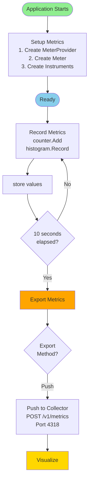

```mermaid
flowchart TB
    Start([Application Starts]) --> Setup[Setup Metrics<br/>1. Create MeterProvider<br/>2. Create Meter<br/>3. Create Instruments]
    
    Setup --> Ready([Ready])
    
    Ready --> Record[Record Metrics<br/>counter.Add<br/>histogram.Record]
    
    Record --> Memory[store values]
    
    Memory --> Timer{10 seconds<br/>elapsed?}
    
    Timer -->|No| Record
    
    Timer -->|Yes| Export[Export Metrics]
    
    Export --> Method{Export<br/>Method?}
    
    Method -->|Push| Collector[Push to Collector<br/>POST /v1/metrics<br/>Port 4318]
    
    Collector --> Visualize
    
    style Start fill:#90EE90
    style Ready fill:#87CEEB
    style Export fill:#FFA500
    style Visualize fill:#FFD700

```
