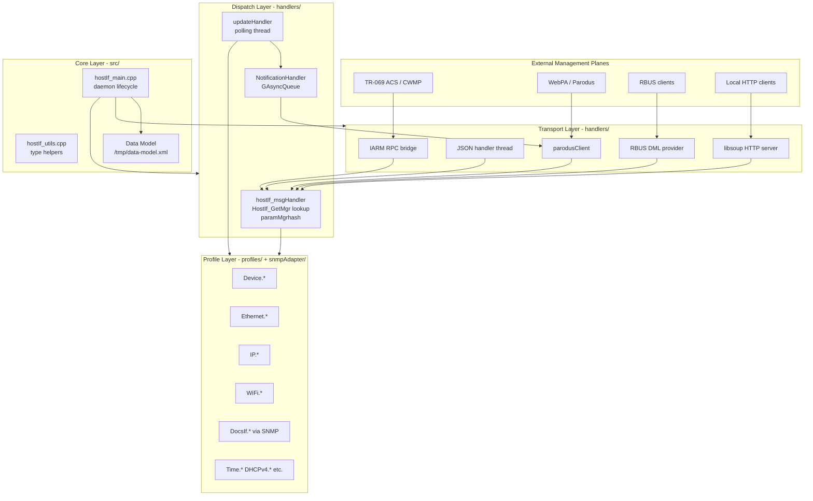
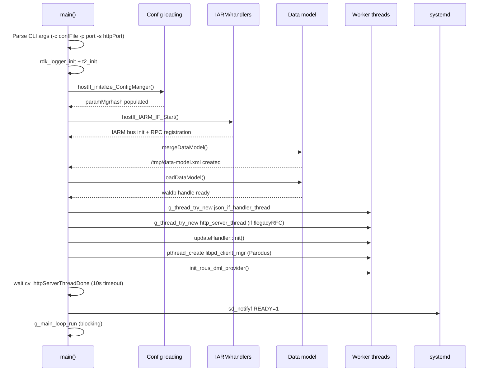
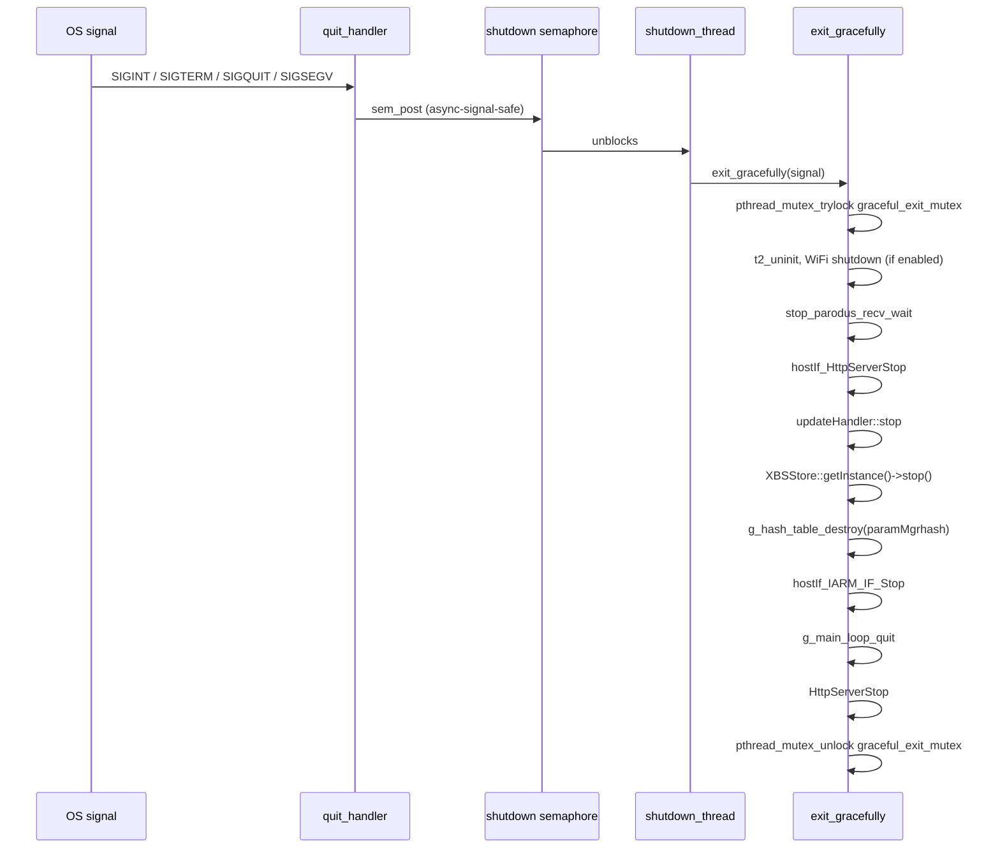
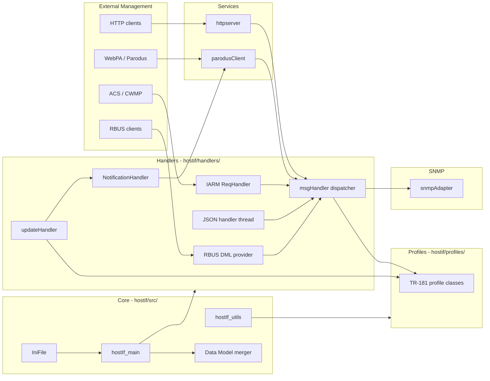

# hostif Module — Implementation Overview

## Overview

The `src/hostif/` directory contains the complete implementation of the tr69hostif daemon — the RDK management TR-69/TR-181 host-interface process. The daemon exposes TR-181 parameter GET, SET, and attribute operations to remote management systems (TR-069 ACS, WebPA/Parodus, RBUS) and to local management clients over HTTP and IARM IPC.

The module is organized into a core daemon layer (`src/`) surrounded by five specialized subsystems: `handlers/`, `httpserver/`, `parodusClient/`, `profiles/`, and `snmpAdapter/`. Each subsystem has its own documentation under its `docs/` folder. This README documents the core layer and the daemon-wide lifecycle that binds all subsystems together.

---

## Directory Structure

```
src/hostif/
├── src/                        # Core daemon: main(), utils, INI file parser
│   ├── hostIf_main.cpp         # Daemon entry point, startup sequence, shutdown
│   ├── hostIf_utils.cpp        # Shared utilities, type conversion, curl helpers
│   ├── IniFile.cpp             # Key=value INI file read/write helper
│   └── gtest/                  # Unit tests for core utilities
│
├── include/                    # Public headers shared across all subsystems
│   ├── hostIf_main.h           # Global types, T_ARGLIST, MERGE_STATUS, return codes
│   ├── hostIf_tr69ReqHandler.h # HOSTIF_MsgData_t, fault codes, parameter types
│   ├── hostIf_utils.h          # Utility function declarations
│   └── IniFile.h               # IniFile class declaration
│
├── handlers/                   # Request dispatch and transport bridges
├── httpserver/                 # libsoup-based HTTP server for JSON GET/SET
├── parodusClient/              # WebPA/Parodus IPC client integration
├── profiles/                   # TR-181 object implementations (Device.*, etc.)
├── snmpAdapter/                # SNMP bridge for DOCSIS and STB OIDs
│
└── docs/                       # This documentation (you are here)
```

---

## Architecture

The daemon layers into four tiers, each building on the one below:



---

## How the Daemon Starts

`main()` in `hostIf_main.cpp` performs a fixed ordered startup sequence. Understanding this sequence is essential for diagnosing boot-time failures.



### Key Startup Steps

| Step | Function | What it does |
|------|----------|-------------|
| 1 | `hostIf_initalize_ConfigManger()` | Parses `mgrlist.conf` into `paramMgrhash`: maps TR-181 prefixes to manager enums |
| 2 | `hostIf_IARM_IF_Start()` | Initializes IARM bus, registers GET/SET/attribute RPCs, starts Device/DS/SNMP managers |
| 3 | `mergeDataModel()` | Reads `RDK_PROFILE` from `/etc/device.properties`, merges STB/TV/generic XML into `/tmp/data-model.xml` |
| 4 | `loadDataModel()` | Loads the merged data model into the waldb handle for param validation |
| 5 | `json_if_handler_thread` | Old HTTP/JSON request path (always started) |
| 6 | `http_server_thread` | New libsoup HTTP server (started only when `!NEW_HTTP_SERVER_DISABLE` and not in legacyRFC mode) |
| 7 | `updateHandler::Init()` | Registers change callbacks with managed profiles; starts 60s polling GLib thread |
| 8 | `libpd_client_mgr` | Connects to Parodus daemon, enters receive loop for WebPA requests |
| 9 | `init_rbus_dml_provider()` | Registers RBUS DML provider for TR-181 parameters |
| 10 | `sd_notifyf(READY=1)` | Informs systemd the daemon is ready |
| 11 | `g_main_loop_run()` | Enters GLib main loop; daemon blocks here until shutdown signal |

### Data Model Merge

Before the data model is loaded, `mergeDataModel()` builds `/tmp/data-model.xml` from static XML files:

```mermaid
flowchart LR
    PROPS["/etc/device.properties<br/>RDK_PROFILE=STB or TV"] --> MERGE[mergeDataModel]
    GENERIC[/etc/data-model-generic.xml] --> MERGE
    STB[/etc/data-model-stb.xml] --> MERGE
    TV[/etc/data-model-tv.xml] --> MERGE
    BASE["/etc/data-model.xml<br/>RDKV only"] --> MERGE
    MERGE --> OUT[/tmp/data-model.xml]
    OUT --> WALDB["loadDataModel<br/>waldb handle"]
```

For `RDKV_TR69` builds: base is merged with generic as an intermediate step, then the profile-specific file is applied.  
For `RDKE` builds: generic and the profile file are merged directly.

---

## Shutdown Sequence

Graceful shutdown is handled by a dedicated thread (`shutdown_thread`) that waits on a POSIX semaphore:



The `graceful_exit_mutex` prevents re-entrant shutdown if multiple signals arrive simultaneously.

---

## Key Data Structures

### `HOSTIF_MsgData_t` — the universal request envelope

All GET, SET, and attribute operations between transport adapters, the dispatch layer, and profile implementations use this single structure:

```cpp
typedef struct _HostIf_MsgData_t {
    char  paramName[TR69HOSTIFMGR_MAX_PARAM_LEN];  // TR-181 dotted param path (4 KB)
    char  paramValue[TR69HOSTIFMGR_MAX_PARAM_LEN]; // Binary-encoded value (4 KB)
    char *paramValueLong;                           // Heap pointer for values > 4 KB
    char  transactionID[256];                       // Caller transaction ID
    short paramLen;                                 // Byte length of paramValue
    short instanceNum;                              // Object instance number
    HostIf_ParamType_t paramtype;                   // Type of paramValue encoding
    HostIf_ReqType_t   reqType;                     // GET, SET, GETATTRIB, SETATTRIB
    faultCode_t        faultCode;                   // TR-069 fault code on error
    HostIf_Source_Type_t requestor;                 // Source of the request
    HostIf_Source_Type_t bsUpdate;                  // Bootstrap update classification
    bool isLengthyParam;                            // Use paramValueLong instead
} HOSTIF_MsgData_t;
```

**Key design constraint**: `paramValue` is a fixed 4 KB buffer. Numeric types (int, bool, unsigned long) are stored as their raw binary representation via `put_int()`, `put_bool()`, etc., not as strings. The helpers in `hostIf_utils.cpp` provide the canonical encode/decode paths.

### `T_ARGLIST` — CLI argument state

```cpp
typedef struct argsList {
    char logFileName[64];       // -l: log file path
    char confFile[100];         // -c: manager config file path
    int  httpPort;              // -p: old JSON HTTP port
    int  httpServerPort;        // -s: new HTTP server port (conditional)
} T_ARGLIST;
```

`argList` is a global extern used throughout all subsystems to access the configured ports and paths.

### `HostIf_ParamType_t` — parameter type encoding

| Enum | Value encoding in `paramValue` |
|------|-------------------------------|
| `hostIf_StringType` | Null-terminated string |
| `hostIf_IntegerType` | `int` via `put_int()` / `get_int()` |
| `hostIf_UnsignedIntType` | `unsigned int` via `put_uint()` / `get_uint()` |
| `hostIf_BooleanType` | `bool` via `put_boolean()` / `get_boolean()` |
| `hostIf_UnsignedLongType` | `unsigned long` via `put_ulong()` / `get_ulong()` |
| `hostIf_DateTimeType` | String (ISO 8601 date-time) |

### `faultCode_t` — TR-069 fault code set

| Code | Name | Meaning |
|------|------|---------|
| 0 | `fcNoFault` | Success |
| 9000 | `fcMethodNotSupported` | RPC not available |
| 9001 | `fcRequestDenied` | Rejected by policy |
| 9002 | `fcInternalError` | Internal handler error |
| 9003 | `fcInvalidArguments` | Malformed request |
| 9006 | `fcInvalidParameterName` | No such parameter |
| 9007 | `fcInvalidParameterType` | Type mismatch |
| 9008 | `fcAttemptToSetaNonWritableParameter` | Read-only param SET |

---

## Threading Model

The daemon is inherently multi-threaded. The following threads are alive during normal operation:

| Thread | Created by | Library primitive | Purpose |
|--------|-----------|-------------------|---------|
| Main thread | OS | — | Startup, main loop |
| `shutdown_thread` | `pthread_create` | POSIX semaphore | Signal handler proxy, graceful exit |
| `json_if_handler_thread` | `g_thread_try_new` | GLib | Legacy JSON/HTTP request processing |
| `http_server_thread` | `g_thread_try_new` | libsoup callbacks | New HTTP server for GET/SET |
| `updateHandler` worker | `g_thread_new` | GLib | Periodic 60-second profile polling |
| `libpd_client_mgr` (Parodus) | `pthread_create` | pthreads | WebPA/Parodus request receive loop |
| Power controller thread (`RDKB`) | `std::thread + detach` | pthreads (detached) | Connects PowerController, registers callback |
| WebConfig thread | `pthread_create` | pthreads | Fetches/applies WebConfig payloads |

### Synchronization Overview

| Primitive | Location | Protects |
|-----------|----------|---------|
| `get_handler_mutex` (std::mutex) | `hostIf_msgHandler.cpp` | GET dispatch path |
| `set_handler_mutex` (std::mutex) | `hostIf_msgHandler.cpp` | SET dispatch path |
| `graceful_exit_mutex` (pthread_mutex) | `hostIf_main.cpp` | Re-entrant shutdown prevention |
| `mtx_httpServerThreadDone` (std::mutex) | `hostIf_main.cpp` | HTTP server startup coordination |
| `cv_httpServerThreadDone` (std::condition_variable) | `hostIf_main.cpp` | Main thread waits for server ready |
| `m_mutex` (GMutex) | `snmpAdapter.cpp` | SNMP adapter access serialization |
| `NotificationHandler` GAsyncQueue | `hostIf_NotificationHandler.cpp` | Notification event queue |

---

## `hostIf_utils.cpp` — Shared Utilities

This file provides all type-neutral helpers used across the subsystems.

### Type conversion helpers

| Function | Direction | Notes |
|----------|-----------|-------|
| `put_int` / `get_int` | `int` ↔ `paramValue[]` | Binary copy via pointer cast |
| `put_uint` / `get_uint` | `unsigned int` ↔ `paramValue[]` | Binary copy |
| `put_ulong` / `get_ulong` | `unsigned long` ↔ `paramValue[]` | Binary copy |
| `put_boolean` / `get_boolean` | `bool` ↔ `paramValue[]` | Binary copy |
| `getStringValue()` | `HOSTIF_MsgData_t` → `std::string` | Dispatch on `paramtype` |
| `putValue()` | `std::string` → `HOSTIF_MsgData_t` | Dispatch on `paramtype` |
| `int_to_string` / `string_to_int` | String ↔ int | `sprintf` / `strtol` |
| `string_to_uint` / `string_to_ulong` | String ↔ unsigned | `strtoul` |
| `string_to_bool` | `"true"` / `"1"` → `bool` | `strcasecmp` |

### Other utilities

| Function | Purpose |
|----------|---------|
| `matchComponent()` | Prefix and instance-number parsing for TR-181 paths |
| `triggerResetScript()` | Executes cold / factory / warehouse / customer reset scripts |
| `getJsonRPCData()` | `libcurl` POST to WPEFramework JSON-RPC endpoint with Bearer token |
| `get_security_token()` | Calls `/usr/bin/WPEFrameworkSecurityUtility` via popen, parses JWT token |
| `getCurrentTime()` / `timeValDiff()` | Wall-clock timing for request duration logging |
| `setLegacyRFCEnabled()` / `legacyRFCEnabled()` | Runtime flag for legacy vs new HTTP server mode |
| `getBSUpdateEnum()` | Maps "rfcUpdate" / "allUpdate" / "default" strings to `HostIf_Source_Type_t` |
| `isWebpaReady()` | Checks for `/tmp/webpa/start_time` sentinel file |
| `get_system_manageble_ntp_time()` | Reads NTP-confirmed time from `/tmp/timeReceivedNTP` |
| `get_device_manageble_time()` | Polls `/tmp/webpa/start_time` up to 5 times for epoch value |

### `IniFile` class

A simple `key=value` file parser with in-memory dictionary and write-back:

| Method | Purpose |
|--------|---------|
| `load(filename)` | Opens the file, parses `=`-delimited lines into `m_dict` |
| `value(key, default)` | Returns stored value or a caller-provided default |
| `setValue(key, value)` | Updates `m_dict` and immediately flushes to disk |
| `clear()` | Empties `m_dict` and flushes (erases file content) |
| `flush()` | Truncates and rewrites the INI file from `m_dict` |

---

## Build Configuration and Feature Gates

The daemon's compiled feature set is controlled by a set of build-time macros. The presence or absence of these macros changes which subsystems are compiled in and which runtime paths are active.

| Macro | Effect when defined |
|-------|-------------------|
| `NEW_HTTP_SERVER_DISABLE` | Disables the libsoup HTTP server; old JSON path only |
| `PARODUS_ENABLE` | Enables Parodus/WebPA integration and `libpd_client_mgr` thread |
| `WEBPA_RFC_ENABLED` | Adds WEBPAXG feature flag check at startup; daemon exits if disabled |
| `ENABLE_SD_NOTIFY` | Sends `READY=1` to systemd via `sd_notifyf` |
| `RDKV_TR69` | Enables RDKV-specific two-step data model merge and `pwrMgr.h` |
| `WEB_CONFIG_ENABLED` | Enables WebConfig multipart task (`initWebConfigMultipartTask`) |
| `WEBCONFIG_LITE_ENABLE` | Enables lightweight WebConfig thread (`initWebConfigTask`) |
| `T2_EVENT_ENABLED` | Enables Telemetry 2 via `t2_event_d` / `t2_event_s` |
| `USE_WIFI_PROFILE` | Compiles in WiFi profile; calls `WiFiDevice::init/shutdown` |
| `IS_YOCTO_ENABLED` | Links `libsecure_wrapper` explicitly |
| `RDK_DEVICE_EMU` | Selects `eth0` instead of `eth1` as the Ethernet interface |
| `SNMP_ADAPTER_ENABLED` | Compiles in SNMP adapter and `SNMPClientReqHandler` |

---

## Runtime File Dependencies

The daemon reads, writes, or checks these paths at runtime:

| Path | Access | Purpose |
|------|--------|---------|
| `argList.confFile` (default `mgrlist.conf`) | Read | Manager-to-prefix mapping |
| `/etc/device.properties` | Read | `RDK_PROFILE` determination |
| `/etc/data-model-generic.xml` | Read | Generic TR-181 data model fragment |
| `/etc/data-model-stb.xml` | Read | STB profile data model fragment |
| `/etc/data-model-tv.xml` | Read | TV profile data model fragment |
| `/etc/data-model.xml` | Read (RDKV only) | RDKV base data model |
| `/tmp/data-model.xml` | Write then Read | Merged runtime data model |
| `/opt/debug.ini` or `/etc/debug.ini` | Read | RDK logger level configuration |
| `/opt/RFC/.RFC_LegacyRFCEnabled.ini` | Existence check | Legacy RFC mode flag |
| `/opt/notify_webpa_cfg.json` or `/etc/notify_webpa_cfg.json` | Read | Parodus notification config |
| `/etc/tr181_snmpOID.conf` | Read | SNMP OID mapping (via snmpAdapter) |
| `/tmp/.tr69hostif_http_server_ready` | Write | Sentinel for RFC readiness check |
| `/tmp/webpa/` | Create + Write | Parodus working directory |
| `/tmp/webpa/start_time` | Read | WebPA manageable-time epoch |
| `/tmp/timeReceivedNTP` | Read | NTP confirmed time |
| Systemd socket | Write | `sd_notifyf(READY=1)` |

---

## Component Interaction Summary



---

## Known Issues and Gaps

The following implementation gaps were identified by reviewing `hostIf_main.cpp`, `hostIf_utils.cpp`, and `IniFile.cpp`. Each entry records severity, the affected file and line area, the problem, and the recommended fix.

---

### Gap 1 — Critical: `GetFeatureEnabled()` references undefined variable `feature`

**File**: `src/hostif/src/hostIf_main.cpp` — `GetFeatureEnabled()`

**Observation**: The function signature takes `char *cmd` but the function body uses `feature`, which is neither a parameter nor a local variable:

```cpp
bool GetFeatureEnabled(char *cmd)
{
    struct stat buffer;
    string fileName = "/opt/secure/RFC/" + string(".RFC_") + feature + ".ini";
    return (stat(fileName.c_str(), &buffer) == 0);
}
```

`feature` is an undeclared identifier. The only caller passes `"WEBPAXG"` as the argument named `cmd`. This code cannot compile unless `feature` has been defined as a global elsewhere (not visible in this file), making the function completely disconnected from its own parameter.

**Impact**: If the `WEBPA_RFC_ENABLED` guard is ever active with a compiler that enforces the undeclared identifier error, the daemon will not compile. If `feature` resolves to a global with a different value, the RFC file check is silently wrong and `GetFeatureEnabled("WEBPAXG")` never tests WEBPAXG.

**Recommended fix**:
```cpp
bool GetFeatureEnabled(const char *feature)
{
    struct stat buffer;
    string fileName = "/opt/secure/RFC/" + string(".RFC_") + feature + ".ini";
    return (stat(fileName.c_str(), &buffer) == 0);
}
```

---

### Gap 2 — High: `SIGSEGV` routed through the shutdown semaphore path

**File**: `src/hostif/src/hostIf_main.cpp` — `quit_handler()` and `shutdown_thread_entry()`

**Observation**: `SIGSEGV` is registered with the same `quit_handler` as `SIGTERM`/`SIGINT`:

```cpp
sigaction(SIGTERM, &sigact, NULL);   // clean shutdown
// SIGQUIT is NOT registered — see below
signal(SIGPIPE, SIG_IGN);
```

`SIGQUIT` is logged in `shutdown_thread_entry()` but `sigaction(SIGQUIT, ...)` is never called (the code comment says "The actions for SIGINT, SIGTERM, SIGSEGV, and SIGQUIT are set" but `SIGQUIT` and `SIGSEGV` are not registered). When a segfault occurs, the default handler produces a core dump immediately without any cleanup. Setting a custom handler for `SIGSEGV` without using an alternate signal stack (`SA_ONSTACK` is set, but see below) can cause a double fault if the crash was a stack overflow.

The `SA_ONSTACK` flag is set in `sigact.sa_flags` but no alternate stack is ever allocated via `sigaltstack()`. This means `SA_ONSTACK` has no effect and any signal handler execution uses the already-corrupted stack on SIGSEGV from a stack overflow.

**Impact**: Stack-overflow crashes will immediately double-fault and produce an unclean process termination with no graceful cleanup logs. `SIGQUIT` is not handled, so `kill -QUIT <pid>` does not trigger the shutdown path.

**Recommended fix**:
```cpp
// Register an alternate stack before registering SIGSEGV:
stack_t ss;
ss.ss_sp = malloc(SIGSTKSZ);
ss.ss_size = SIGSTKSZ;
ss.ss_flags = 0;
sigaltstack(&ss, NULL);

// Then register SIGSEGV and SIGQUIT:
sigaction(SIGSEGV, &sigact, NULL);
sigaction(SIGQUIT, &sigact, NULL);
```

---

### Gap 3 — High: `graceful_exit_mutex` is used but never initialized

**File**: `src/hostif/src/hostIf_main.cpp`

**Observation**: `graceful_exit_mutex` is declared as:

```cpp
pthread_mutex_t graceful_exit_mutex;
```

It is never initialized with `pthread_mutex_init()` or `PTHREAD_MUTEX_INITIALIZER`. Using an uninitialized mutex with `pthread_mutex_trylock()` is undefined behavior.

**Impact**: On platforms where `pthread_mutex_t` does not initialize to a valid unlocked state by default (non-Linux POSIX), `pthread_mutex_trylock(&graceful_exit_mutex)` can fail or crash, preventing any graceful shutdown. Even on Linux where it happens to work due to zero-initialization of BSS, relying on this is non-portable.

**Recommended fix**:
```cpp
pthread_mutex_t graceful_exit_mutex = PTHREAD_MUTEX_INITIALIZER;
```

---

### Gap 4 — High: `main()` returns `DB_FAILURE` on data model error but does not clean up

**File**: `src/hostif/src/hostIf_main.cpp`

**Observation**: If `mergeDataModel()` or `loadDataModel()` fails, `main()` returns `DB_FAILURE` immediately. By this point:

- IARM bus is connected (`hostIf_IARM_IF_Start()` has succeeded).
- The JSON handler thread has been created.
- The HTTP server thread may have been created.
- The shutdown semaphore has been initialized and the `shutdown_thread` is running.

None of these are cleaned up before `return DB_FAILURE`. The IARM bus remains connected, threads keep running, and the semaphore is leaked.

**Impact**: When data model initialization fails, the daemon exits without stopping its background threads. If systemd restarts the daemon, a second IARM registration attempt may fail because the first instance's bus connection was not properly terminated.

**Recommended fix** — call the cleanup sequence before returning:
```cpp
if (mergeStatus != MERGE_SUCCESS) {
    hostIf_IARM_IF_Stop();
    exit_gracefully(0);
    return DB_FAILURE;
}
```

---

### Gap 5 — Medium: `IniFile::flush()` truncates the file on every `setValue()` call

**File**: `src/hostif/src/IniFile.cpp`

**Observation**: Every call to `setValue()` immediately calls `flush()`, which opens the file with `ios::out | ios::trunc` (the `ofstream` default) and rewrites the entire dictionary from scratch. The comment in the code acknowledges this:

```cpp
// FIXME: truncating everytime is bad for flash in general
ofstream outputStream(m_filename.c_str()); // default is out|truncate
```

**Impact**: On devices with NAND flash storage, the combination of full-truncate + full-rewrite on every single-key update accelerates wear on the target sector. For INI files with many keys written during boot (device properties, bootstrap params), this creates unnecessary write amplification.

**Recommended fix** — defer flush until an explicit `sync()` call, or batch writes with a dirty flag:
```cpp
bool IniFile::setValue(const string &key, const string &value) {
    m_dict[key] = value;
    m_dirty = true;
    return true;  // caller must call flush() explicitly
}
```

---

### Gap 6 — Medium: `mergeDataModel()` silently ignores unknown `RDK_PROFILE` values in RDKE builds

**File**: `src/hostif/src/hostIf_main.cpp` — `mergeDataModelRDKE()`

**Observation**: `mergeDataModelRDKE()` supports only `"TV"` and `"STB"`:

```cpp
if (strcmp(rdk_profile, "TV") == 0) { ... }
else if (strcmp(rdk_profile, "STB") == 0) { ... }
else {
    RDK_LOG(... "RDKE: Unsupported RDK_PROFILE: %s\n", rdk_profile);
    return MERGE_FAILURE;
}
```

If `RDK_PROFILE` is empty due to a malformed or missing `/etc/device.properties` line, `rdk_profile` is an empty string that matches neither branch. The daemon returns `DB_FAILURE` from `main()` and exits. This is not logged at a prominent enough level to make the failure obvious in a field environment.

**Impact**: Any device that ships with a new profile value (e.g., `"GATEWAY"` or `"HUB"`) or a device where `/etc/device.properties` was corrupted returns `DB_FAILURE` and the daemon exits, entirely disabling remote management.

**Recommended fix** — add a default fallback that uses generic data model:
```cpp
else {
    RDK_LOG(RDK_LOG_WARN, ..., "Unknown RDK_PROFILE '%s', falling back to generic\n", rdk_profile);
    if (!filter_and_merge_xml(generic_file, generic_file, output_file))
        return MERGE_FAILURE;
}
```

---

### Gap 7 — Medium: `get_ulong()` returns `int` despite operating on `unsigned long`

**File**: `src/hostif/src/hostIf_utils.cpp`

**Observation**:

```cpp
int get_ulong(const char* ptr)
{
    unsigned long *ret = (unsigned long *)ptr;
    return *ret;
}
```

The return type is `int` (32-bit on all ABIs in this tree), but the value held in `paramValue` is an `unsigned long` (64-bit on LP64 systems). Values above 2,147,483,647 are silently truncated or sign-wrapped when stored in an `int` return.

`put_ulong()` correctly uses `unsigned long`, so the asymmetry means every read-back of an `unsigned long` parameter loses the upper 32 bits.

**Impact**: Any TR-181 parameter that holds a 64-bit counter (interface byte counters, total bytes received/sent) returns an incorrect value whenever the value exceeds 2³¹−1 (approximately 2 GB). CWMP ACS comparisons will fail once counters wrap.

**Recommended fix**:
```cpp
unsigned long get_ulong(const char* ptr)
{
    const unsigned long *ret = (const unsigned long *)ptr;
    return *ret;
}
```

---

### Gap 8 — Medium: `writeCurlResponse` does not accumulate data into the destination string

**File**: `src/hostif/src/hostIf_utils.cpp`

**Observation**: The libcurl write callback:

```cpp
size_t static writeCurlResponse(void *ptr, size_t size, size_t nmemb, string stream)
{
    size_t realsize = size * nmemb;
    string temp(static_cast<const char*>(ptr), realsize);
    stream.append(temp);   // appending to a local copy
    return realsize;
}
```

The `stream` parameter is passed **by value**, not by reference. `stream.append(temp)` modifies a local copy that is destroyed when the function returns. The caller's `response` string in `getJsonRPCData()` is never populated.

**Impact**: `getJsonRPCData()` always returns an empty string regardless of whether the HTTP JSON-RPC call succeeded. Any profile logic that depends on the WPEFramework JSON-RPC response (device info, security token validation) receives empty data and fails silently.

**Recommended fix**:
```cpp
size_t static writeCurlResponse(void *ptr, size_t size, size_t nmemb, string &stream)
{
    size_t realsize = size * nmemb;
    stream.append(static_cast<const char*>(ptr), realsize);
    return realsize;
}
```
The matching `CURLOPT_WRITEDATA` must pass `&response` (which is already done correctly by the caller).

---

### Gap 9 — Low: The WEBPA RFC check reads from `/opt/secure/RFC/` but `LEGACY_RFC_ENABLED_PATH` reads from `/opt/RFC/`

**File**: `src/hostif/src/hostIf_main.cpp`

**Observation**: Two RFC-related file paths in the same file use different directory roots:

```cpp
// WEBPA_RFC_ENABLED path:
string fileName = "/opt/secure/RFC/" + string(".RFC_") + feature + ".ini";

// Legacy RFC check:
#define LEGACY_RFC_ENABLED_PATH "/opt/RFC/.RFC_LegacyRFCEnabled.ini"
```

On some platforms, `/opt/secure/RFC/` is a security-restricted directory while `/opt/RFC/` is accessible to standard processes. If both directories exist but the daemon lacks permission to read `/opt/secure/RFC/`, `GetFeatureEnabled()` will always return `false` and the daemon will shut itself down via `sd_pid_notify(SD_FINALIZING)`.

**Impact**: Daemon fails to start on systems where `/opt/secure/RFC/` requires elevated privileges, with no meaningful error log distinguishing "WEBPAXG disabled" from "permission denied".

---

### Gap 10 — Low: `mergeDataModel()` uses `sscanf` without bounding the destination buffer

**File**: `src/hostif/src/hostIf_main.cpp` — `mergeDataModel()`

**Observation**:

```cpp
char rdk_profile[256] = {0};
// ...
int sscanf_result = sscanf(line, "RDK_PROFILE=%s", rdk_profile);
```

`sscanf` with `%s` has no field-width limit. If the `RDK_PROFILE=` line in `/etc/device.properties` contains a value longer than 255 characters (e.g., corrupted file), `rdk_profile` is overflowed.

**Recommended fix**:
```cpp
int sscanf_result = sscanf(line, "RDK_PROFILE=%255s", rdk_profile);
```

---

### Gap Summary Table

| # | Severity | File | Problem | Impact |
|---|----------|------|---------|--------|
| 1 | **Critical** | `hostIf_main.cpp` | `GetFeatureEnabled()` uses undeclared `feature` variable instead of `cmd` parameter | Compile error or silent wrong-path check when `WEBPA_RFC_ENABLED` is active |
| 2 | **High** | `hostIf_main.cpp` | `SIGSEGV` / `SIGQUIT` not registered; `SA_ONSTACK` set without `sigaltstack()` | Stack-overflow crashes double-fault; SIGQUIT unhandled |
| 3 | **High** | `hostIf_main.cpp` | `graceful_exit_mutex` never initialized | Undefined behavior on non-Linux POSIX; non-portable |
| 4 | **High** | `hostIf_main.cpp` | Data model failure returns early without IARM/thread cleanup | Zombie IARM connection blocks daemon restart |
| 5 | **Medium** | `IniFile.cpp` | `flush()` truncates and rewrites on every `setValue()` | Excessive flash wear; not suitable for high-frequency updates |
| 6 | **Medium** | `hostIf_main.cpp` | Unknown/empty `RDK_PROFILE` causes `MERGE_FAILURE` and exit | Remote management entirely disabled on unrecognized profile |
| 7 | **Medium** | `hostIf_utils.cpp` | `get_ulong()` returns `int`, truncating 64-bit values to 32 bits | Byte counters > 2 GB return wrong values to ACS and WebPA |
| 8 | **Medium** | `hostIf_utils.cpp` | `writeCurlResponse` takes `string` by value; response data never accumulated | `getJsonRPCData()` always returns empty string; JSON-RPC calls silently fail |
| 9 | **Low** | `hostIf_main.cpp` | RFC paths use `/opt/secure/RFC/` vs `/opt/RFC/` inconsistently | Permission failures look like "feature disabled" |
| 10 | **Low** | `hostIf_main.cpp` | `sscanf(..., "%s", rdk_profile)` has no field-width limit | Corrupted `device.properties` can overflow `rdk_profile[256]` |

---

## Testing

Unit tests for the core layer are in `src/hostif/src/gtest/`. The test binary is built with `GTEST_ENABLE` defined.

When modifying the core layer, validate:

1. Daemon starts cleanly with a valid `mgrlist.conf` and merged data model.
2. `mergeDataModel()` produces a valid `/tmp/data-model.xml` for each supported profile.
3. `loadDataModel()` succeeds and the waldb handle is ready before HTTP/Parodus threads start.
4. Clean shutdown on `SIGTERM` closes all threads and disconnects IARM.
5. `get_ulong` / `put_ulong` round-trip values above 4,294,967,295 correctly after Gap 7 fix.
6. `getJsonRPCData()` actually returns the HTTP response body after Gap 8 fix.

---

## See Also

- [handlers/docs/README.md](../handlers/docs/README.md) — Request dispatch and transport bridges
- [httpserver/docs/README.md](../httpserver/docs/README.md) — libsoup HTTP server module
- [parodusClient/docs/README.md](../parodusClient/docs/README.md) — WebPA/Parodus integration
- [snmpAdapter/docs/README.md](../snmpAdapter/docs/README.md) — SNMP adapter for DOCSIS and STB OIDs
- [docs/architecture/overview.md](../../../docs/architecture/overview.md) — Daemon-wide architecture
- [docs/api/public-api.md](../../../docs/api/public-api.md) — Public API reference
- [docs/architecture/threading-model.md](../../../docs/architecture/threading-model.md) — Full runtime thread model
