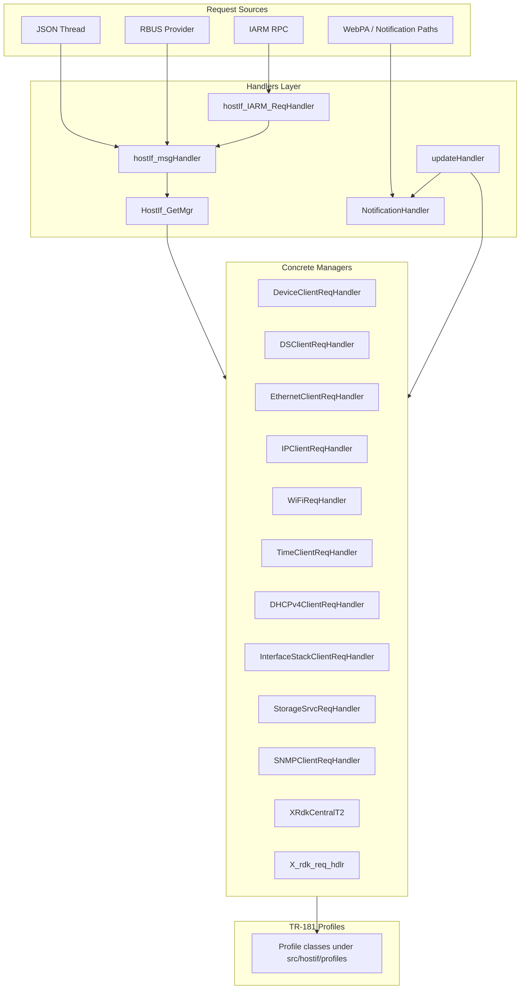
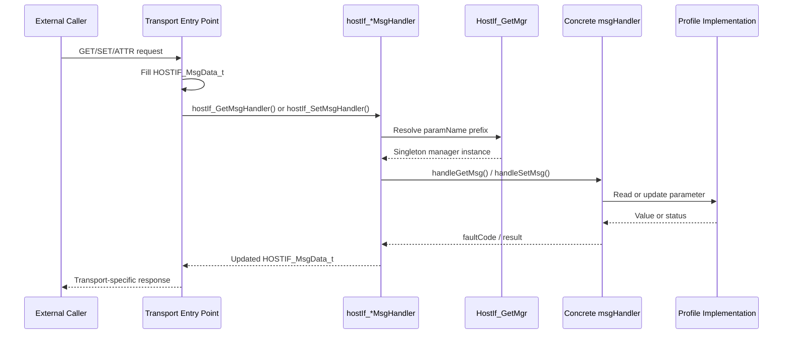

# Handlers Implementation Overview

## Overview

The handlers layer in tr69hostif is the request-dispatch boundary between transport-facing entry points and the TR-181 profile implementations. Code in `src/hostif/handlers/src/` accepts requests from IARM, JSON, RBUS, and notification paths, resolves each parameter to the correct manager, and forwards the operation to a concrete handler derived from `msgHandler`.

This layer does not implement the full device logic for every TR-181 object. Its main responsibilities are routing, request normalization, singleton lifecycle for manager objects, event propagation, and update polling. The actual parameter-specific logic lives mostly under `src/hostif/profiles/`.

## Source Layout

| Path | Purpose |
|------|---------|
| `src/hostif/handlers/include/hostIf_msgHandler.h` | Base `msgHandler` interface and dispatcher declarations |
| `src/hostif/handlers/src/hostIf_msgHandler.cpp` | Core GET/SET/attribute dispatch, manager lookup, config loading |
| `src/hostif/handlers/src/hostIf_IARM_ReqHandler.cpp` | IARM bus initialization, RPC registration, IARM request entry points |
| `src/hostif/handlers/src/hostIf_jsonReqHandlerThread.cpp` | JSON request handling thread |
| `src/hostif/handlers/src/hostIf_rbus_Dml_Provider.cpp` | RBUS-facing DML provider integration |
| `src/hostif/handlers/src/hostIf_updateHandler.cpp` | Periodic polling for value-change events |
| `src/hostif/handlers/src/hostIf_NotificationHandler.cpp` | Parodus/WebPA notification enqueue and delivery support |
| `src/hostif/handlers/src/hostIf_*ReqHandler.cpp` | Concrete manager classes for Device, DS, Ethernet, IP, WiFi, DHCPv4, and other profiles |

## Architecture

The handlers layer is organized around one abstract interface and a set of singleton manager implementations:

- `msgHandler` defines the common handler contract: `init()`, `unInit()`, `handleGetMsg()`, `handleSetMsg()`, `handleGetAttributesMsg()`, and `handleSetAttributesMsg()`.
- `HostIf_GetMgr()` performs prefix-based manager lookup using the runtime configuration loaded into `paramMgrhash`.
- Each concrete handler exposes a `getInstance()` singleton accessor and delegates parameter work into one or more profile classes.
- Transport entry points convert external requests into `HOSTIF_MsgData_t`, then call the common dispatcher functions in `hostIf_msgHandler.cpp`.

### Component Diagram



## Request Routing Model

At runtime, the dispatcher builds a prefix-to-manager map from the configured hostif manager file. Two code paths exist:

- `hostIf_initalize_ConfigManger()` parses a whitespace-delimited mapping file.
- `hostIf_ConfigProperties_Init()` parses grouped key/value configuration using GLib `GKeyFile`.

Both paths populate `paramMgrhash`, which maps parameter prefixes such as `Device.DeviceInfo.` or `Device.WiFi.` to a `HostIf_ParamMgr_t` enum. `HostIf_GetMgr()` then scans the configured prefixes and returns the singleton manager that owns the requested subtree.

### Request Flow



## Key Components

### `msgHandler` base class

The `msgHandler` class in `hostIf_msgHandler.h` is the common interface for all manager objects. It enforces a uniform contract for GET, SET, and attribute operations so that transports do not need to know profile-specific types.

The class is intentionally small. Shared behavior such as routing, request logging, timing telemetry, and configuration lookup stays outside the class in free functions inside `hostIf_msgHandler.cpp`.

### `hostIf_msgHandler.cpp`

This file is the core of the handlers subsystem. It provides:

- `hostIf_GetMsgHandler()` and `hostIf_SetMsgHandler()` for common request dispatch
- `hostIf_GetAttributesMsgHandler()` and `hostIf_SetAttributesMsgHandler()` for attribute operations
- `paramValueToString()` for type-aware logging
- `HostIf_GetMgr()` for runtime manager resolution
- configuration loading helpers for building `paramMgrhash`

The GET and SET paths also include:

- request counters for boot-time traffic visibility
- slow-request logging when a request takes more than five seconds
- optional T2 telemetry notifications when thresholds are exceeded
- separate mutexes for GET and SET serialization

### IARM request bridge

`hostIf_IARM_ReqHandler.cpp` owns the IARM-facing lifecycle:

- bus initialization and connection
- registration of TR-069 host interface RPCs
- initial manager startup for Device, DS, and optional SNMP paths
- translation from incoming IARM calls to the common `hostIf_*MsgHandler()` dispatcher APIs
- power-state event handling used to publish deep-sleep notifications when the matching RFC parameter is enabled

### Update and notification path

`hostIf_updateHandler.cpp` manages periodic polling for change detection. During initialization it registers callback hooks with the enabled managers, then starts a GLib thread that checks for updates in a 60-second loop.

When a manager reports a change, `updateHandler::notifyCallback()`:

1. packages the event into `IARM_Bus_tr69HostIfMgr_EventData_t`
2. broadcasts it on IARM
3. optionally forwards value-change notifications to Parodus when notification support is enabled

This makes the handlers layer the bridge between passive parameter access and active change distribution.

## Handler Inventory

The source tree contains one handler implementation per major TR-181 area or integration domain. Most concrete handlers follow the same broad pattern:

- singleton allocation with `getInstance()`
- optional `init()` and `unInit()` hooks
- `handleGetMsg()` and `handleSetMsg()` implementations
- optional static `reset()`, `checkForUpdates()`, or `registerUpdateCallback()` helpers for event-driven flows

### Transport and bridge handlers

These files do not own a single TR-181 subtree. They connect external transports or background workflows to the common dispatcher.

| File or class | Operates on | What it does in the module |
|---------------|-------------|-----------------------------|
| `hostIf_IARM_ReqHandler.cpp` | IARM bus RPCs and power events | Registers TR-069 hostif RPC calls on IARM, converts IARM requests into `HOSTIF_MsgData_t`, invokes GET/SET/attribute dispatch, and publishes deep-sleep related notifications when the relevant RFC is enabled |
| `hostIf_msgHandler.cpp` | Common dispatch path | Owns the shared GET/SET/attribute routing logic, request timing logs, boot-time counters, manager lookup, and configuration-driven prefix mapping |
| `hostIf_jsonReqHandlerThread.cpp` | JSON-over-HTTP request path | Starts the HTTP server thread and parses incoming JSON `paramList` payloads with YAJL before those requests are handed into the shared hostif path |
| `hostIf_rbus_Dml_Provider.cpp` | RBUS DML interface | Exposes parameters through RBUS, validates parameters against the loaded data model, converts RBUS value types to hostif types, and forwards RBUS GET requests to `hostIf_GetMsgHandler()` |
| `hostIf_updateHandler.cpp` | Periodic value-change polling | Registers update callbacks with enabled managers, runs the background polling loop, emits add/remove/value-changed IARM events, and forwards change notifications to Parodus when enabled |
| `hostIf_NotificationHandler.cpp` | Parodus/WebPA notification delivery | Builds JSON payloads for value-change and key/value notifications, queues them on a `GAsyncQueue`, and wakes the registered Parodus sender callback |

### Subtree and feature handlers

These classes own specific TR-181 areas or integration namespaces and are the objects returned by `HostIf_GetMgr()`.

| Handler | Operates on | Notes from implementation |
|---------|-------------|---------------------------|
| `DeviceClientReqHandler` | `Device.DeviceInfo.*`, selected bootstrap and firmware paths, and some SNMP-adjacent DeviceInfo parameters | Routes DeviceInfo GET and SET requests into `hostIf_DeviceInfo`, `hostIf_DeviceProcessorInterface`, and `hostIf_DeviceProcessStatusInterface`; handles reset, firmware download, preferred gateway, log upload, reverse SSH, bootstrap updates, and some `Device.DeviceInfo.X_RDK_SNMP.*` paths |
| `DSClientReqHandler` | `Device.Services.STBService.1.Components.*` and related DS-backed capabilities | Initializes `device::Manager`, then dispatches HDMI, VideoDecoder, AudioOutput, SPDIF, VideoOutput, and capability-related requests to the Device Settings service layer |
| `EthernetClientReqHandler` | `Device.Ethernet.Interface.*` and `Device.Ethernet.Interface.{i}.Stats.*` | Handles Ethernet interface state, alias, lower-layer relationships, bitrate, duplex mode, and per-interface statistics; also tracks interface count changes for event reporting |
| `IPClientReqHandler` | `Device.IP.*`, `Device.IP.Interface.*`, `IPv4Address`, optional `IPv6Address`, `ActivePort`, and diagnostics | Dispatches IP stack, interface, address, and active-port reads; when built with optional flags it also covers IPv6 and speed-test related objects; maintains cached entry counts for update detection |
| `TimeClientReqHandler` | `Device.Time.*` | Handles time enablement, Chrony/NTP settings, NTP directive parameters, and bootstrap-sensitive time parameters through `hostIf_Time` |
| `WiFiReqHandler` | `Device.WiFi.*` including Radio, SSID, AccessPoint, EndPoint, WPS, Security, Stats, and optional client roaming | Manages the broad WiFi subtree, supports WiFi global enable and roaming-related SETs, closes all WiFi object instances on shutdown, and tracks object counts for radios, SSIDs, and endpoints |
| `MoCAClientReqHandler` | `Device.MoCA.Interface.*`, QoS, associated devices, stats, and mesh-table related objects | Handles MoCA interface configuration such as enable, alias, privacy, keying, power limits, QoS-related objects, and mesh-entry tracking when the MoCA profile is enabled |
| `DHCPv4ClientReqHandler` | `Device.DHCPv4.Client.*` | Read-only handler in practice for the current code path; returns client interface references, routers, and DNS servers, and reports the client entry count |
| `InterfaceStackClientReqHandler` | `Device.InterfaceStack.*` | Read-only handler that exposes higher-layer and lower-layer relationships between interfaces and reports `InterfaceStackNumberOfEntries` |
| `StorageSrvcReqHandler` | `Device.services.StorageService.*` | Delegates storage-service GET requests to `hostIf_StorageSrvc`; the current implementation exposes reads and leaves SET and attribute support effectively unimplemented |
| `SNMPClientReqHandler` | `Device.X_RDKCENTRAL-COM_DocsIf.*` and `Device.DeviceInfo.X_RDK_SNMP.*` | Bridges hostif requests to the SNMP adapter, supports selected DOCSIS and DeviceInfo-backed SNMP values, initializes the SNMP adapter, and stores notification attributes in a hash table |
| `XREClientReqHandler` | `Device.X_COMCAST-COM_Xcalibur.Client.*`, `...Client.XRE.*`, and related XRE/DevApp control parameters | Handles XRE operational controls such as xconf check-now, session refresh, XRE restart, cache flush, log level changes, and receiver/dev-app restart flows when the XRE profile is enabled |
| `XRdkCentralT2` | `Device.X_RDKCENTRAL-COM_T2.ReportProfiles` and `...ReportProfilesMsgPack` | Pass-through handler that forwards Telemetry 2 profile payloads to RBUS, supports long-string transfer using `paramValueLong`, and cross-checks written report profile data |
| `X_rdk_req_hdlr` | Parameters under the internal `X_RDK_PREFIX_STR` namespace | Thin mutex-protected wrapper around `X_rdk_profile`, used for RDK-specific parameters that are not part of the main standard object handlers |

### Supporting notes

- `hostIf_updateHandler.cpp` only polls handlers that register update callbacks; not every concrete manager participates in change detection.
- Some handlers are compiled only when their profile or feature flag is enabled, so their source exists even when the target image excludes them.
- `hostIf_sysScriptHandler.cpp` exists in the directory but is effectively a placeholder in the current tree and is not part of the core `libMsgHandlers.la` source list shown in `Makefile.am`.

## Build-Time Feature Gating

The handlers library is assembled in `src/hostif/handlers/Makefile.am` as `libMsgHandlers.la`. The file shows that several managers are compiled conditionally.

Common feature gates include:

- `WITH_WIFI_PROFILE` for WiFi handler support
- `WITH_MOCA_PROFILE` for MoCA manager support
- `WITH_DHCP_PROFILE` for DHCPv4 support
- `WITH_INTFSTACK_PROFILE` for InterfaceStack support
- `WITH_STORAGESERVICE_PROFILE` for StorageService support
- `WITH_SNMP_ADAPTER` for SNMP adapter integration
- `WITH_NOTIFICATION_SUPPORT` for value-change notification behavior
- `IS_TELEMETRY2_ENABLED` for T2 metrics and reporting hooks

Because of these flags, the exact set of managers in a target image can vary by platform build.

## Threading Model

The handlers layer is not a single-threaded module. It is entered concurrently from multiple runtime paths.

| Thread or Context | Entry Point | Role |
|-------------------|-------------|------|
| Main/service startup | `hostIf_IARM_IF_Start()` | Initialize bus-facing managers and register RPCs |
| IARM worker context | `_Gettr69HostIfMgr()`, `_Settr69HostIfMgr()` | Process synchronous bus requests |
| JSON handler thread | `hostIf_jsonReqHandlerThread.cpp` | Process JSON-based requests |
| RBUS context | `hostIf_rbus_Dml_Provider.cpp` | Serve RBUS DML operations |
| Update thread | `updateHandler::run()` | Poll enabled managers for state changes every 60 seconds |
| Detached power-controller thread | `hostIf_getPwrContInterface()` on non-RDKV builds | Connect power controller callbacks used for deep-sleep notifications |

### Synchronization

The subsystem uses straightforward locking rather than a global scheduler:

- `get_handler_mutex` serializes GET dispatch in `hostIf_GetMsgHandler()`
- `set_handler_mutex` serializes SET dispatch in `hostIf_SetMsgHandler()`
- `sendAddRemoveEvents()` uses a static mutex to serialize add/remove event emission
- GLib thread primitives are used for the update worker thread

The current implementation favors correctness and predictable logging over maximum parallelism. GET and SET operations are serialized separately before the request reaches the concrete handler.

## Memory and Ownership

The handlers layer mostly treats `HOSTIF_MsgData_t` as caller-owned request state that is mutated in place. Ownership rules visible in this directory are:

- transport adapters allocate or receive a `HOSTIF_MsgData_t` and pass it into dispatcher functions
- handlers update the same structure rather than returning a second response object
- `hostIf_Free_stMsgData()` uses `g_free()`, so callers must match the allocation strategy used by their path
- temporary metadata returned by data-model lookup in `hostIf_GetReqHandler()` is explicitly freed after use
- singleton handler instances persist for daemon lifetime and are not recreated per request

One practical implication is that new handler code should avoid hidden allocations on hot paths unless the matching cleanup is obvious and local.

## Error Handling

Error handling in the handlers layer is intentionally transport-neutral:

- dispatch APIs return integer status codes such as `OK` or `NOK`
- the concrete handler is responsible for setting any TR-069 fault information in `HOSTIF_MsgData_t`
- unsupported or unconfigured parameter prefixes result in a null manager lookup and a failed operation
- invalid data-model parameters are detected early in the IARM GET path before dispatch continues
- exceptions in `hostIf_GetMsgHandler()` are caught and logged to keep the daemon alive

## Performance Notes

This layer is not where most hardware interaction happens, but it still affects end-to-end latency.

Important characteristics from the implementation:

- manager lookup performs prefix scanning over the configured key set rather than direct trie-style routing
- GET and SET are serialized by dedicated mutexes, so long-running handlers can delay other requests of the same type
- request duration is measured and logged in microseconds
- requests slower than five seconds trigger explicit debug logging and optional telemetry reporting

If request volume or latency becomes a problem, the first place to inspect is the combination of serialized dispatch and profile-specific blocking operations.

## Testing and Validation

When changing code in this directory, validate both routing and behavior:

1. confirm the target parameter prefix is present in the active manager configuration
2. verify the expected build flag includes the relevant handler source
3. exercise GET, SET, and attribute paths through the transport that owns the issue
4. verify update callbacks still emit IARM and Parodus notifications when applicable
5. run the repo’s unit-test or integration workflow that covers the affected profile

The most relevant follow-on validation usually lives outside this directory because the underlying parameter logic is in the profile implementation.

## Known Issues and Gaps

The following implementation gaps were identified by reviewing the source files in `src/hostif/handlers/src/`. Each entry records the severity, the affected file and approximate line, the problem, and the recommended fix.

### Gap 1 — High: `_GetAttributestr69HostIfMgr` dispatches SET instead of GET

**File**: `src/hostif/handlers/src/hostIf_IARM_ReqHandler.cpp`

**Observation**: `hostIf_GetAttributesReqHandler()` is the function registered as the IARM GET-attributes entry point. Its body calls `hostIf_SetAttributesMsgHandler(stMsgData)` instead of `hostIf_GetAttributesMsgHandler(stMsgData)`. Every IARM GET-attributes RPC call therefore silently executes a SET-attributes operation instead.

**Impact**: Attribute reads through IARM return SET semantics. Any client expecting to read notification or access attributes will instead trigger an unintended write. This is a copy-paste regression.

**Recommended fix**:
```cpp
// In hostIf_GetAttributesReqHandler() — change:
ret = hostIf_SetAttributesMsgHandler(stMsgData);   // wrong
// to:
ret = hostIf_GetAttributesMsgHandler(stMsgData);   // correct
```

---

### Gap 2 — High: `mgrName` not reset between config file iterations

**File**: `src/hostif/handlers/src/hostIf_msgHandler.cpp` — `hostIf_initalize_ConfigManger()` and `hostIf_ConfigProperties_Init()`

**Observation**: In `hostIf_initalize_ConfigManger()`, the local variable `mgrName` is never reassigned to `HOSTIF_INVALID_Mgr` at the start of each `while` iteration. The if-else chain that identifies the manager token has no final `else` branch to reset `mgrName` on an unrecognized token. If a configuration line contains an unknown manager name, `mgrName` retains the value from the previous iteration and the guard `if(mgrName != HOSTIF_INVALID_Mgr)` passes, inserting the wrong manager for that prefix. `hostIf_ConfigProperties_Init()` has the identical problem.

**Impact**: A typo or unknown manager name in the configuration file silently associates the preceding iteration's manager with a parameter prefix. Requests for that prefix are routed to the wrong handler with no log indication at runtime.

**Recommended fix** — add a reset at the top of each loop body:
```cpp
while (fscanf(fp, "%99s %15s", param, mgr) != EOF)
{
    mgrName = HOSTIF_INVALID_Mgr;   // reset every iteration
    if (strcasecmp(mgr, "deviceMgr") == 0)
        mgrName = HOSTIF_DeviceMgr;
    // ... rest of if-else chain ...
```

---

### Gap 3 — High: `hostIf_SetMsgHandler()` lacks an exception handler

**File**: `src/hostif/handlers/src/hostIf_msgHandler.cpp`

**Observation**: `hostIf_GetMsgHandler()` wraps `pMsgHandler->handleGetMsg()` in a `try/catch(std::exception&)` block. `hostIf_SetMsgHandler()` does not. An uncaught exception thrown by any SET handler propagates through the IARM callback and crashes the daemon.

**Impact**: Any C++ exception thrown during a SET operation — including those from profile code or vendor-supplied handlers — terminates the daemon rather than returning an error. The asymmetry is particularly visible in that GET is protected while the equally common SET path is not.

**Recommended fix** — mirror the GET exception guard:
```cpp
try
{
    msgHandler *pMsgHandler = HostIf_GetMgr(stMsgData);
    if (pMsgHandler)
        ret = pMsgHandler->handleSetMsg(stMsgData);
}
catch (const std::exception& e)
{
    RDK_LOG(RDK_LOG_ERROR, LOG_TR69HOSTIF,
        "[%s:%d] Exception caught %s\n", __FUNCTION__, __LINE__, e.what());
}
```

---

### Gap 4 — Medium: Hash table created with mismatched hash and equality functions

**File**: `src/hostif/handlers/src/hostIf_msgHandler.cpp` — lines 413 and 644

**Observation**: Both `hostIf_initalize_ConfigManger()` and `hostIf_ConfigProperties_Init()` create `paramMgrhash` with:

```c
paramMgrhash = g_hash_table_new(g_str_hash, g_int_equal);
```

`g_str_hash` computes a hash from the contents of a string, but `g_int_equal` compares keys by pointer identity rather than string content. GLib requires hash and equality functions to be consistent: two keys that compare as equal must produce the same hash. Using string hashing with pointer equality breaks this contract. A direct `g_hash_table_lookup()` with a newly constructed string would hash into the correct bucket but never find the entry because pointer comparison would fail.

**Impact**: `HostIf_GetMgr()` cannot rely on hash-table lookups at all. The current workaround calls `g_hash_table_get_keys()` and performs an O(n) linear prefix scan for every parameter dispatch, completely defeating the purpose of the hash table and causing performance degradation proportional to the number of configured prefixes.

**Recommended fix** — use consistent pair:
```c
// String keys, string equality (correct):
paramMgrhash = g_hash_table_new_full(g_str_hash, g_str_equal, g_free, NULL);
```
With matching `g_str_equal`, `g_hash_table_lookup()` would work correctly and `HostIf_GetMgr()` could be simplified to a direct lookup once prefix matching is also resolved.

---

### Gap 5 — Medium: `g_error_free(NULL)` called in the success path

**File**: `src/hostif/handlers/src/hostIf_msgHandler.cpp` — `hostIf_ConfigProperties_Init()`

**Observation**: The function unconditionally calls `g_error_free(error)` at the end of its body. When `g_key_file_load_from_file` succeeds, `error` is not set and remains `NULL`. `g_error_free()` requires a non-NULL pointer; providing `NULL` triggers `g_return_if_fail(error != NULL)`, which logs a critical warning in debug builds and is undefined behavior in strict GLib configurations.

**Impact**: Every successful startup produces a spurious GLib critical warning in debug builds. On platforms where GLib critical warnings are treated as fatal, this causes a crash on normal daemon startup.

**Recommended fix**:
```cpp
if (error)
    g_error_free(error);
```

---

### Gap 6 — Low: `updateHandler` polling loop uses non-interruptible `sleep(60)`

**File**: `src/hostif/handlers/src/hostIf_updateHandler.cpp`

**Observation**: The polling loop body ends with `sleep(60)` and checks `stopped` only at the top of the loop. Calling `updateHandler::stop()` during daemon shutdown does not wake the sleeping thread; the thread takes up to 60 seconds to observe the flag and exit.

**Impact**: Daemon shutdown is delayed by up to 60 seconds whenever the update thread is mid-sleep. This can cause systemd to exceed its `TimeoutStopSec` and forcibly terminate the process.

**Recommended fix** — replace `sleep(60)` with a condition variable timed wait:
```cpp
std::unique_lock<std::mutex> lk(stopMutex);
stopCv.wait_for(lk, std::chrono::seconds(60), []{ return stopped; });
```
where `stopMutex` and `stopCv` are class-level synchronization primitives and `stop()` signals the condition variable.

---

### Gap 7 — Low: `hostIf_initalize_ConfigManger()` calls `exit()` on file open failure

**File**: `src/hostif/handlers/src/hostIf_msgHandler.cpp` — `hostIf_initalize_ConfigManger()`

**Observation**: When `fopen(argList.confFile, "r")` fails, the function sets `bVal = false` and then immediately calls `exit(EXIT_FAILURE)`. Calling `exit()` from a library-level initialization function bypasses any cleanup registered with `atexit()` in `hostIf_main.cpp` and prevents the main thread from logging a controlled shutdown or performing resource teardown.

**Impact**: On configuration errors the daemon terminates abruptly rather than logging a meaningful message through the main-thread shutdown path. Platform supervisors (systemd) may not receive a clean exit code.

**Recommended fix** — return the error to the caller:
```cpp
if (fp == NULL)
{
    RDK_LOG(RDK_LOG_ERROR, LOG_TR69HOSTIF,
        "[%s:%s] Error opening %s\n", __FILE__, __FUNCTION__, argList.confFile);
    return false;   // let the caller decide how to handle it
}
```

---

### Gap Summary Table

| # | Severity | File | Problem | Impact |
|---|----------|------|---------|--------|
| 1 | High | `hostIf_IARM_ReqHandler.cpp` | `_GetAttributestr69HostIfMgr` calls SET instead of GET attributes handler | All IARM attribute reads silently become writes |
| 2 | High | `hostIf_msgHandler.cpp` | `mgrName` not reset per config iteration; unknown tokens inherit previous manager | Silent wrong-manager routing for misconfigured prefixes |
| 3 | High | `hostIf_msgHandler.cpp` | `hostIf_SetMsgHandler()` has no exception handler | Uncaught exception from any SET handler crashes the daemon |
| 4 | Medium | `hostIf_msgHandler.cpp` | `g_str_hash` + `g_int_equal` mismatch makes hash lookup unreliable | O(n) linear scan used instead of O(1) hash lookup per request |
| 5 | Medium | `hostIf_msgHandler.cpp` | `g_error_free(NULL)` called in success path of `hostIf_ConfigProperties_Init()` | GLib critical warning on every normal startup; potential abort in debug builds |
| 6 | Low | `hostIf_updateHandler.cpp` | Non-interruptible `sleep(60)` in the update loop | Daemon shutdown delayed up to 60 seconds |
| 7 | Low | `hostIf_msgHandler.cpp` | `exit()` called from config-loading function on file open failure | Abrupt termination with no main-thread cleanup |

---

## See Also

- `src/hostif/profiles/` for the parameter-specific business logic invoked by these handlers
- `src/hostif/include/hostIf_tr69ReqHandler.h` for `HOSTIF_MsgData_t` and shared request types
- `docs/architecture/overview.md` for the daemon-wide component map
- `docs/architecture/threading-model.md` for the broader runtime thread model
- `docs/api/public-api.md` for shared request and dispatcher interfaces