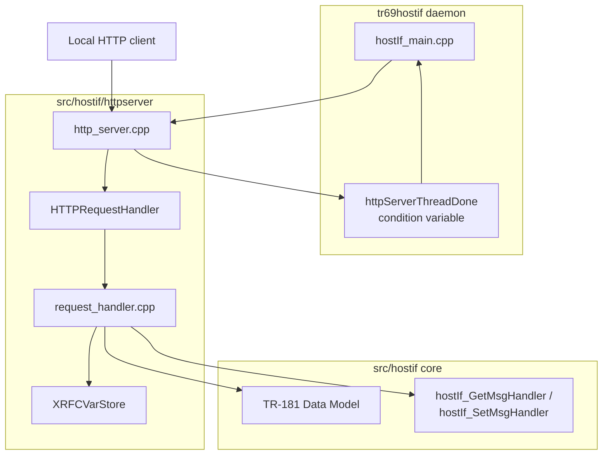
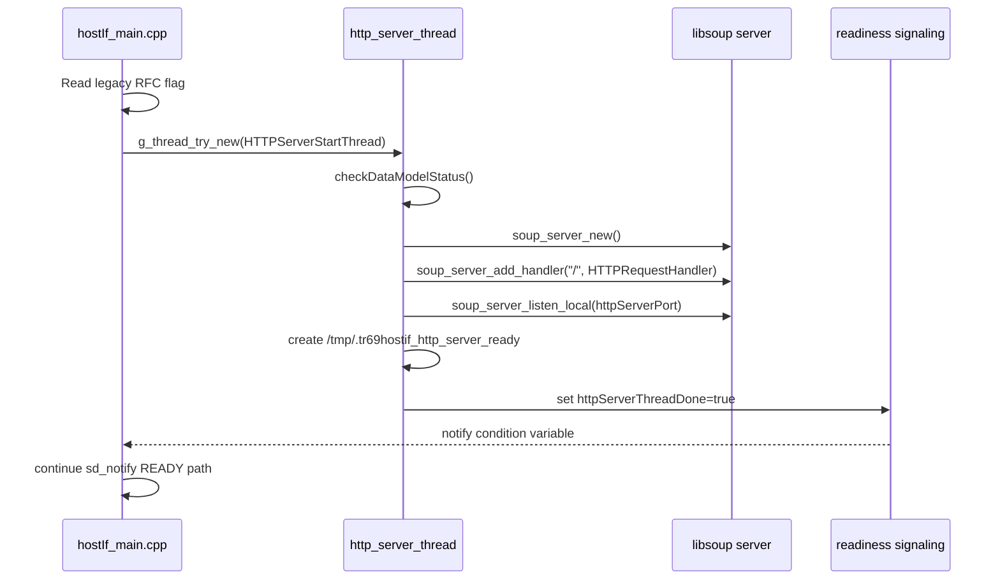
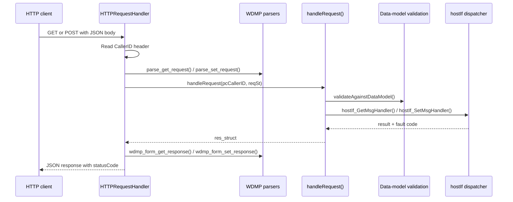

# HTTP Server Implementation Overview

## Overview

The `src/hostif/httpserver/` module implements the newer local HTTP server used by tr69hostif to process TR-181 GET and SET requests over an HTTP JSON interface. It is separate from the older JSON server in `src/hostif/handlers/` and is started only when the build includes the new server and legacy RFC mode is not enabled.

At runtime, this module accepts HTTP requests through libsoup, parses WDMP-style JSON payloads, validates parameters against the loaded TR-181 data model, invokes the common hostif dispatcher, and converts the results back into WDMP JSON responses. It also includes a small RFC variable cache used for temporary handling of `RFC_*` keys that are intentionally outside the data model.

## Source Layout

| Path | Purpose |
|------|---------|
| `src/hostif/httpserver/src/http_server.cpp` | libsoup server lifecycle, request entry point, readiness signaling |
| `src/hostif/httpserver/src/request_handler.cpp` | request validation, WDMP-to-hostif conversion, hostif invocation, response building |
| `src/hostif/httpserver/src/XrdkCentralComRFCVar.cpp` | RFC variable file discovery and in-memory cache |
| `src/hostif/httpserver/include/http_server.h` | public start/stop APIs for the server thread |
| `src/hostif/httpserver/include/request_handler.h` | request handling API exported to the HTTP server layer |
| `src/hostif/httpserver/src/gtest/gtest_httpserver.cpp` | unit tests for datatype conversion, RFC var store, request validation, and request handling helpers |

## Architecture

This module is split into three layers:

1. server lifecycle and socket binding in `http_server.cpp`
2. request translation and hostif dispatch in `request_handler.cpp`
3. RFC variable cache support in `XrdkCentralComRFCVar.cpp`

The implementation depends on:

- libsoup 3 for the embedded HTTP listener
- WDMP request/response helpers for JSON request parsing and response formatting
- the hostif dispatcher in `src/hostif/handlers/`
- the loaded TR-181 data model for validation and wildcard expansion
- `waldb` and related WebPA support libraries already used elsewhere in tr69hostif

### Component Diagram



## Build and Enablement

The module is built as `libhttpserver.la` from:

- `src/http_server.cpp`
- `src/request_handler.cpp`
- `src/XrdkCentralComRFCVar.cpp`

The module links against:

- `libMsgHandlers.la`
- `libwaldb.la`
- `wdmp-c`
- `libsoup-3.0`
- `cJSON`

Runtime enablement is controlled in `hostIf_main.cpp`:

- when `NEW_HTTP_SERVER_DISABLE` is defined, this module is not part of the active startup path
- when `/opt/RFC/.RFC_LegacyRFCEnabled.ini` exists, the daemon treats legacy RFC mode as enabled and does not start the new HTTP server thread
- otherwise `HTTPServerStartThread()` is launched on a dedicated GLib thread named `http_server_thread`

## How Server Operation Happens

The server operation in tr69hostif follows a fixed sequence from daemon startup to request completion.

### Startup sequence



The important operational points are:

- the server does not bind until the data model is confirmed ready
- the handler is registered only on `/`
- the thread writes `/tmp/.tr69hostif_http_server_ready` so RFC-related paths can detect readiness externally
- the daemon waits up to 10 seconds on `cv_httpServerThreadDone` before sending its systemd readiness notification

### Request processing sequence



The per-request flow works like this:

1. `HTTPRequestHandler()` receives the libsoup request.
2. It rejects empty request bodies with `400 Bad Request`.
3. It reads the `CallerID` header.
4. It parses the JSON body using WDMP helpers into a `req_struct`.
5. It calls `handleRequest()` for GET or POST processing.
6. It converts the `res_struct` into WDMP JSON.
7. It rewrites the top-level `statusCode` field so it reflects the first real parameter error instead of the generic WDMP default.
8. It sends the final JSON response with `SOUP_STATUS_OK` when the request was processed.

### Supported HTTP methods

The module currently recognizes:

- `GET` for parameter retrieval
- `POST` for parameter updates

Operational details:

- `GET` is allowed even when the `CallerID` header is missing; the caller is logged as `Unknown`
- `POST` is rejected when `CallerID` is missing
- methods other than `GET` and `POST` return `501 Not Implemented`

## Key Components

### `http_server.cpp`

This file owns the embedded server instance and is the only module that directly talks to libsoup.

Its responsibilities are:

- create the `SoupServer`
- register `HTTPRequestHandler()` on `/`
- listen on `argList.httpServerPort`
- check data-model readiness before binding
- create the readiness marker file in `/tmp`
- synchronize startup with the main daemon using `mtx_httpServerThreadDone`, `cv_httpServerThreadDone`, and `httpServerThreadDone`
- stop the listener through `HttpServerStop()` by disconnecting the server

### `HTTPRequestHandler()`

This is the server’s top-level request callback. It operates as the HTTP boundary adapter for the module.

It performs:

- raw request-body validation
- `CallerID` extraction from request headers
- JSON parsing with cJSON
- method-based request parsing using WDMP helpers
- dispatch to `handleRequest()`
- response formatting back into JSON
- per-request timing logs using `getCurrentTime()` and `timeValDiff()`

### `request_handler.cpp`

This file contains almost all request semantics. It bridges the HTTP/WDMP shape of the request to the internal `HOSTIF_MsgData_t` model used by the rest of tr69hostif.

Important helper functions include:

- `getWdmpDataType()` converts data-model strings such as `string`, `boolean`, and `unsignedInt` into WDMP datatypes
- `getHostIfParamType()` maps WDMP datatypes into `HostIf_ParamType_t`
- `convertAndAssignParamValue()` writes SET values into `HOSTIF_MsgData_t.paramValue` using the internal representation expected by hostif
- `getStringValue()` converts hostif values back into string form for WDMP output
- `validateParamValue()` verifies that incoming SET values match the expected datatype
- `validateAgainstDataModel()` checks existence, access mode, datatype, default value, and bootstrap-update behavior using the merged TR-181 data model
- `invokeHostIfAPI()` calls `hostIf_GetMsgHandler()` or `hostIf_SetMsgHandler()` after building a hostif request envelope
- `handleRFCRequest()` provides the special path for raw `RFC_*` variables that are not represented in the data model

### `handleRequest()`

`handleRequest()` is the request engine for the module.

For GET requests it:

- allocates a `res_struct`
- handles individual parameter names and wildcard parameter names
- validates normal parameters against the data model
- expands wildcard requests into child parameter names using the data-model API
- invokes hostif for each resolved parameter
- falls back to the parameter’s default value when hostif returns no value but the data model defines one
- supports temporary RFC-variable GET access for names that start with `RFC_` and do not contain `.`

For SET requests it:

- rejects unauthorized writes such as `Device.X_CISCO_COM_DeviceControl.RebootDevice`
- rejects wildcard SET operations
- rejects null values
- validates the request against the data model’s access rules and datatype rules
- invokes hostif for normal TR-181 parameters
- routes raw `RFC_*` variables to `handleRFCRequest()` instead of hostif

## RFC Variable Handling

`XrdkCentralComRFCVar.cpp` implements `XRFCVarStore`, a small cache for legacy RFC variable access.

Operational behavior:

- it reads `/etc/rfc.properties`
- it looks for the `RFC_VAR_FILENAME` property
- it strips quotes from the configured filename
- it loads key/value pairs from that file into an in-memory `unordered_map`
- it serves GET requests for `RFC_*` keys outside the data model
- it supports a cache reload operation through `XRFC_VAR_STORE_RELOADCACHE`

This path exists because some RFC variables are handled outside the main TR-181 data-model validation path.

## Threading Model

This module is simple from a concurrency perspective.

| Thread or Context | Purpose |
|-------------------|---------|
| `http_server_thread` | Creates and binds the new HTTP server, then serves incoming requests through libsoup callbacks |
| main daemon thread | Starts the HTTP server thread, waits for readiness, and stops the server during graceful shutdown |
| libsoup request callback context | Executes `HTTPRequestHandler()` for each incoming request |

### Synchronization primitives

The module uses:

- `std::mutex mtx_httpServerThreadDone`
- `std::condition_variable cv_httpServerThreadDone`
- `bool httpServerThreadDone`

These are not used for request serialization. They are used only to coordinate startup readiness between the HTTP server thread and the daemon main thread.

## Memory Management

The module uses manual allocation for WDMP request and response structures, so the cleanup path matters.

Key ownership rules visible in the code are:

- `HTTPRequestHandler()` allocates `req_struct` and frees it with `wdmp_free_req_struct()`
- `handleRequest()` allocates `res_struct` members and they are later freed with `wdmp_free_res_struct()`
- parameter names and values are duplicated with `strdup()` when building WDMP responses
- wildcard expansion allocates arrays for child parameter names and datatypes, then frees the temporary arrays after response structures are built
- `invokeHostIfAPI()` allocates string output values for WDMP using `getStringValue()`
- `XRFCVarStore` owns its in-memory map for the process lifetime

The main thing to preserve when modifying this code is symmetry between WDMP allocation helpers, `strdup()` ownership, and the corresponding free calls in the success and error paths.

## Error Handling

The module distinguishes between HTTP transport errors and parameter-processing errors.

Transport-level errors:

- empty body results in `400 Bad Request`
- malformed JSON results in `400 Bad Request`
- unsupported method results in `501 Not Implemented`
- missing `CallerID` on POST results in an internal-server-style rejection in the current code path

Parameter-level errors:

- invalid parameter name becomes `WDMP_ERR_INVALID_PARAMETER_NAME`
- read-only parameter SET becomes `WDMP_ERR_NOT_WRITABLE`
- datatype mismatch becomes `WDMP_ERR_INVALID_PARAMETER_TYPE`
- invalid parameter value becomes `WDMP_ERR_INVALID_PARAMETER_VALUE`
- wildcard SET becomes `WDMP_ERR_WILDCARD_NOT_SUPPORTED`
- empty results may become `WDMP_ERR_VALUE_IS_EMPTY` unless a default value is available

One implementation detail worth keeping in mind is that the response formatter first creates a generic WDMP response, then `HTTPRequestHandler()` patches the top-level `statusCode` so the returned HTTP JSON better reflects the actual first parameter failure.

## Performance Notes

The server is lightweight, but a few behaviors are important operationally:

- request execution time is measured and logged in `HTTPRequestHandler()`
- wildcard GETs can expand into many child parameters and therefore multiply hostif calls
- each request performs data-model validation before invoking hostif
- GET and SET requests still inherit the serialization behavior of the shared hostif dispatcher once they reach `hostIf_GetMsgHandler()` or `hostIf_SetMsgHandler()`

This means the module is usually not CPU-heavy on its own; latency is dominated by wildcard expansion, data-model lookups, and downstream profile handlers.

## Testing

The module has dedicated unit tests in `src/hostif/httpserver/src/gtest/gtest_httpserver.cpp` covering:

- RFC variable filename discovery and cache loading
- datatype conversion helpers
- parameter value validation
- RFC request handling
- hostif invocation helpers
- HTTP request handler exposure in test builds

When modifying this module, validate:

1. server startup and readiness behavior
2. GET and POST request handling
3. wildcard GET expansion
4. RFC variable GET and reload-cache behavior
5. graceful shutdown through `HttpServerStop()`

## Platform Notes

- The implementation uses libsoup 3 and GLib threading primitives.
- The server listens on the port stored in `argList.httpServerPort`.
- The module is intended for local management integration inside tr69hostif, not as a general-purpose external web service.
- Runtime behavior depends on whether legacy RFC mode is active and whether the build disables the new HTTP server entirely.

## Known Issues and Gaps

The following implementation gaps were identified by reviewing the source files in `src/hostif/httpserver/src/`. Each entry records the severity, the affected file and line range, the problem, and the recommended fix.

### Gap 1 — High: False readiness signaling when server fails to bind

**File**: `src/hostif/httpserver/src/http_server.cpp` — lines 257–275

**Observation**: The conditional at line 257 checks the return value of `soup_server_listen_local()` and logs an error if the call fails, but the code falls through without returning or setting an error status. Execution continues to create `/tmp/.tr69hostif_http_server_ready` (line 263), log "Started server successfully" (line 269), set `httpServerThreadDone = true` (line 274), and signal `cv_httpServerThreadDone`. The main thread wakes, sees `httpServerThreadDone == true`, and sends `READY=1` to systemd.

```cpp
// Current code — no return or error path after listen failure:
if(FALSE == soup_server_listen_local(http_server, httpServerPort, ...))
{
    RDK_LOG(..., "SERVER: failed in soup_server_listen_local...");
    // falls through — does NOT return
}
// readiness file is created and condition is signalled regardless
```

**Impact**: When the port is already in use or the listener fails for any other reason, the daemon signals systemd that it is ready, RFC-facing processes detect the readiness sentinel file, and clients send requests to a socket that is not listening. The failure is invisible from the outside.

**Recommended fix** — return (and do not signal readiness) on listen failure:
```cpp
if(FALSE == soup_server_listen_local(http_server, httpServerPort, ..., &error))
{
    RDK_LOG(RDK_LOG_ERROR, ..., "failed: %s", error->message);
    g_error_free(error);
    // Signal readiness with failure so the main thread can handle it:
    std::unique_lock<std::mutex> lck(mtx_httpServerThreadDone);
    httpServerThreadDone = true;   // or use a separate error flag
    cv_httpServerThreadDone.notify_all();
    return NULL;
}
```

---

### Gap 2 — High: `rfcParam` flag not reset between loop iterations

**File**: `src/hostif/httpserver/src/request_handler.cpp` — `handleRequest()`

**Observation**: The variable `rfcParam` is declared once before the `switch` statement and is set to `true` inside both the GET and SET loops when a parameter name starts with `RFC_` and contains no `.`. There is no `rfcParam = false` statement at the start of each iteration. Once `rfcParam` is `true`, all subsequent parameters in the same multi-parameter request are incorrectly routed through `handleRFCRequest()` even when they are ordinary TR-181 parameters.

```cpp
bool rfcParam = false;      // declared once, outside the loop
// ...
for (paramIndex = 0; ...) {
    if (strncmp(..., "RFC_", 4) == 0 ...) {
        rfcParam = true;    // set here, never cleared
    }
    // rfcParam stays true for paramIndex+1, paramIndex+2, ...
    if (!rfcParam)
        invokeHostIfAPI(...);
    else
        handleRFCRequest(...);
}
```

**Impact**: A multi-parameter GET or SET request that contains even one `RFC_*` key will misroute all TR-181 parameters that follow it in the list. Those parameters are sent to the RFC file-cache path, which will not find them, and `WDMP_ERR_INVALID_PARAMETER_NAME` or an empty value is returned. The bug affects any client that batches RFC keys together with regular TR-181 parameters.

**Recommended fix** — reset `rfcParam` at the top of each iteration:
```cpp
for (paramIndex = 0; paramIndex < respSt->paramCnt; paramIndex++)
{
    rfcParam = false;   // reset per iteration
    // rest of the loop body unchanged
```

---

### Gap 3 — Medium: `WDMP_ULONG` mapped to `hostIf_UnsignedIntType` instead of `hostIf_UnsignedLongType`

**File**: `src/hostif/httpserver/src/request_handler.cpp` — `getHostIfParamType()`

**Observation**: The switch in `getHostIfParamType()` groups `WDMP_UINT` and `WDMP_ULONG` in the same case:

```cpp
case WDMP_UINT:
case WDMP_ULONG:
    hostIfDataType = hostIf_UnsignedIntType;   // wrong for WDMP_ULONG
    break;
```

`WDMP_ULONG` should map to `hostIf_UnsignedLongType`, which is the 64-bit-capable type in the hostif layer.

**Impact**: Parameters declared as `unsignedLong` in the TR-181 data model that carry values above 4,294,967,295 (2³²−1) are silently truncated when read back through the HTTP server. No error is returned. Counters such as interface byte counters and large capacity values are affected.

**Recommended fix**:
```cpp
case WDMP_UINT:
    hostIfDataType = hostIf_UnsignedIntType;
    break;
case WDMP_ULONG:
    hostIfDataType = hostIf_UnsignedLongType;
    break;
```

---

### Gap 4 — Medium: `validateParamValue()` accesses string characters before checking for empty input

**File**: `src/hostif/httpserver/src/request_handler.cpp` — `validateParamValue()`

**Observation**: For `hostIf_IntegerType`, the function accesses `paramValue[0]` and `paramValue[1]` directly:

```cpp
case hostIf_IntegerType:
    if (isdigit(paramValue[0]) ||
        (paramValue[0] == '-' && isdigit(paramValue[1])))
```

For `hostIf_UnsignedIntType` and `hostIf_UnsignedLongType`, `paramValue[0]` is accessed:
```cpp
case hostIf_UnsignedIntType:
case hostIf_UnsignedLongType:
    if (isdigit(paramValue[0]))
```

Neither branch checks `paramValue.empty()` first. A caller that sends an empty string value for a numeric parameter triggers undefined behavior through `std::string::operator[]` on an empty string, followed by `isdigit` on an indeterminate character.

**Impact**: An empty `value` field in a SET request for any numeric parameter can cause a read at `paramValue[0]` that returns an implementation-defined value. On platforms where `std::string::operator[]("")` silently returns the null terminator, the validation returns `false` as expected, but the code path remains exploitable for denial-of-service via malformed requests.

**Recommended fix** — add an early empty-string guard:
```cpp
case hostIf_IntegerType:
    if (paramValue.empty()) { ret = false; break; }
    if (isdigit(paramValue[0]) ||
        (paramValue[0] == '-' && paramValue.length() > 1 && isdigit(paramValue[1])))
    // ...
case hostIf_UnsignedIntType:
case hostIf_UnsignedLongType:
    if (paramValue.empty()) { ret = false; break; }
    if (isdigit(paramValue[0]))
    // ...
```

---

### Gap Summary Table

| # | Severity | File | Problem | Impact |
|---|----------|------|---------|--------|
| 1 | High | `http_server.cpp` | Listen failure falls through to false readiness signal | Daemon reports READY=1 to systemd with no active listener |
| 2 | High | `request_handler.cpp` | `rfcParam` flag not reset per loop iteration | Subsequent TR-181 parameters in a batch are misrouted to RFC cache |
| 3 | Medium | `request_handler.cpp` | `WDMP_ULONG` maps to `hostIf_UnsignedIntType` | 64-bit parameter values silently truncated to 32 bits |
| 4 | Medium | `request_handler.cpp` | `validateParamValue()` indexes into string before checking empty | Undefined behavior for empty numeric parameter values in SET requests |

---

## See Also

- `src/hostif/src/hostIf_main.cpp` for daemon startup, legacy RFC gating, and shutdown integration
- `src/hostif/handlers/include/hostIf_msgHandler.h` for the common dispatcher interface used by this module
- `src/hostif/handlers/docs/README.md` for the handlers-layer overview that this module ultimately calls into
- `docs/architecture/overview.md` for daemon-wide component relationships
- `docs/api/public-api.md` for shared request envelope context