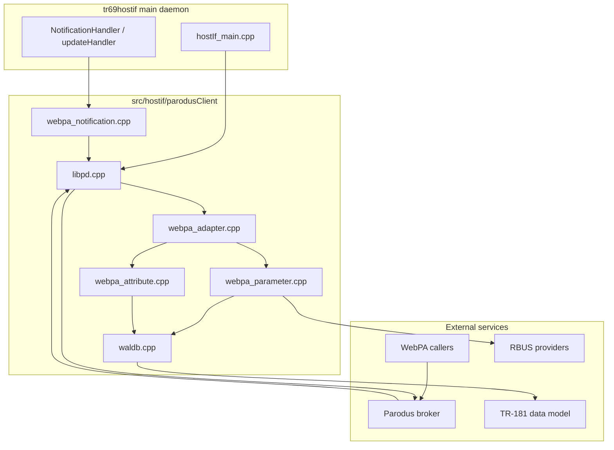
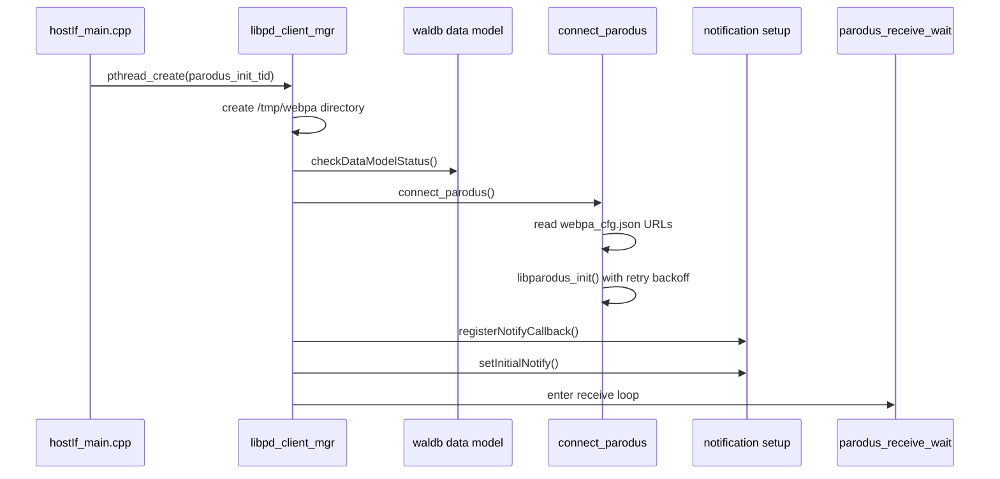
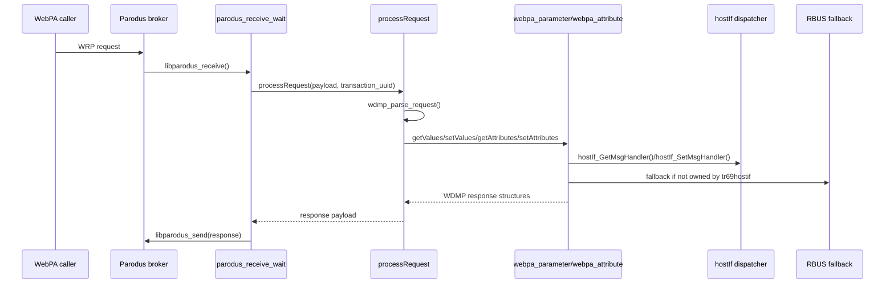
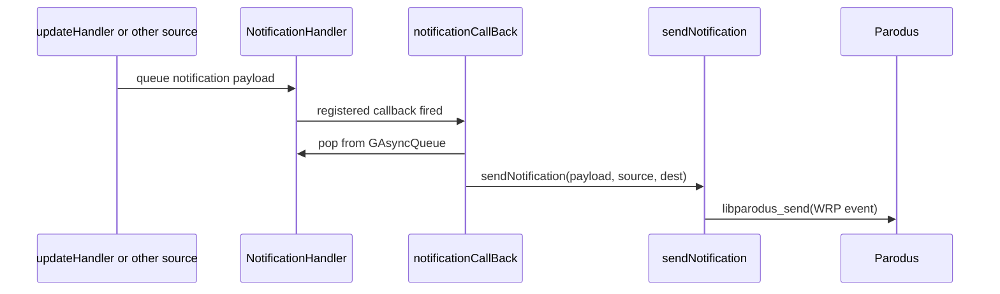

# Parodus Client Implementation Overview

## Overview

The `src/hostif/parodusClient/` module is the WebPA and Parodus integration layer for tr69hostif. It connects the daemon to the local Parodus broker, receives WRP requests from WebPA, translates those requests into the internal hostif parameter model, and sends responses or value-change notifications back through Parodus.

This module is not a standalone HTTP server. Its runtime role is a long-lived Parodus client with three main responsibilities:

- establish and maintain the `libparodus` connection
- process incoming GET, SET, GET_ATTRIBUTES, and SET_ATTRIBUTES messages
- publish notifications generated elsewhere in tr69hostif through the Parodus event path

It also includes:

- a data-model helper layer under `waldb/`
- notification configuration parsing
- an auxiliary `startParodus/` bootstrap helper used to prepare Parodus launch parameters and runtime configuration

## Source Layout

| Path | Purpose |
|------|---------|
| `src/hostif/parodusClient/pal/libpd.cpp` | Parodus connection lifecycle, receive loop, and outbound event sending |
| `src/hostif/parodusClient/pal/webpa_adapter.cpp` | WDMP request orchestration, WebPA request dispatch, and notification callback glue |
| `src/hostif/parodusClient/pal/webpa_parameter.cpp` | GET and SET parameter handling, hostif and RBUS fallback routing |
| `src/hostif/parodusClient/pal/webpa_attribute.cpp` | GET_ATTRIBUTES and SET_ATTRIBUTES translation to hostif |
| `src/hostif/parodusClient/pal/webpa_notification.cpp` | notification source discovery and notify-list parsing |
| `src/hostif/parodusClient/waldb/waldb.cpp` | TR-181 data-model loading, wildcard expansion, and parameter metadata lookup |
| `src/hostif/parodusClient/startParodus/` | startup helper that prepares Parodus runtime configuration and environment |
| `src/hostif/parodusClient/conf/webpa_cfg.json` | Parodus URL and WebPA runtime configuration |
| `src/hostif/parodusClient/conf/notify_webpa_cfg.json` | initial notification list configuration |
| `src/hostif/parodusClient/parodus.service` | systemd service unit for Parodus |
| `src/hostif/parodusClient/parodus.path` | systemd path unit that triggers Parodus startup on route availability |
| `src/hostif/parodusClient/gtest/dm_test.cpp` | unit coverage for data-model, WebPA PAL, notification, and helper functions |

## Architecture

The Parodus client path is split into four layers:

1. daemon integration from `hostIf_main.cpp`
2. Parodus connection management in `libpd.cpp`
3. WebPA request translation in `webpa_adapter.cpp`, `webpa_parameter.cpp`, and `webpa_attribute.cpp`
4. data-model support and notification support in `waldb.cpp` and `webpa_notification.cpp`

### Component Diagram

## Build and Runtime Integration

The module is organized as three subdirectories in [src/hostif/parodusClient/Makefile.am](src/hostif/parodusClient/Makefile.am):

- `waldb`
- `pal`
- `startParodus`

The Parodus client library itself is built in [src/hostif/parodusClient/pal/Makefile.am](src/hostif/parodusClient/pal/Makefile.am) as `libparodusclient.la` from:

- `libpd.cpp`
- `webpa_notification.cpp`
- `webpa_parameter.cpp`
- `webpa_adapter.cpp`
- `webpa_attribute.cpp`

It links against:

- `libparodus`
- `libwaldb.la`
- `libMsgHandlers.la`
- `wdmp-c`
- `wrp-c`
- `cJSON`
- `pthread`

At daemon startup, [src/hostif/src/hostIf_main.cpp](src/hostif/src/hostIf_main.cpp#L475) initializes the notification config file path and starts the Parodus initialization thread by calling `pthread_create(&parodus_init_tid, NULL, libpd_client_mgr, NULL)` when `PARODUS_ENABLE` is compiled in.

## How Runtime Operation Happens

The runtime path is best understood as a client loop around Parodus rather than as a socket server owned by tr69hostif.

### Startup sequence

Operationally this means:

- tr69hostif starts the Parodus path after the rest of the daemon core is initialized
- the Parodus client depends on the data model already being loaded
- connection is retried with exponential backoff until `libparodus_init()` succeeds
- notification callback registration happens only after the connection attempt path completes
- once initialized, the thread remains in the receive loop until shutdown is requested

### Request path

The receive loop in `libpd.cpp` waits for `WRP_MSG_TYPE__REQ` messages. For each request it:

1. allocates a response WRP structure
2. passes the JSON payload to `processRequest()`
3. swaps source and destination so the reply is sent back to the original requester
4. sets content type to `application/json`
5. sends the reply using `libparodus_send()`

### Notification path

The module does not directly generate most value-change events. Instead, [src/hostif/handlers/src/hostIf_NotificationHandler.cpp](src/hostif/handlers/src/hostIf_NotificationHandler.cpp) queues notification work, and the Parodus client PAL sends that queued work through `notificationCallBack()` and `sendNotification()`.

## Key Components

### `libpd.cpp`

This file owns the Parodus transport lifecycle.

Its responsibilities are:

- initialize the notify config file path through `libpd_set_notifyConfigFile()`
- start the client thread through `libpd_client_mgr()`
- load or verify data-model availability before Parodus processing begins
- compute Parodus and client URLs from configuration
- connect to Parodus using `libparodus_init()` with retry backoff
- receive WRP requests with `libparodus_receive()`
- send response and event messages through `libparodus_send()`
- stop the receive loop through `stop_parodus_recv_wait()`
- close the receiver and shut down the `libparodus` instance on exit

### `webpa_adapter.cpp`

This file is the request orchestration layer. It converts incoming WDMP JSON requests into the module’s internal request and response structures and selects the proper handling path.

Important behavior includes:

- `processRequest()` parses incoming WDMP requests
- GET requests call `getValues()`
- SET requests call `setValues()`
- GET_ATTRIBUTES requests call `getAttributes()`
- SET_ATTRIBUTES requests call `setAttributes()`
- reboot-related SET operations are annotated through `setRebootReason()` before dispatch
- the response is serialized with `wdmp_form_response()` before being returned to `libpd.cpp`

### `webpa_parameter.cpp`

This file handles parameter GET and SET requests.

The operational model is:

- load parameter metadata from the TR-181 data model when tr69hostif owns the parameter
- expand wildcard requests through `waldb.cpp`
- convert between WebPA datatypes and hostif datatypes
- call `hostIf_GetMsgHandler()` or `hostIf_SetMsgHandler()` for parameters owned by tr69hostif
- fall back to RBUS for parameters not owned by tr69hostif or when the data model is unavailable
- support lengthy payload handling for `Device.X_RDKCENTRAL-COM_T2.ReportProfiles`

This makes `webpa_parameter.cpp` the main bridge from WebPA semantics to either the hostif dispatcher or the RBUS path.

### `webpa_attribute.cpp`

This file handles notification attributes.

Current behavior:

- GET_ATTRIBUTES reads hostif notification state through `hostIf_GetAttributesMsgHandler()`
- SET_ATTRIBUTES writes notification state through `hostIf_SetAttributesMsgHandler()`
- attribute operations are intentionally limited to parameters that appear in the configured notify list

### `webpa_notification.cpp`

This file manages notification configuration and notification source identity.

Its responsibilities are:

- remember the active notification config file path
- parse the `Notify` array from `notify_webpa_cfg.json`
- derive the notification source from `Device.DeviceInfo.X_COMCAST-COM_STB_MAC`
- normalize the MAC address into the `mac:<value>` format used in notifications

### `waldb.cpp`

This file is the data-model support layer used by the Parodus client path.

It provides:

- `loadDataModel()` to load the merged XML data model from `/tmp/data-model.xml`
- `getParamInfoFromDataModel()` to retrieve parameter metadata
- `getChildParamNamesFromDataModel()` to expand wildcard requests
- `isWildCardParam()` helpers used by the WebPA request logic
- instance-count resolution for object tables using `NumberOfEntries` style parameters

## Configuration and Service Assets

### `conf/webpa_cfg.json`

This file provides runtime defaults for:

- `ParodusURL`
- `ParodusClientURL`
- server port and retry timing values
- JWT acquisition behavior
- device network interface selection

### `conf/notify_webpa_cfg.json`

This file provides the list of parameters that should have initial notification state enabled through the WebPA attribute path.

### `parodus.service` and `parodus.path`

These files show that Parodus itself is managed as a separate systemd unit. The path unit watches `/tmp/route_available` and starts the Parodus service when routing becomes available. That service then runs `startParodusMain`, which is implemented under `startParodus/`.

## Threading Model

| Thread or Context | Purpose |
|-------------------|---------|
| `parodus_init_tid` | created from `hostIf_main.cpp` to initialize the Parodus client and then enter the receive loop |
| notification callback context | sends queued notifications from `NotificationHandler` through Parodus |
| RBUS client context inside WebPA helpers | handles fallback parameter access for parameters outside tr69hostif ownership |

### Synchronization

The module uses only limited explicit synchronization in the PAL layer:

- `parodus_lock` and `parodus_cond` are used in the receive loop’s timed wait path
- notification delivery relies on the GLib async queue owned by `NotificationHandler`
- most request serialization is delegated to downstream hostif handlers and libparodus behavior rather than enforced directly here

One practical implication is that the Parodus client path is thin on internal concurrency control and therefore relies on correct ownership and sequencing in surrounding layers.

## Memory Management

This module allocates and frees many request, response, and notification objects manually.

Key ownership patterns are:

- WRP request and response structures are heap-allocated in `libpd.cpp` and released with `wrp_free_struct()`
- WDMP request and response structures are created in `webpa_adapter.cpp` and released with `wdmp_free_req_struct()` and `wdmp_free_res_struct()`
- wildcard parameter expansion allocates arrays of `param_t` and nested name/value strings in `webpa_parameter.cpp`
- notification payloads and destinations are transferred through `NotificationHandler` and freed after send or error handling
- the data-model XML document is loaded once and held for process lifetime in `waldb.cpp`

Because the implementation uses multiple ownership conventions across WDMP, WRP, GLib, and local helpers, this module is sensitive to leaks and double-free regressions when code paths are modified.

## Testing

The unit test file [src/hostif/parodusClient/gtest/dm_test.cpp](src/hostif/parodusClient/gtest/dm_test.cpp) covers a broad set of helper behavior, including:

- data-model load and parameter lookup
- datatype conversion helpers
- notification list parsing
- RFC and request helper paths
- Parodus URL handling helpers

When changing this module, validate:

1. Parodus connect and reconnect behavior
2. GET and SET request translation
3. wildcard parameter handling
4. notification send behavior
5. RBUS fallback behavior for non-hostif parameters

## Known Gaps in Current Implementation

The following issues are visible in the current code and are worth keeping in mind when debugging or extending the module.

### 1. Initial notification enablement is effectively disabled

In `setInitialNotify()` inside `webpa_adapter.cpp`, the local variables `notifyparameters` and `notifyListSize` are initialized but the function never calls `getnotifyparamList()` to populate them. The code then checks `if(notifyparameters != NULL)`, which is always false in the current implementation, so the initial notification list is never actually applied.

Impact:

- `notify_webpa_cfg.json` can be present and valid, but the initial notify-on behavior is skipped
- the logs report `Initial Notification list is empty` even when configuration exists

### 2. Parodus URL fallback logic is incorrect

In `get_parodus_url()` inside `libpd.cpp`, the default-value fallback uses destination-buffer lengths derived from the current contents of `parodus_url` and `client_url`, which are empty at that point. It also copies the client URL using the length of the Parodus URL string in the configured path.

Impact:

- fallback URLs may be copied incorrectly or not copied completely
- client URL handling can be truncated or left unterminated
- startup behavior depends more heavily on the config file being well formed than intended

### 3. Existing `/tmp/webpa` directory is logged as an error

In `libpd_client_mgr()`, `mkdir("/tmp/webpa", ...)` treats `EEXIST` as a failure and logs an error. `EEXIST` normally means the directory already exists and is usually harmless in this startup path.

Impact:

- normal restart scenarios can generate misleading error logs
- operators can be pushed toward false-positive investigation of a healthy state

### 4. Notification source allocation has ownership and length issues

In `getNotifySource()` inside `webpa_notification.cpp`, the code allocates `notificationSource`, then overwrites that pointer with `asprintf()`, losing the original allocation. In the failure path it also computes copy lengths using `strlen(notificationSource)` before the fallback string has been assigned.

Impact:

- unnecessary heap leakage on the success path
- unsafe string-length handling on the failure path
- notification source generation is more fragile than it needs to be

### 5. SET/SET_ATTRIBUTES path allocates an unused temporary return array

In `processRequest()` inside `webpa_adapter.cpp`, the SET and SET_ATTRIBUTES case allocates `retList` using `resObj->paramCnt` before `resObj->paramCnt` is initialized for that branch, and the array is not used for the final response path.

Impact:

- no direct functional benefit from the allocation
- unnecessary complexity in an already allocation-heavy path
- increased difficulty when auditing memory behavior in the SET path

These gaps do not invalidate the overall architecture, but they are real implementation issues and should be considered when diagnosing startup, notification, or WebPA behavior.

## See Also

- [src/hostif/src/hostIf_main.cpp](src/hostif/src/hostIf_main.cpp) for daemon startup and Parodus thread creation
- [src/hostif/handlers/docs/README.md](src/hostif/handlers/docs/README.md) for the dispatcher layer that services many Parodus-backed requests
- [src/hostif/httpserver/docs/README.md](src/hostif/httpserver/docs/README.md) for the separate local HTTP server path
- [docs/architecture/data-flow.md](docs/architecture/data-flow.md) for daemon-wide request routing context