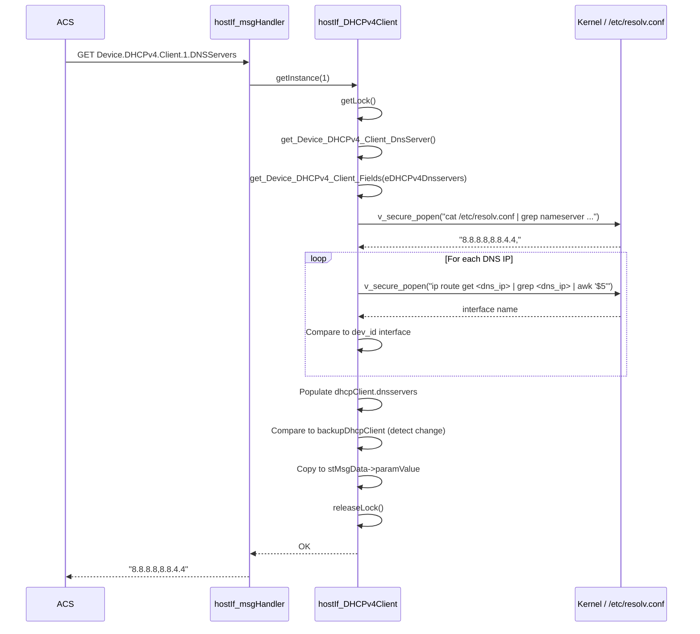

# DHCPv4 Profile

## Overview

The DHCPv4 profile implements the TR-181 `Device.DHCPv4.Client.{i}` object tree. It exposes the current DHCPv4 lease state — the active interface reference, DNS server list, and default gateway (IP Router) list — to TR-069 ACS and WebPA management systems. Data is derived at query time from the live kernel routing table and `/etc/resolv.conf`; no lease database file is parsed directly.

---

## Directory Structure

```
src/hostif/profiles/DHCPv4/
├── Device_DHCPv4_Client.h   # Class declaration, enums, struct definitions
├── Device_DHCPv4_Client.cpp # GET handler implementations
├── Makefile.am              # Autotools build rules
└── gtest/
    ├── gtest_dhcpv4.cpp     # Unit tests
    └── Makefile.am
```

---

## Architecture

```mermaid
graph TB
    ACS[ACS / WebPA] -->|GET Device.DHCPv4.Client.{i}.*| DISP[hostIf_msgHandler]
    DISP --> INST[hostIf_DHCPv4Client::getInstance\ndev_id]
    INST --> HASH[(dhcpv4ClientHash\nGHashTable)]
    INST --> GET[get_Device_DHCPv4_Client_Fields]
    GET -->|eDHCPv4Interface| IPIFS[hostIf_IP / hostIf_IPInterface\nname match lookup]
    GET -->|eDHCPv4Dnsservers| RESOLV[/etc/resolv.conf\nplus ip route get per DNS]
    GET -->|eDHCPv4Iprouters| IPROUTE[ip r grep default grep ifname]
    GET -->|Count| DEFROUTE[ip r grep default wc -l]
```

---

## TR-181 Parameter Coverage

| TR-181 Parameter | Method | Data Source |
|------------------|--------|-------------|
| `Device.DHCPv4.ClientNumberOfEntries` | GET | `ip r \| grep default \| wc -l` — counts default routes |
| `Device.DHCPv4.Client.{i}.Interface` | GET | Iterates `Device.IP.Interface.*`, matches `nameOfInterface` to OS interface name derived from dev_id |
| `Device.DHCPv4.Client.{i}.DNSServers` | GET | Parses `/etc/resolv.conf` nameserver lines; validates each with `ip route get <dns_ip>` per interface |
| `Device.DHCPv4.Client.{i}.IPRouters` | GET | `ip r \| grep default \| grep <ifname>` awk `$3` (gateway field) |

> **Note**: `Enable`, `Status`, `Alias`, `IPAddress`, `SubnetMask`, `LeaseTimeRemaining`, `DHCPServer`, `RenewedTime`, `SentOptionNumberOfEntries`, and `ReqOptionNumberOfEntries` from the TR-181 specification are not implemented. There is no `handleSetMsg` — all parameters are read-only.

---

## Class Design

### `hostIf_DHCPv4Client`

```
class hostIf_DHCPv4Client
├── static GHashTable* dhcpv4ClientHash   // dev_id → instance map
├── static GMutex*     m_mutex            // guards all class operations
├── static GHashTable* m_notifyHash       // change-notification registry
├── static DHCPv4Client dhcpClient        // SHARED state (all instances)
│
├── DHCPv4Client backupDhcpClient         // per-instance previous value
├── DHCPv4ClientParamBackUpFlag bBackUpFlags // tracks if backup is valid
│
├── getInstance(dev_id) → instance
├── getAllInstances()   → GList*
├── closeInstance()
├── closeAllInstances()
│
├── get_Device_DHCPv4_ClientNumberOfEntries()
├── get_Device_DHCPv4_Client_InterfaceReference()
├── get_Device_DHCPv4_Client_DnsServer()
└── get_Device_DHCPv4_Client_IPRouters()
```

### Key Structures

```c
typedef struct DHCPv4Client {
    char interface[MAX_IF_LEN];       // 256 bytes: "Device.IP.Interface.N"
    char dnsservers[MAX_DNS_SERVER_LEN]; // 256 bytes: comma-separated IPv4 list
    char ipRouters[MAX_IP_ROUTER_LEN];   // 256 bytes: comma-separated IPv4 list
} DHCPv4Client;

typedef struct DHCPv4ClientParamBackUpFlag {
    unsigned int interface:1;
    unsigned int dnsservers:1;
    unsigned int ipRouters:1;
} DHCPv4ClientParamBackUpFlag;
```

---

## How Operations Work

### GET Request Flow



### Interface Resolution Flow

When `get_Device_DHCPv4_Client_InterfaceReference()` is called, it:
1. Calls `getInterfaceName(ifname)` to get the OS interface name for `dev_id`
2. Calls `hostIf_IP::get_Device_IP_InterfaceNumberOfEntries()` to enumerate `Device.IP.Interface.*`
3. For each IP interface, calls `pIface->get_Interface_Name()` and compares to `ifname`
4. On match, returns `"Device.IP.Interface.N"` as a TR-181 path reference

---

## Change Detection

All three GET methods use a backup pattern for notification:

1. If `bBackUpFlags.<field>` is set (indicating a previous value exists) AND `pChanged != NULL`, the method calls `strncmp()` between the current and backup value
2. If they differ, `*pChanged = true` is set so the `updateHandler` can fire a WebPA notification
3. The backup is always updated to the current value after the comparison

---

## Error Handling

| Condition | Behavior |
|-----------|----------|
| `v_secure_popen()` fails | Returns `NOK`; stMsgData is not populated |
| No default route found | `get_Device_DHCPv4_ClientNumberOfEntries()` returns 0 |
| No matching IP interface | `Interface` field stays empty; returns `NOK` |
| `getInterfaceName()` fails | Returns `NOK` immediately, no shell commands spawned |
| Invalid DNS IP format | `isValidIPAddr()` rejects; DNS entry skipped |

---

## Known Issues and Gaps

### Gap 1 — High: `dhcpClient` is a class-level static shared by all instances

**File**: `Device_DHCPv4_Client.h` / `Device_DHCPv4_Client.cpp`

**Observation**: The data structure `dhcpClient` (of type `DHCPv4Client`) is declared `static`:

```cpp
static DHCPv4Client dhcpClient;
```

All `hostIf_DHCPv4Client` instances (dev_id 1, 2, 3, …) write to the same `dhcpClient` structure during `get_Device_DHCPv4_Client_Fields()`. When two manager instances call GET concurrently, one will overwrite the other's pending result.

**Impact**: On a multi-interface device, concurrent GET requests for different DHCPv4 client instances return corrupted or crossed field values.

**Recommended fix**: Make `dhcpClient` an instance member (not static).

---

### Gap 2 — High: `getLock()` lazy-initializes `m_mutex` without synchronization

**File**: `Device_DHCPv4_Client.cpp`

**Observation**:

```cpp
void hostIf_DHCPv4Client::getLock()
{
    if(!m_mutex)
    {
        m_mutex = g_mutex_new();
    }
    g_mutex_lock(m_mutex);
}
```

The `if(!m_mutex)` check and `g_mutex_new()` call are not atomically protected. Two threads calling `getLock()` simultaneously at startup can both observe `m_mutex == NULL` and create two separate mutexes. One mutex is stored, the other is leaked. All future locks use the stored mutex, but the initial caller's lock is on the leaked one — the critical section is left unprotected.

**Recommended fix**: Initialize `m_mutex` at class construction time or use `g_once`.

---

### Gap 3 — Medium: Only 3 of 14 TR-181 DHCPv4 Client parameters implemented

**Observation**: TR-181 `Device.DHCPv4.Client.{i}` defines 14 parameters including `Enable`, `Status`, `Alias`, `IPAddress`, `SubnetMask`, `LeaseTimeRemaining`, `DHCPServer`, `RenewedTime`, `SentOption`, and `ReqOption`. The implementation exposes only `Interface`, `DNSServers`, and `IPRouters`, all as read-only GET parameters. Any ACS attempt to GET `IPAddress`, `Enable`, or `Status` returns `NOT_HANDLED`.

**Impact**: ACS cannot perform full DHCPv4 diagnostics or control. Compliance with BBF TR-181 issue 2 is incomplete.

---

### Gap 4 — Medium: `ClientNumberOfEntries` counts default routes, not distinct DHCP clients

**File**: `Device_DHCPv4_Client.cpp` — `get_Device_DHCPv4_ClientNumberOfEntries()`

**Observation**:

```cpp
cmdOP = v_secure_popen("r", "ip r | grep default|wc -l");
```

This counts the number of default routing entries, not the number of active DHCP leases. On a device with multiple static default routes or policy routing tables, this returns a count that does not correspond to the number of DHCPv4 client instances actually in `dhcpv4ClientHash`.

**Recommended fix**: Count the keys in `dhcpv4ClientHash` or parse `/var/lib/dhclient/*.leases`.

---

### Gap 5 — Low: Memory leak in constructor

**File**: `Device_DHCPv4_Client.cpp`

**Observation**: The constructor allocates a `FILE*` via `cmdOP` but the variable is declared and assigned `NULL` without being used in the constructor body. Reviewing the constructor, `cmdOP` is declared but never assigned a non-NULL value. This is dead code, but there is no cleanup path for any future use.

---

## Testing

Unit tests are in `gtest/gtest_dhcpv4.cpp`. Run:

```bash
./run_ut.sh
```

When modifying DHCPv4 logic:
1. Verify `Interface` field correctly resolves `Device.IP.Interface.N` references.
2. Verify `DNSServers` parses multi-server entries separated by commas.
3. Verify `IPRouters` returns the gateway for the correct interface.
4. Test change detection: call GET twice with an intermediate route change in between.

---

## See Also

- [IP Profile README](../../IP/docs/README.md) — `Device.IP.Interface.{i}` used for interface resolution
- [handlers/docs/README.md](../../../handlers/docs/README.md) — Dispatch layer
- [src/hostif/docs/README.md](../../../docs/README.md) — Core daemon overview
