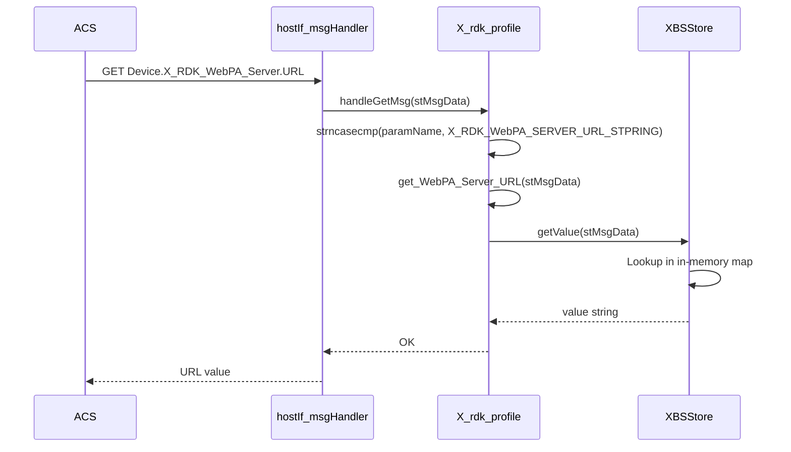
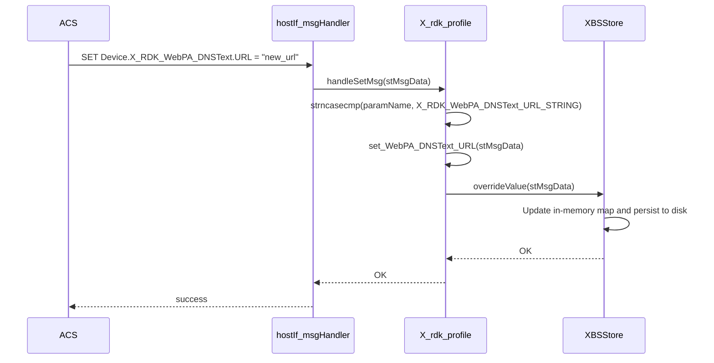

# Device Profile (X_RDK_profile)

## Overview

The Device profile implements the RDK-specific vendor extension `Device.X_RDK_*` parameter namespace. It provides GET and SET access to WebPA server URLs and WebConfig synchronization URLs that are stored and managed by the Bootstrap (`XBSStore`) subsystem. These parameters allow an ACS or WebPA controller to read and modify the management-plane endpoint configuration of the device.

---

## Directory Structure

```
src/hostif/profiles/Device/
├── x_rdk_profile.h    # Singleton class declaration and parameter name constants
├── x_rdk_profile.cpp  # GET and SET handler implementations
├── Makefile.am        # Autotools build rules
└── gtest/
    ├── gtest_device.cpp # Unit tests
    └── Makefile.am
```

---

## Architecture

```mermaid
graph TB
    ACS[ACS / WebPA] -->|GET/SET Device.X_RDK_*| DISP[hostIf_msgHandler]
    DISP --> INST[X_rdk_profile::getInstance]
    INST --> GET[handleGetMsg]
    INST --> SET[handleSetMsg]
    GET --> BSSTORE[XBSStore::getValue\nBootstrap store]
    SET --> BSSTORE2[XBSStore::overrideValue\nBootstrap store]
    BSSTORE --> JSON[/etc/partners_defaults.json\nor /opt/partners_defaults.json]
```

---

## TR-181 Parameter Coverage

| TR-181 Parameter | GET | SET | Backend |
|------------------|-----|-----|---------|
| `Device.X_RDK_WebPA_Server.URL` | ✅ | ❌ | XBSStore |
| `Device.X_RDK_WebPA_TokenServer.URL` | ✅ | ❌ | XBSStore |
| `Device.X_RDK_WebPA_DNSText.URL` | ✅ | ✅ | XBSStore |
| `Device.X_RDK_WebConfig.URL` | GET via BSStore routing | — | XBSStore |
| `Device.X_RDK_WebConfig.ForceSync` | GET via BSStore routing | — | XBSStore |

> **Note**: WebPA Server URL and WebPA TokenServer URL support GET only. The `handleSetMsg` function only handles `X_RDK_WebPA_DNSText.URL`. Setting `X_RDK_WebPA_Server.URL` or `X_RDK_WebPA_TokenServer.URL` returns `NOT_HANDLED`.

---

## Class Design

### `X_rdk_profile`

```
class X_rdk_profile  (singleton)
├── static X_rdk_profile* m_instance
├── static std::mutex m
├── static XBSStore* m_bsStore     // Bootstrap store reference
│
├── getInstance() → X_rdk_profile*
├── closeInstance()
│
├── handleGetMsg(stMsgData) → int  // GET dispatcher
└── handleSetMsg(stMsgData) → int  // SET dispatcher
```

### Parameter Name Constants

```cpp
#define X_RDK_WebPA_SERVER_URL_STPRING   "Device.X_RDK_WebPA_Server.URL"
#define X_RDK_WebPA_TokenServer_URL_STRING "Device.X_RDK_WebPA_TokenServer.URL"
#define X_RDK_WebPA_DNSText_URL_STRING   "Device.X_RDK_WebPA_DNSText.URL"
```

---

## How Operations Work

### GET Request Flow



### SET Request Flow



---

## Backend: Bootstrap Store (XBSStore)

All values are stored in the Bootstrap store (`XBSStore`). This store:
- Loads its initial values from a partner-specific JSON file (`partners_defaults.json`)
- Maintains an in-memory `std::map<string, string>` of key-value pairs
- On `overrideValue()`, writes an updated value to `tr181store.ini` so it persists across reboots

For more details see [DeviceInfo/docs/README.md](../../DeviceInfo/docs/README.md#xbsstore--bootstrap-store).

---

## Error Handling

| Condition | Behavior |
|-----------|----------|
| `paramName == NULL` | Logs error, returns `NOK` without touching `faultCode` |
| Unknown parameter name in GET | Sets `stMsgData->faultCode = fcInvalidParameterName`, returns `NOK` |
| Unknown parameter name in SET | Sets `stMsgData->faultCode = fcInvalidParameterName`, returns `NOK` |
| `XBSStore::getValue()` key not found | Returns `NOK`; paramValue is empty |
| C++ exception thrown | Caught, logs with `e.what()`, sets `fcInternalError`, returns `NOK` |

---

## Known Issues and Gaps

### Gap 1 — High: `handleSetMsg` only supports one of three writable parameters

**File**: `x_rdk_profile.cpp` — `handleSetMsg()`

**Observation**: The SET dispatcher handles only `X_RDK_WebPA_DNSText.URL`. The other two URL parameters (`X_RDK_WebPA_Server.URL` and `X_RDK_WebPA_TokenServer.URL`) are silently returned with `fcInvalidParameterName` on any SET attempt, even though the Bootstrap store can store arbitrary values. The GET for these parameters works fine.

**Impact**: ACS cannot change the WebPA server URL via TR-069/WebPA without using a different protocol path. This asymmetry between readable and writable parameters is not documented in any TR-181 extension schema.

---

### Gap 2 — Medium: `WebConfig.URL` and `WebConfig.ForceSync` not explicitly routed in this handler

**Observation**: The `handleGetMsg` in `x_rdk_profile.cpp` does not contain routing logic for `Device.X_RDK_WebConfig.*` parameters. These pass through to `XBSStore::getValue()` indirectly via the BSStore bootstrap routing. However, there is no explicit mapping showing which parameter names are valid, making it impossible to determine supported parameters from the source code alone.

---

### Gap 3 — Low: Stale file comments reference Bluetooth

**File**: `x_rdk_profile.cpp`

**Observation**: Both the `@file` Doxygen comment and the `@brief` Doxygen comment describe this file as handling Bluetooth device information:

```cpp
/**
 * @file X_rdk_profile.cpp
 * @brief This source file contains the APIs for getting bluetooth device information.
 */
```

This file handles WebPA/WebConfig URL configuration. The Bluetooth implementation lives in `XrdkBlueTooth.cpp` in the `DeviceInfo/` directory. The stale comments create misleading cross-references in generated API documentation.

---

### Gap 4 — Low: `getInstance()` is not thread-safe

**File**: `x_rdk_profile.cpp`

**Observation**:

```cpp
X_rdk_profile* X_rdk_profile::getInstance()
{
    if(!m_instance)
    {
        try {
            m_instance = new X_rdk_profile();
        } ...
    }
    return m_instance;
}
```

The `if(!m_instance)` check-and-create is not protected by `m` (the class-level `std::mutex`). Two threads could both observe `m_instance == nullptr` and each create an instance, with one being immediately leaked.

**Recommended fix**:
```cpp
std::lock_guard<std::mutex> lock(m);
if(!m_instance) {
    m_instance = new X_rdk_profile();
}
```

---

## Testing

Unit tests are in `gtest/gtest_device.cpp`. Run:

```bash
./run_ut.sh
```

When modifying this profile:
1. Verify GET returns the bootstrap store value for all three URL parameters.
2. Verify SET for `X_RDK_WebPA_DNSText.URL` persists across a simulated restart (check `tr181store.ini`).
3. Verify SET for `X_RDK_WebPA_Server.URL` returns `fcInvalidParameterName`.
4. Test `getInstance()` under concurrent access.

---

## See Also

- [DeviceInfo/docs/README.md](../../DeviceInfo/docs/README.md) — XBSStore internals, RFC store
- [src/hostif/docs/README.md](../../../docs/README.md) — Core daemon overview
- [handlers/docs/README.md](../../../handlers/docs/README.md) — Dispatch layer
