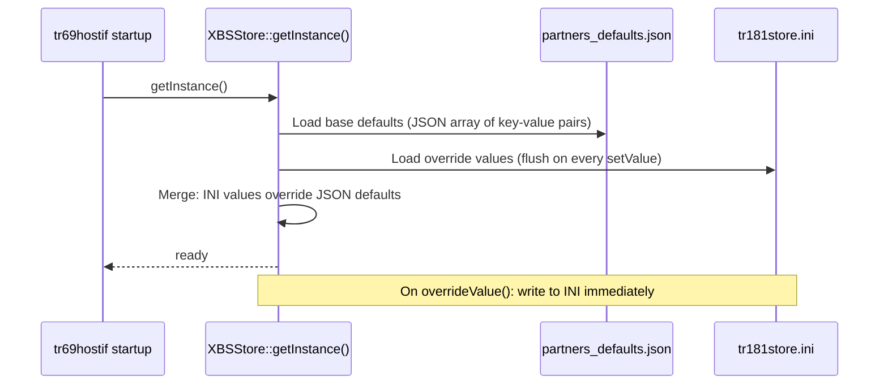
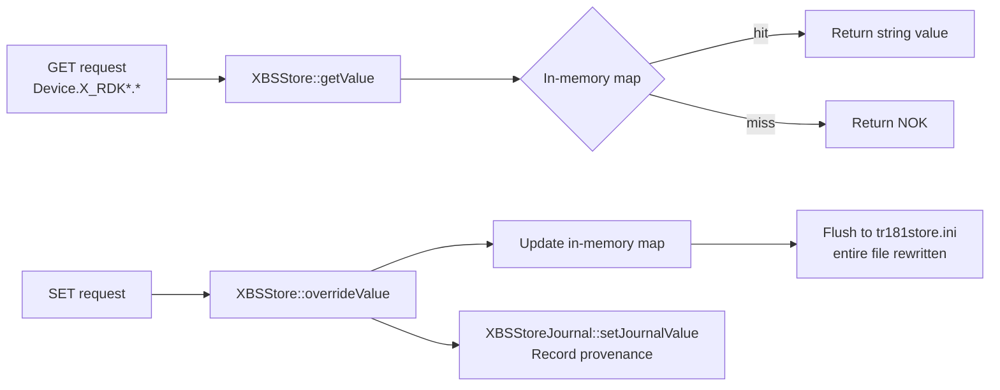
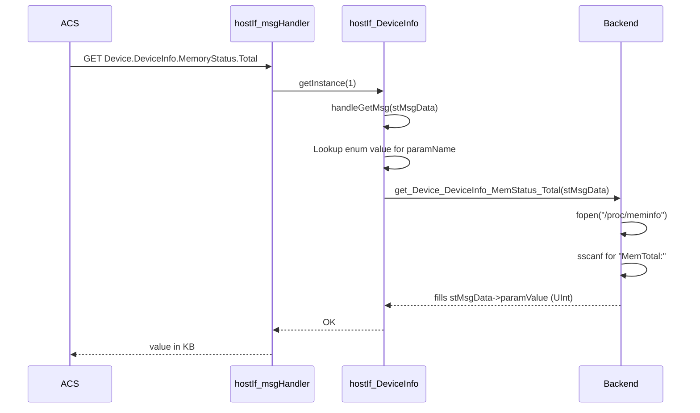

# DeviceInfo Profile

## Overview

The DeviceInfo profile is the largest and most complex profile in the tr69hostif daemon. It implements the entire `Device.DeviceInfo.*` object tree from TR-181 Issue 2, plus the RDK-specific `Device.DeviceInfo.X_RDKCENTRAL-COM_*` extensions. This includes manufacturer identification, software version management, memory status, process enumeration, reboot control, Bluetooth discovery/pairing, Bootstrap store (BSStore), and RFC configuration store management.

The profile consists of ten implementation files organized around three distinct functional areas:
1. **Core DeviceInfo** — static and dynamic device attributes
2. **BSStore / RFCStore** — partner configuration and RFC override persistence
3. **Bluetooth** — `btmgr` HAL integration for BLE and classic Bluetooth

---

## Directory Structure

```
src/hostif/profiles/DeviceInfo/
├── Device_DeviceInfo.cpp               # Core parameter handler (5,337 lines)
├── Device_DeviceInfo.h                 # Core class + 200+ parameter enum
├── Device_DeviceInfo_Processor.cpp     # Device.DeviceInfo.Processor.{i}.*
├── Device_DeviceInfo_Processor.h
├── Device_DeviceInfo_ProcessStatus.cpp # Device.DeviceInfo.ProcessStatus.*
├── Device_DeviceInfo_ProcessStatus.h
├── Device_DeviceInfo_ProcessStatus_Process.cpp  # Per-process stats
├── Device_DeviceInfo_ProcessStatus_Process.h
├── XrdkBlueTooth.cpp                   # X_RDKCENTRAL-COM_xBlueTooth.*
├── XrdkBlueTooth.h
├── XrdkCentralComBSStore.cpp           # Bootstrap store implementation
├── XrdkCentralComBSStore.h
├── XrdkCentralComBSStoreJournal.cpp    # BS store change journal
├── XrdkCentralComBSStoreJournal.h
├── XrdkCentralComRFC.cpp               # RFC INI file backend
├── XrdkCentralComRFC.h
├── XrdkCentralComRFCStore.cpp          # RFC store with 4 dict tiers
├── XrdkCentralComRFCStore.h
├── Makefile.am
└── gtest/
    ├── gtest_main.cpp   # Comprehensive tests (4,291 lines)
    └── Makefile.am
```

---

## Architecture

```mermaid
graph TB
    ACS[ACS / WebPA / RBUS] -->|GET/SET Device.DeviceInfo.*| DISP[hostIf_msgHandler]
    DISP --> DI[hostIf_DeviceInfo\nhandleGetMsg / handleSetMsg]
    DISP --> PROC[hostIf_DeviceProcessorInterface\nDevice.DeviceInfo.Processor.{i}]
    DISP --> PSTAT[hostIf_DeviceProcessStatusInterface\nDevice.DeviceInfo.ProcessStatus]
    DISP --> PPROC[DeviceProcessStatusProcess\nDevice.DeviceInfo.ProcessStatus.Process.{i}]
    DISP --> BT[XrdkBluetoothMgr\nDevice.DeviceInfo.X_RDKCENTRAL-COM_xBlueTooth.*]

    DI --> BSSTORE[XBSStore\nBootstrap store]
    DI --> RFCSTORE[XRFCStore\nRFC store]
    DI --> PROCFS[/proc/meminfo\n/proc/uptime\n/proc/version]
    DI --> SCRIPTS[triggerResetScript\nfactory/cold/warm reset]
    DI --> IARMBUS[IARM Bus\nDevice/MFR services]

    BSSTORE --> BSJSON[partners_defaults.json\ntr181store.ini]
    BSSTORE --> BSJOURNAL[XBSStoreJournal\nfwValue tracking]
    RFCSTORE --> RFCINI[/opt/RFC/*.ini\n/etc/rfcdefaults/]
    PSTAT --> PROCFS2[/proc/stat]
    PPROC --> PROCFSPID[/proc/PID/status]
    BT --> BTMGR[btmgr HAL]
```

---

## Functional Areas

### 1. Core DeviceInfo Parameters

`hostIf_DeviceInfo` in `Device_DeviceInfo.cpp` handles the standard TR-181 and RDK extension parameters. Data comes from multiple backends:

| Category | Source | Examples |
|----------|--------|---------|
| Static identifiers | IARM / MFR services | Manufacturer, ManufacturerOUI, ProductClass, SerialNumber |
| Software versions | `/version.txt`, `/etc/device.properties` | SoftwareVersion, HardwareVersion, AdditionalHardwareVersion |
| Runtime stats | `/proc/meminfo`, `/proc/uptime` | MemoryStatus.Total, MemoryStatus.Free, UpTime |
| Reset control | `triggerResetScript()` | X_RDKCENTRAL-COM_Reset (factory/cold/warehouse/customer) |
| Bootstrap values | `XBSStore` | Partner URL overrides, CMS management endpoint |
| RFC values | `XRFCStore` | Feature enable/disable flags, override parameters |
| Process stats | `/proc/stat`, `/proc/PID/status` | ProcessStatus.CPUUsage, Process.{i}.* |

### 2. Bootstrap Store (XBSStore)

The Bootstrap store manages partner-specific default configuration:



**File locations** (in priority order, later overrides earlier):
1. `/etc/partners_defaults.json` — factory installed defaults
2. `/opt/partners_defaults.json` — operator-installed overrides
3. `/opt/tr181store.ini` — RFC/ACS-programmed runtime overrides

### 3. RFC Store (XRFCStore)

The RFC store manages feature enablement flags with a four-tier dictionary:

| Dictionary | Source File | Description |
|-----------|-------------|-------------|
| `rfcdefaults` | `/etc/rfcdefaults/tr69hostif.ini` | Factory RFC defaults |
| `main` | `/opt/RFC/tr69hostif.ini` | Network RFC overrides |
| `localstore` | `/opt/persistent/RFC/` | Locally persisted overrides |
| `non-persistent` | In-memory only | Transient overrides cleared on restart |

Priority (highest to lowest): `non-persistent` > `main` > `localstore` > `rfcdefaults`

### 4. Bootstrap Store Journal (XBSStoreJournal)

The journal records the provenance of every bootstrap store entry:

```cpp
typedef struct {
    std::string fwValue;       // Value from the firmware/factory JSON
    std::string buildTime;     // ISO timestamp when fwValue was set
    std::string updatedValue;  // Current override value (if any)
    HostIf_Source_Type_t source; // RFCUPDATE / ALLUPDATE / BOOTSTRAP
} JournalEntry;
```

When `XBSStore::overrideValue()` is called, it records the old firmware value, new value, source type, and timestamp in the journal so audit trails can be retrieved later.

### 5. Process and CPU Statistics

`hostIf_DeviceProcessStatusInterface` reads `/proc/stat` to compute `CPUUsage` as a percentage. `DeviceProcessStatusProcess` reads individual `/proc/<pid>/status` files to populate `Process.{i}.*` table rows.

### 6. Bluetooth (XrdkBluetoothMgr)

`XrdkBluetoothMgr` bridges `Device.DeviceInfo.X_RDKCENTRAL-COM_xBlueTooth.*` parameter GET/SET requests to the `btmgr` HAL. Supported sub-objects:
- `DiscoveredDevice.{i}.*` — devices found during scan
- `PairedDevice.{i}.*` — bonded devices
- `ConnectedDevice.{i}.*` — currently connected devices
- `LimitedBeaconDetection.*` — BLE scanning

---

## Key Data Structures

### DeviceInfo parameter enum (partial)

`Device_DeviceInfo.h` defines an enum `eDeviceInfoMembers` with over 200 values mapping each TR-181 parameter to an array index for the GET/SET dispatch table.

### BS Store data flow



---

## GET Request Flow (DeviceInfo)



---

## Error Handling

| Condition | Behavior |
|-----------|----------|
| `/proc/*` file not readable | Returns `NOK`; paramValue empty |
| IARM bus call fails | Returns `NOK`; logs error via RDK_LOG |
| BSStore key not found | Returns `NOK` |
| Unknown parameter name | Sets `fcInvalidParameterName`, returns `NOK` |
| C++ exception in handler | Catches `std::exception`, sets `fcInternalError`, returns `NOK` |
| Bluetooth HAL unavailable | `XrdkBluetoothMgr` returns `NOK`; no crash |

---

## Known Issues and Gaps

### Gap 1 — High: `XBSStore::flush()` and `IniFile::flush()` rewrite the entire file on every `setValue()`

**File**: `XrdkCentralComBSStore.cpp`, `IniFile.cpp`

**Observation**: Every call to `XBSStore::overrideValue()` ultimately calls `IniFile::flush()`, which opens the `.ini` file with `ofstream` (default truncate mode) and rewrites all key-value pairs from scratch:

```cpp
// IniFile.cpp — FIXME: truncating everytime is bad for flash in general
ofstream outputStream(m_filename.c_str());
```

The FIXME comment is present in the code. On NAND flash storage, truncate+rewrite on every single-value update causes excessive sector erasures, accelerating flash wear.

**Recommended fix**: Accumulate changes in memory and flush only on explicit sync, on daemon shutdown, or on a timer.

---

### Gap 2 — High: BSStore journal source attribute not enforced

**File**: `XrdkCentralComBSStoreJournal.cpp`

**Observation**: `XBSStoreJournal::getJournalSource()` compares the journal source enum to `DEV_DETAIL_BS_UPDATE` but returns a `HostIf_Source_Type_t` enum value. If the journal entry was set by an RFC update, the returned source type may indicate `ALLUPDATE` even for a Bootstrap value, making it impossible to reliably distinguish RFC-overridden versus ACS-overridden bootstrap values.

---

### Gap 3 — Medium: `Device.DeviceInfo.ProcessStatus.Process.{i}` built by reading `/proc/<pid>/status` for all running PIDs

**File**: `Device_DeviceInfo_ProcessStatus_Process.cpp`

**Observation**: `getAllProcesses()` iterates `/proc/*/status` for all numeric PIDs. On a device with hundreds of processes, this can take hundreds of milliseconds on each GET request. There is no caching — every GET rewalks `/proc`.

**Impact**: A polling ACS that GETs `ProcessNumberOfEntries` frequently causes measurable CPU spikes.

**Recommended fix**: Cache the process list for a configurable TTL (e.g., 5 seconds).

---

### Gap 4 — Medium: Bluetooth `XrdkBluetoothMgr` is conditionally compiled but the condition is undocumented

**File**: `XrdkBlueTooth.cpp`

**Observation**: The Bluetooth implementation is guarded by multiple `#ifdef` blocks without a documented build flag for enabling/disabling the BLE Tile beacon path (`ENABLE_TILE`). The Bluetooth manager calls `BTRMGR_*` HAL functions that may not be present on all RDK platform builds, causing linker failures on non-BT hardware.

---

### Gap 5 — Medium: `X_RDKCENTRAL-COM_Reset` executes scripts without validating input against allowed values

**File**: `Device_DeviceInfo.cpp` — reset handler

**Observation**: The Reset parameter accepts values `factory`, `cold`, `warm`, `warehouse`, and `customer`. The handler calls `triggerResetScript()` from `hostIf_utils.cpp` which dispatches to `v_secure_system()` scripts. While `v_secure_system` is used (safe wrapper), the value itself is not validated against the hard-coded set of allowed values before dispatch. An unsupported reset type silently returns `NOK` with no fault code set.

---

### Gap 6 — Low: `Device_DeviceInfo_Processor.cpp` returns hardcoded `Architecture` string

**File**: `Device_DeviceInfo_Processor.cpp`

**Observation**: The `Architecture` GET handler reads `/proc/version` or similar but returns a hardcoded fallback string on many build configurations rather than dynamically detecting the CPU architecture via `uname()`. On cross-compiled builds, this may report the build host's architecture instead of the target device's.

---

## Testing

Unit tests are in `gtest/gtest_main.cpp` (4,291 lines). Run:

```bash
./run_ut.sh
```

Key test areas:
1. BSStore: load from JSON, override with INI, journal entry tracking.
2. RFCStore: four-tier priority resolution, `clearAll()`, `reloadCache()`.
3. DeviceInfo GET: MemoryStatus.Total/Free from mocked `/proc/meminfo`.
4. ProcessStatus: CPUUsage calculation from `/proc/stat`.

---

## See Also

- [Device/docs/README.md](../../Device/docs/README.md) — X_RDK_profile (WebPA/WebConfig URLs)
- [src/hostif/docs/README.md](../../../docs/README.md) — Core daemon and IniFile overview
- [handlers/docs/README.md](../../../handlers/docs/README.md) — Dispatch layer
