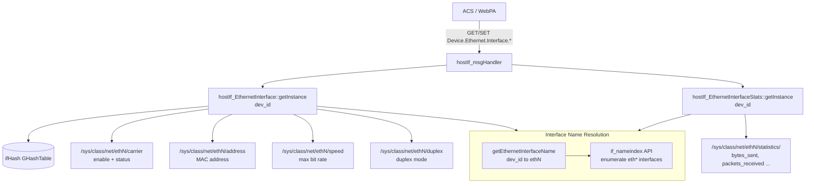
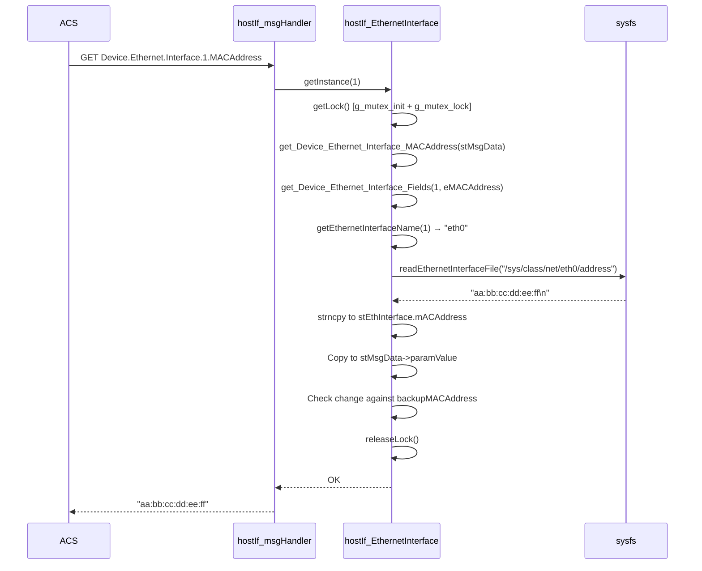

# Ethernet Profile

## Overview

The Ethernet profile implements the TR-181 `Device.Ethernet.Interface.{i}.*` and `Device.Ethernet.Interface.{i}.Stats.*` object trees. It provides GET and SET access to physical Ethernet port attributes (link state, MAC address, speed, duplex mode) and comprehensive interface statistics (byte/packet counters). All data is read from the Linux sysfs path `/sys/class/net/<name>/` without spawning shell processes.

---

## Directory Structure

```
src/hostif/profiles/Ethernet/
├── Device_Ethernet_Interface.cpp       # Interface GET/SET handlers
├── Device_Ethernet_Interface.h         # Class, enum, struct definitions
├── Device_Ethernet_Interface_Stats.cpp # Statistics GET handlers
├── Device_Ethernet_Interface_Stats.h   # Stats class and enum
├── Makefile.am
└── gtest/
    ├── gtest_ethernet.cpp  # Unit tests (364 lines)
    └── Makefile.am
```

---

## Architecture



---

## TR-181 Parameter Coverage

### Interface Parameters (`Device.Ethernet.Interface.{i}.*`)

| Parameter | GET | SET | sysfs Path |
|-----------|-----|-----|-----------|
| `Enable` | ✅ | ❌ | `carrier` (1=up) |
| `Status` | ✅ | ❌ | `carrier` → "Up"/"Down" |
| `Name` | ✅ | ❌ | `if_nameindex()` |
| `Upstream` | ✅ | ❌ | `carrier` (same as Enable — see Gap 2) |
| `MACAddress` | ✅ | ❌ | `address` |
| `MaxBitRate` | ✅ | ❌ | `speed` (Mbps) |
| `DuplexMode` | ✅ | ❌ | `duplex` → "Full"/"Half"/"Auto" |
| `LastChange` | ❌ | ❌ | Not implemented |
| `LowerLayers` | ❌ | ❌ | Not implemented |
| `Alias` | ❌ | ❌ | Not implemented |
| `CurrentBitRate` | ❌ | ❌ | Not implemented |
| `EEECapability` | ❌ | ❌ | Not implemented |

### Stats Parameters (`Device.Ethernet.Interface.{i}.Stats.*`)

All statistics read from `/sys/class/net/<name>/statistics/<counter>`:

| Parameter | Counter file |
|-----------|-------------|
| `BytesSent` | `tx_bytes` |
| `BytesReceived` | `rx_bytes` |
| `PacketsSent` | `tx_packets` |
| `PacketsReceived` | `rx_packets` |
| `ErrorsSent` | `tx_errors` |
| `ErrorsReceived` | `rx_errors` |
| `UnicastPacketsSent` | `tx_packets` (approximation) |
| `DiscardPacketsSent` | `tx_dropped` |
| `DiscardPacketsReceived` | `rx_dropped` |
| `MulticastPacketsSent` | `multicast` |
| `BroadcastPacketsSent` | Computed as `tx_packets - tx_unicast - multicast` |
| `UnknownProtoPacketsReceived` | `rx_frame_errors` |

---

## Class Design

### `hostIf_EthernetInterface`

```
class hostIf_EthernetInterface
├── static GHashTable* ifHash               // dev_id → instance
├── static GMutex m_mutex                   // class-wide mutex (see Gap 1)
├── static GHashTable* m_notifyHash         // notification hash
├── static EthernetInterface stEthInterface // SHARED state (all instances — see Gap 3)
│
├── bool backupEnable, backupUpstream       // per-instance change detection
├── char backupStatus[], backupName[], ...
├── bool bCalledEnable, bCalledStatus, ...  // backup validity flags
│
└── get_Device_Ethernet_Interface_{Param}()
```

### Key Structures

```c
typedef struct Device_Ethernet_Interface {
    bool    enable;
    char    status[_BUF_LEN_16];    // "Up" or "Down"
    char    name[_BUF_LEN_16];      // "ethN"
    bool    upStream;
    char    mACAddress[S_LENGTH];   // "XX:XX:XX:XX:XX:XX"
    int     maxBitRate;             // Mbps, read from /sys/class/net/ethN/speed
    char    duplexMode[_BUF_LEN_16];// "Full", "Half", "Auto"
} EthernetInterface;
```

---

## How Operations Work

### GET Request Flow



### Interface Name Resolution

`getEthernetInterfaceName(ethInterfaceNum)` enumerates all network interfaces via `if_nameindex()` and returns the Nth interface with a name starting with `"eth"` (1-based). This determines which sysfs directory to read.

---

## Change Detection

Each parameter has:
1. A `bCalled*` flag indicating whether a backup value has been set
2. A `backup*` field holding the previous value
3. A comparison in each GET function: if `bCalled*` is true and the values differ, `*pChanged = true`

---

## Error Handling

| Condition | Behavior |
|-----------|----------|
| `if_nameindex()` returns NULL | Logs error, returns `NOK` |
| No Nth `eth*` interface found | Logs error, returns `NOK` |
| `readEthernetInterfaceFile()` file not opened | Returns `NULL`; caller returns `NOK` |
| `malloc` failure in `readEthernetInterfaceFile` | Returns `NULL`; caller returns `NOK` |
| `/sys/class/net/ethN/speed` returns -1 (link down) | Stores -1 as `maxBitRate` (not filtered) |

---

## Known Issues and Gaps

### Gap 1 — High: `getLock()` calls `g_mutex_init()` on every invocation

**File**: `Device_Ethernet_Interface.cpp`

**Observation**:

```cpp
void hostIf_EthernetInterface::getLock()
{
    g_mutex_init(&hostIf_EthernetInterface::m_mutex);  // called every time!
    g_mutex_lock(&hostIf_EthernetInterface::m_mutex);
}
```

`g_mutex_init()` re-initializes an already-initialized mutex before locking it. According to the GLib documentation, calling `g_mutex_init()` on an already-initialized (and potentially already-locked) mutex is undefined behavior. This same pattern is present in multiple other profile classes.

**Impact**: Possible data corruption, crash, or lock bypass under concurrent access.

**Recommended fix**: Initialize the mutex once at class construction or via `G_MUTEX_INIT` static initializer, and remove the `g_mutex_init()` call from `getLock()`.

---

### Gap 2 — High: `Upstream` reads `carrier` (physical link) instead of upstream direction

**File**: `Device_Ethernet_Interface.cpp` — `eUpstream` case

**Observation**: The `Upstream` parameter in TR-181 indicates whether the interface connects toward the WAN/upstream network. The implementation reads `/sys/class/net/ethN/carrier`, which only indicates physical link presence:

```cpp
case eUpstream:
    snprintf(cmd, BUFF_LENGTH, "/sys/class/net/%s/carrier", ethernetInterfaceName);
    hostIf_EthernetInterface::stEthInterface.upStream = string_to_bool(value);
```

`carrier = 1` means a cable is plugged in, not that the interface is the upstream WAN port.

**Impact**: `Upstream` always returns `true` for any interface with physical link. ACS cannot use this parameter to identify the WAN interface.

**Recommended fix**: Read `/sys/class/net/ethN/uevent` and check `DEVTYPE=`, or use a device-specific configuration file to map interface names to their upstream/downstream roles.

---

### Gap 3 — High: `stEthInterface` is a class-level static shared by all instances

**File**: `Device_Ethernet_Interface.h`

**Observation**:

```cpp
static EthernetInterface stEthInterface;
```

All `hostIf_EthernetInterface` instances (dev_id 1, 2, 3, …) write to the same `stEthInterface` structure during `get_Device_Ethernet_Interface_Fields()`. Concurrent GET requests for `eth0` and `eth1` overwrite each other's in-flight results.

**Impact**: On a multi-port device, concurrent GET requests return data from whichever interface wrote last.

**Recommended fix**: Make `stEthInterface` an instance member field.

---

### Gap 4 — Medium: `readEthernetInterfaceFile()` allocates a heap buffer that the caller never frees

**File**: `Device_Ethernet_Interface.cpp`

**Observation**: `readEthernetInterfaceFile()` allocates memory with `malloc()` and returns the pointer:

```cpp
char *buffer = (char *)malloc(sizeof(char) * length);
...
return buffer;
```

In `get_Device_Ethernet_Interface_Fields()`, the returned pointer is copied into the target struct and then the pointer goes out of scope without a `free()` call. Each GET call for a field that uses this helper leaks heap memory.

**Recommended fix**: Add `free(value)` after copying from the returned buffer, or change the helper to write directly into a caller-provided buffer.

---

### Gap 5 — Medium: `MaxBitRate` returns -1 when the interface has no physical link

**Observation**: `/sys/class/net/ethN/speed` returns `-1` when the Ethernet port has no cable attached. The handler copies this negative value into `stEthInterface.maxBitRate` and returns it to the caller. TR-181 specifies `MaxBitRate` as a non-negative integer in Mbps. Some ACS implementations reject negative values.

**Recommended fix**: Map -1 to 0 or return `NOK` when speed is unavailable (link down).

---

### Gap 6 — Low: No SET parameter support

**Observation**: The Ethernet interface profile has no `handleSetMsg` path. TR-181 defines `Enable`, `Alias`, and `MaxBitRate` as writable. Any ACS SET request for these parameters returns `NOT_HANDLED`.

---

## Testing

Unit tests are in `gtest/gtest_ethernet.cpp`. Run:

```bash
./run_ut.sh
```

When modifying this profile:
1. Verify `Enable` and `Status` both correctly reflect carrier state.
2. Verify `MaxBitRate` returns 0 or `NOK` when no link is present.
3. Verify Stats counters match `/sys/class/net/*/statistics/` values.
4. Test multi-interface scenarios with at least two `eth*` interfaces.

---

## See Also

- [IP Profile README](../../IP/docs/README.md) — IP interface layer above Ethernet
- [InterfaceStack Profile README](../../InterfaceStack/docs/README.md) — Layer stacking table
- [src/hostif/docs/README.md](../../../docs/README.md) — Core daemon overview
