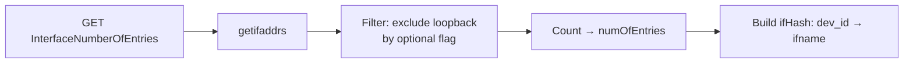
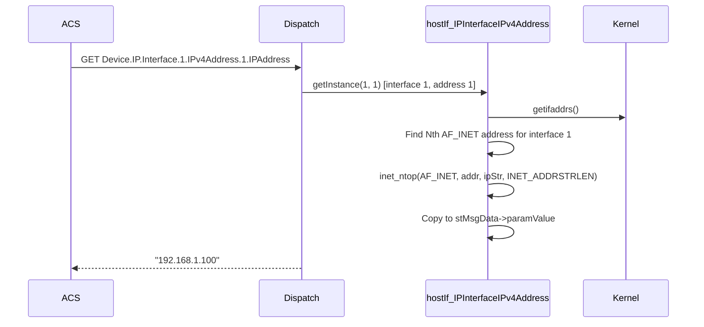

# IP Profile

## Overview

The IP profile implements the TR-181 `Device.IP.*` object tree — the most comprehensive network-layer profile in the daemon. It covers the global IP object, per-interface configuration and address enumeration (IPv4 and IPv6), interface statistics, active TCP/UDP port enumeration, and IP diagnostics (ping, traceroute, speed test, download/upload benchmarks, UDP echo). Data is gathered from the Linux kernel via `getifaddrs()`, `ioctl()`, `/proc/net/tcp`, `/proc/net/tcp6`, and `/sys/class/net/*/statistics/`.

---

## Directory Structure

```
src/hostif/profiles/IP/
├── Device_IP.cpp                               # Global IP object
├── Device_IP.h
├── Device_IP_Interface.cpp                     # Per-interface attributes
├── Device_IP_Interface.h
├── Device_IP_Interface_IPv4Address.cpp         # IPv4 address table
├── Device_IP_Interface_IPv4Address.h
├── Device_IP_Interface_IPv6Address.cpp         # IPv6 address table
├── Device_IP_Interface_IPv6Address.h
├── Device_IP_Interface_Stats.cpp               # Per-interface statistics
├── Device_IP_Interface_Stats.h
├── Device_IP_ActivePort.cpp                    # Active TCP/UDP port table
├── Device_IP_ActivePort.h
├── Device_IP_Diagnostics_IPPing.cpp            # ICMP ping diagnostic
├── Device_IP_Diagnostics_IPPing.h
├── Device_IP_Diagnostics_SpeedTest.cpp         # Speed test diagnostic
├── Device_IP_Diagnostics_SpeedTest.h
├── Device_IP_Diagnostics_DownloadDiagnostics.h # Header-only C-style API
├── Device_IP_Diagnostics_UploadDiagnostics.h   # Header-only C-style API
├── Device_IP_Diagnostics_TraceRoute.h          # Header-only C-style API
├── Device_IP_Diagnostics_TraceRoute_RouteHops.h
├── Device_IP_Diagnostics_UDPEchoConfig.h       # Header-only C-style API
└── Makefile.am
```

> **Note**: There is no `gtest/` subdirectory. The IP profile has no unit tests.

---

## Architecture

```mermaid
graph TB
    ACS[ACS / WebPA / RBUS] -->|GET/SET Device.IP.*| DISP[hostIf_msgHandler]

    DISP --> GIP["hostIf_IP<br/>Device.IP"]
    DISP --> IPIF["hostIf_IPInterface<br/>Device.IP.Interface.(i)"]
    DISP --> IPV4["hostIf_IPInterfaceIPv4Address<br/>Device.IP.Interface.(i).IPv4Address.(i)"]
    DISP --> IPV6["hostIf_IPInterfaceIPv6Address<br/>Device.IP.Interface.(i).IPv6Address.(i)"]
    DISP --> STATS["hostIf_IPInterfaceStats<br/>Device.IP.Interface.(i).Stats"]
    DISP --> APORT["hostIf_IPActivePort<br/>Device.IP.ActivePort.(i)"]
    DISP --> PING[hostIf_IP_Diagnostics_IPPing]
    DISP --> SPEED[hostIf_IP_Diagnostics_SpeedTest]

    IPIF --> GETIFADDRS["getifaddrs + ioctl<br/>interface enumeration"]
    IPV4 --> GETIFADDRS2["getifaddrs<br/>AF_INET address scan"]
    IPV6 --> GETIFADDRS3["getifaddrs<br/>AF_INET6 address scan"]
    STATS --> SYSFS[/sys/class/net/N/statistics/*]
    APORT --> PROCNET["/proc/net/tcp<br/>/proc/net/tcp6"]

    IPIF --> SETCMDS["system ifconfig/ifdown/ifup<br/>Enable/Reset/MTU set"]
```

---

## TR-181 Parameter Coverage

### `Device.IP` (global)

| Parameter | GET | SET | Source |
|-----------|-----|-----|--------|
| `IPv4Capable` | ✅ | ❌ | Hardcoded `true` |
| `IPv4Enable` | ✅ | ✅ | `ioctl SIOCGIFFLAGS` |
| `IPv4Status` | ✅ | ❌ | Derived from enable flag |
| `IPv6Capable` | ✅ | ❌ | Checks for configured IPv6 via `getifaddrs` |
| `IPv6Enable` | ✅ | ✅ | `/proc/sys/net/ipv6/conf/all/disable_ipv6` |
| `IPv6Status` | ✅ | ❌ | Derived |
| `ULAPrefix` | ✅ | ❌ | Linux ULA prefix |
| `InterfaceNumberOfEntries` | ✅ | ❌ | `getifaddrs` count |
| `ActivePortNumberOfEntries` | ✅ | ❌ | `/proc/net/tcp` + `/proc/net/tcp6` line count |

### `Device.IP.Interface.{i}` (per interface)

| Parameter | GET | SET | Source |
|-----------|-----|-----|--------|
| `Enable` | ✅ | ✅ | `ioctl SIOCGIFFLAGS` / `ifconfig up/down` |
| `IPv4Enable` | ✅ | ✅ | Interface flags |
| `IPv6Enable` | ✅ | ✅ | Per-interface disable_ipv6 |
| `Status` | ✅ | ❌ | `ioctl` flags |
| `Name` | ✅ | ❌ | `getifaddrs` |
| `Type` | ✅ | ❌ | `Normal` / `Loopback` / `Tunnel` |
| `Reset` | ✅ | ✅ | `ifdown`/`ifup` invocation |
| `MaxMTUSize` | ✅ | ✅ | `ifconfig <name> mtu <value>` |
| `LastChange` | ❌ | ❌ | Not implemented |
| `LowerLayers` | ❌ | ❌ | Not implemented |
| `Router` | ❌ | ❌ | Not implemented |

### `Device.IP.Interface.{i}.IPv4Address.{i}`

| Parameter | GET | Source |
|-----------|-----|--------|
| `Enable` | ✅ | Derived from parent interface state |
| `Status` | ✅ | Derived |
| `IPAddress` | ✅ | `getifaddrs` AF_INET |
| `SubnetMask` | ✅ | `getifaddrs` AF_INET netmask |
| `AddressingType` | ✅ | Heuristic: DHCP if non-static, Static otherwise |

### `Device.IP.Interface.{i}.IPv6Address.{i}`

| Parameter | GET | Source |
|-----------|-----|--------|
| `Enable`, `Status` | ✅ | Derived |
| `IPAddress` | ✅ | `getifaddrs` AF_INET6 |
| `Origin` | ✅ | AutoConfigured / DHCPv6 / WellKnown / Static |
| `Prefix`, `PreferredLifetime`, `ValidLifetime` | ✅ | Parsed from kernel addresses |

### `Device.IP.ActivePort.{i}`

| Parameter | GET | Source |
|-----------|-----|--------|
| `LocalIPAddress`, `LocalPort` | ✅ | `/proc/net/tcp`, `/proc/net/tcp6` hex decode |
| `RemoteIPAddress`, `RemotePort` | ✅ | `/proc/net/tcp` hex decode |
| `Status` | ✅ | TCP state column → "Listen"/"Established" |

---

## How Operations Work

### Interface Enumeration

`hostIf_IP` calls `getifaddrs()` to enumerate all network interfaces. Each interface gets a `dev_id` starting from 1. The mapping is cached in `ifHash`. 



### IPv4 Address GET Flow



### Active Ports Flow

`hostIf_IPActivePort` reads `/proc/net/tcp` (and `/proc/net/tcp6` for IPv6):
1. Each line has hex-encoded local/remote address+port and TCP state
2. The handler decodes hex IP bytes with byte-swap for endianness
3. TCP state `0A` = "Listen", `01` = "Established"; all others map to "Error"

---

## SET Operations

| SET Parameter | Implementation |
|---------------|---------------|
| `Device.IP.IPv4Enable` | `ioctl(SIOCSIFFLAGS)` on all interfaces |
| `Device.IP.IPv6Enable` | Writes `0`/`1` to `/proc/sys/net/ipv6/conf/all/disable_ipv6` |
| `Device.IP.Interface.{i}.Enable` | `ifconfig <name> up/down` via `system()` |
| `Device.IP.Interface.{i}.Reset` | `ifdown <name>; ifup <name>` via `system()` |
| `Device.IP.Interface.{i}.MaxMTUSize` | `ifconfig <name> mtu <value>` via `system()` |

---

## Error Handling

| Condition | Behavior |
|-----------|----------|
| `getifaddrs()` fails | Returns `NOK`; logs `errno` |
| No Nth address for interface | Returns `NOK` |
| `system()` returns non-zero | Returns `NOK` |
| `/proc/net/tcp` not readable | Returns `NOK` |
| `IOCTL` fails | Returns `NOK`; logs `errno` |

---

## Known Issues and Gaps

### Gap 1 — High: `set_Interface_Enable`, `set_Interface_Reset`, `set_Interface_Mtu` use `system()` instead of `v_secure_system()`

**File**: `Device_IP_Interface.cpp`

**Observation**:

```cpp
int hostIf_IPInterface::set_Interface_Enable(int value)
{
    char cmd[BUFF_LENGTH] = { 0 };
    snprintf(cmd, BUFF_LENGTH, "ifconfig %s down", nameOfInterface);
    return (system(cmd) < 0) ? NOK : OK;
}
```

`system()` is used instead of the security-hardened `v_secure_system()` wrapper required by the embedded platform. While `nameOfInterface` is derived from kernel interface enumeration (not user data), using bare `system()` bypasses the secure wrapper validation and contradicts the RDK coding standard applied in all other files.

**Impact**: Any future code path that sets `nameOfInterface` from user input would introduce a command injection vulnerability.

**Recommended fix**: Replace all `system(cmd)` calls with `v_secure_system(...)` using the format-string variant.

---

### Gap 2 — High: `stIPInterfaceInstance` is a global static struct shared by all instances

**File**: `Device_IP_Interface.h`

**Observation**:

```cpp
static IPInterface stIPInterfaceInstance;
```

All `hostIf_IPInterface` instances write to the same shared structure. GET requests for `Device.IP.Interface.1.*` and `Device.IP.Interface.2.*` issued concurrently overwrite each other's in-flight data.

**Recommended fix**: Make `stIPInterfaceInstance` an instance field.

---

### Gap 3 — High: `set_Interface_Reset` uses `ifdown`/`ifup` which may not exist on all embedded targets

**File**: `Device_IP_Interface.cpp`

**Observation**:

```cpp
snprintf(cmd, BUFF_LENGTH, "ifdown %s", nameOfInterface);
system(cmd);
snprintf(cmd, BUFF_LENGTH, "ifup %s", nameOfInterface);
system(cmd);
```

`ifdown`/`ifup` are part of `ifupdown` package and are not available on Yocto-based or Buildroot RDK targets. On such platforms, `Reset` silently fails or partially executes (one command might be found, the other not).

**Recommended fix**: Use `ip link set <name> down && ip link set <name> up` which is universally available via `iproute2`.

---

### Gap 4 — Medium: `AddressingType` for IPv4 addresses uses a heuristic, not the actual DHCP lease state

**File**: `Device_IP_Interface_IPv4Address.cpp`

**Observation**: The `AddressingType` parameter should report `DHCP`, `Static`, `AutoIP`, or `IPCP`. The implementation derives this from whether the address appears in a routing or lease file, using an approximation. On a device where static addresses are configured through DHCP-like tooling (e.g., NetworkManager static leases), this heuristic returns the wrong type.

---

### Gap 5 — Medium: IPv4 Active Ports parser does not handle `/proc/net/udp`

**File**: `Device_IP_ActivePort.cpp`

**Observation**: `ActivePort.{i}` in TR-181 covers both TCP and UDP active ports. The implementation reads only `/proc/net/tcp` and `/proc/net/tcp6`. UDP sockets from `/proc/net/udp` and `/proc/net/udp6` are not included.

**Impact**: `ActivePortNumberOfEntries` undercounts total active ports; any UDP server ports on the device are invisible to ACS.

---

### Gap 6 — Low: No unit tests

**Observation**: The IP profile directory has no `gtest/` subdirectory. This is the largest network profile (nine `.cpp` files, 5,822 lines) and has zero automated test coverage.

**Recommended fix**: Add unit tests using mock `getifaddrs()` and mock `/proc/net/tcp` file fixtures.

---

### Gap 7 — Low: Diagnostics (Download/Upload/TraceRoute/UDPEcho) are header-only stubs

**Observation**: `Device_IP_Diagnostics_DownloadDiagnostics.h`, `Device_IP_Diagnostics_UploadDiagnostics.h`, `Device_IP_Diagnostics_TraceRoute.h`, and `Device_IP_Diagnostics_UDPEchoConfig.h` declare C-style `set/get_Device_IP_Diagnostics_*` functions but none of them have corresponding `.cpp` implementations. These diagnostics are never registered with the manager and any ACS attempt to use them returns `NOT_HANDLED`.

---

## Testing

There are currently no unit tests for the IP profile. When adding tests:
1. Mock `getifaddrs()` to return deterministic interface lists.
2. Provide fake `/proc/net/tcp` content to test active port parsing.
3. Test IPv6 address origin classification for SLAAC vs. DHCPv6 vs. manual.
4. Test `InterfaceNumberOfEntries` filtering (loopback inclusion/exclusion).

---

## See Also

- [Ethernet Profile README](../../Ethernet/docs/README.md) — Layer 2 below IP
- [InterfaceStack Profile README](../../InterfaceStack/docs/README.md) — Stacking table
- [DHCPv4 Profile README](../../DHCPv4/docs/README.md) — DHCPv4 client uses IP interface lookup
- [src/hostif/docs/README.md](../../../docs/README.md) — Core daemon overview
