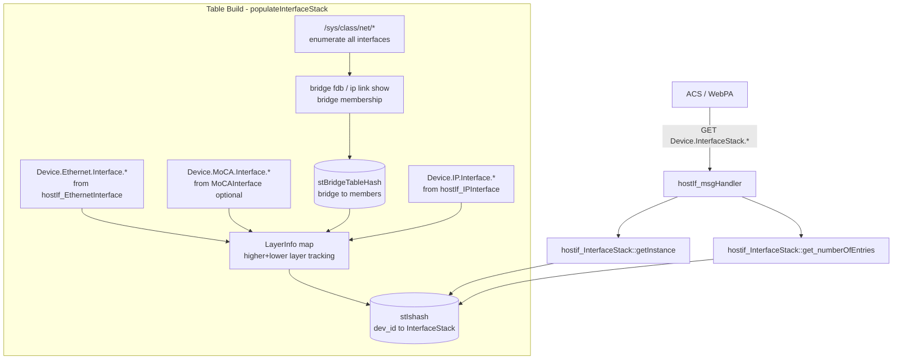

# InterfaceStack Profile

## Overview

The InterfaceStack profile implements the TR-181 `Device.InterfaceStack.{i}.*` object. This object provides a read-only table that describes the adjacency relationships between network interface layers — for example, how an IP interface sits on top of a bridge, which sits on top of a physical Ethernet or MoCA interface. The table is constructed dynamically by walking all Ethernet, MoCA, bridge, and IP interfaces present on the device and inferring their stacking relationships from Linux bridge device memberships.

This profile is guarded by the `USE_INTFSTACK_PROFILE` build flag. When the flag is not defined, the entire implementation is excluded from the build.

---

## Directory Structure

```
src/hostif/profiles/InterfaceStack/
├── Device_InterfaceStack.cpp  # Full implementation (889 lines)
├── Device_InterfaceStack.h    # Class declaration
└── Makefile.am
```

> **Note**: There is no `gtest/` subdirectory. The InterfaceStack profile has no unit tests.

---

## Architecture



---

## TR-181 Parameter Coverage

| Parameter | GET | Description |
|-----------|-----|-------------|
| `Device.InterfaceStack.{i}.HigherLayer` | ✅ | TR-181 path of the upper interface (e.g., `Device.IP.Interface.1`) |
| `Device.InterfaceStack.{i}.LowerLayer` | ✅ | TR-181 path of the lower interface (e.g., `Device.Ethernet.Interface.1`) |
| `Device.InterfaceStackNumberOfEntries` | ✅ | Count of rows in the table |

---

## How the Table is Built

The implementation builds the `stIshash` table by executing these steps in order:

### Step 1 — Build the bridge table

The daemon reads `/sys/class/net/*/brif/` (or executes `ip link show type bridge`) to discover all bridge interfaces and their member ports. The result is stored in `stBridgeTableHash`:

```
Bridge "hnbr0" → members: {"bcm0", "eth1"}
```

### Step 2 — Build lower-layer entries for physical interfaces

For every `Device.Ethernet.Interface.{i}`, a layer-info entry `(lower = "Device.Ethernet.Interface.N", higher = "")` is created. If MoCA is enabled (`USE_MoCA_PROFILE`), the same is done for `Device.MoCA.Interface.{i}`.

### Step 3 — Process bridges

For each bridge and each bridge member:
- The bridge entry gets `lower = "Device.Bridging.Bridge.N.Port.M"` added
- The member interface's entry gets `higher = "Device.Bridging.Bridge.N.Port.M"` added

### Step 4 — Fill remaining higher layers from IP interfaces

For any interface entry that still has an empty `higher` value, the daemon looks for a `Device.IP.Interface.{i}` whose `LowerLayers` parameter references it.

### Step 5 — Create instances

For each `(higherLayer, lowerLayer)` pair in the layer map, a new `hostif_InterfaceStack` instance is created and inserted into `stIshash`.

### Example Output

Given:
```
Physical: bcm0 (Device.Ethernet.Interface.1), eth1 (Device.MoCA.Interface.1)
Bridge:   hnbr0 bridges {bcm0, eth1}
IP:       eth0 (Device.IP.Interface.1) directly on eth1
```

The resulting `InterfaceStack.*` entries are:

| Instance | HigherLayer | LowerLayer |
|----------|-------------|-----------|
| 1 | `Device.Bridging.Bridge.1.Port.1` | `Device.Ethernet.Interface.1` |
| 2 | `Device.Bridging.Bridge.1.Port.1` | `Device.MoCA.Interface.1` |
| 3 | `Device.IP.Interface.1` | `Device.Bridging.Bridge.1.Port.1` |

---

## Change Detection

`get_Device_InterfaceStack_HigherLayer()` and `get_Device_InterfaceStack_LowerLayer()` use the standard backup pattern:
- `bCalledHigherLayer` / `bCalledLowerLayer` flags
- `backupHigherLayer` / `backupLowerLayer` arrays
- `*pChanged = true` if value differs from backup

---

## Error Handling

| Condition | Behavior |
|-----------|----------|
| `USE_INTFSTACK_PROFILE` not defined | Entire implementation compiled out |
| `/sys/class/net` not readable | Logs error, `stIshash` stays empty, `numberOfEntries = 0` |
| Bridge table build fails | Continues without bridge entries |
| No matching IP interface for LowerLayer | `HigherLayer` left empty in that entry |

---

## Known Issues and Gaps

### Gap 1 — High: `getLock()` calls `g_mutex_init()` on every invocation

**File**: `Device_InterfaceStack.cpp`

**Observation**: Several GLib-based profile classes in this codebase share the same pattern:

```cpp
void hostif_InterfaceStack::getLock() {
    g_mutex_init(&stMutex);   // BUG: re-initializes on every call
    g_mutex_lock(&stMutex);
}
```

Calling `g_mutex_init()` on a mutex that is already locked (by another thread calling `getLock()`) is undefined behavior per GLib documentation.

**Recommended fix**: Initialize `stMutex` once at startup via `G_MUTEX_INIT` or within `populateInterfaceStack()`.

---

### Gap 2 — High: Table rebuild does not invalidate existing GET requests in flight

**File**: `Device_InterfaceStack.cpp`

**Observation**: When `populateInterfaceStack()` is called (e.g., due to an interface change event), it calls `closeAllInstances()` to delete all existing `hostif_InterfaceStack` objects and then rebuilds the hash from scratch. Any GET request that obtained a pointer to an existing instance via `getInstance()` before the rebuild will hold a dangling pointer after `closeAllInstances()` returns.

**Impact**: Crash or memory corruption if an interface-change event coincides with a GET request.

**Recommended fix**: Use reference counting or a read-write lock to protect the lifetime of all accessed instances.

---

### Gap 3 — Medium: Entire profile disabled when `USE_INTFSTACK_PROFILE` is not set

**Observation**: The complete `.cpp` file `Device_InterfaceStack.cpp` is wrapped in:

```cpp
#ifdef USE_INTFSTACK_PROFILE
...
#endif
```

This means any `Device.InterfaceStack.*` GET request returns `NOT_HANDLED` without any diagnostic log. ACS receives no indication whether the parameter is unsupported or absent.

---

### Gap 4 — Medium: Bridge membership detection depends on `ip link show` subprocess

**Observation**: Some code paths use `v_secure_popen("r", "ip link show type bridge ...")` to discover bridges. On embedded targets where `iproute2` is not in PATH or the kernel lacks bridge netlink support, the bridge table remains empty and all bridge-based stacking entries are missing.

**Recommended fix**: Read bridge membership directly from `/sys/class/net/*/brif/` directory entries, which does not require spawning a subprocess.

---

### Gap 5 — Low: No unit tests

**Observation**: There is no `gtest/` directory. The table-building algorithm, which involves multiple cross-product joins between Ethernet, MoCA, bridge, and IP interface sets, has no automated verification. Regressions in the stacking logic are difficult to detect.

---

## Testing

There are no unit tests currently. When adding tests:
1. Mock `/sys/class/net/` with a virtual filesystem with known bridge and interface configurations.
2. Verify `numberOfEntries` matches the expected stacking graph.
3. Test with bridges containing multiple members.
4. Test with MoCA enabled (`USE_MoCA_PROFILE`) and disabled.

---

## See Also

- [Ethernet Profile README](../../Ethernet/docs/README.md) — Provides lower-layer entries
- [IP Profile README](../../IP/docs/README.md) — Provides higher-layer entries
- [moca Profile README](../../moca/docs/README.md) — Optional MoCA lower layers
- [src/hostif/docs/README.md](../../../docs/README.md) — Core daemon overview
