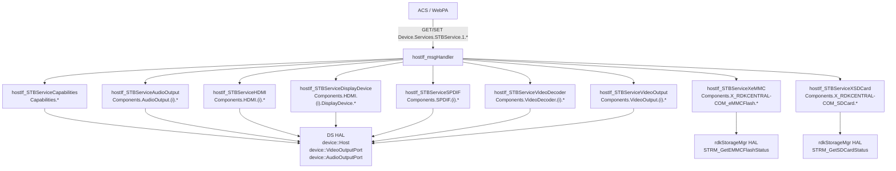
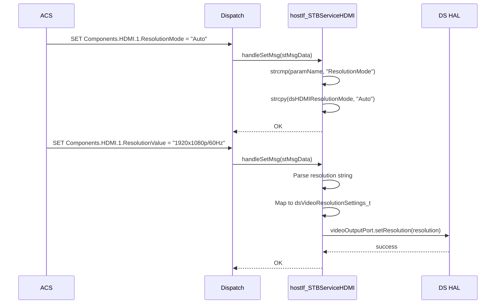
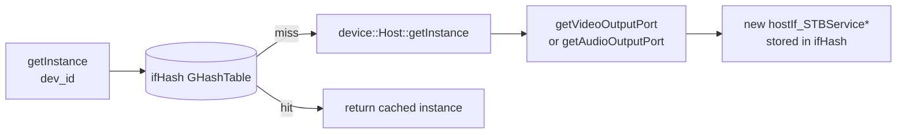

# STBService Profile

## Overview

The STBService profile implements the TR-135 (Set-top Box Service) object tree `Device.Services.STBService.1.*`. It exposes AV capabilities, output port state, and hardware health metrics of an RDK set-top box to TR-069 ACS and WebPA.

Current state is mixed:
- Most component handlers still access hardware through the RDK Device Settings (DS) HAL (`libdshal`) using `device::Host`, `device::VideoOutputPort`, `device::AudioOutputPort`, and related classes.
- Migration target is Thunder JSON-RPC plugin integration for STBService component reads and writes while preserving TR-69 request/response semantics.
- SD card and eMMC health data continue to use `rdkStorageMgr` HAL and are out of scope for Thunder migration in this contract change.

See `thunder-migration-mapping.md` for component-to-plugin mapping, method candidates, and known no-equivalent gaps.

---

## Directory Structure

```
src/hostif/profiles/STBService/
├── Capabilities.cpp             # STBService.1.Capabilities.*
├── Capabilities.h
├── Components_AudioOutput.cpp   # STBService.1.Components.AudioOutput.{i}.*
├── Components_AudioOutput.h
├── Components_DisplayDevice.cpp # STBService.1.Components.HDMI.{i}.DisplayDevice.*
├── Components_DisplayDevice.h
├── Components_HDMI.cpp          # STBService.1.Components.HDMI.{i}.*
├── Components_HDMI.h
├── Components_SPDIF.cpp         # STBService.1.Components.SPDIF.{i}.*
├── Components_SPDIF.h
├── Components_VideoDecoder.cpp  # STBService.1.Components.VideoDecoder.{i}.*
├── Components_VideoDecoder.h
├── Components_VideoOutput.cpp   # STBService.1.Components.VideoOutput.{i}.*
├── Components_VideoOutput.h
├── Components_XrdkEMMC.cpp      # X_RDKCENTRAL-COM_eMMCFlash.*
├── Components_XrdkEMMC.h
├── Components_XrdkSDCard.cpp    # X_RDKCENTRAL-COM_SDCard.*
├── Components_XrdkSDCard.h
└── Makefile.am
```

> **Note**: There is no `gtest/` subdirectory. The STBService profile has no unit tests.

---

## Architecture



---

## Thunder Migration Contract Notes

The STBService contract migration aligns component domains to Thunder plugin ownership:

- `org.rdk.DisplaySettings`: AudioOutput, SPDIF, HDMI, and port-oriented VideoOutput operations
- `org.rdk.AVOutput`: TV-wide picture/display mode operations where parameters are not port-scoped
- `org.rdk.DisplayInfo`: Display connection and resolution state (`connected`, `width`, `height`, HDR/HDCP-related display info)
- `org.rdk.HdcpProfile`: HDCP status and version/compliance state
- `org.rdk.PowerManager`: Power state controls and status for decoder/power-related behavior

Instance lifecycle expectations:

- Port-based components (for example AudioOutput, SPDIF, HDMI/VideoOutput) should enumerate ports from Thunder and create one instance per discovered port.
- Non-port domains should expose a single logical instance.

For unresolved parameter mappings, handlers must return explicit fault outcomes rather than silently falling back to stale values.

---

## TR-181/TR-135 Parameter Coverage

### `STBService.1.Capabilities`

| Parameter | GET | Source |
|-----------|-----|--------|
| `VideoDecoder.VideoStandards` | ✅ | DS HAL — HEVC, H264, MPEG2 support flags |
| `VideoDecoder.HEVC.ProfileLevel.{i}.*` | ✅ | Enumerated from DS capability list |
| `AudioStandards` | ✅ | DS HAL audio capability flags |
| `HDMI.SupportedResolutions.{i}.*` | ✅ | DS HAL supported resolution list |

### `STBService.1.Components.HDMI.{i}`

| Parameter | GET | SET | Source |
|-----------|-----|-----|--------|
| `Enable` | ✅ | ✅ | DS HAL `videoOutputPort.isEnabled()` |
| `Status` | ✅ | ❌ | DS HAL connection status |
| `Name` | ✅ | ❌ | Port name string |
| `ResolutionMode` | ✅ | ✅ | "Auto" or "Manual" — `dsHDMIResolutionMode` |
| `ResolutionValue` | ✅ | ✅ | DS resolution objects (720p, 1080p, 4K, etc.) |
| `DisplayDevice.*` | ✅ | ❌ | DS HAL connected display device info |

Supported resolutions (via `dsVideoPixelResolutionMapper`): 720×480, 720×576, 1280×720, 1920×1080, 3840×2160.

### `STBService.1.Components.AudioOutput.{i}`

| Parameter | GET | SET | Source |
|-----------|-----|-----|--------|
| `Enable` | ✅ | ✅ | DS HAL `audioOutputPort.setEnable()` |
| `Status` | ✅ | ❌ | DS HAL `audioOutputPort.isEnabled()` |
| `AudioFormat` | ✅ | ❌ | HDMI/SPDIF audio coding type |
| `AudioLevel` | ✅ | ✅ | Gain/level in dB |
| `Alias` | ✅ | ❌ | Port name from DS HAL |
| `CompressionLevel` | ✅ | ✅ | Audio compression setting |
| `AudioDelay` | ✅ | ✅ | Delay in ms |

### `STBService.1.Components.SPDIF.{i}`

| Parameter | GET | SET | Source |
|-----------|-----|-----|--------|
| `Enable` | ✅ | ✅ | DS HAL |
| `Status` | ✅ | ❌ | DS HAL |
| `ForceEnable` | ✅ | ✅ | Force stereo PCM override |
| `AudioFormat` | ✅ | ❌ | Auto/PCM/AC3 |
| `AudioDelay` | ✅ | ✅ | Delay in ms |

### `STBService.1.Components.VideoDecoder.{i}`

| Parameter | GET | SET | Source |
|-----------|-----|-----|--------|
| `Enable` | ✅ | ❌ | DS HAL video decoder state |
| `Status` | ✅ | ❌ | DS HAL |
| `ContentAR` | ✅ | ❌ | Current display aspect ratio |
| `VideoStandards` | ✅ | ❌ | Supported formats string |

### `STBService.1.Components.VideoOutput.{i}`

| Parameter | GET | SET | Source |
|-----------|-----|-----|--------|
| `Enable` | ✅ | ✅ | DS HAL video output port enable |
| `Status` | ✅ | ❌ | DS HAL |
| `VideoFormat` | ✅ | ❌ | Pixel format string |
| `AspectRatio` | ✅ | ✅ | DS HAL aspect ratio |
| `HDCP` | ✅ | ❌ | DS HAL HDCP encryption state |

### `STBService.1.Components.X_RDKCENTRAL-COM_eMMCFlash.*`

| Parameter | GET | Source |
|-----------|-----|--------|
| `Capacity` | ✅ | `STRM_GetEMMCFlashStatus()` |
| `LifeElapsedA`, `LifeElapsedB` | ✅ | eMMC health registers via rdkStorageMgr |
| `PreEOLState*` | ✅ | Pre-EOL state for system/EUDA/MLC areas |
| `LotID`, `Manufacturer`, `Model`, `SerialNumber` | ✅ | HAL fields |
| `ReadOnly`, `TSBQualified` | ✅ | Boolean flags |

### `STBService.1.Components.X_RDKCENTRAL-COM_SDCard.*`

| Parameter | GET | Source |
|-----------|-----|--------|
| `Capacity`, `LifeElapsed` | ✅ | `STRM_GetSDCardStatus()` |
| `CardFailed`, `ReadOnly`, `Status` | ✅ | rdkStorageMgr flags |
| `LotID`, `Manufacturer`, `Model`, `SerialNumber` | ✅ | HAL fields |

---

## How Operations Work

### HDMI Resolution Mode SET Flow



### Instance Lifecycle

Each STBService class uses `device::Host::getInstance()` to access the DS HAL device tree:



If the DS HAL throws `device::IllegalArgumentException` (e.g., port index out of range), the constructor catches it and returns `NULL` from `getInstance()`.

---

## Error Handling

| Condition | Behavior |
|-----------|----------|
| DS HAL throws `device::IllegalArgumentException` | Caught in `getInstance()`; no instance created; GET returns `NOT_HANDLED` |
| DS HAL throws `device::Exception` | Caught, logs code and message, returns `NOK` |
| DS HAL throws `dsError_t` | Caught, logs error code, returns `NOK` |
| `rdkStorageMgr` HAL not available | Returns `NOK`; paramValue empty |
| DS HAL not initialized | Typically throws and is caught |

---

## Known Issues and Gaps

### Gap 1 — High: `getLock()` calls `g_mutex_init()` on every invocation (multiple classes)

**File**: `Components_HDMI.cpp`, `Components_AudioOutput.cpp`, `Components_VideoOutput.cpp`, and others

**Observation**: All STBService classes use the same pattern:

```cpp
void hostIf_STBServiceHDMI::getLock()
{
    g_mutex_init(&hostIf_STBServiceHDMI::m_mutex);  // re-initialize on every call
    g_mutex_lock(&hostIf_STBServiceHDMI::m_mutex);
}
```

This is undefined behavior when the mutex is already locked by another thread.

**Impact**: Potential deadlock or mutex corruption under concurrent GET/SET access to any STBService component.

---

### Gap 2 — High: No unit tests for any STBService component

**Observation**: The entire `STBService/` directory has no `gtest/` subdirectory. The profile has 12 source files spanning 5,369 lines of C++ with complex DS HAL interactions and no automated test coverage. DS HAL failures that return silently (logging only) may go undetected for extended periods.

---

### Gap 3 — Medium: `dsHDMIResolutionMode` is a class-level static `char[10]` shared across all HDMI instances

**File**: `Components_HDMI.h`

**Observation**:

```cpp
static char dsHDMIResolutionMode[10];
```

All `hostIf_STBServiceHDMI` instances (multiple HDMI ports) share one `dsHDMIResolutionMode` value. Setting the mode on HDMI port 1 immediately affects the mode reported by HDMI port 2, even if the hardware supports different modes per port.

---

### Gap 4 — Medium: Resolution frame rate mapping is incomplete

**File**: `Components_HDMI.cpp`

**Observation**: `dsVideoFrameRateMapper` maps frame rates 24, 25, 30, 50, 60, 23.98, 29.97, and 59.94. Uncommon rates used by some cable standards (e.g., 120 Hz, 144 Hz) are not listed. When the DS HAL returns an unmapped frame rate, `getStringFromEnum()` returns `NULL` and the returned `ResolutionValue` string is malformed.

---

### Gap 5 — Medium: eMMC and SD card health data returned without error if HAL returns zero values

**File**: `Components_XrdkEMMC.cpp`, `Components_XrdkSDCard.cpp`

**Observation**: If `STRM_GetEMMCFlashStatus()` or `STRM_GetSDCardStatus()` returns `MSRM_SUCCESS` but populates fields with zero values (device not present or HAL stub), the handlers return the zero values as valid data without distinguishing "device not present" from "device present but all meters at zero". ACS has no way to know whether the eMMC/SD card exists.

---

### Gap 6 — Low: Capabilities VideoStandards string is built by concatenating all supported format names

**File**: `Capabilities.cpp`

**Observation**: `VideoDecoder.VideoStandards` is a comma-separated string built by iterating all DS HAL video capability flags. The string length is not bounded. If a future platform adds many new standards, the result could exceed `TR69HOSTIFMGR_MAX_PARAM_LEN` (4 KB) and be silently truncated.

---

## Testing

There are currently no unit tests. When adding coverage:
1. Mock the DS HAL (`device::Host::getInstance()`) using a stub/fake.
2. Verify HDMI resolution SET correctly maps string values to `dsVideoResolutionSettings_t`.
3. Verify AudioOutput level SET/GET round-trip.
4. Test eMMC/SD card health parameter parsing from mock `rdkStorageMgr` responses.

---

## Platform Notes

### DS HAL Dependency

All AV component parameters require the DS HAL dynamic library (`libdshal.so`) at runtime. On RDK devices, this library is provided by the platform vendor. On emulators or headless builds:
- `device::Host::getInstance()` may throw on its first call
- All STBService GETs return `NOT_HANDLED`

### Build Guard

The STBService profile is always compiled but the DS HAL headers and library must be available at build time. The `ENABLE_TILE` flag controls Bluetooth LE beacon detection (used by `XrdkBlueTooth` in DeviceInfo, not directly in STBService).

---

## See Also

- [DeviceInfo/docs/README.md](../../DeviceInfo/docs/README.md) — Bluetooth (XrdkBlueTooth) lives there
- [StorageService/docs/README.md](../../StorageService/docs/README.md) — USB/HDD storage (different from eMMC/SD)
- [src/hostif/docs/README.md](../../../docs/README.md) — Core daemon overview
