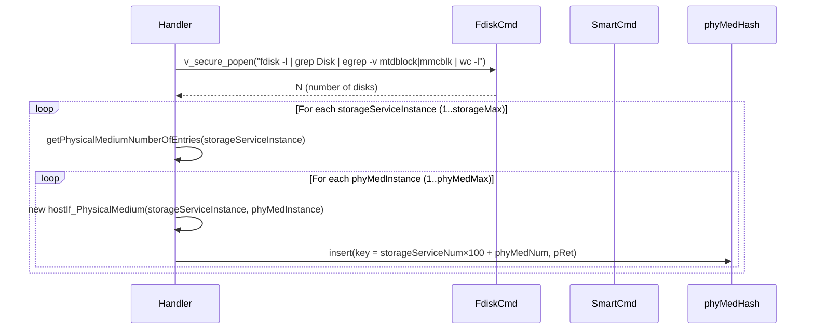
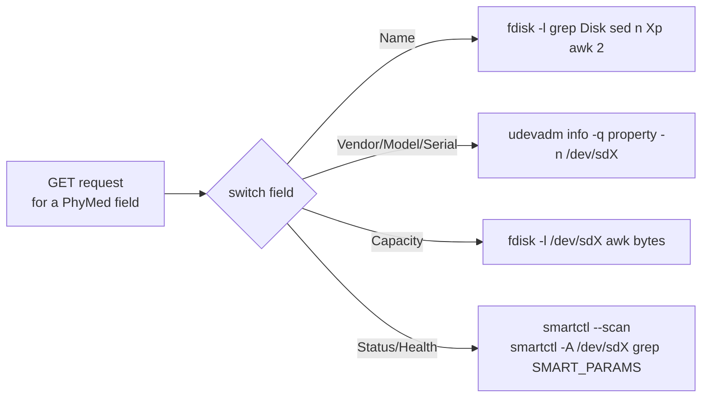

# StorageService Profile

## Overview

The StorageService profile implements the TR-140 (Storage Service) based `Device.StorageService.{i}.*` object tree. It exposes attached physical storage media — external USB drives and SATA hard disks — to TR-069 ACS management, including vendor, model, serial number, capacity, connection type, and health diagnostics obtained via `smartctl`. Storage media enumeration uses `fdisk -l` filtered for non-MTD, non-eMMC devices.

---

## Directory Structure

```
src/hostif/profiles/StorageService/
├── Service_Storage.cpp         # StorageService object (instance container)
├── Service_Storage.h
├── Service_Storage_PhyMedium.cpp # Physical medium detail (655 lines)
├── Service_Storage_PhyMedium.h
└── Makefile.am
```

> **Note**: There is no `gtest/` subdirectory. The StorageService profile has no unit tests.

---

## Architecture

```mermaid
graph TB
    ACS[ACS / WebPA] -->|GET Device.StorageService.*| DISP[hostIf_msgHandler]
    DISP --> SS[hostIf_StorageSrvc\nDevice.StorageService.{i}]
    DISP --> PM[hostIf_PhysicalMedium\nDevice.StorageService.{i}.PhysicalMedium.{j}]

    SS --> FDISK1[fdisk -l grep Disk wc -l\nPhysicalMediumNumberOfEntries]
    PM --> FDISK2[fdisk -l grep Disk sed -n Np awk '$2'\ndisk device path /dev/sdX]
    PM --> SMARTCTL[smartctl --scan\nsmartctl -A /dev/sdX SMART attrs]
    PM --> UDEV[udevadm info\nvendor, model, serial number]
    PM --> FDISK3[fdisk -l /dev/sdX\ncapacity in bytes]

    subgraph HashKey[Instance Key: storageServiceNum×100 + phyMedNum]
        PHASH[(phyMedHash GHashTable)]
    end
    PM --> HashKey
```

---

## TR-181 Parameter Coverage

### `Device.StorageService.{i}` (container)

| Parameter | GET | SET | Source |
|-----------|-----|-----|--------|
| `Alias` | ✅ | ❌ | Constructed from dev_id |
| `Enable` | ✅ | ❌ | Hardcoded `true` |
| `PhysicalMediumNumberOfEntries` | ✅ | ❌ | `fdisk -l \| grep Disk \| egrep -v "mtdblock\|mmcblk" \| wc -l` |

### `Device.StorageService.{i}.PhysicalMedium.{j}`

| Parameter | GET | SET | Source |
|-----------|-----|-----|--------|
| `Alias` | ✅ | ❌ | Constructed from dev_id |
| `Name` | ✅ | ❌ | `/dev/sdX` path from `fdisk -l` |
| `Vendor` | ✅ | ❌ | `udevadm info` |
| `Model` | ✅ | ❌ | `udevadm info` |
| `SerialNumber` | ✅ | ❌ | `udevadm info` |
| `FirmwareVersion` | ✅ | ❌ | `udevadm info` |
| `ConnectionType` | ✅ | ❌ | "USB" or "SATA" from `udevadm` bus path |
| `Removable` | ✅ | ❌ | SCSI query or USB indicator |
| `Capacity` | ✅ | ❌ | `fdisk -l /dev/sdX` total bytes |
| `Status` | ✅ | ❌ | SMART overall health assessment |
| `Health` | ✅ | ❌ | SMART raw attribute check (see below) |

---

## How Operations Work

### Instance Enumeration and Hash Building

`hostIf_PhysicalMedium::rebuildHash()` orchestrates the full discovery:



The instance key encoding `(storageServiceInstanceNumber * 100) + dev_id` allows up to 99 physical media per storage service instance.

### Physical Medium Field Retrieval

Each GET parameter triggers a dedicated subprocess:



### SMART Health Check

The health check reads these SMART attributes (defined in `STORAGE_PHYMED_SMARTPARAMS`):

```
Raw_Read_Error_Rate
Reported_Uncorrect
Airflow_Temperature_Cel
G-Sense_Error_Rate
Reallocated_Sector_Ct
Temperature_Celsius
```

If any attribute's raw value (column 9 of `smartctl -A` output) exceeds its threshold, the medium is reported as `PHYMED_HEALTH_FAILING`; otherwise `PHYMED_HEALTH_OK`.

---

## Error/Health Code Mapping

| Code | Meaning |
|------|---------|
| `PHYMED_HEALTH_OK (101)` | All SMART attributes within threshold |
| `PHYMED_HEALTH_FAILING (102)` | At least one SMART attribute exceeded |
| `PHYMED_HEALTH_ERROR (103)` | `smartctl` command execution failed |
| `PHYMED_HEALTH_INVALID (100)` | Device not found or unknown state |

---

## Known Issues and Gaps

### Gap 1 — High: Instance hash key encoding limits instances to 99 physical media per storage service

**File**: `Service_Storage_PhyMedium.cpp`

**Observation**: The hash key is computed as:

```cpp
g_hash_table_insert(phyMedHash,
    (gpointer)((storageServiceInstance * 100) + phyMedInstance), pRet);
```

If `storageServiceInstance > 1` and `phyMedInstance > 99`, the key has the same value as a different `(storageServiceInstance, phyMedInstance)` pair. More critically, `closeInstance()` removes by `pDev->dev_id` alone:

```cpp
g_hash_table_remove(phyMedHash, (gconstpointer)pDev->dev_id);
```

This removes the wrong entry: it looks up by `phyMedInstance` only, not by the full composite key.

**Impact**: `closeInstance()` removes the wrong hash entry, leaking the actual instance and leaving a dangling or incorrect instance in the hash.

**Recommended fix**: Store the composite key in the instance and use it in `closeInstance()`.

---

### Gap 2 — High: `getLock()` uses `g_mutex_new()` lazy initialization without synchronization

**File**: `Service_Storage_PhyMedium.cpp`

**Observation**:

```cpp
void hostIf_PhysicalMedium::getLock()
{
    if(!m_mutex)
    {
        m_mutex = g_mutex_new();
    }
    g_mutex_lock(m_mutex);
}
```

The check-and-create pattern is not atomic. Two threads can both observe `m_mutex == NULL` and both call `g_mutex_new()`, creating two separate mutexes. One is stored, the other is leaked, and the first caller's critical section is left unprotected.

---

### Gap 3 — Medium: Every GET spawns one or more `udevadm`/`fdisk`/`smartctl` subprocesses

**Observation**: There is no caching. Each GET call for `Vendor`, `Model`, `SerialNumber`, `Capacity`, or `Health` spawns a fresh subprocess. For a device with multiple attached drives, a simultaneous ACS bulk GET spawns many processes in rapid succession. `smartctl` is particularly slow (≥1 second per disk for full SMART scan).

**Impact**: An ACS bulk GET poll can block the parameter handler threads for multiple seconds and cause visible CPU spikes.

**Recommended fix**: Cache enumeration results with a configurable TTL (e.g., 30 seconds for static attributes like Model/SerialNumber, 5 minutes for SMART health).

---

### Gap 4 — Medium: SMART health check uses `egrep` with raw string concatenation

**File**: `Service_Storage_PhyMedium.cpp`

**Observation**:

```cpp
#define CMD_TO_CHECK_SMART_HEALTH "smartctl -A %s | egrep \"%s\" | awk 'BEGIN {ORS=\",\"} {print $9}'"
```

The `%s` format for both the device path and the SMART parameter list is used with `v_secure_popen`. The device path (`/dev/sdX`) is derived from `fdisk -l` output. If a disk device name contains special characters (e.g., spaces or shell metacharacters), this would become a shell injection vulnerability even with `v_secure_popen`, unless `v_secure_popen` strictly validates format arguments.

**Recommended fix**: Always validate that disk names match `/dev/sd[a-z][0-9]?` before using them in format strings.

---

### Gap 5 — Low: No unit tests

**Observation**: The StorageService profile has no `gtest/` subdirectory. The discovery logic (`rebuildHash`, SMART parsing, udevadm output parsing) has no automated coverage.

---

### Gap 6 — Low: `CMD_TO_GET_MED_NUM` and `CMD_TO_GET_MED_NAME` exclude `mmcblk` devices

**Observation**:

```cpp
#define CMD_TO_GET_MED_NUM "fdisk -l | grep Disk | egrep -v \"mtdblock|mmcblk\"| wc -l"
```

eMMC and SD cards (which show as `mmcblk*`) are excluded from this count. This is intentional to avoid double-counting devices already exposed by the STBService eMMC/SDCard profiles. However, if a device has an external USB eMMC reader that presents as `sdb`, it will be included and might be misclassified.

---

## Testing

There are currently no unit tests. When adding coverage:
1. Mock `v_secure_popen()` to return synthetic `fdisk -l` and `smartctl -A` output.
2. Test `rebuildHash()` with 0, 1, and multiple disk scenarios.
3. Test SMART health classification (FAILING vs OK vs ERROR).
4. Test hash key/removal correctness for the composite key.

---

## See Also

- [STBService/docs/README.md](../../STBService/docs/README.md) — eMMC and SD card health (via rdkStorageMgr)
- [src/hostif/docs/README.md](../../../docs/README.md) — Core daemon overview
