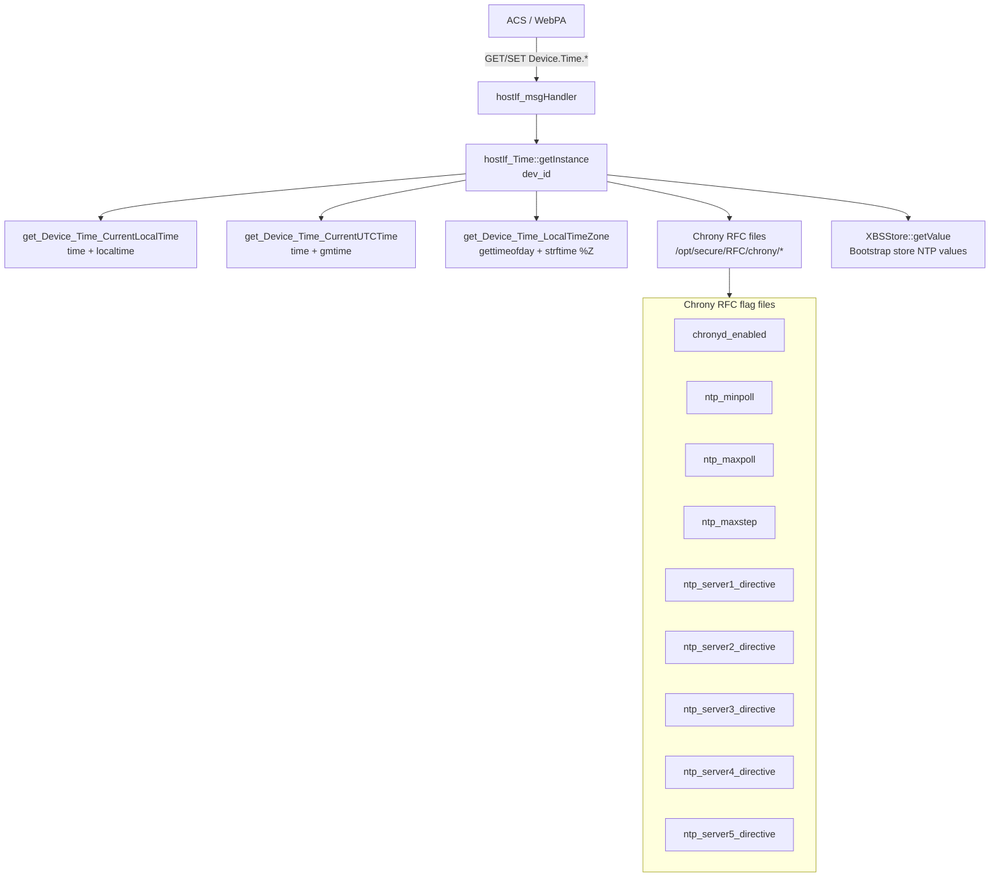
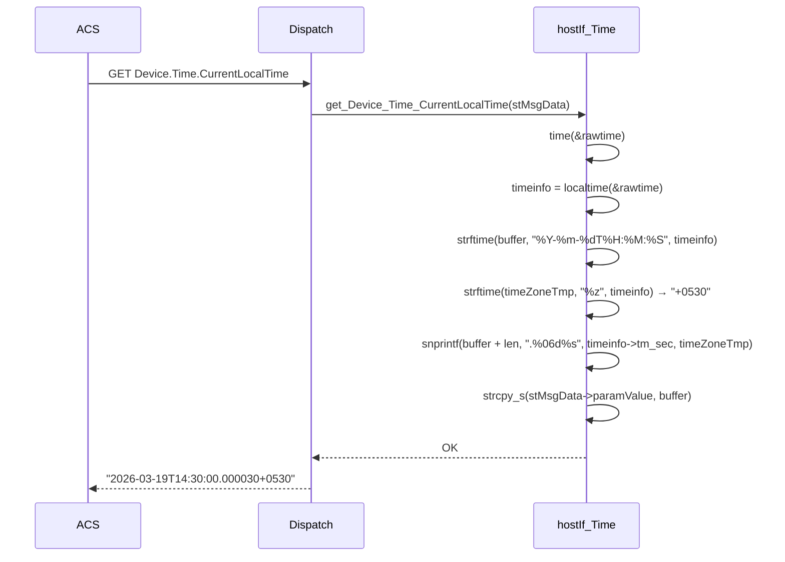
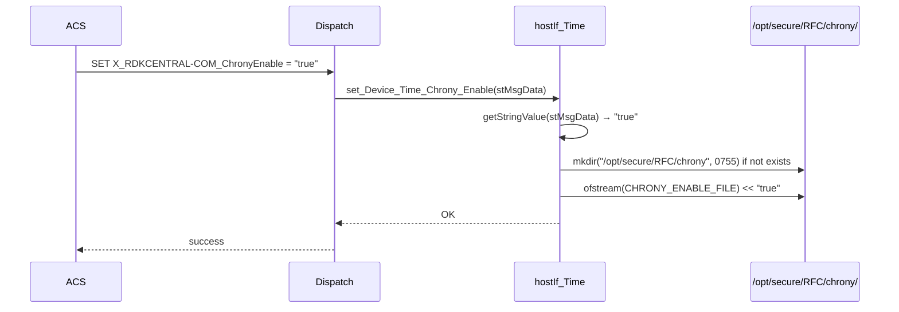

# Time Profile

## Overview

The Time profile implements the TR-181 `Device.Time.*` object. It provides GET and SET access to the system clock, local/UTC time, timezone, and the Chrony NTP client configuration through a set of RFC-controlled flag files under `/opt/secure/RFC/chrony/`. Standard TR-181 NTP server parameters (`NTPServer1`–`NTPServer5`, `Enable`, `Status`) are declared in the class but return `NOK` — active NTP server management is handled exclusively through the Chrony-specific extension parameters.

Bootstrap store integration via `XBSStore` allows ACS to read/write NTP configuration values that are partner-specific.

---

## Directory Structure

```
src/hostif/profiles/Time/
├── Device_Time.cpp   # Full implementation (640 lines)
├── Device_Time.h     # Class declaration with all parameter methods
├── Makefile.am
└── gtest/
    ├── gtest_time.cpp  # Unit tests (143 lines)
    └── Makefile.am
```

---

## Architecture



---

## TR-181 Parameter Coverage

### Standard `Device.Time.*`

| Parameter | GET | SET | Notes |
|-----------|-----|-----|-------|
| `Enable` | ❌ (returns NOK) | ❌ (returns NOK) | Not implemented |
| `Status` | ❌ (returns NOK) | — | Not implemented |
| `NTPServer1` | ❌ (returns NOK) | ❌ (returns NOK) | Not implemented (see Gap 1) |
| `NTPServer2` | ❌ (returns NOK) | ❌ (returns NOK) | Not implemented |
| `NTPServer3` | ❌ (returns NOK) | ❌ (returns NOK) | Not implemented |
| `NTPServer4` | ❌ (returns NOK) | ❌ (returns NOK) | Not implemented |
| `NTPServer5` | ❌ (returns NOK) | ❌ (returns NOK) | Not implemented |
| `CurrentLocalTime` | ✅ | — | `time` + `localtime` + `strftime` |
| `CurrentUTCTime` | ✅ | — | `time` + `gmtime` + `strftime` |
| `LocalTimeZone` | ✅ | ❌ (returns NOK) | `%Z` from `strftime` |
| `LocalTimeZoneName` | ❌ | ❌ | Not implemented |

### RDK-Specific Chrony Extension Parameters

All values stored in `/opt/secure/RFC/chrony/` flag files:

| Parameter | GET | SET | Flag File |
|-----------|-----|-----|-----------|
| `X_RDKCENTRAL-COM_ChronyEnable` | ✅ | ✅ | `chronyd_enabled` (existence check) |
| `X_RDKCENTRAL-COM_NTPMinpoll` | ✅ | ✅ | `ntp_minpoll` (integer 4–24) |
| `X_RDKCENTRAL-COM_NTPMaxpoll` | ✅ | ✅ | `ntp_maxpoll` (integer 4–24) |
| `X_RDKCENTRAL-COM_NTPMaxstep` | ✅ | ✅ | `ntp_maxstep` (float,retries e.g. "1.0,3") |
| `X_RDKCENTRAL-COM_NTPServer1Directive` | ✅ | ✅ | `ntp_server1_directive` ("server"/"pool"/"peer") |
| `X_RDKCENTRAL-COM_NTPServer2Directive` | ✅ | ✅ | `ntp_server2_directive` |
| `X_RDKCENTRAL-COM_NTPServer3Directive` | ✅ | ✅ | `ntp_server3_directive` |
| `X_RDKCENTRAL-COM_NTPServer4Directive` | ✅ | ✅ | `ntp_server4_directive` |
| `X_RDKCENTRAL-COM_NTPServer5Directive` | ✅ | ✅ | `ntp_server5_directive` |

### Bootstrap Store Parameters

Parameters prefixed with `Device.Time.X_RDKCENTRAL-COM_xBSS.*` or similar (partner-specific) are routed through `XBSStore::getValue` and `XBSStore::overrideValue`. These include NTP server URL defaults from `partners_defaults.json`.

---

## How Operations Work

### GET CurrentLocalTime



### SET Chrony Enable Flow



For `ChronyEnable = "false"`: The flag file is removed with `std::remove()`. Chrony daemon reads the flag file presence on restart.

### NTP Poll Interval SET Validation

`set_Device_Time_NTPMinpoll()` and `set_Device_Time_NTPMaxpoll()` validate that the integer is in the NTP-allowed power-of-2 exponent range [4, 24]:

```cpp
int minpoll = atoi(minpollStr.c_str());
if (minpoll < 4 || minpoll > 24) {
    return NOK;  // Invalid range
}
```

---

## Change Detection

`CurrentLocalTime`, `CurrentUTCTime`, and `LocalTimeZone` use the standard backup pattern:
- `bCalledCurrentLocalTime`, `bCalledCurrentUTCTime`, `bCalledLocalTimeZone` flags
- `backupCurrentLocalTime`, `backupCurrentUTCTime`, `backupLocalTimeZone` arrays
- `*pChanged = true` when the formatted time string differs from backup

Since `CurrentLocalTime` changes every second, the notification system will fire on every poll update cycle.

---

## Error Handling

| Condition | Behavior |
|-----------|----------|
| `NTPServer1`–`NTPServer5` GET called | Returns `NOK` unconditionally |
| `Enable`, `Status` GET called | Returns `NOK` unconditionally |
| Chrony directory creation fails | Logs error, returns `NOK` |
| Chrony flag file open fails | Logs error, returns `NOK` |
| `std::remove()` fails (not ENOENT) | Logs warning, returns `OK` (best-effort) |
| NTP poll value out of range [4,24] | Logs error, returns `NOK` |
| `ERR_CHK(rc)` on `strcpy_s` failure | Logs internally; does not return `NOK` |

---

## Known Issues and Gaps

### Gap 1 — Critical: Standard TR-181 `NTPServer1`–`NTPServer5` GET and SET both return `NOK`

**File**: `Device_Time.cpp`

**Observation**:

```cpp
int hostIf_Time::get_Device_Time_NTPServer1(HOSTIF_MsgData_t *, bool *pChanged) { return NOK; }
int hostIf_Time::set_Device_Time_NTPServer1(HOSTIF_MsgData_t* stMsgData)       { return NOK; }
// ... same for NTPServer2 through NTPServer5
```

All five standard TR-181 NTP server parameters are declared in the class but never implemented. Any ACS that follows the TR-181 standard and tries to read or configure NTP servers via `Device.Time.NTPServer*` receives an error response. The only supported path is the RDK-specific Chrony extension `NTPServerNDirective` parameters.

**Impact**: ACS systems that use the standard TR-181 `Device.Time.NTPServer*` parameters cannot manage the device's NTP configuration. Only ACS systems that are specifically aware of the RDK Chrony extension parameters can manage NTP.

---

### Gap 2 — High: `getLock()` calls `g_mutex_init()` on every invocation

**File**: `Device_Time.cpp`

**Observation**:

```cpp
void hostIf_Time::getLock()
{
    g_mutex_init(&hostIf_Time::m_mutex);  // re-initializes on every call
    g_mutex_lock(&hostIf_Time::m_mutex);
}
```

Re-initializing an already-initialized and possibly locked mutex is undefined behavior. See the same gap described in the Ethernet, STBService, and InterfaceStack profiles.

---

### Gap 3 — High: `get_Device_Time_CurrentLocalTime` appends `tm_sec` instead of microseconds

**File**: `Device_Time.cpp`

**Observation**:

```cpp
strftime(buffer, _BUF_LEN_64-1, "%Y-%m-%dT%H:%M:%S", timeinfo);
snprintf(buffer + strlen(buffer), (sizeof(buffer) - strlen(buffer)),
         ".%.6d%s", timeinfo->tm_sec, timeZoneTmp);
```

The format `".%.6d%s"` with `timeinfo->tm_sec` appends the current seconds (0–59) as a 6-digit zero-padded number after the decimal point. This produces values like `"2026-03-19T14:30:30.000030+0530"` — `30` microseconds when the actual intent was to show sub-second fractional time. The correct value is the microseconds field from `gettimeofday()` (`tv_usec`).

**Impact**: The fractional second in `CurrentLocalTime` is completely wrong. It ranges from `.000000` to `.000059` based on the current second, not the actual microsecond offset.

**Recommended fix**:
```cpp
struct timeval tv;
gettimeofday(&tv, NULL);
struct tm *timeinfo = localtime(&tv.tv_sec);
strftime(buffer, sizeof(buffer)-1, "%Y-%m-%dT%H:%M:%S", timeinfo);
snprintf(buffer + strlen(buffer), sizeof(buffer) - strlen(buffer),
         ".%06ld%s", (long)tv.tv_usec, timeZoneTmp);
```

---

### Gap 4 — Medium: Chrony configuration files do not directly reconfigure the running Chrony daemon

**File**: `Device_Time.cpp`

**Observation**: The SET handlers write values to flag files under `/opt/secure/RFC/chrony/`. These files are read by a separate script that regenerates the Chrony configuration file (`/etc/chrony/chrony.conf`). The daemon itself is not signaled or restarted after the SET operation. An ACS SET of `NTPMinpoll` is not applied until the next Chrony restart, which might not happen until the next reboot.

**Impact**: SET operations appear to succeed (return `OK`) but have no immediate effect on the running NTP synchronization behavior.

---

### Gap 5 — Medium: NTP poll validation range [4,24] deviates from the Chrony documentation

**Observation**: The NTP-recommended poll range per RFC 5905 and Chrony documentation is 4–17 (for a value where the actual poll interval is 2^N seconds). The code comment says `[4, 17]` but the actual validation allows up to 24:

```cpp
// Validate that minpollStr is a number in a valid range [4, 17] for NTP
int minpoll = atoi(minpollStr.c_str());
if (minpoll < 4 || minpoll > 24) {  // range in code is 4..24, not 4..17
```

The comment and the code disagree. Values 18–24 are accepted but result in poll intervals of 2^18 (3 days) to 2^24 (194 days), which are not practical NTP poll settings.

---

### Gap 6 — Low: `NTPMaxstep` SET does not validate the "float,retries" format

**Observation**: The `NTPMaxstep` parameter is expected to be in the format `"<float>,<int>"` (e.g., `"1.0,3"`). The SET handler writes the raw string to the flag file without validating the format. An invalid value like `"abc"` is silently written and would cause Chrony to fail parsing on restart.

---

## Testing

Unit tests are in `gtest/gtest_time.cpp` (143 lines). Run:

```bash
./run_ut.sh
```

Key test areas:
1. `CurrentLocalTime` format: verify the ISO 8601 format with timezone offset.
2. `LocalTimeZone`: verify abbreviation (e.g., "UTC", "EST") is returned.
3. Chrony enable: verify flag file creation and removal.
4. NTP poll validation: boundary tests at 3 (should fail), 4 (should pass), 24 (should pass), 25 (should fail).

---

## See Also

- [DeviceInfo/docs/README.md](../../DeviceInfo/docs/README.md) — XBSStore for NTP URL partner defaults
- [src/hostif/docs/README.md](../../../docs/README.md) — Core daemon overview
- [handlers/docs/README.md](../../../handlers/docs/README.md) — Dispatch layer
