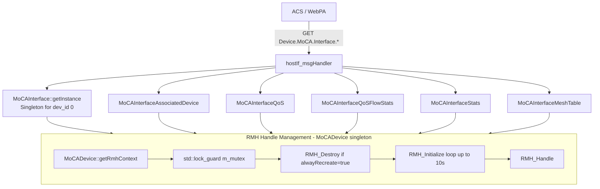
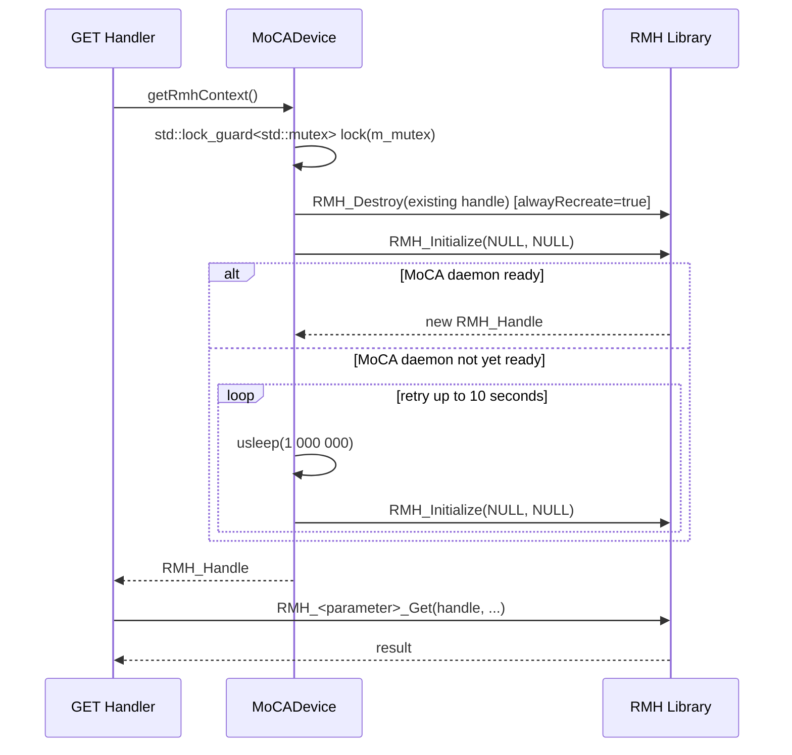

# MoCA Profile

## Overview

The MoCA (Multimedia over Coax Alliance) profile implements the TR-181 `Device.MoCA.Interface.{i}.*` object tree. It exposes the MoCA network state — node identity, PHY/MAC parameters, associated device table, QoS flow statistics, and the RDK unicast mesh rate table — through the RMH (RDK MoCA HAL) API (`rdk_moca_hal.h`). The profile uses a singleton `MoCADevice` to own the `RMH_Handle` and a singleton `MoCAInterface` for the TR-181 parameter handler, both backed by a `std::mutex`-protected RMH context.

---

## Directory Structure

```
src/hostif/profiles/moca/
├── Device_MoCA_Interface.cpp                      # Core interface (1,268 lines)
├── Device_MoCA_Interface.h                        # Classes MoCADevice + MoCAInterface
├── Device_MoCA_Interface_AssociatedDevice.cpp     # Associated node table
├── Device_MoCA_Interface_AssociatedDevice.h
├── Device_MoCA_Interface_QoS.cpp                  # QoS flow counts
├── Device_MoCA_Interface_QoS.h
├── Device_MoCA_Interface_QoS_FlowStats.cpp        # Per-flow statistics
├── Device_MoCA_Interface_QoS_FlowStats.h
├── Device_MoCA_Interface_Stats.cpp                # Interface throughput stats
├── Device_MoCA_Interface_Stats.h
├── Device_MoCA_Interface_X_RDKCENTRAL_COM_MeshTable.cpp  # Unicast PHY rate mesh
├── Device_MoCA_Interface_X_RDKCENTRAL_COM_MeshTable.h
└── Makefile.am
```

> **Note**: There is no `gtest/` subdirectory. The MoCA profile has no unit tests.

---

## Architecture



---

## TR-181 Parameter Coverage

### `Device.MoCA.Interface.{i}`

| Parameter | GET | Notes |
|-----------|-----|-------|
| `Enable` | ✅ | `RMH_Interface_GetEnabled` |
| `Status` | ✅ | `RMH_Network_GetStatus` → "Up"/"Down"/"Error" |
| `Alias` | ✅ | Constructed from dev_id |
| `Name` | ✅ | `RMH_Interface_GetName` |
| `LastChange` | ✅ | `RMH_Interface_GetLastChange` |
| `LowerLayers` | ✅ | Derived from interface name |
| `Upstream` | ✅ | Fixed `false` (MoCA is downstream) |
| `MACAddress` | ✅ | `RMH_Interface_GetMacAddress` |
| `FirmwareVersion` | ✅ | `RMH_Interface_GetFirmwareVersion` |
| `MaxBitRate` | ✅ | `RMH_Interface_GetMaxEgressBW` |
| `MaxIngressBW`, `MaxEgressBW` | ✅ | RMH BW queries |
| `HighestVersion`, `CurrentVersion` | ✅ | `RMH_Network_GetMoCAVersion` |
| `NetworkCoordinator` | ✅ | `RMH_Network_GetNCNodeId` |
| `NodeID` | ✅ | `RMH_Self_GetNodeId` |
| `BackupNC` | ✅ | `RMH_Network_GetBackupNCNodeId` |
| `PrivacyEnabledSetting`, `PrivacyEnabled` | ✅ | `RMH_Privacy_GetEnabled` |
| `CurrentOperFreq`, `LastOperFreq` | ✅ | `RMH_Network_GetRFChannelFreq` |
| `TxPowerLimit` | ✅ | `RMH_Power_GetTxPowerLimit` |
| `TxBcastRate` | ✅ | `RMH_Network_GetTxBroadcastPhyRate` |
| `AssociatedDeviceNumberOfEntries` | ✅ | `RMH_Network_GetAssociatedIds` |
| `X_RDKCENTRAL-COM_MeshTableNumberOfEntries` | ✅ | Computed: N² - N for N nodes |

### `Device.MoCA.Interface.{i}.AssociatedDevice.{j}`

| Parameter | GET |
|-----------|-----|
| `MACAddress` | ✅ |
| `NodeID` | ✅ |
| `IsPreferredNC` | ✅ |
| `PHYTxRate`, `PHYRxRate` | ✅ |
| `TxPowerControlReduction` | ✅ |
| `RxPowerLevel` | ✅ |
| `RxBcastPowerLevel`, `RxBcastRate` | ✅ |
| `PacketAggregationCapability` | ✅ |
| `RxSNR` | ✅ |
| `Active` | ✅ |

### `Device.MoCA.Interface.{i}.Stats`

All stats use `RMH_Stats_GetTx*` and `RMH_Stats_GetRx*`: BytesSent, BytesReceived, PacketsSent, PacketsReceived, ErrorsSent, ErrorsReceived, UnicastPackets, MulticastPackets, BroadcastPackets, Discards, UnknownProtoPackets.

### `Device.MoCA.Interface.{i}.X_RDKCENTRAL-COM_MeshTable.{j}`

| Parameter | GET |
|-----------|-----|
| `MeshTxNodeId` | ✅ |
| `MeshRxNodeId` | ✅ |
| `MeshPHYTxRate` | ✅ |

---

## How Operations Work

### RMH Handle Acquisition

Every GET operation calls `MoCADevice::getRmhContext()` to obtain an `RMH_Handle`. The current implementation unconditionally destroys and recreates the handle on every call:



### Associated Device Enumeration

`get_Associated_Device_NumberOfEntries()` calls `RMH_Network_GetAssociatedIds()` which returns a `RMH_NodeList_Uint32_t` bitmask. The code iterates all 16 possible node IDs and counts those with `nodePresent[nodeId] == true`.

### Mesh Table Calculation

`get_MoCA_Mesh_NumberOfEntries()` derives the entry count from the node count N using the formula `N² - N` (number of directed edges in a complete graph, excluding self-edges). This represents all possible unicast PHY rate pairs.

---

## Error Handling

| Condition | Behavior |
|-----------|----------|
| `RMH_Initialize` fails all retries | Returns `NULL` handle; all subsequent RMH calls skipped; GET returns `NOK` |
| `RMH_<param>_Get` returns non-SUCCESS | Logs error with `RMH_ResultToString(ret)`, returns `NOK` |
| `RMH_UNIMPLEMENTED` / `RMH_NOT_SUPPORTED` | Logs warning, continues; handle considered valid |
| `m_mutex == NULL` (lazy init) | `getLock()` calls `g_mutex_new()` — race condition (see Gap 2) |

---

## Known Issues and Gaps

### Gap 1 — Critical: `alwayRecreate = true` destroys and recreates the RMH handle on every GET request

**File**: `Device_MoCA_Interface.cpp` — `MoCADevice::getRmhContext()`

**Observation**:

```cpp
bool alwayRecreate = true; /* XITHREE-7905 */

if (alwayRecreate && rmhContext) {
    RMH_Destroy(rmhContext);
    rmhContext = NULL;
}
```

The workaround for JIRA issue XITHREE-7905 unconditionally destroys and recreates the RMH handle before every use. `RMH_Destroy` tears down the MoCA HAL connection, and `RMH_Initialize` re-establishes it. When MoCA is ready, this adds significant latency (HAL init overhead) to every single GET request. When MoCA is slow to respond, it may block up to 10 seconds with `usleep(1 000 000)` retry loops — holding `m_mutex` the entire time.

**Impact**: 
- Every MoCA parameter GET takes at minimum the HAL init round-trip time.
- During MoCA network join (slow path), a single GET can block for up to 10 seconds.
- The `m_mutex` is held during the entire blocking retry loop, serializing all other MoCA requests.

---

### Gap 2 — High: `getLock()` uses `g_mutex_new()` lazy initialization without synchronization

**File**: `Device_MoCA_Interface.cpp`

**Observation**:

```cpp
void MoCAInterface::getLock()
{
    if(!m_mutex)
    {
        m_mutex = g_mutex_new();
    }
    g_mutex_lock(m_mutex);
}
```

This is the same race condition documented in DHCPv4, Ethernet, and StorageService profiles. Two callers can simultaneously observe `m_mutex == NULL` and create two separate mutexes.

---

### Gap 3 — High: `closeRmhContext()` has no return statement despite returning `void*`

**File**: `Device_MoCA_Interface.cpp`

**Observation**:

```cpp
void* MoCADevice::closeRmhContext() {
    RMH_Handle rmhContext = (RMH_Handle)getRmhContext();
    if(rmhContext) {
        RMH_Destroy(rmhContext);
    }
    // No return statement! Return type is void*
}
```

The function signature returns `void*` but the function body has no `return` statement. This is undefined behavior in C++. The function should return `void` (no return value) or return `NULL`.

---

### Gap 4 — High: `MoCAInterface::getInstance()` ignores `_dev_Id` and always returns instance 0

**File**: `Device_MoCA_Interface.cpp`

**Observation**:

```cpp
MoCAInterface* MoCAInterface::getInstance(int _dev_Id)
{
    if(NULL == Instance) {
        Instance = new MoCAInterface(0);  // Always creates with dev_id=0
    }
    return Instance;  // Always returns the same singleton
}
```

Regardless of the `_dev_Id` argument, the same singleton is returned. On a device with multiple MoCA interfaces, all GET requests land on instance 0 and read results for the same hardware interface.

**Impact**: `Device.MoCA.Interface.2.*` returns exactly the same values as `Device.MoCA.Interface.1.*`.

---

### Gap 5 — Medium: Mesh table entry count calculation uses `N² - N` which overcounts for asymmetric topologies

**Observation**: The formula `N² - N` counts all directed entries in a complete graph (every node can reach every other node). In a real MoCA network, not all unicast paths have measured PHY rates — some node pairs may not have communicated. The actual `MeshTable` entries returned by `RMH_MeshTable_GetRxEntries()` may be fewer than `N² - N`.

**Impact**: `MeshTableNumberOfEntries` overestimates the actual number of entries. ACS may request instances beyond what the HAL returns.

---

### Gap 6 — Low: No unit tests

**Observation**: There is no `gtest/` directory. The profile has 2,418 lines of C++ covering complex RMH HAL interactions with no automated test coverage.

---

## Testing

There are currently no unit tests. When adding coverage:
1. Create a mock `rdk_moca_hal.h` with stub implementations.
2. Test `getRmhContext()` retry behavior with a mock that fails N times before succeeding.
3. Test `AssociatedDeviceNumberOfEntries` with mock `RMH_NodeList_Uint32_t` values.
4. Test `MeshTableNumberOfEntries` computation for N=2, 3, 4 nodes.

---

## Platform Notes

### RMH HAL Dependency

The MoCA profile requires `librdk_moca_hal.so` at runtime. On non-MoCA platforms (devices without coaxial MoCA network), `RMH_Initialize()` will always fail and all MoCA GET parameters return `NOK`.

### Build Guard

The MoCA profile is compiled when `USE_MoCA_PROFILE` is defined. When not defined:
- `Device.MoCA.Interface.*` parameters return `NOT_HANDLED`
- InterfaceStack profile skips MoCA lower-layer entries

---

## See Also

- [InterfaceStack/docs/README.md](../../InterfaceStack/docs/README.md) — MoCA as a lower-layer interface
- [src/hostif/docs/README.md](../../../docs/README.md) — Core daemon overview
- [handlers/docs/README.md](../../../handlers/docs/README.md) — Dispatch layer
