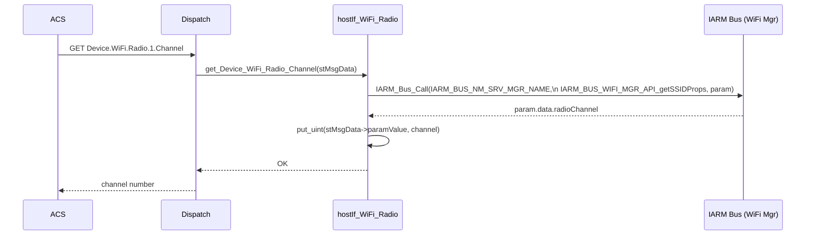
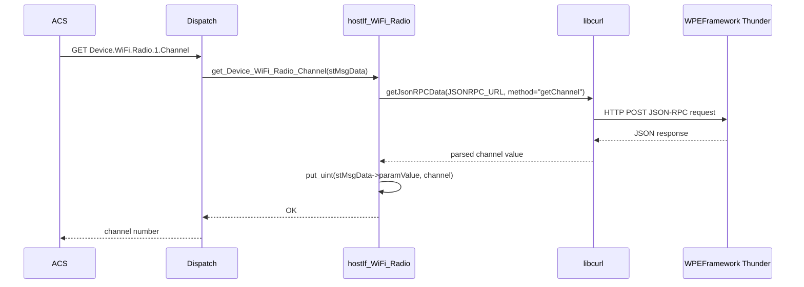
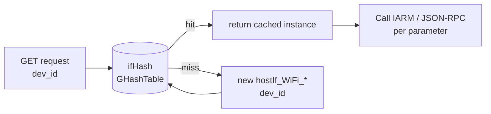

# WiFi Profile

## Overview

The WiFi profile implements the TR-181 `Device.WiFi.*` object tree, covering the complete 802.11 management hierarchy: top-level counts, radio configuration and statistics, SSID interface state, access point management (WPS, security, associated clients), and client endpoint profiles. On RDK-V builds (`RDKV_NM`), all data comes from the `IARM_BUS_NM_SRV_MGR_NAME` WiFi manager via IARM Bus calls. On non-RDKV builds, data is fetched from the WPEFramework Thunder plugin via libcurl JSON-RPC calls (`cJSON`). The entire profile is guarded by `USE_WIFI_PROFILE`.

---

## Directory Structure

```
src/hostif/profiles/wifi/
├── Device_WiFi.cpp                        # Top-level WiFi container
├── Device_WiFi.h
├── Device_WiFi_Radio.cpp                  # Radio physical layer config
├── Device_WiFi_Radio.h
├── Device_WiFi_Radio_Stats.cpp            # Radio statistics
├── Device_WiFi_Radio_Stats.h
├── Device_WiFi_SSID.cpp                   # SSID interface state
├── Device_WiFi_SSID.h
├── Device_WiFi_SSID_Stats.cpp             # SSID-level statistics
├── Device_WiFi_SSID_Stats.h
├── Device_WiFi_AccessPoint.cpp            # AP configuration
├── Device_WiFi_AccessPoint.h
├── Device_WiFi_AccessPoint_AssociatedDevice.cpp  # Per-client entries
├── Device_WiFi_AccessPoint_AssociatedDevice.h
├── Device_WiFi_AccessPoint_Security.cpp   # AP security settings
├── Device_WiFi_AccessPoint_Security.h
├── Device_WiFi_AccessPoint_WPS.cpp        # AP WPS configuration
├── Device_WiFi_AccessPoint_WPS.h
├── Device_WiFi_EndPoint.cpp               # Client endpoint
├── Device_WiFi_EndPoint.h
├── Device_WiFi_EndPoint_Profile.cpp       # EndPoint connection profile
├── Device_WiFi_EndPoint_Profile.h
├── Device_WiFi_EndPoint_Profile_Security.cpp  # EndPoint security
├── Device_WiFi_EndPoint_Profile_Security.h
├── Device_WiFi_EndPoint_Security.cpp      # EndPoint security modes
├── Device_WiFi_EndPoint_Security.h
├── Device_WiFi_EndPoint_WPS.cpp           # EndPoint WPS
├── Device_WiFi_EndPoint_WPS.h
├── Device_WiFi_X_RDKCENTRAL_COM_ClientRoaming.cpp  # Band-steering/roaming
├── Device_WiFi_X_RDKCENTRAL_COM_ClientRoaming.h
└── Makefile.am
```

> **Note**: There is no `gtest/` subdirectory. The WiFi profile has no unit tests.

---

## Architecture

```mermaid
graph TB
    ACS[ACS / WebPA / RBUS] -->|GET/SET Device.WiFi.*| DISP[hostIf_msgHandler]

    DISP --> WIFI[hostIf_WiFi\nDevice.WiFi top-level]
    DISP --> RADIO[hostIf_WiFi_Radio\nDevice.WiFi.Radio.{i}.*]
    DISP --> RADSTA[hostIf_WiFi_Radio_Stats\nDevice.WiFi.Radio.{i}.Stats.*]
    DISP --> SSID[hostIf_WiFi_SSID\nDevice.WiFi.SSID.{i}.*]
    DISP --> SSISTAT[hostIf_WiFi_SSID_Stats\nDevice.WiFi.SSID.{i}.Stats.*]
    DISP --> AP[hostIf_WiFi_AccessPoint\nDevice.WiFi.AccessPoint.{i}.*]
    DISP --> ASSOC[hostIf_WiFi_AccessPoint_AssociatedDevice\nDevice.WiFi.AccessPoint.{i}.AssociatedDevice.{j}]
    DISP --> APSEC[hostIf_WiFi_AccessPoint_Security\nDevice.WiFi.AccessPoint.{i}.Security.*]
    DISP --> APWPS[hostIf_WiFi_AccessPoint_WPS\nDevice.WiFi.AccessPoint.{i}.WPS.*]
    DISP --> EP[hostIf_WiFi_EndPoint\nDevice.WiFi.EndPoint.{i}.*]
    DISP --> ROAM[hostIf_WiFi_X_RDKCENTRAL_COM_ClientRoaming\nDevice.WiFi.X_RDKCENTRAL-COM_ClientRoaming.*]

    subgraph RDKVNM[RDKV_NM build path]
        IARM[IARM Bus\nIARM_BUS_NM_SRV_MGR_NAME\nIARM_BUS_WIFI_MGR_API_*]
    end
    subgraph NONRDKV[Non-RDKV build path]
        CURL[libcurl + cJSON\nJSON-RPC to WPEFramework]
    end

    RADIO --> RDKVNM
    RADIO --> NONRDKV
    SSID --> RDKVNM
    AP --> RDKVNM
```

---

## TR-181 Parameter Coverage

### `Device.WiFi`

| Parameter | GET (RDKV_NM) | GET (non-RDKV) | Notes |
|-----------|:---:|:---:|-------|
| `RadioNumberOfEntries` | ✅ | ❌ | IARM `IARM_BUS_WIFI_MGR_RadioEntry` |
| `SSIDNumberOfEntries` | ✅ | ❌ | IARM `IARM_BUS_WIFI_MGR_SSIDEntry` |
| `AccessPointNumberOfEntries` | ✅ | ✅ | Hardcoded `1` (non-RDKV) |
| `EndPointNumberOfEntries` | ✅ | ✅ | Hardcoded `1` |

### `Device.WiFi.Radio.{i}`

| Parameter | GET | Notes |
|-----------|-----|-------|
| `Enable` | ✅ | `wifi_getRadioEnable` / IARM |
| `Status` | ✅ | `wifi_getRadioEnable` → "Up"/"Down" |
| `Name` | ✅ | `wifi_getRadioIfName` |
| `SupportedFrequencyBands` | ✅ | "2.4GHz" / "5GHz" |
| `OperatingFrequencyBand` | ✅ | `wifi_getRadioOperatingFrequencyBand` |
| `SupportedStandards` | ✅ | Comma-separated list (a/b/g/n/ac) |
| `OperatingStandards` | ✅ | `wifi_getRadioStandard` |
| `PossibleChannels` | ✅ | `wifi_getRadioPossibleChannels` |
| `AutoChannelEnable` | ✅ | `wifi_getRadioAutoChannelEnable` |
| `Channel` | ✅ | `wifi_getRadioChannel` |
| `TransmitPower` | ✅ | `wifi_getRadioTransmitPower` |
| `MACAddress` | ✅ | `wifi_getRadioBaseBSSID` |
| `MaxBitRate` | ✅ | `wifi_getRadioMaxBitRate` |

### `Device.WiFi.SSID.{i}`

| Parameter | GET | Notes |
|-----------|-----|-------|
| `Enable` | ✅ | `wifi_getSSIDEnable` |
| `Status` | ✅ | `wifi_getSSIDStatus` |
| `Name` | ✅ | `wifi_getSSIDIfName` |
| `BSSID` | ✅ | `wifi_getBaseBSSID` |
| `MACAddress` | ✅ | `wifi_getBaseBSSID` |
| `SSID` | ✅ | `wifi_getSSIDName` |

### `Device.WiFi.AccessPoint.{i}`

| Parameter | GET | SET | Notes |
|-----------|-----|-----|-------|
| `Enable`, `Status` | ✅ | ✅ | IARM / HAL |
| `SSIDReference` | ✅ | ❌ | Resolved from SSID instance |
| `SSIDAdvertisementEnabled` | ✅ | ✅ | Beacon SSID visibility |
| `WMMEnable` | ✅ | ✅ | WMM QoS |
| `AssociatedDeviceNumberOfEntries` | ✅ | ❌ | Count of connected clients |

### `Device.WiFi.X_RDKCENTRAL-COM_ClientRoaming`

| Parameter | GET | SET | Notes |
|-----------|-----|-----|-------|
| `Enable` | ✅ | ✅ | Band-steering global enable |
| `PreAssn5GProbeRetryLimit` | ✅ | ✅ | Pre-association retries before steering |
| `PreAssn5GProbeMinRSSI` | ✅ | ✅ | Min RSSI threshold to steer to 5GHz |
| `PostAssnLevelDeltaConnected` | ✅ | ✅ | Signal delta to trigger roam |
| `PostAssnLevelDeltaDisconnected` | ✅ | ✅ | Signal delta after disconnect |
| And many more 5G/2G roaming parameters | ✅ | ✅ | Full band-steering configuration set |

---

## How Operations Work

### RDKV_NM Build Path (IARM)



### Non-RDKV Build Path (JSON-RPC via WPEFramework)



---

## Instance Lifecycle



---

## Error Handling

| Condition | Behavior |
|-----------|----------|
| `USE_WIFI_PROFILE` not defined | Entire profile excluded from build |
| IARM Bus call fails | Logs with IARM result code, returns `NOK` |
| JSON-RPC returns empty string | Returns `NOK`; paramValue empty |
| `cJSON_Parse` fails | Returns `NOK` |
| WiFi HAL function not available | Returns `NOK` |
| `WiFiDevice` constructor throws 1 | `getInstance()` catches, logs, returns `NULL` |

---

## Known Issues and Gaps

### Gap 1 — Critical: `WiFiDevice::ctxt` is uninitialized — constructor always throws

**File**: `Device_WiFi.cpp`

**Observation**: The `WiFiDevice` constructor:

```cpp
WiFiDevice::WiFiDevice(int dev_id):dev_id(dev_id)
{
    // ctxt = WiFiCtl_Open(interface);  // COMMENTED OUT

    if(!ctxt)  // ctxt is uninitialized — always NULL
    {
        RDK_LOG(RDK_LOG_ERROR, ..., "Error! Unable to connect to WiFi Device instance %d\n", dev_id);
        throw 1;
    }
}
```

`ctxt` is never assigned (the initialization call is commented out). Since an uninitialized pointer is non-NULL on some platforms, this may or may not throw. But the subsequent `getContext()` returns the garbage pointer, which is then passed to the HAL. On platforms that zero-initialize global/static data, `ctxt == NULL`, and the constructor always throws, making `WiFiDevice` completely unusable.

**Impact**: `WiFiDevice::getInstance()` catches the exception and inserts `NULL` into `devHash`. Any caller that dereferences the returned `WiFiDevice*` will crash.

**Note**: The actual WiFi data path in many builds bypasses `WiFiDevice` entirely and goes directly via IARM or JSON-RPC. But `WiFiDevice` is still created during initialization.

---

### Gap 2 — High: `WiFiDevice::init()` returns 1 for success, conflicting with its own comment

**File**: `Device_WiFi.cpp`

**Observation**:

```cpp
//------------------------------------------------------------------------------
// init: Returns 0 on success, -1 on failure.
//------------------------------------------------------------------------------
int WiFiDevice::init()
{
    // Initialise the WiFi HAL
    // ... (commented out) ...
    return 1;  // BUG: returns 1, comment says 0 is success
}
```

The comment documents `0` as success and `-1` as failure, but the function returns `1`. Callers that check `if (ret != 0) → error` would treat this successful return as an error.

---

### Gap 3 — High: Non-RDKV build path relies on `getJsonRPCData()` which always returns an empty string

**Observation**: The non-`RDKV_NM` build path uses `getJsonRPCData()` from `hostIf_utils.cpp` for retrieving WiFi parameters from WPEFramework. As documented in [src/hostif/docs/README.md](../../../docs/README.md#gap-8), `getJsonRPCData()` always returns an empty string because `writeCurlResponse()` takes its accumulation buffer by value. All non-RDKV WiFi GET parameters return empty or `NOK`.

---

### Gap 4 — Medium: `AccessPointNumberOfEntries` and `EndPointNumberOfEntries` are hardcoded to 1

**File**: `Device_WiFi.cpp` (non-`RDKV_NM` build)

**Observation**: In the `#ifndef RDKV_NM` path:

```cpp
int hostIf_WiFi::get_Device_WiFi_AccessPointNumberOfEntries(HOSTIF_MsgData_t *stMsgData)
{
    unsigned int accessPointNumOfEntries = 1;  // Always 1
    put_int(stMsgData->paramValue, accessPointNumOfEntries);
    return OK;
}
```

Dual-band platforms with one 2.4 GHz and one 5 GHz access point (two SSIDs, two APs) return `1` instead of `2`.

---

### Gap 5 — Medium: No unit tests

**Observation**: There is no `gtest/` directory. The WiFi profile has 28 source files and 4,597+ lines of C++ with no automated test coverage. The dual build path (`RDKV_NM` vs. non-RDKV) makes testing complex.

---

### Gap 6 — Medium: `ClientRoaming` SET parameters are written to HAL but the HAL API is not verified to persist them

**File**: `Device_WiFi_X_RDKCENTRAL_COM_ClientRoaming.cpp`

**Observation**: All SET handlers call `wifi_steering_setBandUtilizationThreshold()` or equivalent HAL functions. These functions write to an in-memory HAL state. On some RDK builds the HAL does not persist roaming parameters across reboots, and the values must be re-applied from the RFC store on every startup. If the RFC store is not also updated during the SET call, roaming configuration reverts after reboot.

---

### Gap 7 — Low: `Security.PreSharedKey` and `Security.KeyPassphrase` are both exposed as readable parameters

**File**: `Device_WiFi_AccessPoint_Security.cpp`

**Observation**: Both `PreSharedKey` (raw hex PSK) and `KeyPassphrase` (WPA2 passphrase) are exposed via GET. Under the TR-181 specification, PSK and passphrase are write-only credentials that should not be returned to an ACS. Returning these values to any management system that can read TR-181 parameters exposes the network access credentials.

**Recommended fix**: Return an empty string or a fixed placeholder on GET for all security credential parameters.

---

## Platform Notes

### Build Guard

The entire WiFi profile is disabled when `USE_WIFI_PROFILE` is not defined. When disabled, `Device.WiFi.*` returns `NOT_HANDLED` for all parameters.

### Dual Backend

| Build Flag | Backend | Data Source |
|-----------|---------|-------------|
| `RDKV_NM` defined | IARM Bus | NM Service Manager WiFi Manager |
| `RDKV_NM` not defined | libcurl + cJSON | WPEFramework Thunder `DeviceInfo`/`WiFiManager` plugin JSON-RPC |

---

## Testing

There are currently no unit tests. When adding coverage:
1. Create IARM Bus stubs (`IARM_Bus_Call` mock).
2. Test Radio channel/frequency enumeration with multiple radio instances.
3. Test SSID enable/disable sequence.
4. Test AssociatedDevice table population with mock client list.
5. Test ClientRoaming parameter round-trip (SET then GET).

---

## See Also

- [src/hostif/docs/README.md](../../../docs/README.md) — Core daemon overview and `getJsonRPCData()` bug (Gap 8)
- [Device/docs/README.md](../../Device/docs/README.md) — WebPA server URL management
- [handlers/docs/README.md](../../../handlers/docs/README.md) — Dispatch layer
