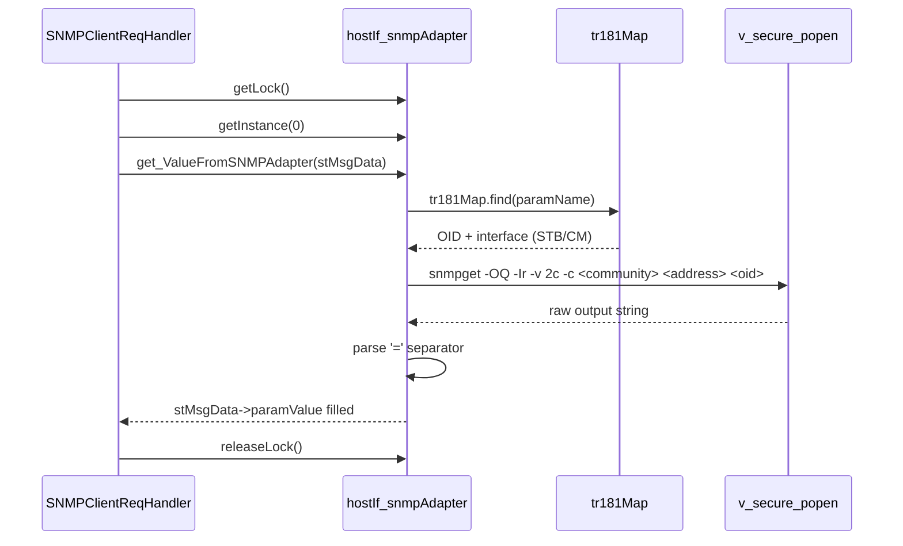

# SNMP Adapter Implementation Overview

## Overview

The `src/hostif/snmpAdapter/` module is a thin bridge that translates TR-181 parameter GET and SET requests into SNMP v2c `snmpget` and `snmpset` subprocess calls. It is used exclusively by `SNMPClientReqHandler` to serve the `Device.X_RDKCENTRAL-COM_DocsIf.*` and `Device.DeviceInfo.X_RDK_SNMP.*` subtrees, which map DOCSIS cable modem MIBs and set-top-box SNMP OIDs back into the TR-181 parameter model.

The adapter maintains an in-memory map loaded at startup from `/etc/tr181_snmpOID.conf` that associates each TR-181 parameter name with an SNMP OID and the target device interface (CM or STB). When a GET or SET arrives, the adapter looks up the OID in this map and invokes the corresponding command-line utility via `v_secure_popen`.

## Source Layout

| Path | Purpose |
|------|---------|
| `src/hostif/snmpAdapter/snmpAdapter.h` | Class declaration for `hostIf_snmpAdapter`, public API, static state declarations |
| `src/hostif/snmpAdapter/snmpAdapter.cpp` | Full implementation: config loading, instance management, GET and SET dispatch |
| `src/hostif/snmpAdapter/Makefile.am` | Builds `libSNMPAdapter.la`, links against GLib and libsoup |
| `conf/tr181_snmpOID.conf` | Mapping table: TR-181 parameter name → OID + interface label |
| `src/hostif/handlers/src/hostIf_SNMPClient_ReqHandler.cpp` | Handler wrapper that calls GET/SET/attribute paths and manages locking |

## Architecture

The module is shallow: all logic lives in a single class with no sub-components.

1. On daemon startup, `SNMPClientReqHandler::init()` calls `hostIf_snmpAdapter::init()`, which parses `tr181_snmpOID.conf` into `tr181Map`.
2. For each GET or SET dispatched by the handlers layer, `SNMPClientReqHandler` acquires the module lock, obtains an `hostIf_snmpAdapter` singleton instance for device index 0, and calls `get_ValueFromSNMPAdapter()` or `set_ValueToSNMPAdapter()`.
3. Each operation looks up the parameter name in `tr181Map`, selects the target IP address (STB: 127.0.0.1, CM: 192.168.100.1), and launches a `snmpget` or `snmpset` subprocess via `v_secure_popen`.
4. For `snmpget`, the raw output is parsed by finding the `=` character and copying the right-hand side into `stMsgData->paramValue`.

### Component Diagram

```mermaid
graph TB
    subgraph Handlers[handlers layer]
        SNMPH[SNMPClientReqHandler]
    end

    subgraph Adapter[snmpAdapter]
        CLASS[hostIf_snmpAdapter]
        MAP[tr181Map
key: TR-181 param name
value: OID + interface]
        LOCK[m_mutex
GMutex]
    end

    subgraph OS[OS subprocess]
        GET[snmpget -OQ -Ir -v 2c -c community address oid]
        SET[snmpset -v 2c -c community address oid type value]
    end

    subgraph Targets[SNMP agents]
        STB[STB agent
127.0.0.1]
        CM[CM agent
192.168.100.1]
    end

    CONF[/etc/tr181_snmpOID.conf] --> CLASS
    SNMPH --> CLASS
    CLASS --> MAP
    CLASS --> GET
    CLASS --> SET
    GET --> STB
    GET --> CM
    SET --> STB
    SET --> CM
```

### Request Flow Diagram



## How Operation Happens

### Startup and Configuration Loading

`hostIf_snmpAdapter::init()` is called once by `SNMPClientReqHandler::init()`, which is invoked during daemon startup from `hostIf_IARM_IF_Start()`.

The function opens `/etc/tr181_snmpOID.conf` and reads it line by line. Each line has the format:

```
TR-181.ParamName = .OID.dotted.notation INTERFACE
```

Where `INTERFACE` is either `STB` or `CM`. The parser:

1. Finds the `=` separator.
2. Searches for the string `STB` in the portion after the key.
3. If found at position `> 0`: sets `interface_value = "STB"`, erases the interface label from the line, then extracts the OID.
4. Otherwise: sets `interface_value = "CM"`, erases `CM` from the line, then extracts the OID.
5. Strips leading and trailing whitespace from both key and OID.
6. Inserts the pair into `tr181Map` as `map[paramName] = [{OID, interface}]`.

**Example mapping from `conf/tr181_snmpOID.conf`:**

```
Device.X_RDKCENTRAL-COM_DocsIf.docsIfCmStatusTxPower = .1.3.6.1.2.1.10.127.1.2.2.1.3.2 CM
Device.DeviceInfo.X_RDK_SNMP.PowerStatus = .1.3.6.1.4.1.4491.2.3.1.1.4.1.1.0 STB
```

### GET Operation — `get_ValueFromSNMPAdapter()`

For each incoming GET request:

1. Looks up `stMsgData->paramName` in `tr181Map`.
2. If not found: returns `NOK`.
3. If found: selects the SNMP agent IP address based on the interface label.
4. Calls `GetStdoutFromSnmpgetCommand()`:
   - Invokes `snmpget -OQ -Ir -v 2c -c <community> <address> <oid>` via `v_secure_popen`.
   - Reads all output, up to 1024 bytes at a time, into `consoleString`.
5. Finds the `=` character in the output to split the response.
6. Copies the right-hand-side value (trimmed) into `stMsgData->paramValue`.
7. Sets `stMsgData->paramtype = hostIf_StringType` unconditionally.
8. Returns `OK` on success, `-1` on popen failure, `NOT_HANDLED` on missing parameter.

### SET Operation — `set_ValueToSNMPAdapter()`

For each incoming SET request:

1. Looks up `stMsgData->paramName` in `tr181Map`.
2. If not found: returns `NOT_HANDLED`.
3. If found: selects the target IP address.
4. Matches `stMsgData->paramtype` against `hostIf_StringType`, `hostIf_IntegerType`, or `hostIf_UnsignedIntType` to determine the SNMP type character (`s`, `i`, or `u`).
5. Builds the `snmpset` command string and opens the subprocess via the `CMD` macro.
6. Reads one line of output.
7. Closes the pipe and stores the close status into `ret`.
8. Sets `stMsgData->faultCode` to `fcNoFault` on success or `fcRequestDenied` on failure.

**Note**: `hostIf_BooleanType`, `hostIf_DateTimeType`, and `hostIf_UnsignedLongType` are not handled for SET operations and return `NOK`.

### Notification Attribute Handling

`SNMPClientReqHandler` uses `m_notifyHash` to track which parameters have notification enabled. The `handleSetAttributesMsg()` path allocates an integer `1` and a copy of `paramName`, inserts them, and then immediately frees them — this is a use-after-free (see Gaps section). `handleGetAttributesMsg()` looks up the parameter in `m_notifyHash` and reads the integer value.

## Key Components

### `hostIf_snmpAdapter` class

```cpp
class hostIf_snmpAdapter {
    static GHashTable  *ifHash;        // instance registry, keyed by dev_id
    static GMutex      *m_mutex;       // coarse global lock
    static GHashTable  *m_notifyHash;  // notification attribute storage
    static map<string, vector<pair<string,string>>> tr181Map;  // OID lookup table

    int dev_id;

    // Private: subprocess launcher
    int GetStdoutFromSnmpgetCommand(const char *community,
                                    const char *address,
                                    const char *oid,
                                    string &consoleString);
public:
    static void init(void);          // load tr181_snmpOID.conf → tr181Map
    static void unInit(void);        // clear tr181Map

    static hostIf_snmpAdapter *getInstance(int dev_id);
    static void closeInstance(hostIf_snmpAdapter *);
    static GList* getAllInstances();
    static void closeAllInstances();

    static void getLock();
    static void releaseLock();

    GHashTable* getNotifyHash();

    int get_ValueFromSNMPAdapter(HOSTIF_MsgData_t *);
    int set_ValueToSNMPAdapter(HOSTIF_MsgData_t *);
};
```

### Configuration File Format

`/etc/tr181_snmpOID.conf` (installed from `conf/tr181_snmpOID.conf`) contains one entry per line:

```
<TR181.ParameterName> = <.OID> <STB|CM>
```

Each entry is unique. The file contains two parameter subtrees:

| Subtree | Interface | Purpose |
|---------|-----------|---------|
| `Device.X_RDKCENTRAL-COM_DocsIf.*` | CM | DOCSIS cable modem MIB values |
| `Device.DeviceInfo.X_RDK_SNMP.*` | STB | Set-top-box SNMP values (power, tuner, firmware) |

## Threading Model

The adapter is single-threaded at the operation level. All GET, SET, and attribute requests from `SNMPClientReqHandler` are serialized through the module's own coarse lock.

| Primitive | Location | Purpose |
|-----------|----------|---------|
| `m_mutex` (GMutex) | Static member of `hostIf_snmpAdapter` | Serializes all `getLock()` / `releaseLock()` callers |

**All public operations on the adapter must be bracketed by `getLock()` / `releaseLock()`.** The handler does this correctly for GET, SET, and both attribute operations.

**Important**: `m_mutex` is lazily allocated inside `getLock()` on first call without a prior lock held. This initialization path is not thread-safe (see Gaps section).

## Memory Management

| Allocation | Owner | Lifetime | Freed by |
|-----------|-------|----------|---------|
| `hostIf_snmpAdapter` instance (via `new`) | `ifHash` | Daemon lifetime | `closeInstance()` → `delete` |
| `ifHash` GHashTable | Static | Daemon lifetime | Not freed in `unInit()` |
| `m_mutex` GMutex | Static | Created on first lock | Not freed in `unInit()` |
| `m_notifyHash` GHashTable | Static, per-instance destructor | Destroyed in `~hostIf_snmpAdapter()` | `g_hash_table_destroy()` in destructor |
| `tr181Map` entries | `std::map` | Re-populated on each `init()` | `tr181Map.clear()` in `unInit()` |
| `consoleString` in GET | Stack (std::string) | Per-request | Automatic |
| `notifyKey` / `notifyValuePtr` in SET-attributes | `malloc` within `SNMPClientReqHandler` | **Freed before hash insertion — use-after-free** | See Gaps section |

## API Reference

### `hostIf_snmpAdapter::init()`

Loads the TR-181-to-OID mapping table from `/etc/tr181_snmpOID.conf`.

**Signature:** `static void init(void)`

**Thread safety:** Must be called before any concurrent access. Typically called once by `SNMPClientReqHandler::init()` during daemon startup.

**Side effects:** Clears and repopulates the static `tr181Map`.

---

### `hostIf_snmpAdapter::unInit()`

Clears the OID mapping table.

**Signature:** `static void unInit(void)`

**Note:** Does not free `ifHash`, `m_mutex`, or `m_notifyHash`. This leaks resources during daemon shutdown.

---

### `hostIf_snmpAdapter::getInstance(int dev_id)`

Returns the singleton adapter instance for the given device index. Creates a new instance if one does not exist for that `dev_id`.

**Signature:** `static hostIf_snmpAdapter *getInstance(int dev_id)`

**Returns:** Pointer to instance, or `NULL` if allocation fails.

**Note:** The instance registry `ifHash` is lazily initialized on first call.

---

### `get_ValueFromSNMPAdapter(HOSTIF_MsgData_t *stMsgData)`

Executes `snmpget` for the TR-181 parameter named in `stMsgData->paramName` and writes the result into `stMsgData->paramValue`.

**Returns:**
- `OK` (0) — value retrieved and stored
- `NOT_HANDLED` — parameter name not in `tr181Map`
- `-1` — `v_secure_popen` failed

**Paramtype set:** Always `hostIf_StringType`, regardless of the underlying OID type.

---

### `set_ValueToSNMPAdapter(HOSTIF_MsgData_t *stMsgData)`

Executes `snmpset` for the TR-181 parameter named in `stMsgData->paramName`.

**Returns:**
- `OK` or result of `v_secure_pclose` — on success
- `NOK` — pipe open or read failure
- `NOT_HANDLED` — parameter name not in `tr181Map`

**Supported types:** `hostIf_StringType` (`s`), `hostIf_IntegerType` (`i`), `hostIf_UnsignedIntType` (`u`)

**Unsupported types:** `hostIf_BooleanType`, `hostIf_DateTimeType`, `hostIf_UnsignedLongType` — these return `NOK` with a log message.

---

### `getLock()` / `releaseLock()`

Coarse global lock for serializing all adapter operations.

**Note:** `getLock()` lazily creates `m_mutex` if it is `NULL`. This is not thread-safe for the first call (see Gaps section).

## Error Handling

| Condition | Detected in | Return |
|-----------|-------------|--------|
| Parameter not in `tr181Map` | `get_ValueFromSNMPAdapter`, `set_ValueToSNMPAdapter` | `NOK` or `NOT_HANDLED` |
| `v_secure_popen` failure (GET) | `GetStdoutFromSnmpgetCommand` | Returns `-1` |
| `v_secure_popen` failure (SET) | `set_ValueToSNMPAdapter` | `NOK` |
| `snmpget` response missing `=` | `get_ValueFromSNMPAdapter` | Copies empty `resultBuff` (zero bytes) to `paramValue` |
| Config file not found | `init()` | Logs error; `tr181Map` remains empty |
| `getInstance` allocation failure | `getInstance()` | Logs warning; returns `NULL` |

## Performance Notes

Every GET and SET operation involves a `fork()` + `exec()` via `v_secure_popen`. This has a latency cost that is orders of magnitude higher than in-process IPC:

- A single `snmpget` subprocess adds 20-100ms latency depending on SNMP agent responsiveness.
- Wildcard GET expansion that resolves to multiple SNMP parameters will spawn one subprocess per parameter.
- The coarse global mutex (`m_mutex`) serializes all requests, so high-frequency SNMP reads will queue up behind each other.
- There is no caching layer; every request goes directly to the SNMP agent.

## Platform Notes

- The adapter is compiled only when `SNMP_ADAPTER_ENABLED` is defined at build time.
- The module depends on the `snmpget` and `snmpset` command-line utilities being installed on the target image (`net-snmp` package).
- `v_secure_popen` from `secure_wrapper` is used as the subprocess launcher and must be available.
- When `IS_YOCTO_ENABLED`, the build links against `-lsecure_wrapper` explicitly (from `Makefile.am`).
- The SNMP community string `hDaFHJG7` is hardcoded at compile time (see Gaps section).

## Known Issues and Gaps

The following implementation problems were identified by reviewing `snmpAdapter.cpp`, `snmpAdapter.h`, and `hostIf_SNMPClient_ReqHandler.cpp`. Each entry records severity, location, problem, and recommended fix.

---

### Gap 1 — Critical Security: SNMP community string hardcoded in source

**File**: `src/hostif/snmpAdapter/snmpAdapter.cpp` — line 58

**Observation**: The SNMP v2c community string is defined as a compile-time constant:

```cpp
#define SNMP_COMMUNITY "hDaFHJG7"
```

It appears in every `snmpget` and `snmpset` subprocess invocation and is also logged at `TRACE1` level in the GET path.

**Impact**: The community string is embedded in the binary and can be extracted with standard tooling. Any process or user on the device that can read logs or the binary has the credential needed to query or set DOCSIS MIB values on both the STB and CM agents. This also means rotating or changing the community string requires a full firmware rebuild and re-flash.

**Recommended fix** — load the community string from a file or environment variable at runtime:
```cpp
static std::string snmpCommunity;

void hostIf_snmpAdapter::init(void) {
    // Read community from a secured config path
    std::ifstream commFile("/etc/snmp_community");
    if (commFile.is_open())
        std::getline(commFile, snmpCommunity);
    else
        RDK_LOG(RDK_LOG_ERROR, ..., "Cannot read community file\n");
    // ... rest of init ...
}
```

---

### Gap 2 — Critical: `handleSetAttributesMsg()` uses memory after freeing it

**File**: `src/hostif/handlers/src/hostIf_SNMPClient_ReqHandler.cpp` — `handleSetAttributesMsg()`

**Observation**: The function allocates `notifyKey` and `notifyValuePtr`, inserts them into `notifyhash`, and then frees them immediately — twice. Both the success path and the Coverity-appended `free()` at the bottom of the function free the same pointers:

```cpp
g_hash_table_insert(notifyhash, notifyKey, notifyValuePtr);   // hash now holds raw pointers
ret = OK;
free(notifyKey);        // freed here — hash holds dangling pointer
free(notifyValuePtr);   // freed here
// ...
free(notifyKey);        // freed AGAIN — double-free (CID 87911 workaround)
free(notifyValuePtr);   // freed AGAIN
```

The hash table retains the raw pointers. Any subsequent `handleGetAttributesMsg()` call dereferences the freed `notifyValuePtr` — this is a use-after-free.

**Impact**: `handleGetAttributesMsg()` reads `*notifyvalue` after the memory has been freed. This is undefined behavior and can produce incorrect notification attribute values or crash the daemon.

**Recommended fix** — do not free memory that was handed to the hash table; instead use GLib's destructor functions to free on removal:
```cpp
// Create hash with key and value destructor:
GHashTable* notifyhash = g_hash_table_new_full(g_str_hash, g_str_equal, g_free, g_free);
// Then insert — the hash table owns the memory:
g_hash_table_insert(notifyhash, g_strdup(stMsgData->paramName), notifyValuePtr);
// Do NOT call free() on notifyKey or notifyValuePtr after this
```

---

### Gap 3 — High: `set_ValueToSNMPAdapter()` uses a malformed macro

**File**: `src/hostif/snmpAdapter/snmpAdapter.cpp`

**Observation**: The `CMD` macro is defined as:

```cpp
#define CMD(cmd, length, args...) ({ snprintf(cmd, length, args); fp = (v_secure_popen("r", args); )})
```

The expression `fp = (v_secure_popen("r", args); )` has a semicolon inside parentheses, which is not valid C/C++ syntax. Even under GCC's statement-expression extension, `(expr;)` is not a compound statement — the correct form would be `({ expr; })`. This means the `fp` assignment may not behave as intended depending on compiler version.

Additionally, the `cmd` buffer (built with `snprintf`) is logged but is never passed to `v_secure_popen`. `v_secure_popen` receives the raw format string and arguments directly. While both paths produce the same substitution from the same `args`, this is fragile and makes the logged command value meaningless for auditing.

**Impact**: The SET path may not compile cleanly on strict compilers and the command logged to RDK_LOG is built separately from the command actually executed, reducing diagnostic value.

**Recommended fix** — build the command string first and execute it:
```cpp
snprintf(cmd, BUFF_LENGTH_256, "snmpset -v 2c -c %s %s %s s %s",
         SNMP_COMMUNITY, address, oid, stMsgData->paramValue);
RDK_LOG(RDK_LOG_TRACE1, LOG_TR69HOSTIF, "[%s] %s\n", __FUNCTION__, cmd);
fp = v_secure_popen("r", "snmpset -v 2c -c %s %s %s s %s",
                    SNMP_COMMUNITY, address, oid, stMsgData->paramValue);
```
Remove the `CMD` macro entirely.

---

### Gap 4 — High: `getLock()` is not thread-safe for first-time initialization

**File**: `src/hostif/snmpAdapter/snmpAdapter.cpp`

**Observation**: `getLock()` lazily initializes `m_mutex`:

```cpp
void hostIf_snmpAdapter::getLock() {
    if (!m_mutex) {
        m_mutex = g_mutex_new();   // race condition here
    }
    g_mutex_lock(m_mutex);
}
```

If two threads call `getLock()` simultaneously before `m_mutex` is set, both pass the `NULL` check, both call `g_mutex_new()`, and only one assignment wins. The other `GMutex*` is leaked and the winning pointer may not be the one both threads proceed to lock, creating silent non-mutual-exclusion.

**Impact**: This is a startup race condition. GET and SET requests arriving quickly after daemon initialization (common during boot) can bypass the lock entirely, leading to concurrent map access and potential crashes.

**Recommended fix** — initialize the mutex once in `init()`:
```cpp
void hostIf_snmpAdapter::init(void) {
    if (!m_mutex)
        m_mutex = g_mutex_new();
    // ... rest of init ...
}
```

---

### Gap 5 — High: All GET results typed as `hostIf_StringType` regardless of OID type

**File**: `src/hostif/snmpAdapter/snmpAdapter.cpp` — `get_ValueFromSNMPAdapter()`

**Observation**: After retrieving the SNMP response, the result type is unconditionally set to string:

```cpp
stMsgData->paramtype = hostIf_StringType;
```

Integer, unsigned integer, and boolean SNMP OID values are returned as strings. Callers that branch on `paramtype` (for example, `hostIf_GetMsgHandler()` telemetry logging or RBUS type conversion) will misinterpret numeric values.

**Impact**: Numeric comparisons, range checks, and protocol serialization that depend on `paramtype` correctness will silently treat all SNMP-backed parameters as strings. `getStringValue()` in the httpserver layer has a specific `hostIf_UnsignedLongType` branch that formats values as `%lu`, but will never be used for SNMP parameters.

**Recommended fix** — infer the type from the OID map or from the `snmpget -OQ` output prefix (e.g., `INTEGER:`, `STRING:`, `Gauge32:`):
```cpp
if (consoleString.find("INTEGER:") != string::npos ||
    consoleString.find("Gauge32:") != string::npos) {
    stMsgData->paramtype = hostIf_IntegerType;
} else {
    stMsgData->paramtype = hostIf_StringType;
}
```

---

### Gap 6 — Medium: `init()` parser misidentifies `STB` at string position 0

**File**: `src/hostif/snmpAdapter/snmpAdapter.cpp` — `init()`

**Observation**: The interface detection uses:

```cpp
int result = line.find(interface_STB);
if (result > 0) {
    interface_value = interface_STB;
    ...
}
```

`line.find()` returns `string::size_type` (unsigned). After assignment to `int result`, `string::npos` maps to `-1`, which correctly fails `> 0`. However, if `STB` appears at position `0` (start of the line — possible if whitespace trimming changes the line layout), `result == 0` and `0 > 0` is `false`. The entry would be silently treated as a CM parameter and queried against `192.168.100.1` instead of `127.0.0.1`.

**Impact**: Any configuration entry where the interface label appears at the beginning of the value part would be incorrectly assigned to the CM agent.

**Recommended fix** — use `string::npos` as the sentinel:
```cpp
size_t result = line.find(interface_STB);
if (result != string::npos) {
    interface_value = interface_STB;
```

---

### Gap 7 — Medium: `~hostIf_snmpAdapter()` destroys a static shared hash table

**File**: `src/hostif/snmpAdapter/snmpAdapter.cpp`

**Observation**: The destructor destroys `m_notifyHash`:

```cpp
hostIf_snmpAdapter::~hostIf_snmpAdapter() {
    if (m_notifyHash) {
        g_hash_table_destroy(m_notifyHash);
    }
}
```

`m_notifyHash` is a `static` member shared across all instances. If `closeInstance()` is ever called for any instance other than the last one, the hash table is destroyed. All remaining instances — and any subsequent call to `getNotifyHash()` — will operate on a destroyed table.

**Impact**: In practice only one instance (device index 0) is ever created, so this is latent. However, if the cleanup path is extended or the adapter is used for multiple devices, this will cause heap corruption.

**Recommended fix** — move hash table destruction to `unInit()` rather than the destructor:
```cpp
void hostIf_snmpAdapter::unInit(void) {
    tr181Map.clear();
    if (m_notifyHash) {
        g_hash_table_destroy(m_notifyHash);
        m_notifyHash = NULL;
    }
}
```

---

### Gap 8 — Medium: `unInit()` leaks `ifHash` and `m_mutex`

**File**: `src/hostif/snmpAdapter/snmpAdapter.cpp`

**Observation**: `unInit()` only calls `tr181Map.clear()`. The instance hash table `ifHash` and the mutex `m_mutex` are never freed. This is typically not a problem for a daemon (resources reclaimed by OS on exit), but it is a problem if `init()` / `unInit()` cycles are used at runtime for configuration reload, as the mutex would be re-created without freeing the old one.

**Recommended fix** — add cleanup to `unInit()`:
```cpp
void hostIf_snmpAdapter::unInit(void) {
    tr181Map.clear();
    if (m_mutex) {
        g_mutex_free(m_mutex);
        m_mutex = NULL;
    }
    if (ifHash) {
        g_hash_table_destroy(ifHash);
        ifHash = NULL;
    }
}
```

---

### Gap 9 — Low: Missing return type on `GetStdoutFromSnmpgetCommand` in header

**File**: `src/hostif/snmpAdapter/snmpAdapter.h`

**Observation**: The declaration in the class body is:

```cpp
GetStdoutFromSnmpgetCommand(const char *community, const char *address,
                            const char *oid, string &consoleString);
```

No return type is declared. The implementation returns `int`. In C++ this is a compile error under `-std=c++11` or later since implicit `int` is not valid. The project presumably compiles with warnings rather than errors for this case, or the method is treated as `int` by older compilers.

**Recommended fix**:
```cpp
int GetStdoutFromSnmpgetCommand(const char *community, const char *address,
                                const char *oid, string &consoleString);
```

---

### Gap 10 — Low: SNMP v2c provides no encryption or authentication

**File**: All subprocess calls in `snmpAdapter.cpp`

**Observation**: All SNMP operations use SNMPv2c (`-v 2c`). SNMPv2c community-based security provides no message authentication, no privacy (data is cleartext on the wire), and no per-user access control. The CM agent is accessed at `192.168.100.1`, an IP address that may be reachable from subnets other than the device itself.

**Impact**: Any device on the same network segment as `192.168.100.1` that knows the community string can read or modify DOCSIS MIB values. The plaintext-on-wire nature means passive network monitoring can capture the community string from any SNMP exchange.

**Recommended fix** — migrate to SNMPv3 with `authPriv` security level using SHA authentication and AES privacy. The command-line syntax change is:
```bash
# v2c (current):
snmpget -OQ -Ir -v 2c -c <community> <address> <oid>

# v3 (recommended):
snmpget -OQ -Ir -v 3 -u <username> -l authPriv \
        -a SHA -A <authPass> -x AES -X <privPass> <address> <oid>
```

---

### Gap Summary Table

| # | Severity | File | Problem | Impact |
|---|----------|------|---------|--------|
| 1 | **Critical** | `snmpAdapter.cpp` | SNMP community string hardcoded in source | Credential embedded in binary; requires firmware flash to rotate |
| 2 | **Critical** | `hostIf_SNMPClient_ReqHandler.cpp` | `notifyKey`/`notifyValuePtr` freed before hash table uses them + freed twice | Use-after-free in `handleGetAttributesMsg()`; double-free crash |
| 3 | **High** | `snmpAdapter.cpp` | Malformed `CMD` macro with `(expr;)` syntax | SET subprocess may not execute correctly on strict compilers |
| 4 | **High** | `snmpAdapter.cpp` | `getLock()` lazily initializes `m_mutex` without synchronization | Boot-time race condition allows concurrent map access before first lock |
| 5 | **High** | `snmpAdapter.cpp` | All GET responses typed `hostIf_StringType` regardless of OID type | Numeric parameter type information lost; callers misinterpret values |
| 6 | **Medium** | `snmpAdapter.cpp` | `result > 0` check misses `STB` at string position 0 | Config entries with `STB` at position 0 silently route to CM agent |
| 7 | **Medium** | `snmpAdapter.cpp` | Destructor destroys static `m_notifyHash` on any instance close | Latent heap corruption if multiple instances are ever used |
| 8 | **Medium** | `snmpAdapter.cpp` | `unInit()` does not free `ifHash` or `m_mutex` | Memory and mutex leaked during any config-reload cycle |
| 9 | **Low** | `snmpAdapter.h` | Missing return type on `GetStdoutFromSnmpgetCommand` declaration | Compile warning or error on C++11 strict mode |
| 10 | **Low** | `snmpAdapter.cpp` | SNMPv2c used for all operations | Community string transmitted cleartext; no per-user auth or privacy |

## Testing

There are no unit tests for the `snmpAdapter` module. The `Makefile.am` builds only `libSNMPAdapter.la` with no test target. Testing is done implicitly through `SNMPClientReqHandler` integration tests when the full daemon is run with a live SNMP agent.

When modifying this module, manually validate:

1. `init()` correctly loads all entries from `tr181_snmpOID.conf` and classifies them as STB or CM.
2. `get_ValueFromSNMPAdapter()` returns the expected string value for a known OID against a live or mock SNMP agent.
3. Parameters not in the map return `NOT_HANDLED` without crashing.
4. `getLock()` / `releaseLock()` correctly serializes concurrent callers.
5. `unInit()` followed by `init()` leaves `tr181Map` in a clean state.

## See Also

- `src/hostif/handlers/src/hostIf_SNMPClient_ReqHandler.cpp` for the handler wrapper that drives this module
- `src/hostif/handlers/docs/README.md` for the handlers-layer overview
- `conf/tr181_snmpOID.conf` for the mapping table installed at `/etc/tr181_snmpOID.conf`
- `docs/architecture/overview.md` for the daemon-wide component map
- `docs/api/public-api.md` for `HOSTIF_MsgData_t` and shared request types
