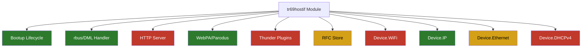
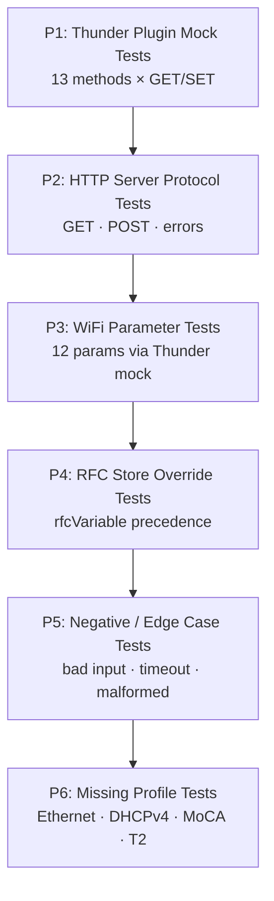

# L2 Functional Test Coverage

## Overview

This document maps the current L2 functional tests in `test/functional-tests/` against
the full tr69hostif module surface. It identifies what is covered, what is not, and
precisely quantifies the tests needed to reach 100% functional coverage.

> Last analysed: March 2026  
> Test suite: `test/functional-tests/` — 4 feature files, **45 ordered pytest functions**  
> Module surface: **708 parameter handlers** + **38 behavioral scenarios** = **746 testable items**  
> **Tests needed for 100% coverage: ~761**  
> **Current effective coverage: ~52 tests (~6.8%)**  
> **Tests still required: ~709**

---

## Test Suite Layout

```
test/functional-tests/
├── features/                              # BDD scenario descriptions (not wired to pytest)
│   ├── tr69hostif_bootup_sequence.feature
│   ├── tr69hostif_deviceip.feature
│   ├── tr69hostif_handlers_communications.feature
│   └── tr69hostif_webpa.feature
└── tests/                                 # Runnable pytest functions
    ├── test_bootup_sequence.py            # orders 1–18
    ├── test_handlers_communications.py    # orders 19–24
    ├── tr69hostif_deviceip.py             # orders 25–28
    ├── tr69hostif_webpa.py                # orders 29–45
    ├── helper_functions.py                # shell/log helpers
    ├── basic_constants.py                 # shared constants
    └── profile_helper_functions.py        # ⚠ stub — broken (NameError at runtime)
```

**Test runner:** `pytest` with `@pytest.mark.run(order=N)`, executed sequentially.  
**Interfaces exercised:** `rbuscli` (rbus DML), mock `parodus` binary (WebPA), log scraping.

---

## Infrastructure Notes

| Component | Status | Notes |
|-----------|--------|-------|
| `conftest.py` / fixtures | **Missing** | No setup/teardown; no parameter rollback between tests |
| BDD wiring | **Missing** | `.feature` files are documentation only — no `@given/@when/@then` implementations |
| `profile_helper_functions.py` | **Broken** | `GREP_STRING` undefined → `NameError` at runtime |
| HTTP server test helper | **Dead code** | `profile_init_run_command()` builds a `curl` command against `:11999` but is never called |
| Log isolation | **Absent** | Log cleared once at suite start; grep spans entire boot log |
| Test state isolation | **Absent** | SET operations persist; later tests may see values from earlier tests |
| Hardcoded expected values | `"DOCKER"`, `"99.99.15.07"`, etc. | Tests are tied to one specific container image |

---

## Current Coverage

### Bootup Sequence (orders 1–18)

All tests are **log-scrape checks** — they verify messages appear (or are absent) after
daemon startup. No parameter values are read or written.

| Order | Area Tested | Method |
|-------|-------------|--------|
| 1–2 | HTTP/JSON server thread start | Log: `"SERVER: Started server successfully."` |
| 3 | Parodus connection init | Log: `"Initiating Connection with PARODUS success.."` |
| 4 | Thread creation success | Log absence: `"pthread_create() failed"` |
| 5 | rbus DML registration | Log: `"rbus_regDataElements registered successfully"` |
| 6 | Config manager init | Log absence: `"Failed to hostIf_initalize_ConfigManger()"` |
| 7–8 | IARM bus init + `getPwrContInterface` thread | Log positive |
| 9 | Data model XML merge pipeline | Log: `"Successfully merged Data Model"` |
| 10 | Data model load | Log: `"Successfully initialize Data Model"` |
| 11 | Ethernet client thread start | Log: `"checkForUpdates] Got lock.."` |
| 12 | Bootstrap config file load | Log: `"/opt/secure/RFC/bootstrap.ini"` |
| 13 | Device manager (dsClient) init | Log: `"Device manager Initialized success"` |
| 14 | WebPA/parodus thread start | Log: `"Starting WEBPA Parodus Connections"` |
| 15–16 | PowerController start + callback register | Log positive |
| 17 | No fatal errors in full log | Negative sweep: no `FATAL`/`CRITICAL` |
| 18 | RFC default store | File `/tmp/rfcdefaults.ini` + rbus GET of `…RFC.Feature.Airplay.Enable` |

---

### RFC / Handler Parameters (orders 19–24)

All via **`rbuscli` SET + GET roundtrip** (rbus DML path).

| Order | TR-181 Parameter | Dir | Type |
|-------|-----------------|-----|------|
| 19 | `Device.DeviceInfo.X_RDKCENTRAL-COM_RFC.Feature.Telemetry.Version` | SET+GET | string |
| 20 | `Device.DeviceInfo.X_RDKCENTRAL-COM_RFC.Feature.DHCPv6Client.Enable` | SET+GET | boolean |
| 20 | `Device.Time.NTPServer1` | SET+GET | string |
| 21 | `Device.DeviceInfo.X_RDKCENTRAL-COM_RFC.Feature.HdmiCecSink.CECVersion` | SET+GET | string |
| 21 | `Device.DeviceInfo.X_RDKCENTRAL-COM_RFC.Feature.SWDLSpLimit.Enable` | SET+GET | boolean |
| 21 | `Device.DeviceInfo.X_RDKCENTRAL-COM_RFC.Feature.SWDLSpLimit.TopSpeed` | SET+GET | int |
| 21 | `Device.DeviceInfo.X_RDKCENTRAL-COM_RFC.Feature.eMMCFirmware.Version` | SET+GET | string |
| 21 | `Device.DeviceInfo.X_RDKCENTRAL-COM_RFC.Feature.IncrementalCDL.Enable` | SET+GET | boolean |
| 22 | `Device.DeviceInfo.X_RDKCENTRAL-COM_IPRemoteSupport.Enable` | SET+GET | boolean |
| 22 | `Device.DeviceInfo.X_RDKCENTRAL-COM_xOpsDeviceMgmt.ForwardSSH.Enable` | SET+GET | boolean |
| 22 | `Device.DeviceInfo.X_RDKCENTRAL-COM_FirmwareDownloadDeferReboot` | SET+GET | boolean |
| 22 | `Device.DeviceInfo.X_RDKCENTRAL-COM_xOpsDeviceMgmt.RPC.FirmwareDownloadCompletedNotification` | SET+GET | boolean |
| 23 | `Device.DeviceInfo.X_RDKCENTRAL-COM_RFC.Bootstrap.PartnerProductName` | SET+GET | string |
| 23 | `Device.DeviceInfo.X_RDKCENTRAL-COM_RFC.Bootstrap.NetflixESNprefix` | SET+GET | string |
| 23 | `Device.DeviceInfo.X_RDKCENTRAL-COM_RFC.Bootstrap.PartnerName` | SET+GET | string |
| 23 | `Device.DeviceInfo.X_RDKCENTRAL-COM_RFC.Bootstrap.SsrUrl` | SET+GET | string |
| 24 | `Device.DeviceInfo.X_RDKCENTRAL-COM_RFC.Bootstrap.PartnerProductName` + file persistence | SET+GET+file | string |

---

### DeviceInfo / IP Parameters (orders 25–28)

| Order | TR-181 Parameter | Dir | Expected Value |
|-------|-----------------|-----|----------------|
| 25 | `Device.DeviceInfo.SoftwareVersion` | GET | `"99.99.15.07"` |
| 25 | `Device.DeviceInfo.ModelName` | GET | `"DOCKER"` |
| 25 | `Device.DeviceInfo.X_COMCAST-COM_FirmwareFilename` | GET | `"Platform_Cotainer_1.0.0"` |
| 25 | `Device.DeviceInfo.X_RDKCENTRAL-COM_RFC.Feature.MEMSWAP.Enable` | SET+GET | `"true"` |
| 26 | `Device.IP.Interface.1.IPv4Address.1.Enable` | GET | `"true"` |
| 26 | `Device.IP.Interface.1.IPv6Enable` | GET | `"true"` |
| 26 | `Device.IP.Interface.1.IPv6Address.1.Enable` | GET | `"true"` |
| 26 | `Device.IP.Interface.1.IPv6Address.1.Anycast` | GET | `"false"` |
| 26 | `Device.IP.Interface.1.IPv6Address.1.Origin` | GET | `"WellKnown"` |
| 26 | `Device.IP.Interface.1.IPv6Address.1.PreferredLifetime` | GET | `"0001-01-01T00:00:00Z"` |
| 26 | `Device.IP.Interface.1.IPv6Prefix.1.Autonomous` | GET | `"false"` |
| 26 | `Device.IP.Interface.1.IPv6Prefix.1.StaticType` | GET | `"Inapplicable"` |
| 26 | `Device.IP.Interface.1.IPv6Prefix.1.PrefixStatus` | GET | `"Preferred"` |
| 26 | `Device.IP.Interface.1.IPv6Prefix.1.ValidLifetime` | GET | `"0001-01-01T00:00:00Z"` |
| 26 | `Device.IP.Interface.1.IPv6AddressNumberOfEntries` | GET | `"1"` |
| 27 | `Device.Services.STBServiceNumberOfEntries` | GET | `"1"` |
| 28 | `Device.DeviceInfo.X_RDKCENTRAL-COM_xOpsDeviceMgmt.ReverseSSH.xOpsReverseSshStatus` | GET | `"INACTIVE"` |
| 28 | `Device.DeviceInfo.X_RDKCENTRAL-COM_xOpsDeviceMgmt.ReverseSSH.xOpsReverseSshTrigger` | SET | `"start shorts"` |
| 28 | `Device.DeviceInfo.X_RDKCENTRAL-COM_xOpsDeviceMgmt.ReverseSSH.xOpsReverseSshArgs` | SET | SSH args string |

---

### WebPA / Parodus (orders 29–45)

Via **mock `parodus` binary** with JSON payloads. Validation reads `/opt/logs/parodus.log`.

| Order | TR-181 Parameter | Op | Verification |
|-------|-----------------|-----|-------------|
| 29–30 | `Device.DeviceInfo.X_RDKCENTRAL-COM_RFC.Control.XconfUrl` | SET→GET | statusCode 200, value roundtrip |
| 31–32 | `Device.DeviceInfo.X_RDKCENTRAL-COM_RFC.Feature.FWUpdate.AutoExcluded.Enable` | SET→GET | statusCode 200, `"false"` |
| 33–34 | `Device.DeviceInfo.X_RDKCENTRAL-COM_RFC.LogUpload.LogServerUrl` | SET→GET | statusCode 200, `"logs.mock.tv"` |
| 35 | `Device.DeviceInfo.X_RDKCENTRAL-COM_RFC.Feature.SWDLSpLimit.LowSpeed` | GET | `"12800"` |
| 36 | `Device.DeviceInfo.X_RDKCENTRAL-COM_FirmwareDownloadProtocol` | GET | `"http"` |
| 37 | `Device.DeviceInfo.X_RDKCENTRAL-COM_FirmwareDownloadStatus` | GET | presence only |
| 38 | `Device.DeviceInfo.X_RDKCENTRAL-COM_FirmwareDownloadURL` | GET | `"https://mockserver.tv/Images"` |
| 39 | `Device.DeviceInfo.X_RDKCENTRAL-COM_FirmwareToDownload` | GET | `"TESTIMAGE_DEV.bin"` |
| 40 | `Device.DeviceInfo.X_RDKCENTRAL-COM_FirmwareUpdateState` | GET | `"Download complete"` |
| 41 | `Device.DeviceInfo.` (wildcard) | GET | statusCode 200, `"Success"` |
| 42–44 | FW upgrade: Protocol, URL, Image | SET × 3 | statusCode 200 each |
| 45 | `Device.DeviceInfo.X_RDKCENTRAL-COM_FirmwareDownloadNow` (DownloadNow) | SET | statusCode 200 + log `"Triggered Download"` |

---

## Coverage Heat Map



| Colour | Meaning |
|--------|---------|
| Green | Covered |
| Amber | Partially covered |
| Red | Not covered |

---

## Coverage Gaps

### Priority 1 — Thunder Plugin Calls (0% covered)

**All 5 Thunder plugins and all 21 TR-181 parameters that use them have zero test coverage.**
This is the largest gap because Thunder calls are synchronous blocking operations with a
10-second timeout; any regression silently returns empty/NOK with no daemon crash.

| Plugin | Method | TR-181 Parameter | Gap |
|--------|--------|-----------------|-----|
| `org.rdk.NetworkManager` | `GetPrimaryInterface` + `GetIPSettings` | `Device.DeviceInfo.X_COMCAST-COM_STB_IP` | No GET test |
| `org.rdk.NetworkManager` | `GetAvailableInterfaces` | `Device.WiFi.SSID.{i}.Enable` / `MACAddress` | No GET test |
| `org.rdk.NetworkManager` | `GetConnectedSSID` | `Device.WiFi.SSID.{i}.SSID` / `BSSID` / `Name` | No GET test |
| `org.rdk.NetworkManager` | `GetConnectedSSID` | `Device.WiFi.Endpoint.{i}.SSIDReference` / `Stats.SignalStrength` | No GET test |
| `org.rdk.NetworkManager` | `GetConnectedSSID` | `Device.WiFi.Endpoint.{i}.Security.ModesEnabled` | No GET test |
| `org.rdk.NetworkManager` | `GetWifiState` | `Device.WiFi.SSID.{i}.Status` | No GET test |
| `org.rdk.NetworkManager` | `Enable/DisableInterface` | `Device.WiFi.X_RDKCENTRAL-COM_WiFiEnable` | No SET test |
| `org.rdk.AuthService` | `setPartnerId` | `Device.DeviceInfo.X_RDKCENTRAL-COM_Syndication.PartnerId` | No SET test |
| `org.rdk.AuthService` | `getServiceAccountId` | `Device.DeviceInfo.X_RDKCENTRAL-COM_RFC.Feature.AccountInfo.AccountID` | No GET test |
| `org.rdk.AuthService` | `getExperience` | `Device.DeviceInfo.X_RDKCENTRAL-COM_Experience` | No GET test |
| `org.rdk.System` | `getPrivacyMode` | `Device.DeviceInfo.…ReverseSSH.xOpsReverseSshTrigger` gate | No privacy-mode gate test |
| `org.rdk.MigrationPreparer` | `getComponentReadiness` | `Device.DeviceInfo.MigrationPreparer.MigrationReady` | No GET test |
| `org.rdk.Account` | `getLastCheckoutResetTime` | `…HotelCheckout.LastResetTime` / `Status` | No GET test |

**Recommended test approach:**
- Deploy a mock Thunder JSON-RPC responder on `127.0.0.1:9998` in the test container
- Stub each `org.rdk.*` method to return a known JSON payload
- Verify the TR-181 parameter GET returns the expected mapped value

---

### Priority 2 — HTTP Server (0% functional coverage)

The libsoup-based HTTP server (`/`) accepting WDMP-C JSON is completely untested at the
protocol level. The only evidence of intent is dead code in `test_bootup_sequence.py`:

```python
# Dead code — never called from any test function
def profile_init_run_command():
    cmd = f"curl -s -X GET http://127.0.0.1:11999/ ..."
```

**Required tests:**

| Test | Method | Request | Expected |
|------|--------|---------|----------|
| GET single parameter | HTTP GET | `{"names":["Device.DeviceInfo.ModelName"]}` | `{"statusCode":200,...}` |
| GET multiple parameters | HTTP GET | `{"names":["param1","param2"]}` | Multi-value response |
| GET wildcard | HTTP GET | `{"names":["Device.DeviceInfo."]}` | All DeviceInfo params |
| SET parameter | HTTP POST with CallerID | `{"parameters":[{"name":...,"value":...}]}` | `{"statusCode":200}` |
| SET without CallerID | HTTP POST no header | — | `500 POST Not Allowed without CallerID` |
| Malformed JSON body | HTTP GET | `{bad json}` | `400 Bad Request` |
| Unknown parameter | HTTP GET | nonexistent param | Non-zero statusCode |
| Empty body | HTTP GET | no body | `400 No request data.` |

---

### Priority 3 — WiFi TR-181 Subtree (0% covered)

`Device.WiFi.*` has 13 TR-181 parameters mapped to Thunder — none are tested.

| Parameter | Dir | Needs |
|-----------|-----|-------|
| `Device.WiFi.X_RDKCENTRAL-COM_WiFiEnable` | GET+SET | Positive GET; SET enable/disable roundtrip |
| `Device.WiFi.SSID.{i}.BSSID` | GET | GET with mock Thunder response |
| `Device.WiFi.SSID.{i}.SSID` | GET | GET with mock Thunder response |
| `Device.WiFi.SSID.{i}.Name` | GET | GET with mock Thunder response |
| `Device.WiFi.SSID.{i}.Enable` | GET | GET with mock Thunder response |
| `Device.WiFi.SSID.{i}.MACAddress` | GET | GET with mock Thunder response |
| `Device.WiFi.SSID.{i}.Status` | GET | GET with mock Thunder response |
| `Device.WiFi.Endpoint.{i}.Enable` | GET | GET with mock Thunder response |
| `Device.WiFi.Endpoint.{i}.Status` | GET | GET with mock Thunder response |
| `Device.WiFi.Endpoint.{i}.SSIDReference` | GET | GET with mock Thunder response |
| `Device.WiFi.Endpoint.{i}.Stats.SignalStrength` | GET | GET with mock Thunder response |
| `Device.WiFi.Endpoint.{i}.Security.ModesEnabled` | GET | GET with mock Thunder response |

---

### Priority 4 — RFC Variable Store (partial)

| Scenario | Status |
|----------|--------|
| `rfcdefaults.ini` file read + rbus GET | Covered (order 18) |
| `bootstrap.ini` persistence + `.journal` file | Covered (order 24) |
| `rfcVariable.ini` read-back | **Not covered** |
| RFC override precedence (`rfcVariable` overrides `rfcdefaults`) | **Not covered** |
| `XRFCVarStore` consistency after daemon restart | **Not covered** |
| `RFC_CONTROL_RELOADCACHE` trigger (via HTTP server POST) | **Not covered** |

---

### Priority 5 — Negative / Edge Cases (0% covered)

No negative test exists in the current suite.

| Missing Test | Description |
|-------------|-------------|
| SET wrong data type | SET a string param with an integer value |
| SET out-of-range value | SET an integer param beyond valid range |
| GET nonexistent parameter | GET a param that does not exist in data model |
| Malformed WebPA JSON | Send malformed JSON to parodus mock |
| Thunder timeout simulation | Kill mock Thunder server mid-request; verify NOK returned |
| Thunder empty response | Return `{}` from mock; verify handler returns NOK, no crash |
| HTTP server POST without CallerID | Expect `500` response |
| WebPA REPLACE command | Currently only GET/SET tested |

---

### Priority 6 — Untested Module Areas

| Module / Profile | Status | Notes |
|-----------------|--------|-------|
| `Device.Ethernet.*` | Thread start logged only | No parameter GET/SET |
| `Device.DHCPv4.*` | **Zero** | No thread log, no parameter test |
| `Device.InterfaceStack.*` | **Zero** | No test |
| `Device.MoCA.*` | **Zero** | No test |
| `Device.X_RDKCENTRAL-COM_T2.*` | **Zero** | Constants defined but `check_Rbus_data()` never called |
| `Device.StorageService.*` | **Zero** | No test |
| STB Service profile | `STBServiceNumberOfEntries` GET only (order 27) | Internal params untested |

---

## Tests Needed — Prioritised Backlog



| Priority | Area | Estimated Tests | Blocking? |
|----------|------|-----------------|-----------|
| P1 | Thunder plugin mock tests | ~26 | Yes — zero coverage of live path |
| P2 | HTTP server protocol tests | ~8 | Yes — dead code in current suite |
| P3 | WiFi TR-181 parameter tests | ~12 | Yes — zero coverage |
| P4 | RFC variable store override | ~4 | No |
| P5 | Negative / edge cases | ~8 | No |
| P6 | Ethernet, DHCPv4, MoCA, T2 | ~10 | No |

---

## Infrastructure Fixes Required

Before new tests can be added reliably, the following infrastructure issues must be resolved:

| Issue | Fix |
|-------|-----|
| No `conftest.py` | Add `conftest.py` with `@pytest.fixture(autouse=True)` that records and restores any SET parameters after each test |
| BDD feature files not wired | Either wire them with `pytest-bdd` step implementations or drop them and document test intent in docstrings |
| `profile_helper_functions.py` broken | Fix `GREP_STRING` undefined reference or remove the file |
| HTTP server dead code | Move `profile_init_run_command()` into actual test functions |
| Hardcoded expected values | Extract to `basic_constants.py` with a comment that they are image-specific |
| Log isolation | Call `clear_tr69hostiflogs()` at the start of each test (the function exists but is commented out) |

---

---

## Complete Coverage Count Analysis

### Counting Methodology

- Each **GET handler** = 1 required test (positive GET, verify value returned)
- Each **SET handler** = 1 required test (positive SET + GET roundtrip)
- Each **behavioral scenario** = 1 required test
- Negative/edge case tests are counted separately (~16 total)
- Internal helpers, dispatcher delegates, and duplicated `#ifdef` branches excluded

---

### Per-Profile Handler Counts and Coverage Status

| # | Profile Area | TR-181 Namespace | GET | SET | Tests Needed | Covered | Gap | Coverage |
|---|-------------|-----------------|:---:|:---:|:---:|:---:|:---:|:---:|
| 1 | **DeviceInfo** | `Device.DeviceInfo.*` | 111 | 61 | **172** | ~20 | ~152 | ~12% |
| 2 | **Ethernet** | `Device.Ethernet.*` | 25 | 5 | **30** | 0 | 30 | 0% |
| 3 | **IP** | `Device.IP.*` | 73 | 33 | **106** | ~12 | ~94 | ~11% |
| 4 | **DHCPv4** | `Device.DHCPv4.*` | 4 | 0 | **4** | 0 | 4 | 0% |
| 5 | **InterfaceStack** | `Device.InterfaceStack.*` | 2 | 0 | **2** | 0 | 2 | 0% |
| 6 | **MoCA** | `Device.MoCA.*` | 89 | 10 | **99** | 0 | 99 | 0% |
| 7 | **STBService** | `Device.Services.STBService.*` | 71 | 14 | **85** | ~1 | ~84 | ~1% |
| 8 | **StorageService** | `Device.StorageService.*` | 15 | 0 | **15** | 0 | 15 | 0% |
| 9 | **Time** | `Device.Time.*` | 20 | 17 | **37** | ~1 | ~36 | ~3% |
| 10 | **WiFi** | `Device.WiFi.*` | 132 | 21 | **153** | 0 | 153 | 0% |
| 11 | **Device** | `Device.*` (WebPA URLs) | 3 | 1 | **4** | 0 | 4 | 0% |
|  | **Parameter subtotal** | | **545** | **163** | **707** | **~34** | **~673** | **~5%** |

### DeviceInfo Profile — Per-File Breakdown

DeviceInfo is the largest single profile area (24% of all handler tests needed).

| Source File | GET | SET | Tests Needed | Notes |
|-------------|:---:|:---:|:---:|-------|
| [Device_DeviceInfo.cpp](../../src/hostif/profiles/DeviceInfo/Device_DeviceInfo.cpp) | 70 | 59 | 129 | Largest file; all Thunder-backed paths live here |
| [Device_DeviceInfo_Processor.cpp](../../src/hostif/profiles/DeviceInfo/Device_DeviceInfo_Processor.cpp) | 1 | 0 | 1 | `Processor.Architecture` |
| [Device_DeviceInfo_ProcessStatus.cpp](../../src/hostif/profiles/DeviceInfo/Device_DeviceInfo_ProcessStatus.cpp) | 1 | 0 | 1 | `ProcessStatus.CPUUsage` |
| [Device_DeviceInfo_ProcessStatus_Process.cpp](../../src/hostif/profiles/DeviceInfo/Device_DeviceInfo_ProcessStatus_Process.cpp) | 6 | 0 | 6 | PID, Command, Size, Priority, CPUTime, State |
| [XrdkBlueTooth.cpp](../../src/hostif/profiles/DeviceInfo/XrdkBlueTooth.cpp) | 32 | 2 | 34 | `BLE_TILE_PROFILE` compile guard |
| [XrdkCentralComRFC.cpp](../../src/hostif/profiles/DeviceInfo/XrdkCentralComRFC.cpp) | 1 | 0 | 1 | `XRFCStorage::getValue` |
| **DeviceInfo TOTAL** | **111** | **61** | **172** | |

### WiFi Profile — Sub-Object Breakdown

WiFi is the most handler-diverse profile with 15 distinct sub-object types and **0% current coverage**.

| Sub-Object | GET | SET | Tests Needed |
|-----------|:---:|:---:|:---:|
| WiFi top-level | 5 | 0 | 5 |
| Radio | 27 | 0 | 27 |
| Radio.Stats | 9 | 0 | 9 |
| SSID | 7 | 0 | 7 |
| SSID.Stats | 15 | 0 | 15 |
| AccessPoint | 11 | 8 | 19 |
| AccessPoint.AssociatedDevice | 7 | 0 | 7 |
| AccessPoint.Security | 9 | 6 | 15 |
| AccessPoint.WPS | 3 | 0 | 3 |
| EndPoint | 10 | 5 | 15 |
| EndPoint.Profile | 6 | 0 | 6 |
| EndPoint.Profile.Security | 4 | 2 | 6 |
| EndPoint.Security | 2 | 0 | 2 |
| EndPoint.WPS | 3 | 0 | 3 |
| X_RDKCENTRAL.ClientRoaming | 13 | 0 | 13 |
| **WiFi TOTAL** | **132** | **21** | **153** |

### Non-Parameter Behavioral Scenarios

| Category | Needed | Covered | Gap |
|----------|:---:|:---:|:---:|
| HTTP Server (GET, POST, errors, missing CallerID, malformed JSON, empty body) | 8 | 0 | 8 |
| WebPA / Parodus (GET, SET, REPLACE, ADD, attributes, wildcard, FW upgrade) | 10 | ~5 | ~5 |
| RFC Store (read, override precedence, reload trigger, restart consistency) | 10 | ~3 | ~7 |
| Daemon lifecycle (start, stop, SIGTERM, re-init, PID file, sd_notify) | 10 | ~10 | 0 |
| **Behavioral subtotal** | **38** | **~18** | **~20** |

### Grand Total

| Category | Tests Needed | Currently Covered | Still Required |
|----------|:---:|:---:|:---:|
| Parameter handlers (GET + SET across all 11 profiles) | 707 | ~34 | ~673 |
| Behavioral scenarios (HTTP, WebPA, RFC, lifecycle) | 38 | ~18 | ~20 |
| Negative / edge case tests | ~16 | 0 | ~16 |
| **TOTAL** | **~761** | **~52** | **~709** |

> **Current L2 coverage: ~6.8% of module surface.**  
> **709 additional test cases are required to reach 100%.**

---

### Where We Are NOT — Profile Gap Summary

| Profile | Tests Needed | Have | Missing | Primary Gap Areas |
|---------|:---:|:---:|:---:|-------------------|
| `Device.WiFi.*` | 153 | 0 | **153** | Entire profile untested — Radio (36), AccessPoint (41), SSID (22), EndPoint (32), ClientRoaming (13) |
| `Device.MoCA.*` | 99 | 0 | **99** | Interface (43), AssociatedDevice (17), Stats (15), QoS (10), MeshTable (4) |
| `Device.DeviceInfo.*` | 172 | ~20 | **~152** | Thunder-backed (21), BT (34), ProcessStatus (8), firmware (10), SSH/privacy (3), remaining ~76 params |
| `Device.IP.*` | 106 | ~12 | **~94** | IPv4 SETs (6), all IPv6Address/Prefix (23), Interface.Stats (9), IP-level SETs (10) |
| `Device.Services.STBService.*` | 85 | ~1 | **~84** | AudioOutput SET/GET (25), eMMC (14), SPDIF (11), SDCard (10), Security (9) |
| `Device.Ethernet.*` | 30 | 0 | **30** | Interface GET+SET (15), Interface.Stats GET (15) |
| `Device.Time.*` | 37 | ~1 | **~36** | NTPServer2–5 (8), NTP directives (5), all 17 SET handlers |
| `Device.StorageService.*` | 15 | 0 | **15** | PhysicalMedium GET-only (14) + service entry (1) |
| Thunder Plugin endpoints | 21 params | 0 | **21** | All 5 plugins, 13 methods; requires mock JSON-RPC server on :9998 |
| HTTP Server protocol | 8 | 0 | **8** | GET/POST/errors — only dead code exists in current suite |
| `Device.DHCPv4.*` | 4 | 0 | **4** | Client params; all GET-only |
| `Device.InterfaceStack.*` | 2 | 0 | **2** | HigherLayer, LowerLayer |
| Negative / edge cases | ~16 | 0 | **~16** | Wrong type, nonexistent param, malformed JSON, timeout simulation |

---

## Complete TR-181 Parameter Inventory

This is the exhaustive flat list of every testable TR-181 parameter, non-parameter
functional behaviour, and lifecycle path discovered by reading every profile source
file. Use this table as the master checklist to calculate 100% test coverage.

**Columns:** `Parameter` | `Dir` (GET / SET / GET+SET) | `Source File` | `Handler Function`

---

### 1. Device.DeviceInfo — Standard Parameters
`src/hostif/profiles/DeviceInfo/Device_DeviceInfo.cpp` / `.h`

| Parameter | Dir | Handler |
|-----------|-----|---------|
| `Device.DeviceInfo.Manufacturer` | GET | `get_Device_DeviceInfo_Manufacturer` |
| `Device.DeviceInfo.ManufacturerOUI` | GET | `get_Device_DeviceInfo_ManufacturerOUI` |
| `Device.DeviceInfo.ModelName` | GET | `get_Device_DeviceInfo_ModelName` |
| `Device.DeviceInfo.Description` | GET | `get_Device_DeviceInfo_Description` |
| `Device.DeviceInfo.ProductClass` | GET | `get_Device_DeviceInfo_ProductClass` |
| `Device.DeviceInfo.SerialNumber` | GET | `get_Device_DeviceInfo_SerialNumber` |
| `Device.DeviceInfo.HardwareVersion` | GET | `get_Device_DeviceInfo_HardwareVersion` |
| `Device.DeviceInfo.SoftwareVersion` | GET | `get_Device_DeviceInfo_SoftwareVersion` |
| `Device.DeviceInfo.AdditionalHardwareVersion` | GET | `get_Device_DeviceInfo_AdditionalHardwareVersion` |
| `Device.DeviceInfo.AdditionalSoftwareVersion` | GET | `get_Device_DeviceInfo_AdditionalSoftwareVersion` |
| `Device.DeviceInfo.ProvisioningCode` | GET | `get_Device_DeviceInfo_ProvisioningCode` |
| `Device.DeviceInfo.UpTime` | GET | `get_Device_DeviceInfo_UpTime` |
| `Device.DeviceInfo.FirstUseDate` | GET | `get_Device_DeviceInfo_FirstUseDate` |
| `Device.DeviceInfo.VendorConfigFileNumberOfEntries` | GET | `get_Device_DeviceInfo_VendorConfigFileNumberOfEntries` |
| `Device.DeviceInfo.SupportedDataModelNumberOfEntries` | GET | `get_Device_DeviceInfo_SupportedDataModelNumberOfEntries` |
| `Device.DeviceInfo.ProcessorNumberOfEntries` | GET | `get_Device_DeviceInfo_ProcessorNumberOfEntries` |
| `Device.DeviceInfo.VendorLogFileNumberOfEntries` | GET | `get_Device_DeviceInfo_VendorLogFileNumberOfEntries` |
| `Device.DeviceInfo.MemoryStatus.Total` | GET | `get_Device_DeviceInfo_MemoryStatus_Total` |
| `Device.DeviceInfo.MemoryStatus.Free` | GET | `get_Device_DeviceInfo_MemoryStatus_Free` |

---

### 2. Device.DeviceInfo — Processor / ProcessStatus
`src/hostif/profiles/DeviceInfo/Device_DeviceInfo_Processor.cpp`
`src/hostif/profiles/DeviceInfo/Device_DeviceInfo_ProcessStatus_Process.cpp`

| Parameter | Dir | Handler |
|-----------|-----|---------|
| `Device.DeviceInfo.Processor.{i}.Architecture` | GET | `get_Device_DeviceInfo_Processor_Architecture` |
| `Device.DeviceInfo.ProcessStatus.Process.{i}.PID` | GET | `getProcessFields(eProcessPid)` |
| `Device.DeviceInfo.ProcessStatus.Process.{i}.Command` | GET | `getProcessFields(eProcessCmd)` |
| `Device.DeviceInfo.ProcessStatus.Process.{i}.Size` | GET | `getProcessFields(eProcessSize)` |
| `Device.DeviceInfo.ProcessStatus.Process.{i}.Priority` | GET | `getProcessFields(eProcessPriority)` |
| `Device.DeviceInfo.ProcessStatus.Process.{i}.CPUTime` | GET | `getProcessFields(eProcessCPUTime)` |
| `Device.DeviceInfo.ProcessStatus.Process.{i}.State` | GET | `getProcessFields(eProcessState)` |
| `Device.DeviceInfo.ProcessStatus.ProcessNumberOfEntries` | GET | `get_Device_DeviceInfo_ProcessStatus_ProcessNumberOfEntries` |

---

### 3. Device.DeviceInfo — Comcast/RDK Custom Parameters
`src/hostif/profiles/DeviceInfo/Device_DeviceInfo.cpp`

| Parameter | Dir | Handler |
|-----------|-----|---------|
| `Device.DeviceInfo.X_COMCAST-COM_STB_MAC` | GET | `get_Device_DeviceInfo_X_COMCAST_COM_STB_MAC` |
| `Device.DeviceInfo.X_COMCAST-COM_STB_IP` | GET | `get_Device_DeviceInfo_X_COMCAST_COM_STB_IP` |
| `Device.DeviceInfo.X_COMCAST-COM_PowerStatus` | GET | `get_Device_DeviceInfo_X_COMCAST_COM_PowerStatus` |
| `Device.DeviceInfo.X_RDKCENTRAL-COM_FirmwareFilename` | GET | `get_Device_DeviceInfo_X_RDKCENTRAL_COM_FirmwareFilename` |
| `Device.DeviceInfo.X_RDKCENTRAL-COM_FirmwareToDownload` | GET+SET | `get/set_Device_DeviceInfo_X_RDKCENTRAL_COM_FirmwareToDownload` |
| `Device.DeviceInfo.X_RDKCENTRAL-COM_FirmwareDownloadStatus` | GET+SET | `get/set_Device_DeviceInfo_X_RDKCENTRAL_COM_FirmwareDownloadStatus` |
| `Device.DeviceInfo.X_COMCAST-COM_FirmwareDownloadProtocol` | GET+SET | `get/set_Device_DeviceInfo_X_COMCAST_COM_FirmwareDownloadProtocol` |
| `Device.DeviceInfo.X_COMCAST-COM_FirmwareDownloadURL` | GET+SET | `get/set_Device_DeviceInfo_X_COMCAST_COM_FirmwareDownloadURL` |
| `Device.DeviceInfo.X_RDKCENTRAL-COM_FirmwareDownloadUseCodebig` | GET+SET | `get/set_Device_DeviceInfo_X_RDKCENTRAL_COM_FirmwareDownloadUseCodebig` |
| `Device.DeviceInfo.X_RDKCENTRAL-COM_FirmwareDownloadDeferReboot` | GET+SET | `get/set_Device_DeviceInfo_X_RDKCENTRAL_COM_FirmwareDownloadDeferReboot` |
| `Device.DeviceInfo.X_COMCAST-COM_FirmwareDownloadPercent` | GET | `get_Device_DeviceInfo_X_COMCAST_COM_FirmwareDownloadPercent` |
| `Device.DeviceInfo.X_RDKCENTRAL-COM_FirmwareUpdateState` | GET | `get_Device_DeviceInfo_X_RDKCENTRAL_COM_FirmwareUpdateState` |
| `Device.DeviceInfo.X_RDKCENTRAL-COM_FirmwareDownloadNow` | SET | `set_xFirmwareDownloadNow` (triggers download) |
| `Device.DeviceInfo.X_RDKCENTRAL-COM_Reset` | GET+SET | `get/set_Device_DeviceInfo_X_RDKCENTRAL_COM_Reset` |
| `Device.DeviceInfo.X_RDKCENTRAL-COM_BootStatus` | GET | `get_Device_DeviceInfo_X_RDKCENTRAL_COM_BootStatus` |
| `Device.DeviceInfo.X_RDKCENTRAL-COM_BootTime` | GET | `get_X_RDKCENTRAL_COM_BootTime` |
| `Device.DeviceInfo.X_RDKCENTRAL-COM_CPUTemp` | GET | `get_Device_DeviceInfo_X_RDKCENTRAL_COM_CPUTemp` |
| `Device.DeviceInfo.X_RDKCENTRAL-COM_LastRebootReason` | GET | `get_X_RDKCENTRAL_COM_LastRebootReason` |
| `Device.DeviceInfo.X_RDKCENTRAL-COM_Experience` | GET | (Thunder `org.rdk.AuthService.getExperience`) |
| `Device.DeviceInfo.X_RDK_FirmwareName` | GET | `get_X_RDK_FirmwareName` |
| `Device.DeviceInfo.X_RDKCENTRAL-COM_PreferredGatewayType` | GET+SET | `get/set_Device_DeviceInfo_X_RDKCENTRAL_COM_PreferredGatewayType` |
| `Device.DeviceInfo.X_RDKCENTRAL-COM_MigrationPreparer.MigrationReady` | GET | `get_Device_DeviceInfo_MigrationPreparer_MigrationReady` |
| `Device.DeviceInfo.X_RDKCENTRAL-COM_Migration.MigrationStatus` | GET | `get_Device_DeviceInfo_Migration_MigrationStatus` |
| `Device.DeviceInfo.X_RDKCENTRAL-COM.IUI.Version` | GET+SET | `get/set_Device_DeviceInfo_IUI_Version` |
| `Device.DeviceInfo.X_RDKCENTRAL-COM.IUI.AppsVersion` | GET+SET | `get/set_Device_DeviceInfo_IUI_AppsVersion` |

---

### 4. Device.DeviceInfo — xOpsDeviceMgmt Logging
`src/hostif/profiles/DeviceInfo/Device_DeviceInfo.cpp`

| Parameter | Dir | Handler |
|-----------|-----|---------|
| `Device.DeviceInfo.X_RDKCENTRAL-COM_xOpsDeviceMgmt.Logging.xOpsDMUploadLogsNow` | GET+SET | `get/set_xOpsDMUploadLogsNow` |
| `Device.DeviceInfo.X_RDKCENTRAL-COM_xOpsDeviceMgmt.Logging.xOpsDMLogsUploadStatus` | GET | `get_xOpsDMLogsUploadStatus` |
| `Device.DeviceInfo.X_RDKCENTRAL-COM_xOpsDeviceMgmt.Logging.xOpsDMMoCALogEnabled` | GET+SET | `get/set_xOpsDMMoCALogEnabled` |
| `Device.DeviceInfo.X_RDKCENTRAL-COM_xOpsDeviceMgmt.Logging.xOpsDMMoCALogPeriod` | GET+SET | `get/set_xOpsDMMoCALogPeriod` |

---

### 5. Device.DeviceInfo — xOpsDeviceMgmt ReverseSSH / ForwardSSH
`src/hostif/profiles/DeviceInfo/Device_DeviceInfo.cpp`

| Parameter | Dir | Handler |
|-----------|-----|---------|
| `Device.DeviceInfo.X_RDKCENTRAL-COM_xOpsDeviceMgmt.ReverseSSH.xOpsReverseSshTrigger` | SET | `set_xOpsReverseSshTrigger` |
| `Device.DeviceInfo.X_RDKCENTRAL-COM_xOpsDeviceMgmt.ReverseSSH.xOpsReverseSshArgs` | GET+SET | `get/set_xOpsReverseSshArgs` |
| `Device.DeviceInfo.X_RDKCENTRAL-COM_xOpsDeviceMgmt.ReverseSSH.xOpsReverseSshStatus` | GET | `get_xOpsReverseSshStatus` |
| `Device.DeviceInfo.X_RDKCENTRAL-COM_xOpsDeviceMgmt.ForwardSSH.Enable` | GET+SET | `get/set_xOpsDeviceMgmtForwardSSHEnable` |

---

### 6. Device.DeviceInfo — xOpsDeviceMgmt RPC
`src/hostif/profiles/DeviceInfo/Device_DeviceInfo.cpp`

| Parameter | Dir | Handler |
|-----------|-----|---------|
| `Device.DeviceInfo.X_RDKCENTRAL-COM_xOpsDeviceMgmt.RPC.RebootNow` | SET | `set_xOpsDeviceMgmtRPCRebootNow` |
| `Device.DeviceInfo.X_RDKCENTRAL-COM_xOpsDeviceMgmt.RPC.DeviceManageableNotification` | GET+SET | `get/set_xOpsRPCDevManageableNotification` |
| `Device.DeviceInfo.X_RDKCENTRAL-COM_xOpsDeviceMgmt.RPC.FirmwareDownloadStartedNotification` | GET+SET | `get/set_xOpsRPCFwDwldStartedNotification` |
| `Device.DeviceInfo.X_RDKCENTRAL-COM_xOpsDeviceMgmt.RPC.FirmwareDownloadCompletedNotification` | GET+SET | `get/set_xOpsRPCFwDwldCompletedNotification` |
| `Device.DeviceInfo.X_RDKCENTRAL-COM_xOpsDeviceMgmt.RPC.RebootPendingNotification` | GET+SET | `get/set_xOpsRPCRebootPendingNotification` |

---

### 7. Device.DeviceInfo — xOpsDeviceMgmt hwHealthTest *(USE_HWSELFTEST_PROFILE)*
`src/hostif/profiles/DeviceInfo/Device_DeviceInfo.cpp`

| Parameter | Dir | Handler |
|-----------|-----|---------|
| `Device.DeviceInfo.X_RDKCENTRAL-COM_xOpsDeviceMgmt.hwHealthTest.Enable` | SET | `set_xOpsDeviceMgmt_hwHealthTest_Enable` |
| `Device.DeviceInfo.X_RDKCENTRAL-COM_xOpsDeviceMgmt.hwHealthTest.ExecuteTest` | SET | `set_xOpsDeviceMgmt_hwHealthTest_ExecuteTest` |
| `Device.DeviceInfo.X_RDKCENTRAL-COM_xOpsDeviceMgmt.hwHealthTest.Results` | GET | `get_xOpsDeviceMgmt_hwHealthTest_Results` |
| `Device.DeviceInfo.X_RDKCENTRAL-COM_xOpsDeviceMgmt.hwHealthTest.SetTuneType` | SET | `set_xOpsDeviceMgmt_hwHealthTest_SetTuneType` |
| `Device.DeviceInfo.X_RDKCENTRAL-COM_xOpsDeviceMgmt.hwHealthTest.ExecuteTuneTest` | SET | `set_xOpsDeviceMgmt_hwHealthTest_ExecuteTuneTest` |
| `Device.DeviceInfo.X_RDKCENTRAL-COM_xOpsDeviceMgmt.hwHealthTestTune.TuneResults` | GET | `get_xOpsDeviceMgmt_hwHealthTestTune_TuneResults` |
| `Device.DeviceInfo.X_RDKCENTRAL-COM_xOpsDeviceMgmt.hwHealthTest.EnablePeriodicRun` | SET | `set_xOpsDeviceMgmt_hwHealthTest_EnablePeriodicRun` |
| `Device.DeviceInfo.X_RDKCENTRAL-COM_xOpsDeviceMgmt.hwHealthTest.PeriodicRunFrequency` | SET | `set_xOpsDeviceMgmt_hwHealthTest_PeriodicRunFrequency` |
| `Device.DeviceInfo.X_RDKCENTRAL-COM_xOpsDeviceMgmt.hwHealthTest.cpuThreshold` | SET | `set_xOpsDeviceMgmt_hwHealthTest_CpuThreshold` |
| `Device.DeviceInfo.X_RDKCENTRAL-COM_xOpsDeviceMgmt.hwHealthTest.dramThreshold` | SET | `set_xOpsDeviceMgmt_hwHealthTest_DramThreshold` |
| `Device.DeviceInfo.X_RDKCENTRAL-COM_xOpsDeviceMgmt.hwHealthTestWAN.WANTestEndPointURL` | SET | `set_RFC_hwHealthTestWAN_WANEndPointURL` |
| `Device.DeviceInfo.X_RDKCENTRAL-COM_RFC.Feature.hwHealthTest.ResultFilter.Enable` | SET | `set_xRDKCentralComRFC_hwHealthTest_ResultFilter_Enable` |
| `Device.DeviceInfo.X_RDKCENTRAL-COM_RFC.Feature.hwHealthTest.ResultFilter.QueueDepth` | SET | `set_xRDKCentralComRFC_hwHealthTest_ResultFilter_QueueDepth` |
| `Device.DeviceInfo.X_RDKCENTRAL-COM_RFC.Feature.hwHealthTest.ResultFilter.FilterParams` | SET | `set_xRDKCentralComRFC_hwHealthTest_ResultFilter_FilterParams` |
| `Device.DeviceInfo.X_RDKCENTRAL-COM_RFC.Feature.hwHealthTest.ResultFilter.ResultsFiltered` | SET | `set_xRDKCentralComRFC_hwHealthTest_ResultFilter_ResultsFiltered` |

---

### 8. Device.DeviceInfo — RFC Store Parameters
`src/hostif/profiles/DeviceInfo/Device_DeviceInfo.cpp`, `XrdkCentralComRFC.cpp`

| Parameter | Dir | Handler |
|-----------|-----|---------|
| `Device.DeviceInfo.X_RDKCENTRAL-COM_RFC.Control.ClearDB` | SET | `set_xRDKCentralComRFC` → `m_rfcStore->clearAll()` |
| `Device.DeviceInfo.X_RDKCENTRAL-COM_RFC.Control.ClearDBEnd` | SET | `set_xRDKCentralComRFC` → `m_rfcStorage.clearAll()` |
| `Device.DeviceInfo.X_RDKCENTRAL-COM_RFC.Control.RetrieveNow` | SET | `set_xRDKCentralComRFCRetrieveNow` |
| `Device.DeviceInfo.X_RDKCENTRAL-COM_RFC.Feature.DolbyVision.Enable` | SET | `set_xRDKCentralComRFC` |
| `Device.DeviceInfo.X_RDKCENTRAL-COM_RFC.Feature.RoamTrigger` | SET | `set_xRDKCentralComRFCRoamTrigger` |
| `Device.DeviceInfo.X_RDKCENTRAL-COM_RFC.Feature.MS12.DAPv2_Enable` | SET | `set_xRDKCentralComRFC` (dsMS12FEATURE_DAPV2) |
| `Device.DeviceInfo.X_RDKCENTRAL-COM_RFC.Feature.MS12.DE_Enable` | SET | `set_xRDKCentralComRFC` (dsMS12FEATURE_DE) |
| `Device.DeviceInfo.X_RDKCENTRAL-COM_RFC.Feature.LoudnessEquivalence.Enable` | SET | `set_xRDKCentralComRFCLoudnessEquivalenceEnable` |
| `Device.DeviceInfo.X_RDKCENTRAL-COM_RFC.Feature.DAB.Enable` | SET | `set_xRDKCentralComDABRFCEnable` |
| `Device.DeviceInfo.X_RDKCENTRAL-COM_RFC.Feature.LXC.XRE.Enable` | SET | `set_xRDKCentralComXREContainerRFCEnable` |
| `Device.DeviceInfo.X_RDKCENTRAL-COM_RFC.Feature.AutoReboot.Enable` | SET | `set_xRDKCentralComRFCAutoRebootEnable` |
| `Device.DeviceInfo.X_RDKCENTRAL-COM_RFC.Feature.ManageableNotification.Enable` | GET+SET | `get/set_xRDKCentralComRFC` |
| `Device.DeviceInfo.X_RDKCENTRAL-COM_RFC.Feature.Tr069DoSLimit.Threshold` | SET | `validate_ParamValue` (range 0–30) |
| `Device.DeviceInfo.X_RDKCENTRAL-COM_RFC.Feature.VideoTelemetry.FrequncyMinutes` | SET | `set_xRDKCentralComRFCVideoTelFreq` *(ENABLE_VIDEO_TELEMETRY)* |
| `Device.DeviceInfo.X_RDKCENTRAL-COM_RFC.Feature.newNTP.Enable` | SET | `set_xRDKCentralComNewNtpEnable` |
| `Device.DeviceInfo.X_RDKCENTRAL-COM_RFC.Feature.RebootStop.Enable` | SET | `set_Device_DeviceInfo_X_RDKCENTRAL_COM_RebootStopEnable` |
| `Device.DeviceInfo.X_RDKCENTRAL-COM_RFC.Feature.Canary.wakeUpStart` | SET | `set_Device_DeviceInfo_X_RDKCENTRAL_COM_Canary_wakeUpStart` |
| `Device.DeviceInfo.X_RDKCENTRAL-COM_RFC.Feature.Canary.wakeUpEnd` | SET | `set_Device_DeviceInfo_X_RDKCENTRAL_COM_Canary_wakeUpEnd` |
| `Device.DeviceInfo.X_RDKCENTRAL-COM_RFC.Feature.xMemInsight.Enable` | SET | `set_Device_DeviceInfo_X_RDKCENTRAL_COM_XMemInsight_Enable` |
| `Device.DeviceInfo.X_RDKCENTRAL-COM_RFC.Feature.NonRootSupport.ApparmorBlocklist` | GET+SET | `get_ApparmorBlockListStatus` / `set_xRDKCentralComApparmorBlocklist` |
| `Device.DeviceInfo.X_RDKCENTRAL-COM_RFC.Feature.AccountInfo.AccountID` | GET+SET | `get/set_xRDKCentralComRFC` (Thunder `org.rdk.AuthService`) |
| `Device.DeviceInfo.X_RDKCENTRAL-COM_RFC.*` (any key) | GET+SET | `get/set_xRDKCentralComRFC` (generic pass-through to rfcStore) |
| `Device.DeviceInfo.X_RDKCENTRAL-COM_RFC.Bootstrap.*` (any key) | GET+SET | `get/set_xRDKCentralComBootstrap` (XBSStore) |

---

### 9. Device.DeviceInfo — IPRemoteSupport / Syndication / XRPolling
`src/hostif/profiles/DeviceInfo/Device_DeviceInfo.cpp`

| Parameter | Dir | Handler |
|-----------|-----|---------|
| `Device.DeviceInfo.X_RDKCENTRAL-COM_IPRemoteSupport.Enable` | GET+SET | `get/set_Device_DeviceInfo_X_RDKCENTRAL_COM_IPRemoteSupportEnable` |
| `Device.DeviceInfo.X_RDKCENTRAL-COM_IPRemoteSupport.IPAddr` | GET | `get_Device_DeviceInfo_X_RDKCENTRAL_COM_IPRemoteSupportIpaddress` |
| `Device.DeviceInfo.X_RDKCENTRAL-COM_IPRemoteSupport.MACAddr` | GET | `get_Device_DeviceInfo_X_RDKCENTRAL_COM_IPRemoteSupportMACaddress` |
| `Device.DeviceInfo.X_RDKCENTRAL-COM_Syndication.PartnerId` | GET+SET | `get/set_Device_DeviceInfo_X_RDKCENTRAL_COM_Syndication_PartnerId` |
| `Device.DeviceInfo.X_RDKCENTRAL-COM_XRPolling.Action` | GET+SET | `get/set_Device_DeviceInfo_X_RDKCENTRAL_COM_XRPollingAction` |

---

### 10. Device.DeviceInfo — RDKDownloadManager
`src/hostif/profiles/DeviceInfo/Device_DeviceInfo.cpp`

| Parameter | Dir | Handler |
|-----------|-----|---------|
| `Device.DeviceInfo.X_RDKCENTRAL-COM_RDKDownloadManager.InstallPackage` | SET | `set_xRDKDownloadManager_InstallPackage` |
| `Device.DeviceInfo.X_RDKCENTRAL-COM_RDKDownloadManager.DownloadStatus` | SET | `set_xRDKDownloadManager_DownloadStatus` |

---

### 11. Device.DeviceInfo — RDKRemoteDebugger *(USE_REMOTE_DEBUGGER)*
`src/hostif/profiles/DeviceInfo/Device_DeviceInfo.cpp`

| Parameter | Dir | Handler |
|-----------|-----|---------|
| `Device.DeviceInfo.X_RDKCENTRAL-COM_RFC.Feature.RDKRemoteDebugger.Enable` | SET | `set_xRDKCentralComRFC` (rfcStore pass-through) |
| `Device.DeviceInfo.X_RDKCENTRAL-COM_RFC.Feature.RDKRemoteDebugger.IssueType` | SET | `set_Device_DeviceInfo_X_RDKCENTRAL_COM_RDKRemoteDebuggerIssueType` |
| `Device.DeviceInfo.X_RDKCENTRAL-COM_RFC.Feature.RDKRemoteDebugger.WebCfgData` | SET | `set_Device_DeviceInfo_X_RDKCENTRAL_COM_RDKRemoteDebuggerWebCfgData` |
| `Device.DeviceInfo.X_RDKCENTRAL-COM_RFC.Feature.RDKRemoteDebugger.ProfileData` | GET | `get_Device_DeviceInfo_X_RDKCENTRAL_COM_RDKRemoteDebuggergetProfileData` |

---

### 12. Device.DeviceInfo — HotelCheckout / Account *(Thunder)*
`src/hostif/profiles/DeviceInfo/Device_DeviceInfo.cpp`

| Parameter | Dir | Handler |
|-----------|-----|---------|
| `Device.DeviceInfo.X_RDKCENTRAL-COM_xAccount.HotelCheckout.LastResetTime` | GET | Thunder `org.rdk.Account.getLastCheckoutResetTime` |
| `Device.DeviceInfo.X_RDKCENTRAL-COM_xAccount.HotelCheckout.Status` | GET | Thunder `org.rdk.Account` |

---

### 13. Device.DeviceInfo — xBlueTooth
`src/hostif/profiles/DeviceInfo/XrdkBlueTooth.cpp`

| Parameter | Dir | Handler |
|-----------|-----|---------|
| `Device.DeviceInfo.X_RDKCENTRAL-COM_xBlueTooth.Enable` | GET+SET | `isEnabled` / `setDeviceInfo` |
| `Device.DeviceInfo.X_RDKCENTRAL-COM_xBlueTooth.DeviceInfo` | GET+SET | `getDeviceInfo` / `setDeviceInfo` |
| `Device.DeviceInfo.X_RDKCENTRAL-COM_xBlueTooth.LimitBeaconDetection` | SET | `setLimitBeaconDetection` *(BLE_TILE_PROFILE)* |
| `Device.DeviceInfo.X_RDKCENTRAL-COM_xBlueTooth.TileId` | SET | inline *(BLE_TILE_PROFILE)* |
| `Device.DeviceInfo.X_RDKCENTRAL-COM_xBlueTooth.SessionId` | SET | inline *(BLE_TILE_PROFILE)* |
| `Device.DeviceInfo.X_RDKCENTRAL-COM_xBlueTooth.TileStatus.Trigger` | SET | `do_Ring_A_Tile` *(BLE_TILE_PROFILE)* |
| `Device.DeviceInfo.X_RDKCENTRAL-COM_xBlueTooth.TileStatus.CmdRequest` | SET | `process_TileCmdRequest` *(BLE_TILE_PROFILE)* |

---

### 14. Device — X_RDK_WebPA Profile
`src/hostif/profiles/Device/x_rdk_profile.cpp`

| Parameter | Dir | Handler |
|-----------|-----|---------|
| `Device.X_RDK_WebPA_Server.URL` | GET | `get_WebPA_Server_URL` |
| `Device.X_RDK_WebPA_TokenServer.URL` | GET | `get_WebPA_TokenServer_URL` |
| `Device.X_RDK_WebPA_DNSText.URL` | GET+SET | `get/set_WebPA_DNSText_URL` |

---

### 15. Device.Ethernet
`src/hostif/profiles/Ethernet/Device_Ethernet_Interface.cpp` / `Device_Ethernet_Interface_Stats.cpp`

| Parameter | Dir | Handler |
|-----------|-----|---------|
| `Device.Ethernet.InterfaceNumberOfEntries` | GET | `get_Device_Ethernet_InterfaceNumberOfEntries` |
| `Device.Ethernet.Interface.{i}.Enable` | GET+SET | `get/set_Device_Ethernet_Interface_Enable` |
| `Device.Ethernet.Interface.{i}.Status` | GET | `get_Device_Ethernet_Interface_Status` |
| `Device.Ethernet.Interface.{i}.Alias` | GET+SET | `get/set_Device_Ethernet_Interface_Alias` |
| `Device.Ethernet.Interface.{i}.Name` | GET | `get_Device_Ethernet_Interface_Name` |
| `Device.Ethernet.Interface.{i}.LastChange` | GET | `get_Device_Ethernet_Interface_LastChange` |
| `Device.Ethernet.Interface.{i}.LowerLayers` | GET+SET | `get/set_Device_Ethernet_Interface_LowerLayers` |
| `Device.Ethernet.Interface.{i}.Upstream` | GET | `get_Device_Ethernet_Interface_Upstream` |
| `Device.Ethernet.Interface.{i}.MACAddress` | GET | `get_Device_Ethernet_Interface_MACAddress` |
| `Device.Ethernet.Interface.{i}.MaxBitRate` | GET+SET | `get/set_Device_Ethernet_Interface_MaxBitRate` |
| `Device.Ethernet.Interface.{i}.DuplexMode` | GET+SET | `get/set_Device_Ethernet_Interface_DuplexMode` |
| `Device.Ethernet.Interface.{i}.Stats.BytesSent` | GET | Stats handler |
| `Device.Ethernet.Interface.{i}.Stats.BytesReceived` | GET | Stats handler |
| `Device.Ethernet.Interface.{i}.Stats.PacketsSent` | GET | Stats handler |
| `Device.Ethernet.Interface.{i}.Stats.PacketsReceived` | GET | Stats handler |
| `Device.Ethernet.Interface.{i}.Stats.ErrorsSent` | GET | Stats handler |
| `Device.Ethernet.Interface.{i}.Stats.ErrorsReceived` | GET | Stats handler |
| `Device.Ethernet.Interface.{i}.Stats.UnicastPacketsSent` | GET | Stats handler |
| `Device.Ethernet.Interface.{i}.Stats.UnicastPacketsReceived` | GET | Stats handler |
| `Device.Ethernet.Interface.{i}.Stats.DiscardPacketsSent` | GET | Stats handler |
| `Device.Ethernet.Interface.{i}.Stats.DiscardPacketsReceived` | GET | Stats handler |
| `Device.Ethernet.Interface.{i}.Stats.MulticastPacketsSent` | GET | Stats handler |
| `Device.Ethernet.Interface.{i}.Stats.MulticastPacketsReceived` | GET | Stats handler |
| `Device.Ethernet.Interface.{i}.Stats.BroadcastPacketsSent` | GET | Stats handler |
| `Device.Ethernet.Interface.{i}.Stats.BroadcastPacketsReceived` | GET | Stats handler |

---

### 16. Device.IP
`src/hostif/profiles/IP/Device_IP.cpp`, `Device_IP_Interface.cpp`, `Device_IP_Interface_IPv4Address.cpp`,
`Device_IP_Interface_IPv6Address.cpp`, `Device_IP_Interface_Stats.cpp`, `Device_IP_ActivePort.cpp`

| Parameter | Dir | Handler |
|-----------|-----|---------|
| `Device.IP.InterfaceNumberOfEntries` | GET | `get_Device_IP_InterfaceNumberOfEntries` |
| `Device.IP.ActivePortNumberOfEntries` | GET | `get_Device_IP_ActivePortNumberOfEntries` |
| `Device.IP.Interface.{i}.Enable` | GET+SET | `handleGetMsg/handleSetMsg` |
| `Device.IP.Interface.{i}.IPv4Enable` | GET+SET | `handleGetMsg/handleSetMsg` |
| `Device.IP.Interface.{i}.IPv6Enable` | GET+SET | `handleGetMsg/handleSetMsg` |
| `Device.IP.Interface.{i}.ULAEnable` | GET+SET | `handleGetMsg/handleSetMsg` |
| `Device.IP.Interface.{i}.Status` | GET | `handleGetMsg` |
| `Device.IP.Interface.{i}.Alias` | GET+SET | `handleGetMsg/handleSetMsg` |
| `Device.IP.Interface.{i}.Name` | GET | `handleGetMsg` |
| `Device.IP.Interface.{i}.LastChange` | GET | `handleGetMsg` |
| `Device.IP.Interface.{i}.LowerLayers` | GET+SET | `handleGetMsg/handleSetMsg` |
| `Device.IP.Interface.{i}.Router` | GET+SET | `handleGetMsg/handleSetMsg` |
| `Device.IP.Interface.{i}.Type` | GET | `handleGetMsg` |
| `Device.IP.Interface.{i}.Loopback` | GET+SET | `handleGetMsg/handleSetMsg` |
| `Device.IP.Interface.{i}.IPv4AddressNumberOfEntries` | GET | `handleGetMsg` |
| `Device.IP.Interface.{i}.IPv4Address.{j}.Enable` | GET+SET | IPv4Address handler |
| `Device.IP.Interface.{i}.IPv4Address.{j}.Status` | GET | IPv4Address handler |
| `Device.IP.Interface.{i}.IPv4Address.{j}.Alias` | GET+SET | IPv4Address handler |
| `Device.IP.Interface.{i}.IPv4Address.{j}.IPAddress` | GET+SET | IPv4Address handler |
| `Device.IP.Interface.{i}.IPv4Address.{j}.SubnetMask` | GET+SET | IPv4Address handler |
| `Device.IP.Interface.{i}.IPv4Address.{j}.AddressingType` | GET | IPv4Address handler |
| `Device.IP.Interface.{i}.IPv6AddressNumberOfEntries` | GET | `handleGetMsg` |
| `Device.IP.Interface.{i}.IPv6Address.{j}.Enable` | GET+SET | IPv6Address handler |
| `Device.IP.Interface.{i}.IPv6Address.{j}.Status` | GET | IPv6Address handler |
| `Device.IP.Interface.{i}.IPv6Address.{j}.IPAddress` | GET | IPv6Address handler |
| `Device.IP.Interface.{i}.IPv6Address.{j}.Prefix` | GET | IPv6Address handler |
| `Device.IP.Interface.{i}.IPv6Address.{j}.Origin` | GET | IPv6Address handler |
| `Device.IP.Interface.{i}.IPv6Address.{j}.Anycast` | GET | IPv6Address handler |
| `Device.IP.Interface.{i}.IPv6Address.{j}.PreferredLifetime` | GET | IPv6Address handler |
| `Device.IP.Interface.{i}.IPv6Address.{j}.ValidLifetime` | GET | IPv6Address handler |
| `Device.IP.Interface.{i}.IPv6Prefix.{j}.Autonomous` | GET | IPv6Address handler |
| `Device.IP.Interface.{i}.IPv6Prefix.{j}.StaticType` | GET | IPv6Address handler |
| `Device.IP.Interface.{i}.IPv6Prefix.{j}.PrefixStatus` | GET | IPv6Address handler |
| `Device.IP.Interface.{i}.IPv6Prefix.{j}.ValidLifetime` | GET | IPv6Address handler |
| `Device.IP.Interface.{i}.Stats.BytesSent` | GET | `get_Device_IP_Interface_Stats_BytesSent` |
| `Device.IP.Interface.{i}.Stats.BytesReceived` | GET | `get_Device_IP_Interface_Stats_BytesReceived` |
| `Device.IP.Interface.{i}.Stats.PacketsSent` | GET | `get_Device_IP_Interface_Stats_PacketsSent` |
| `Device.IP.Interface.{i}.Stats.PacketsReceived` | GET | `get_Device_IP_Interface_Stats_PacketsReceived` |
| `Device.IP.Interface.{i}.Stats.ErrorsSent` | GET | `get_Device_IP_Interface_Stats_ErrorsSent` |
| `Device.IP.Interface.{i}.Stats.ErrorsReceived` | GET | `get_Device_IP_Interface_Stats_ErrorsReceived` |
| `Device.IP.Interface.{i}.Stats.UnicastPacketsSent` | GET | `get_Device_IP_Interface_Stats_UnicastPacketsSent` |
| `Device.IP.Interface.{i}.Stats.UnicastPacketsReceived` | GET | `get_Device_IP_Interface_Stats_UnicastPacketsReceived` |
| `Device.IP.Interface.{i}.Stats.DiscardPacketsSent` | GET | `get_Device_IP_Interface_Stats_DiscardPacketsSent` |
| `Device.IP.Interface.{i}.Stats.DiscardPacketsReceived` | GET | `get_Device_IP_Interface_Stats_DiscardPacketsReceived` |
| `Device.IP.Interface.{i}.Stats.MulticastPacketsSent` | GET | `get_Device_IP_Interface_Stats_MulticastPacketsSent` |
| `Device.IP.Interface.{i}.Stats.MulticastPacketsReceived` | GET | `get_Device_IP_Interface_Stats_MulticastPacketsReceived` |
| `Device.IP.Interface.{i}.Stats.BroadcastPacketsSent` | GET | `get_Device_IP_Interface_Stats_BroadcastPacketsSent` |
| `Device.IP.Interface.{i}.Stats.BroadcastPacketsReceived` | GET | `get_Device_IP_Interface_Stats_BroadcastPacketsReceived` |
| `Device.IP.Interface.{i}.Stats.UnknownProtoPacketsReceived` | GET | `get_Device_IP_Interface_Stats_UnknownProtoPacketsReceived` |
| `Device.IP.ActivePort.{i}.LocalIPAddress` | GET | `get_Device_IP_ActivePort_LocalIPAddress` |
| `Device.IP.ActivePort.{i}.LocalPort` | GET | `get_Device_IP_ActivePort_LocalPort` |
| `Device.IP.ActivePort.{i}.RemoteIPAddress` | GET | `get_Device_IP_ActivePort_RemoteIPAddress` |
| `Device.IP.ActivePort.{i}.RemotePort` | GET | `get_Device_IP_ActivePort_RemotePort` |
| `Device.IP.ActivePort.{i}.Status` | GET | `get_Device_IP_ActivePort_Status` |

---

### 17. Device.DHCPv4
`src/hostif/profiles/DHCPv4/Device_DHCPv4_Client.cpp`

| Parameter | Dir | Handler |
|-----------|-----|---------|
| `Device.DHCPv4.ClientNumberOfEntries` | GET | `get_Device_DHCPv4_ClientNumberOfEntries` |
| `Device.DHCPv4.Client.{i}.InterfaceReference` | GET | `get_Device_DHCPv4_Client_InterfaceReference` |
| `Device.DHCPv4.Client.{i}.DnsServer` | GET | `get_Device_DHCPv4_Client_DnsServer` |
| `Device.DHCPv4.Client.{i}.IPRouters` | GET | `get_Device_DHCPv4_Client_IPRouters` |

---

### 18. Device.InterfaceStack
`src/hostif/profiles/InterfaceStack/Device_InterfaceStack.cpp`

| Parameter | Dir | Handler |
|-----------|-----|---------|
| `Device.InterfaceStackNumberOfEntries` | GET | `get_Device_InterfaceStackNumberOfEntries` |
| `Device.InterfaceStack.{i}.HigherLayer` | GET | `get_Device_InterfaceStack_HigherLayer` |
| `Device.InterfaceStack.{i}.LowerLayer` | GET | `get_Device_InterfaceStack_LowerLayer` |

---

### 19. Device.MoCA
`src/hostif/profiles/moca/Device_MoCA_Interface.cpp`, `Device_MoCA_Interface_Stats.cpp`,
`Device_MoCA_Interface_QoS.cpp`, `Device_MoCA_Interface_QoS_FlowStats.cpp`,
`Device_MoCA_Interface_X_RDKCENTRAL_COM_MeshTable.cpp`

| Parameter | Dir | Handler |
|-----------|-----|---------|
| `Device.MoCA.InterfaceNumberOfEntries` | GET | `get_InterfaceNumberOfEntries` |
| `Device.MoCA.Interface.{i}.Enable` | GET+SET | `get_Enable` / `set_Enable` |
| `Device.MoCA.Interface.{i}.Status` | GET | `get_Status` |
| `Device.MoCA.Interface.{i}.Alias` | GET+SET | `get_Alias` / `set_Alias` |
| `Device.MoCA.Interface.{i}.Name` | GET | `get_Name` |
| `Device.MoCA.Interface.{i}.LastChange` | GET | `get_LastChange` |
| `Device.MoCA.Interface.{i}.LowerLayers` | GET+SET | `get_LowerLayers` / `set_LowerLayers` |
| `Device.MoCA.Interface.{i}.Upstream` | GET | `get_Upstream` |
| `Device.MoCA.Interface.{i}.MACAddress` | GET | `get_MACAddress` |
| `Device.MoCA.Interface.{i}.FirmwareVersion` | GET | `get_FirmwareVersion` |
| `Device.MoCA.Interface.{i}.MaxBitRate` | GET | `get_MaxBitRate` |
| `Device.MoCA.Interface.{i}.MaxIngressBW` | GET | `get_MaxIngressBW` |
| `Device.MoCA.Interface.{i}.MaxEgressBW` | GET | `get_MaxEgressBW` |
| `Device.MoCA.Interface.{i}.HighestVersion` | GET | `get_HighestVersion` |
| `Device.MoCA.Interface.{i}.CurrentVersion` | GET | `get_CurrentVersion` |
| `Device.MoCA.Interface.{i}.NetworkCoordinator` | GET | `get_NetworkCoordinator` |
| `Device.MoCA.Interface.{i}.NodeID` | GET | `get_NodeID` |
| `Device.MoCA.Interface.{i}.MaxNodes` | GET | `get_MaxNodes` |
| `Device.MoCA.Interface.{i}.PreferredNC` | GET | `get_PreferredNC` |
| `Device.MoCA.Interface.{i}.BackupNC` | GET | `get_BackupNC` |
| `Device.MoCA.Interface.{i}.PrivacyEnabledSetting` | GET | `get_PrivacyEnabledSetting` |
| `Device.MoCA.Interface.{i}.FreqCapabilityMask` | GET | `get_FreqCapabilityMask` |
| `Device.MoCA.Interface.{i}.FreqCurrentMaskSetting` | GET | `get_FreqCurrentMaskSetting` |
| `Device.MoCA.Interface.{i}.FreqCurrentMask` | GET | `get_FreqCurrentMask` |
| `Device.MoCA.Interface.{i}.TxBcastRate` | GET | `get_TxBcastRate` |
| `Device.MoCA.Interface.{i}.PowerCntlPhyTarget` | GET | `get_PowerCntlPhyTarget` |
| `Device.MoCA.Interface.{i}.TxBcastPowerReduction` | GET | `get_TxBcastPowerReduction` |
| `Device.MoCA.Interface.{i}.QAM256Capable` | GET | `get_QAM256Capable` |
| `Device.MoCA.Interface.{i}.PacketAggregationCapability` | GET | `get_PacketAggregationCapability` |
| `Device.MoCA.Interface.{i}.AssociatedDeviceNumberOfEntries` | GET | `get_AssociatedDeviceNumberOfEntries` |
| `Device.MoCA.Interface.{i}.Stats.BytesSent` | GET | Stats handler |
| `Device.MoCA.Interface.{i}.Stats.BytesReceived` | GET | Stats handler |
| `Device.MoCA.Interface.{i}.Stats.PacketsSent` | GET | Stats handler |
| `Device.MoCA.Interface.{i}.Stats.PacketsReceived` | GET | Stats handler |
| `Device.MoCA.Interface.{i}.Stats.ErrorsSent` | GET | Stats handler |
| `Device.MoCA.Interface.{i}.Stats.ErrorsReceived` | GET | Stats handler |
| `Device.MoCA.Interface.{i}.Stats.UnicastPacketsSent` | GET | Stats handler |
| `Device.MoCA.Interface.{i}.Stats.UnicastPacketsReceived` | GET | Stats handler |
| `Device.MoCA.Interface.{i}.Stats.DiscardPacketsSent` | GET | Stats handler |
| `Device.MoCA.Interface.{i}.Stats.DiscardPacketsReceived` | GET | Stats handler |
| `Device.MoCA.Interface.{i}.Stats.MulticastPacketsSent` | GET | Stats handler |
| `Device.MoCA.Interface.{i}.Stats.X_RDKCENTRAL-COM_RxMapPhyRate` | GET | Stats handler |
| `Device.MoCA.Interface.{i}.QoS.EgressNumFlows` | GET | QoS handler |
| `Device.MoCA.Interface.{i}.QoS.IngressNumFlows` | GET | QoS handler |
| `Device.MoCA.Interface.{i}.QoS.FlowStats.{j}.FlowID` | GET | QoS FlowStats handler |
| `Device.MoCA.Interface.{i}.QoS.FlowStats.{j}.PacketDA` | GET | QoS FlowStats handler |
| `Device.MoCA.Interface.{i}.QoS.FlowStats.{j}.MaxRate` | GET | QoS FlowStats handler |
| `Device.MoCA.Interface.{i}.X_RDKCENTRAL-COM.MeshTable.{j}.MeshTxNodeId` | GET | MeshTable handler |
| `Device.MoCA.Interface.{i}.X_RDKCENTRAL-COM.MeshTable.{j}.MeshRxNodeId` | GET | MeshTable handler |
| `Device.MoCA.Interface.{i}.X_RDKCENTRAL-COM.MeshTable.{j}.MeshPHYTxRate` | GET | MeshTable handler |

---

### 20. Device.Services.STBService — Components
`src/hostif/profiles/STBService/`

| Parameter | Dir | Handler |
|-----------|-----|---------|
| `Device.Services.STBServiceNumberOfEntries` | GET | Top-level handler |
| `Device.Services.STBService.1.Components.AudioOutput.{i}.Status` | GET | `getStatus` |
| `Device.Services.STBService.1.Components.AudioOutput.{i}.Enable` | GET | `getEnable` |
| `Device.Services.STBService.1.Components.AudioOutput.{i}.CancelMute` | GET+SET | `getCancelMute` / `setCancelMute` |
| `Device.Services.STBService.1.Components.AudioOutput.{i}.Name` | GET | `getName` |
| `Device.Services.STBService.1.Components.AudioOutput.{i}.AudioLevel` | GET+SET | `getAudioLevel` / `setAudioLevel` |
| `Device.Services.STBService.1.Components.AudioOutput.{i}.X_COMCAST-COM_AudioFormat` | GET | `getX_COMCAST_COM_AudioFormat` |
| `Device.Services.STBService.1.Components.AudioOutput.{i}.X_COMCAST-COM_AudioOptimalLevel` | GET | `getX_COMCAST_COM_AudioOptimalLevel` |
| `Device.Services.STBService.1.Components.AudioOutput.{i}.X_COMCAST-COM_MinAudioDB` | GET | `getX_COMCAST_COM_MinAudioDB` |
| `Device.Services.STBService.1.Components.AudioOutput.{i}.X_COMCAST-COM_MaxAudioDB` | GET | `getX_COMCAST_COM_MaxAudioDB` |
| `Device.Services.STBService.1.Components.AudioOutput.{i}.X_COMCAST-COM_AudioDB` | GET+SET | `getX_COMCAST_COM_AudioDB` / `setX_COMCAST_COM_AudioDB` |
| `Device.Services.STBService.1.Components.AudioOutput.{i}.X_COMCAST-COM_AudioStereoMode` | GET+SET | `getX_COMCAST_COM_AudioStereoMode` / `setX_COMCAST_COM_AudioStereoMode` |
| `Device.Services.STBService.1.Components.AudioOutput.{i}.X_COMCAST-COM_AudioLoopThru` | GET+SET | `getX_COMCAST_COM_AudioLoopThru` / `setX_COMCAST_COM_AudioLoopThru` |
| `Device.Services.STBService.1.Components.AudioOutput.{i}.X_COMCAST-COM_AudioEncoding` | GET+SET | `getX_COMCAST_COM_AudioEncoding` / `setAudioEncoding` |
| `Device.Services.STBService.1.Components.AudioOutput.{i}.X_COMCAST-COM_AudioCompression` | GET+SET | `getX_COMCAST_COM_AudioCompression` / `setX_COMCAST_COM_AudioCompression` |
| `Device.Services.STBService.1.Components.AudioOutput.{i}.X_COMCAST-COM_AudioGain` | GET | `getX_COMCAST_COM_AudioGain` |
| `Device.Services.STBService.1.Components.AudioOutput.{i}.X_COMCAST-COM_DialogEnhancement` | GET+SET | `getX_COMCAST_COM_DialogEnhancement` / `setX_COMCAST_COM_DialogEnhancement` |
| `Device.Services.STBService.1.Components.HDMI.{i}.Enable` | GET+SET | `getEnable` / `setEnableVideoPort` |
| `Device.Services.STBService.1.Components.HDMI.{i}.Status` | GET | `getStatus` |
| `Device.Services.STBService.1.Components.HDMI.{i}.Name` | GET | `getName` |
| `Device.Services.STBService.1.Components.HDMI.{i}.ResolutionMode` | GET+SET | inline / `setHDMIResolutionMode` |
| `Device.Services.STBService.1.Components.HDMI.{i}.ResolutionValue` | GET+SET | `getResolutionValue` / `setResolution` |
| `Device.Services.STBService.1.Components.HDMI.{i}.DisplayDevice.Status` | GET | `getStatus` |
| `Device.Services.STBService.1.Components.HDMI.{i}.DisplayDevice.EDID` | GET | DisplayDevice handler |
| `Device.Services.STBService.1.Components.HDMI.{i}.DisplayDevice.SupportedResolutions` | GET | DisplayDevice handler |
| `Device.Services.STBService.1.Components.HDMI.{i}.DisplayDevice.PreferredResolution` | GET | DisplayDevice handler |
| `Device.Services.STBService.1.Components.VideoOutput.{i}.Status` | GET | `getStatus` |
| `Device.Services.STBService.1.Components.VideoOutput.{i}.DisplayFormat` | GET | VideoOutput handler |
| `Device.Services.STBService.1.Components.VideoOutput.{i}.VideoFormat` | GET | VideoOutput handler |
| `Device.Services.STBService.1.Components.VideoOutput.{i}.AspectRatio` | GET | VideoOutput handler |
| `Device.Services.STBService.1.Components.VideoOutput.{i}.HDCP` | GET | VideoOutput handler |
| `Device.Services.STBService.1.Components.VideoDecoder.{i}.Status` | GET | `getStatus` |
| `Device.Services.STBService.1.Components.VideoDecoder.{i}.ContentAspectRatio` | GET | VideoDecoder handler |
| `Device.Services.STBService.1.Components.VideoDecoder.{i}.Name` | GET | `getName` |
| `Device.Services.STBService.1.Components.VideoDecoder.{i}.X_COMCAST-COM_Standby` | GET+SET | VideoDecoder handler / `setX_COMCAST_COM_Standby` |
| `Device.Services.STBService.1.Components.SPDIF.{i}.Enable` | GET | SPDIF handler |
| `Device.Services.STBService.1.Components.SPDIF.{i}.Status` | GET | `getStatus` |
| `Device.Services.STBService.1.Components.SPDIF.{i}.Alias` | GET | SPDIF handler |
| `Device.Services.STBService.1.Components.SPDIF.{i}.Name` | GET | SPDIF handler |
| `Device.Services.STBService.1.Components.SPDIF.{i}.ForcePCM` | GET+SET | SPDIF handler / `setForcePCM` |
| `Device.Services.STBService.1.Components.SPDIF.{i}.PassThrough` | GET | SPDIF handler |
| `Device.Services.STBService.1.Components.SPDIF.{i}.AudioDelay` | GET | SPDIF handler |
| `Device.Services.STBService.1.Components.X_RDKCENTRAL-COM_eMMC.*` | GET | `handleGetMsg` (Components_XrdkEMMC.cpp) |
| `Device.Services.STBService.1.Components.X_RDKCENTRAL-COM_SDCard.*` | GET | `handleGetMsg` (Components_XrdkSDCard.cpp) |
| `Device.Services.STBService.1.Capabilities.*` | GET | `handleGetMsg` (Capabilities.cpp) |

---

### 21. Device.Services.StorageService
`src/hostif/profiles/StorageService/Service_Storage.cpp`, `Service_Storage_PhyMedium.cpp`

| Parameter | Dir | Handler |
|-----------|-----|---------|
| `Device.Services.StorageServiceNumberOfEntries` | GET | `get_Device_StorageSrvc_ClientNumberOfEntries` |
| `Device.Services.StorageService.{i}.PhysicalMediumNumberOfEntries` | GET | `get_Device_Service_StorageMedium_ClientNumberOfEntries` |
| `Device.Services.StorageService.{i}.PhysicalMedium.{j}.Name` | GET | `get_Device_Service_StorageMedium_Name` |
| `Device.Services.StorageService.{i}.PhysicalMedium.{j}.SmartCapable` | GET | `get_Device_Service_StorageMedium_SMARTCapable` |
| `Device.Services.StorageService.{i}.PhysicalMedium.{j}.Health` | GET | `get_Device_Service_StorageMedium_Health` |
| `Device.Services.StorageService.{i}.PhysicalMedium.{j}.Alias` | GET | `get_Device_Service_StorageMedium_Alias` *(stub — returns NOK)* |
| `Device.Services.StorageService.{i}.PhysicalMedium.{j}.Vendor` | GET | `get_Device_Service_StorageMedium_Vendor` *(stub — returns NOK)* |
| `Device.Services.StorageService.{i}.PhysicalMedium.{j}.Model` | GET | `get_Device_Service_StorageMedium_Model` *(stub — returns NOK)* |
| `Device.Services.StorageService.{i}.PhysicalMedium.{j}.SerialNumber` | GET | `get_Device_Service_StorageMedium_SerialNumber` *(stub — returns NOK)* |
| `Device.Services.StorageService.{i}.PhysicalMedium.{j}.FirmwareVersion` | GET | `get_Device_Service_StorageMedium_FirmwareVersion` *(stub — returns NOK)* |
| `Device.Services.StorageService.{i}.PhysicalMedium.{j}.ConnectionType` | GET | `get_Device_Service_StorageMedium_ConnectionType` *(stub — returns NOK)* |
| `Device.Services.StorageService.{i}.PhysicalMedium.{j}.Removable` | GET | `get_Device_Service_StorageMedium_Removable` *(stub — returns NOK)* |
| `Device.Services.StorageService.{i}.PhysicalMedium.{j}.Status` | GET | `get_Device_Service_StorageMedium_Status` *(stub — returns NOK)* |
| `Device.Services.StorageService.{i}.PhysicalMedium.{j}.Uptime` | GET | `get_Device_Service_StorageMedium_Uptime` *(stub — returns NOK)* |
| `Device.Services.StorageService.{i}.PhysicalMedium.{j}.HotSwappable` | GET | `get_Device_Service_StorageMedium_HotSwappable` *(stub — returns NOK)* |

---

### 22. Device.Time
`src/hostif/profiles/Time/Device_Time.cpp`

| Parameter | Dir | Handler |
|-----------|-----|---------|
| `Device.Time.Enable` | GET+SET | `get/set_Device_Time_Enable` |
| `Device.Time.Status` | GET | `get_Device_Time_Status` |
| `Device.Time.NTPServer1` | GET+SET | `get/set_Device_Time_NTPServer1` |
| `Device.Time.NTPServer2` | GET+SET | `get/set_Device_Time_NTPServer2` |
| `Device.Time.NTPServer3` | GET+SET | `get/set_Device_Time_NTPServer3` |
| `Device.Time.NTPServer4` | GET+SET | `get/set_Device_Time_NTPServer4` |
| `Device.Time.NTPServer5` | GET+SET | `get/set_Device_Time_NTPServer5` |
| `Device.Time.CurrentLocalTime` | GET | `get_Device_Time_CurrentLocalTime` |
| `Device.Time.LocalTimeZone` | GET+SET | `get/set_Device_Time_LocalTimeZone` |
| `Device.Time.X_RDKCENTRAL-COM_Chrony.Enable` | GET+SET | `get/set_Device_Time_Chrony_Enable` |
| `Device.Time.X_RDKCENTRAL-COM_NTPMinpoll` | GET+SET | `get/set_Device_Time_NTPMinpoll` |
| `Device.Time.X_RDKCENTRAL-COM_NTPMaxpoll` | GET+SET | `get/set_Device_Time_NTPMaxpoll` |
| `Device.Time.X_RDKCENTRAL-COM_NTPMaxstep` | GET+SET | `get/set_Device_Time_NTPMaxstep` |
| `Device.Time.X_RDKCENTRAL-COM_NTPServer1Directive` | GET+SET | `get/set_Device_Time_NTPServer1Directive` |
| `Device.Time.X_RDKCENTRAL-COM_NTPServer2Directive` | GET+SET | `get/set_Device_Time_NTPServer2Directive` |
| `Device.Time.X_RDKCENTRAL-COM_NTPServer3Directive` | GET+SET | `get/set_Device_Time_NTPServer3Directive` |
| `Device.Time.X_RDKCENTRAL-COM_NTPServer4Directive` | GET+SET | `get/set_Device_Time_NTPServer4Directive` |
| `Device.Time.X_RDKCENTRAL-COM_NTPServer5Directive` | GET+SET | `get/set_Device_Time_NTPServer5Directive` |

---

### 23. Device.WiFi — Top-level / Radio
`src/hostif/profiles/wifi/Device_WiFi.cpp`, `Device_WiFi_Radio.cpp`, `Device_WiFi_Radio_Stats.cpp`

| Parameter | Dir | Handler |
|-----------|-----|---------|
| `Device.WiFi.RadioNumberOfEntries` | GET | `get_Device_WiFi_RadioNumberOfEntries` |
| `Device.WiFi.SSIDNumberOfEntries` | GET | `get_Device_WiFi_SSIDNumberOfEntries` |
| `Device.WiFi.AccessPointNumberOfEntries` | GET | `get_Device_WiFi_AccessPointNumberOfEntries` |
| `Device.WiFi.EndPointNumberOfEntries` | GET | `get_Device_WiFi_EndPointNumberOfEntries` |
| `Device.WiFi.Enable` | GET+SET | `get/set_Device_WiFi_EnableWiFi` (Thunder `org.rdk.NetworkManager`) |
| `Device.WiFi.Radio.{i}.Enable` | GET+SET | `get/set_Device_WiFi_Radio_Enable` |
| `Device.WiFi.Radio.{i}.Status` | GET | `get_Device_WiFi_Radio_Status` |
| `Device.WiFi.Radio.{i}.Alias` | GET+SET | `get/set_Device_WiFi_Radio_Alias` |
| `Device.WiFi.Radio.{i}.Name` | GET | `get_Device_WiFi_Radio_Name` |
| `Device.WiFi.Radio.{i}.LastChange` | GET | `get_Device_WiFi_Radio_LastChange` |
| `Device.WiFi.Radio.{i}.LowerLayers` | GET+SET | `get/set_Device_WiFi_Radio_LowerLayers` |
| `Device.WiFi.Radio.{i}.Upstream` | GET | `get_Device_WiFi_Radio_Upstream` |
| `Device.WiFi.Radio.{i}.MaxBitRate` | GET | Radio handler |
| `Device.WiFi.Radio.{i}.SupportedFrequencyBands` | GET | Radio handler |
| `Device.WiFi.Radio.{i}.OperatingFrequencyBand` | GET+SET | Radio handler |
| `Device.WiFi.Radio.{i}.SupportedStandards` | GET | Radio handler |
| `Device.WiFi.Radio.{i}.OperatingStandards` | GET+SET | Radio handler |
| `Device.WiFi.Radio.{i}.PossibleChannels` | GET | Radio handler |
| `Device.WiFi.Radio.{i}.ChannelsInUse` | GET | Radio handler |
| `Device.WiFi.Radio.{i}.Channel` | GET+SET | Radio handler |
| `Device.WiFi.Radio.{i}.AutoChannelEnable` | GET+SET | Radio handler |
| `Device.WiFi.Radio.{i}.OperatingChannelBandwidth` | GET+SET | Radio handler |
| `Device.WiFi.Radio.{i}.ExtensionChannel` | GET+SET | Radio handler |
| `Device.WiFi.Radio.{i}.GuardInterval` | GET+SET | Radio handler |
| `Device.WiFi.Radio.{i}.TransmitPowerSupported` | GET | Radio handler |
| `Device.WiFi.Radio.{i}.TransmitPower` | GET+SET | Radio handler |
| `Device.WiFi.Radio.{i}.IEEE80211hSupported` | GET | Radio handler |
| `Device.WiFi.Radio.{i}.IEEE80211hEnabled` | GET+SET | Radio handler |
| `Device.WiFi.Radio.{i}.Stats.BytesSent` | GET | `get_Device_WiFi_Radio_Stats_BytesSent` |
| `Device.WiFi.Radio.{i}.Stats.BytesReceived` | GET | `get_Device_WiFi_Radio_Stats_BytesReceived` |
| `Device.WiFi.Radio.{i}.Stats.PacketsSent` | GET | `get_Device_WiFi_Radio_Stats_PacketsSent` |
| `Device.WiFi.Radio.{i}.Stats.PacketsReceived` | GET | `get_Device_WiFi_Radio_Stats_PacketsReceived` |
| `Device.WiFi.Radio.{i}.Stats.ErrorsSent` | GET | `get_Device_WiFi_Radio_Stats_ErrorsSent` |
| `Device.WiFi.Radio.{i}.Stats.ErrorsReceived` | GET | `get_Device_WiFi_Radio_Stats_ErrorsReceived` |
| `Device.WiFi.Radio.{i}.Stats.DiscardPacketsSent` | GET | `get_Device_WiFi_Radio_Stats_DiscardPacketsSent` |
| `Device.WiFi.Radio.{i}.Stats.DiscardPacketsReceived` | GET | `get_Device_WiFi_Radio_Stats_DiscardPacketsReceived` |
| `Device.WiFi.Radio.{i}.Stats.NoiseFloor` | GET | `get_Device_WiFi_Radio_Stats_NoiseFloor` |

---

### 24. Device.WiFi — SSID
`src/hostif/profiles/wifi/Device_WiFi_SSID.cpp`, `Device_WiFi_SSID_Stats.cpp`

| Parameter | Dir | Handler |
|-----------|-----|---------|
| `Device.WiFi.SSID.{i}.Enable` | GET+SET | `get/set_Device_WiFi_SSID_Enable` |
| `Device.WiFi.SSID.{i}.Status` | GET | `get_Device_WiFi_SSID_Status` (Thunder `org.rdk.NetworkManager`) |
| `Device.WiFi.SSID.{i}.Alias` | GET+SET | `get/set_Device_WiFi_SSID_Alias` |
| `Device.WiFi.SSID.{i}.Name` | GET | `get_Device_WiFi_SSID_Name` |
| `Device.WiFi.SSID.{i}.BSSID` | GET | `get_Device_WiFi_SSID_BSSID` (Thunder) |
| `Device.WiFi.SSID.{i}.MACAddress` | GET | `get_Device_WiFi_SSID_MACAddress` (Thunder) |
| `Device.WiFi.SSID.{i}.SSID` | GET+SET | `get/set_Device_WiFi_SSID_SSID` (Thunder) |
| `Device.WiFi.SSID.{i}.Stats.BytesSent` | GET | SSID Stats handler |
| `Device.WiFi.SSID.{i}.Stats.BytesReceived` | GET | SSID Stats handler |
| `Device.WiFi.SSID.{i}.Stats.PacketsSent` | GET | SSID Stats handler |
| `Device.WiFi.SSID.{i}.Stats.PacketsReceived` | GET | SSID Stats handler |
| `Device.WiFi.SSID.{i}.Stats.ErrorsSent` | GET | SSID Stats handler |
| `Device.WiFi.SSID.{i}.Stats.ErrorsReceived` | GET | SSID Stats handler |
| `Device.WiFi.SSID.{i}.Stats.UnicastPacketsSent` | GET | SSID Stats handler |
| `Device.WiFi.SSID.{i}.Stats.UnicastPacketsReceived` | GET | SSID Stats handler |
| `Device.WiFi.SSID.{i}.Stats.DiscardPacketsSent` | GET | SSID Stats handler |
| `Device.WiFi.SSID.{i}.Stats.DiscardPacketsReceived` | GET | SSID Stats handler |
| `Device.WiFi.SSID.{i}.Stats.MulticastPacketsSent` | GET | SSID Stats handler |
| `Device.WiFi.SSID.{i}.Stats.MulticastPacketsReceived` | GET | SSID Stats handler |
| `Device.WiFi.SSID.{i}.Stats.BroadcastPacketsSent` | GET | SSID Stats handler |
| `Device.WiFi.SSID.{i}.Stats.BroadcastPacketsReceived` | GET | SSID Stats handler |
| `Device.WiFi.SSID.{i}.Stats.UnknownProtoPacketsReceived` | GET | SSID Stats handler |

---

### 25. Device.WiFi — EndPoint
`src/hostif/profiles/wifi/Device_WiFi_EndPoint.cpp`, `Device_WiFi_EndPoint_WPS.cpp`,
`Device_WiFi_EndPoint_Profile.cpp`, `Device_WiFi_EndPoint_Security.cpp`

| Parameter | Dir | Handler |
|-----------|-----|---------|
| `Device.WiFi.EndPoint.{i}.Enable` | GET+SET | `get/set_Device_WiFi_EndPoint_Enable` |
| `Device.WiFi.EndPoint.{i}.Status` | GET | `get_Device_WiFi_EndPoint_Status` |
| `Device.WiFi.EndPoint.{i}.Alias` | GET+SET | `get/set_Device_WiFi_EndPoint_Alias` |
| `Device.WiFi.EndPoint.{i}.ProfileReference` | GET+SET | `get/set_Device_WiFi_EndPoint_ProfileReference` |
| `Device.WiFi.EndPoint.{i}.SSIDReference` | GET | `get_Device_WiFi_EndPoint_SSIDReference` |
| `Device.WiFi.EndPoint.{i}.ProfileNumberOfEntries` | GET | `get_Device_WiFi_EndPoint_ProfileNumberOfEntries` |
| `Device.WiFi.EndPoint.{i}.Stats.LastDataDownlinkRate` | GET | `get_Device_WiFi_EndPoint_Stats_LastDataDownlinkRate` |
| `Device.WiFi.EndPoint.{i}.Stats.LastDataUplinkRate` | GET | `get_Device_WiFi_EndPoint_Stats_LastDataUplinkRate` |
| `Device.WiFi.EndPoint.{i}.Stats.SignalStrength` | GET | `get_Device_WiFi_EndPoint_Stats_SignalStrength` |
| `Device.WiFi.EndPoint.{i}.Stats.Retransmissions` | GET | `get_Device_WiFi_EndPoint_Stats_Retransmissions` |
| `Device.WiFi.EndPoint.{i}.WPS.Enable` | GET | `get_Device_WiFi_EndPoint_WPS_Enable` |
| `Device.WiFi.EndPoint.{i}.WPS.ConfigMethodsSupported` | GET | `get_Device_WiFi_EndPoint_WPS_ConfigMethodsSupported` |
| `Device.WiFi.EndPoint.{i}.WPS.ConfigMethodsEnabled` | GET | `get_Device_WiFi_EndPoint_WPS_ConfigMethodsEnabled` |
| `Device.WiFi.EndPoint.{i}.Security.ModesEnabled` | GET | EndPoint Security handler (Thunder) |
| `Device.WiFi.EndPoint.{i}.Profile.{j}.*` | GET | Profile handler |

---

### 26. Device.WiFi — X_RDKCENTRAL-COM_ClientRoaming
`src/hostif/profiles/wifi/Device_WiFi_X_RDKCENTRAL_COM_ClientRoaming.cpp`

| Parameter | Dir | Handler |
|-----------|-----|---------|
| `Device.WiFi.X_RDKCENTRAL-COM_ClientRoaming.Enable` | GET+SET | `get/set_Device_WiFi_X_Rdkcentral_clientRoaming_Enable` |
| `Device.WiFi.X_RDKCENTRAL-COM_ClientRoaming.PreAssn.ProbeRetryCnt` | GET+SET | `get/set_…_PreAssn_ProbeRetryCnt` |
| `Device.WiFi.X_RDKCENTRAL-COM_ClientRoaming.PreAssn.BestThresholdLevel` | GET+SET | `get/set_…_PreAssn_BestThresholdLevel` |
| `Device.WiFi.X_RDKCENTRAL-COM_ClientRoaming.PreAssn.BestDeltaLevel` | GET+SET | `get/set_…_PreAssn_BestDeltaLevel` |
| `Device.WiFi.X_RDKCENTRAL-COM_ClientRoaming.SelfSteerOverride` | GET+SET | `get/set_…_SelfSteerOverride` |
| `Device.WiFi.X_RDKCENTRAL-COM_ClientRoaming.PostAssn.BestDeltaLevelConnected` | GET+SET | `get/set_…_PostAssn_BestDeltaLevelConnected` |
| `Device.WiFi.X_RDKCENTRAL-COM_ClientRoaming.PostAssn.BestDeltaLevelDisconnected` | GET+SET | `get/set_…_PostAssn_BestDeltaLevelDisconnected` |
| `Device.WiFi.X_RDKCENTRAL-COM_ClientRoaming.PostAssn.SelfSteerThreshold` | GET+SET | `get/set_…_PostAssn_SelfSteerThreshold` |
| `Device.WiFi.X_RDKCENTRAL-COM_ClientRoaming.PostAssn.SelfSteerTimeframe` | GET+SET | `get/set_…_PostAssn_SelfSteerTimeframe` |
| `Device.WiFi.X_RDKCENTRAL-COM_ClientRoaming.PostAssn.APcontrolThresholdLevel` | GET+SET | `get/set_…_PostAssn_APcontrolThresholdLevel` |
| `Device.WiFi.X_RDKCENTRAL-COM_ClientRoaming.PostAssn.APcontrolTimeframe` | GET+SET | `get/set_…_PostAssn_APcontrolTimeframe` |

---

### 27. Non-Parameter Behaviours — HTTP Server
`src/hostif/httpserver/src/http_server.cpp`, `request_handler.cpp`

| Behaviour | Trigger | Expected Response |
|-----------|---------|-------------------|
| GET single parameter | `HTTP GET` body `{"names":["param"]}` + CallerID header | `200 OK {"statusCode":0,"parameters":[...]}` |
| GET multiple parameters | `HTTP GET` body with 2+ names | `200 OK` multi-value response |
| GET wildcard subtree | `HTTP GET` body `{"names":["Device.DeviceInfo."]}` | `200 OK` all sub-params |
| GET unknown parameter | `HTTP GET` with nonexistent name | `200 OK {"statusCode":non-zero}` |
| GET missing CallerID | `HTTP GET` no `CallerID` header | Allowed — defaults to `"Unknown"` |
| POST SET parameter | `HTTP POST` + CallerID + `{"parameters":[...]}` | `200 OK {"statusCode":0}` |
| POST missing CallerID | `HTTP POST` no `CallerID` header | `500 POST Not Allowed without CallerID` |
| Empty body | `HTTP GET` or `POST` zero-length body | `400 No request data.` |
| Malformed JSON | `HTTP GET` with `{broken json}` | `cJSON_Parse` returns NULL → `500 Invalid request format` |
| Unknown HTTP method (PUT/DELETE) | Any unsupported method | `501 Not Implemented` |
| Valid request → `handleRequest` returns NULL | Corner case | `500 Invalid request format` |

---

### 28. Non-Parameter Behaviours — WebPA / Parodus
`src/hostif/parodusClient/pal/webpa_adapter.cpp`, `webpa_parameter.cpp`

| Behaviour | WDMP Request Type | Handler |
|-----------|-------------------|---------|
| GET single parameter | `GET` | `getValues()` |
| GET multiple parameters | `GET` (multi-name) | `getValues()` |
| GET wildcard — rejected | `GET_ATTRIBUTES` with trailing `.` | Returns `WDMP_ERR_WILDCARD_NOT_SUPPORTED` |
| GET attributes | `GET_ATTRIBUTES` | `getAttributes()` |
| SET parameter (WebPA source) | `SET` | `setValues()` with `WEBPA_SET` |
| SET attributes | `SET_ATTRIBUTES` | `setAttributes()` |
| TEST_AND_SET | `TEST_AND_SET` | No-op (break) |
| REPLACE_ROWS | `REPLACE_ROWS` | No-op (break) |
| ADD_ROWS | `ADD_ROWS` | No-op (break) |
| DELETE_ROW | `DELETE_ROW` | No-op (break) |
| NULL request object | `reqObj == NULL` | Skips all processing, returns empty response |

---

### 29. Non-Parameter Behaviours — RFC Store
`src/hostif/profiles/DeviceInfo/XrdkCentralComRFCStore.cpp`, `XrdkCentralComBSStore.cpp`

| Behaviour | Trigger | Expected |
|-----------|---------|----------|
| Read RFC default | `getValue` with `rfcdefaults.ini` key | Returns file value |
| RFC override via SET (`HOSTIF_SRC_RFC`) | `setValue` with RFC requestor | Written to persistent ini |
| Local override via SET (`HOSTIF_SRC_WEBPA`) | `setValue` with WEBPA requestor | Written to local store layer |
| GET after local override | `getValue` | Returns local override (higher precedence) |
| Clear all RFC data | SET `Control.ClearDB = true` | `clearAll()` wipes store |
| Clear single param | SET `RFC.ClearParam = <paramName>` | Removes one key from local store |
| Bootstrap store GET | `XBSStore::getValue` | Returns partner-specific value |
| Bootstrap store override | `XBSStore::overrideValue` | Writes to bootstrap override layer |
| Reload RFC cache | SET `Control.RetrieveNow` | Triggers RFC refresh |

---

### 30. Non-Parameter Behaviours — Daemon Lifecycle
`src/hostif/src/hostIf_main.cpp`

| Behaviour | Mechanism | Testable Via |
|-----------|-----------|--------------|
| Daemon start | `main()` init chain | Log: `"tr69HostIf starting up"` |
| Handler registration (all profiles) | `hostIf_initalize_ConfigManger()` | Log: `"Registered handler"` / rbus GET any param |
| rbus DML registration | `rbus_regDataElements()` | Log: `"rbus_regDataElements registered successfully"` |
| HTTP server thread start | `g_thread_create(HTTPServerStartThread)` | Log: `"SERVER: Started server successfully."` |
| HTTP server thread join on stop | `g_thread_join` on `HTTPServerThread` | `HttpServerStop()` + join |
| Parodus/libpd thread start (detached) | `pthread_create(…libpd_client_mgr…)` | Log: `"Starting WEBPA Parodus Connections"` |
| Parodus connects | `connect_parodus()` | Log: `"Initiating Connection with PARODUS success.."` |
| SIGTERM graceful exit | `signal(SIGTERM, …)` | Send SIGTERM → daemon exits cleanly |
| SIGINT handler | `signal(SIGINT, …)` | Send SIGINT → daemon exits cleanly |
| No fatal errors in log | Post-init log scan | Absence of `FATAL`/`CRITICAL` strings |

---

## Parameter Count Summary

| Profile Area | GET-only | SET-only | GET+SET | Total Params |
|--------------|----------|----------|---------|--------------|
| DeviceInfo Standard | 19 | 0 | 0 | 19 |
| DeviceInfo Custom/RDK | 10 | 3 | 12 | 25 |
| DeviceInfo xOpsMgmt Logging | 2 | 0 | 2 | 4 |
| DeviceInfo ReverseSSH/ForwardSSH | 1 | 1 | 2 | 4 |
| DeviceInfo xOpsRPC | 0 | 1 | 4 | 5 |
| DeviceInfo hwHealthTest | 2 | 13 | 0 | 15 |
| DeviceInfo RFC Store | 0 | 17 | 6 | 23 |
| DeviceInfo IPRemote/Syndication | 2 | 0 | 3 | 5 |
| DeviceInfo RDKDownloadMgr | 0 | 2 | 0 | 2 |
| DeviceInfo RDKRemoteDebugger | 1 | 2 | 0 | 3 |
| DeviceInfo HotelCheckout | 2 | 0 | 0 | 2 |
| DeviceInfo Processor/ProcessStatus | 8 | 0 | 0 | 8 |
| DeviceInfo xBlueTooth | 1 | 3 | 3 | 7 |
| Device X_RDK_WebPA | 2 | 0 | 1 | 3 |
| Ethernet Interface | 6 | 0 | 5 | 11 |
| Ethernet Stats | 14 | 0 | 0 | 14 |
| IP Interface + Sub-objects | 14 | 0 | 10 | 24 |
| IP Interface Stats | 14 | 0 | 0 | 14 |
| IP ActivePort | 5 | 0 | 0 | 5 |
| DHCPv4 | 4 | 0 | 0 | 4 |
| InterfaceStack | 3 | 0 | 0 | 3 |
| MoCA Interface + sub-tables | 33 | 0 | 5 | 38 |
| STBService Components | 10 | 0 | 17 | 27 |
| StorageService | 15 | 0 | 0 | 15 |
| Time | 3 | 0 | 15 | 18 |
| WiFi Top-level + Radio | 12 | 0 | 22 | 34 |
| WiFi SSID | 5 | 0 | 9 | 14 (standard) + 16 (Stats) |
| WiFi EndPoint | 5 | 0 | 8 | 13 |
| WiFi ClientRoaming | 0 | 0 | 11 | 11 |
| **Total TR-181 Parameters** | | | | **≈ 370** |
| HTTP Server behaviours | — | — | — | 11 |
| WebPA behaviours | — | — | — | 10 |
| RFC Store behaviours | — | — | — | 9 |
| Daemon Lifecycle behaviours | — | — | — | 10 |
| **Grand Total Testable Items** | | | | **≈ 410** |

---

## See Also

- [thunder-plugin-interfaces.md](../api/thunder-plugin-interfaces.md) — Complete list of Thunder plugin calls and TR-181 parameters
- [testing.md](testing.md) — Test environment setup and run instructions
- [common-errors.md](../troubleshooting/common-errors.md) — Runtime error reference
- [data-flow.md](../architecture/data-flow.md) — System data flow architecture
