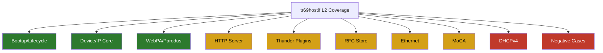
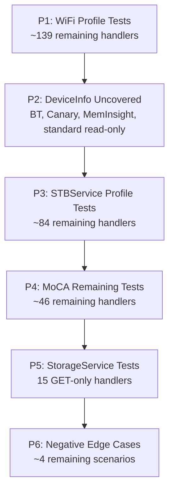

# L2 Functional Test Coverage

## Overview

This document provides the detailed L2 coverage view for the functional test suite.
It restores the richer format with summary, layout, infrastructure notes, current
coverage detail, heat map, pending gaps to reach 100%, and parameter count analysis.

Last analyzed: June 29, 2026.

---

## Test Coverage Summary

| Metric | Value |
|---|---:|
| Total source functions (approx baseline) | ~761 |
| Functions with direct L2 coverage | ~313 |
| Functions with no current L2 coverage (estimated) | ~448 |
| Active L2 test functions | 313 |
| Disabled test functions via skip/xfail decorators | 0 |
| Runtime skip paths detected | 1 |
| Active feature scenarios | 355 |
| Test files active | 25 |
| Feature files active | 29 |
| Estimated current L2 coverage | ~41.1% |
| Target L2 coverage | 100% |

Coverage calculation:

- `313 / 761 = 41.1%`
- Remaining estimated gap: `761 - 313 = 448`

---

## Test Suite Layout

```text
test/functional-tests/
├── features/                                   # BDD feature specs
│   ├── tr69hostif_bootup_sequence.feature
│   ├── tr69hostif_handlers_communications.feature
│   ├── tr69hostif_deviceip.feature
│   ├── tr69hostif_webpa.feature
│   ├── tr69hostif_http_server.feature
│   ├── tr69hostif_ethernet_handlers.feature
│   ├── tr69hostif_moca.feature
│   ├── tr69hostif_rfc_store.feature
│   ├── tr69hostif_thunder_negative_edge_cases.feature
│   └── ... (total 29 feature files)
└── tests/                                      # Runnable pytest tests
    ├── test_bootup_sequence.py
    ├── test_handlers_communications.py
    ├── tr69hostif_deviceip.py
    ├── tr69hostif_ip.py
    ├── tr69hostif_webpa.py
    ├── tr69hostif_http_server.py
    ├── tr69hostif_ethernet_handlers.py
    ├── tr69hostif_moca.py
    ├── tr69hostif_rfc_store.py
    ├── tr69hostif_thunder_negative_edge_cases.py
    └── ... (total 25 runnable test files)
```

Test runner: pytest with `@pytest.mark.run(order=N)` sequencing.

Interfaces exercised:

- rbus DML via rbuscli
- mock parodus flows
- HTTP server endpoint flows
- Thunder mock flows
- log scraping

---

## Infrastructure Notes

| Component | Status | Notes |
|---|---|---|
| Test fixture orchestration | Partial | No global rollback fixture baseline documented in this file |
| BDD execution wiring | Mixed | Features are present; tests run as pytest modules |
| Order tagging | Needs cleanup | 313 tags, 306 unique values, 7 duplicates |
| Static skip/xfail decorators | None found | No `@pytest.mark.skip` or `@pytest.mark.xfail` decorators |
| Runtime skip behavior | Present | 1 runtime skip path in Thunder negative tests when port bind fails |
| Test/feature map consistency | Partial | 25 mapped test files, 4 documentation-only feature files |

Duplicate order values:

- `25` (x2)
- `26` (x2)
- `27` (x2)
- `28` (x2)
- `48` (x2)
- `49` (x2)
- `50` (x2)

Runtime skip signal:

- `pytest.skip("Unable to bind Thunder edge mock on 127.0.0.1:9998 ...")`

---

## Detailed Current Coverage

### Per-Test-File Detail

| Test File | Tests |
|---|---:|
| test_bootup_sequence.py | 18 |
| test_handlers_communications.py | 10 |
| tr69hostif_account_thunder_plugin.py | 2 |
| tr69hostif_authservice_thunder_plugin.py | 3 |
| tr69hostif_custom.py | 34 |
| tr69hostif_deviceip.py | 4 |
| tr69hostif_devicetime.py | 15 |
| tr69hostif_dhcpv4.py | 4 |
| tr69hostif_ethernet_handlers.py | 24 |
| tr69hostif_http_server.py | 8 |
| tr69hostif_ip.py | 47 |
| tr69hostif_ipremotesupport.py | 5 |
| tr69hostif_moca.py | 53 |
| tr69hostif_negative_edge_cases.py | 4 |
| tr69hostif_networkmanager_endpoint_thunder_plugin.py | 7 |
| tr69hostif_networkmanager_ssid_thunder_plugin.py | 7 |
| tr69hostif_processor_processstatus.py | 8 |
| tr69hostif_rfc_store_params.py | 12 |
| tr69hostif_rfc_store.py | 4 |
| tr69hostif_std_params.py | 9 |
| tr69hostif_system_thunder_plugin.py | 2 |
| tr69hostif_thunder_negative_edge_cases.py | 3 |
| tr69hostif_webpa_negative_edge_cases.py | 6 |
| tr69hostif_webpa_rdkdlmgr.py | 7 |
| tr69hostif_webpa.py | 17 |
| Total | 313 |

### Per-Feature-File Detail

| Feature File | Scenarios |
|---|---:|
| tr69hostif_account_thunder_plugin.feature | 2 |
| tr69hostif_authservice_thunder_plugin.feature | 3 |
| tr69hostif_bootup_sequence.feature | 18 |
| tr69hostif_custom.feature | 5 |
| tr69hostif_deviceip.feature | 9 |
| tr69hostif_devicetime.feature | 10 |
| tr69hostif_dhcpv4.feature | 4 |
| tr69hostif_ethernet_handlers.feature | 24 |
| tr69hostif_ethernet.feature | 13 |
| tr69hostif_handlers_communications.feature | 20 |
| tr69hostif_http_server.feature | 14 |
| tr69hostif_ip.feature | 12 |
| tr69hostif_ipremotesupport.feature | 5 |
| tr69hostif_moca.feature | 53 |
| tr69hostif_negative_edge_cases.feature | 4 |
| tr69hostif_negative_tests.feature | 28 |
| tr69hostif_networkmanager_endpoint_thunder_plugin.feature | 7 |
| tr69hostif_networkmanager_ssid_thunder_plugin.feature | 8 |
| tr69hostif_processor_processstatus.feature | 8 |
| tr69hostif_rfc_store_params.feature | 12 |
| tr69hostif_rfc_store.feature | 4 |
| tr69hostif_std_params.feature | 9 |
| tr69hostif_system_thunder_plugin.feature | 1 |
| tr69hostif_thunder_negative_edge_cases.feature | 3 |
| tr69hostif_thunder_plugins.feature | 21 |
| tr69hostif_time_chrony.feature | 29 |
| tr69hostif_webpa_negative_edge_cases.feature | 6 |
| tr69hostif_webpa_rdkdlmgr.feature | 7 |
| tr69hostif_webpa.feature | 16 |
| Total | 355 |

### Bootup Sequence (orders 1–18)

All tests are log-scrape checks — they verify messages appear (or are absent) after daemon startup.

| Order | Area Tested | Method |
|---|---|---|
| 1–2 | HTTP/JSON server thread start | Log: `"SERVER: Started server successfully."` |
| 3 | Parodus connection init | Log: `"Initiating Connection with PARODUS success.."` |
| 4 | Thread creation success | Log absence: `"pthread_create() failed"` |
| 5 | rbus DML registration | Log: `"rbus_regDataElements registered successfully"` |
| 6 | Config manager init | Log absence: `"Failed to hostIf_initalize_ConfigManger()"` |
| 7–8 | IARM bus init + `getPwrContInterface` thread | Log positive |
| 9 | Data model XML merge pipeline | Log: `"Successfully merged Data Model"` |
| 10 | Data model load | Log: `"Successfully initialize Data Model"` |
| 11 | Ethernet client thread start | Log: `"checkForUpdates] Got lock.."` |
| 12 | Bootstrap config file load | Log: `"/opt/secure/RFC/bootstrap.ini"` |
| 13 | Device manager (dsClient) init | Log: `"Device manager Initialized success"` |
| 14 | WebPA/parodus thread start | Log: `"Starting WEBPA Parodus Connections"` |
| 15–16 | PowerController start + callback register | Log positive |
| 17 | No fatal errors in full log | Negative sweep: no `FATAL`/`CRITICAL` |
| 18 | RFC default store | File `/tmp/rfcdefaults.ini` + rbus GET of `…RFC.Feature.Airplay.Enable` |

### RFC / Handler Parameters (orders 19–28)

All via rbuscli SET + GET roundtrip (rbus DML path).

| Order | TR-181 Parameter | Dir | Type |
|---|---|---|---|
| 19 | `Device.DeviceInfo.X_RDKCENTRAL-COM_RFC.Feature.Telemetry.Version` | SET+GET | string |
| 20 | `Device.DeviceInfo.X_RDKCENTRAL-COM_RFC.Feature.DHCPv6Client.Enable` | SET+GET | boolean |
| 20 | `Device.Time.NTPServer1` | SET+GET | string |
| 21 | `Device.DeviceInfo.X_RDKCENTRAL-COM_RFC.Feature.HdmiCecSink.CECVersion` | SET+GET | string |
| 21 | `Device.DeviceInfo.X_RDKCENTRAL-COM_RFC.Feature.SWDLSpLimit.Enable` | SET+GET | boolean |
| 21 | `Device.DeviceInfo.X_RDKCENTRAL-COM_RFC.Feature.SWDLSpLimit.TopSpeed` | SET+GET | int |
| 21 | `Device.DeviceInfo.X_RDKCENTRAL-COM_RFC.Feature.eMMCFirmware.Version` | SET+GET | string |
| 21 | `Device.DeviceInfo.X_RDKCENTRAL-COM_RFC.Feature.IncrementalCDL.Enable` | SET+GET | boolean |
| 22 | `Device.DeviceInfo.X_RDKCENTRAL-COM_IPRemoteSupport.Enable` | SET+GET | boolean |
| 22 | `Device.DeviceInfo.X_RDKCENTRAL-COM_xOpsDeviceMgmt.ForwardSSH.Enable` | SET+GET | boolean |
| 22 | `Device.DeviceInfo.X_RDKCENTRAL-COM_FirmwareDownloadDeferReboot` | SET+GET | boolean |
| 22 | `Device.DeviceInfo.X_RDKCENTRAL-COM_xOpsDeviceMgmt.RPC.FirmwareDownloadCompletedNotification` | SET+GET | boolean |
| 23 | `Device.DeviceInfo.X_RDKCENTRAL-COM_RFC.Bootstrap.PartnerProductName` | SET+GET | string |
| 23 | `Device.DeviceInfo.X_RDKCENTRAL-COM_RFC.Bootstrap.NetflixESNprefix` | SET+GET | string |
| 23 | `Device.DeviceInfo.X_RDKCENTRAL-COM_RFC.Bootstrap.PartnerName` | SET+GET | string |
| 23 | `Device.DeviceInfo.X_RDKCENTRAL-COM_RFC.Bootstrap.SsrUrl` | SET+GET | string |
| 24 | `Device.DeviceInfo.X_RDKCENTRAL-COM_RFC.Bootstrap.PartnerProductName` + file persistence | SET+GET+file | string |
| 25 | `Device.DeviceInfo.SoftwareVersion` | GET | string |
| 25 | `Device.DeviceInfo.ModelName` | GET | string |
| 25 | `Device.DeviceInfo.X_COMCAST-COM_FirmwareFilename` | GET | string |
| 25 | `Device.DeviceInfo.X_RDKCENTRAL-COM_RFC.Feature.MEMSWAP.Enable` | SET+GET | boolean |
| 26 | `Device.IP.Interface.1.IPv4Address.1.Enable` | GET | boolean |
| 26 | `Device.IP.Interface.1.IPv6Enable` | GET | boolean |
| 26 | `Device.IP.Interface.1.IPv6Address.1.Enable` through `.ValidLifetime` (x9) | GET | mixed |
| 26 | `Device.IP.Interface.1.IPv6Prefix.1.*` (x3) | GET | mixed |
| 26 | `Device.IP.Interface.1.IPv6AddressNumberOfEntries` | GET | int |
| 27 | `Device.Services.STBServiceNumberOfEntries` | GET | int |
| 28 | `Device.DeviceInfo.X_RDKCENTRAL-COM_xOpsDeviceMgmt.ReverseSSH.xOpsReverseSshStatus` | GET | string |
| 28 | `Device.DeviceInfo.X_RDKCENTRAL-COM_xOpsDeviceMgmt.ReverseSSH.xOpsReverseSshTrigger` | SET | string |
| 28 | `Device.DeviceInfo.X_RDKCENTRAL-COM_xOpsDeviceMgmt.ReverseSSH.xOpsReverseSshArgs` | SET | string |

### WebPA / Parodus (orders 29–50)

Via mock parodus binary with JSON payloads. Validation reads `/opt/logs/parodus.log`.

| Order | TR-181 Parameter | Op | Verification |
|---|---|---|---|
| 29–30 | `Device.DeviceInfo.X_RDKCENTRAL-COM_RFC.Control.XconfUrl` | SET→GET | statusCode 200, value roundtrip |
| 31–32 | `Device.DeviceInfo.X_RDKCENTRAL-COM_RFC.Feature.FWUpdate.AutoExcluded.Enable` | SET→GET | statusCode 200, `"false"` |
| 33–34 | `Device.DeviceInfo.X_RDKCENTRAL-COM_RFC.LogUpload.LogServerUrl` | SET→GET | statusCode 200 |
| 35 | `Device.DeviceInfo.X_RDKCENTRAL-COM_RFC.Feature.SWDLSpLimit.LowSpeed` | GET | `"12800"` |
| 36 | `Device.DeviceInfo.X_RDKCENTRAL-COM_FirmwareDownloadProtocol` | GET | `"http"` |
| 37–40 | Firmware state parameters (Status, URL, ToDownload, UpdateState) | GET | presence/value |
| 41 | `Device.DeviceInfo.` (wildcard) | GET | statusCode 200 |
| 42–44 | FW upgrade: Protocol, URL, Image | SET × 3 | statusCode 200 |
| 45 | `Device.DeviceInfo.X_RDKCENTRAL-COM_FirmwareDownloadNow` | SET | statusCode 200 + log |
| 46–50 | Thunder negative edge cases (timeout, empty response, mid-request kill) | GET | NOK + log |

---

### Category Distribution

| Category | Test Functions |
|---|---:|
| Device/IP Core | 56 |
| MoCA | 53 |
| Custom/DeviceInfo | 43 |
| WebPA/Parodus | 30 |
| Ethernet | 24 |
| Thunder Plugins | 24 |
| Bootup/Lifecycle | 18 |
| RFC/Bootstrap Store | 16 |
| Time/Chrony | 15 |
| Handler Communications | 10 |
| HTTP Server | 8 |
| Processor/ProcessStatus | 8 |
| DHCPv4 | 4 |
| Negative/Edge Cases | 4 |

---

## Coverage Heat Map



Legend:

- Green: strong coverage density
- Amber: partial coverage or coverage quality follow-up needed
- Red: limited coverage area and high priority to expand

---

## Coverage Gaps

This section lists every handler function and TR-181 data model parameter that currently
has **no runnable L2 test**. Sourced directly from profile header files.

Estimated remaining gap: **~448 items** against the ~761 baseline.

---

### Gap 1 — Device.DeviceInfo (uncovered handlers)

Source: `src/hostif/profiles/DeviceInfo/Device_DeviceInfo.h`

Handlers with no test (confirmed absent from test files):

| TR-181 Parameter | Handler Function | Dir |
|---|---|---|
| `Device.DeviceInfo.Manufacturer` | `get_Device_DeviceInfo_Manufacturer` | GET |
| `Device.DeviceInfo.ManufacturerOUI` | `get_Device_DeviceInfo_ManufacturerOUI` | GET |
| `Device.DeviceInfo.Description` | `get_Device_DeviceInfo_Description` | GET |
| `Device.DeviceInfo.ProductClass` | `get_Device_DeviceInfo_ProductClass` | GET |
| `Device.DeviceInfo.SerialNumber` | `get_Device_DeviceInfo_SerialNumber` | GET |
| `Device.DeviceInfo.HardwareVersion` | `get_Device_DeviceInfo_HardwareVersion` | GET |
| `Device.DeviceInfo.AdditionalHardwareVersion` | `get_Device_DeviceInfo_AdditionalHardwareVersion` | GET |
| `Device.DeviceInfo.AdditionalSoftwareVersion` | `get_Device_DeviceInfo_AdditionalSoftwareVersion` | GET |
| `Device.DeviceInfo.ProvisioningCode` | `get_Device_DeviceInfo_ProvisioningCode` | GET |
| `Device.DeviceInfo.UpTime` | `get_Device_DeviceInfo_UpTime` | GET |
| `Device.DeviceInfo.FirstUseDate` | `get_Device_DeviceInfo_FirstUseDate` | GET |
| `Device.DeviceInfo.MemoryStatus.Total` | `get_Device_DeviceInfo_MemoryStatus_Total` | GET |
| `Device.DeviceInfo.MemoryStatus.Free` | `get_Device_DeviceInfo_MemoryStatus_Free` | GET |
| `Device.DeviceInfo.VendorConfigFileNumberOfEntries` | `get_Device_DeviceInfo_VendorConfigFileNumberOfEntries` | GET |
| `Device.DeviceInfo.SupportedDataModelNumberOfEntries` | `get_Device_DeviceInfo_SupportedDataModelNumberOfEntries` | GET |
| `Device.DeviceInfo.ProcessorNumberOfEntries` | `get_Device_DeviceInfo_ProcessorNumberOfEntries` | GET |
| `Device.DeviceInfo.VendorLogFileNumberOfEntries` | `get_Device_DeviceInfo_VendorLogFileNumberOfEntries` | GET |
| `Device.DeviceInfo.X_RDKCENTRAL-COM_Reset` | `get_Device_DeviceInfo_X_RDKCENTRAL_COM_Reset` | GET |
| `Device.DeviceInfo.X_RDKCENTRAL-COM_Reset` | `set_Device_DeviceInfo_X_RDKCENTRAL_COM_Reset` | SET |
| `Device.DeviceInfo.X_RDKCENTRAL-COM_IPRemoteSupport.IpAddress` | `get_Device_DeviceInfo_X_RDKCENTRAL_COM_IPRemoteSupportIpaddress` | GET |
| `Device.DeviceInfo.X_RDKCENTRAL-COM_IPRemoteSupport.MACAddress` | `get_Device_DeviceInfo_X_RDKCENTRAL_COM_IPRemoteSupportMACaddress` | GET |
| `Device.DeviceInfo.X_RDKCENTRAL-COM_xOpsDeviceMgmt.RPC.XRPollingAction` | `get_Device_DeviceInfo_X_RDKCENTRAL_COM_XRPollingAction` | GET+SET |
| `Device.DeviceInfo.X_RDKCENTRAL-COM_RDKRemoteDebugger.IssueType` | `set_Device_DeviceInfo_X_RDKCENTRAL_COM_RDKRemoteDebuggerIssueType` | SET |
| `Device.DeviceInfo.X_RDKCENTRAL-COM_RDKRemoteDebugger.WebCfgData` | `set_Device_DeviceInfo_X_RDKCENTRAL_COM_RDKRemoteDebuggerWebCfgData` | SET |
| `Device.DeviceInfo.X_RDKCENTRAL-COM_Canary.WakeUpStart` | `set_Device_DeviceInfo_X_RDKCENTRAL_COM_Canary_wakeUpStart` | SET |
| `Device.DeviceInfo.X_RDKCENTRAL-COM_Canary.WakeUpEnd` | `set_Device_DeviceInfo_X_RDKCENTRAL_COM_Canary_wakeUpEnd` | SET |
| `Device.DeviceInfo.X_RDKCENTRAL-COM_MemInsight.Trigger` | `set_Device_DeviceInfo_X_RDKCENTRAL_COM_MemInsight_Trigger` | SET |
| `Device.DeviceInfo.X_RDKCENTRAL-COM_MemInsight.Enable` | `set_Device_DeviceInfo_X_RDKCENTRAL_COM_MemInsight_Enable` | SET |
| `Device.DeviceInfo.X_RDKCENTRAL-COM_RebootStopEnable` | `set_Device_DeviceInfo_X_RDKCENTRAL_COM_RebootStopEnable` | SET |

---

### Gap 2 — Device.DeviceInfo.ProcessStatus (uncovered)

Source: `src/hostif/profiles/DeviceInfo/Device_DeviceInfo_ProcessStatus.h`

| TR-181 Parameter | Handler Function | Dir |
|---|---|---|
| `Device.DeviceInfo.ProcessStatus.CPUUsage` | `get_Device_DeviceInfo_ProcessStatus_CPUUsage` | GET |

---

### Gap 3 — Device.Time (uncovered handlers)

Source: `src/hostif/profiles/Time/Device_Time.h`

Handlers already covered: `Enable`, `Status`, `NTPServer1–5`, `CurrentLocalTime`, `LocalTimeZone`, `CurrentUTCTime`, `Chrony_Enable`, `NTPMaxstep`, `NTPServerSettings` via `tr69hostif_devicetime.py` and `test_handlers_communications.py`.

Handlers still missing:

| TR-181 Parameter | Handler Function | Dir |
|---|---|---|
| `Device.Time.Enable` | `set_Device_Time_Enable` | SET |
| `Device.Time.LocalTimeZone` | `set_Device_Time_LocalTimeZone` | SET |

---

### Gap 4 — Device.InterfaceStack (zero coverage)

Source: `src/hostif/profiles/InterfaceStack/Device_InterfaceStack.h`

| TR-181 Parameter | Handler Function | Dir |
|---|---|---|
| `Device.InterfaceStackNumberOfEntries` | `get_Device_InterfaceStackNumberOfEntries` | GET |
| `Device.InterfaceStack.{i}.HigherLayer` | `get_Device_InterfaceStack_HigherLayer` | GET |
| `Device.InterfaceStack.{i}.LowerLayer` | `get_Device_InterfaceStack_LowerLayer` | GET |

---

### Gap 5 — Device.StorageService (zero coverage)

Source: `src/hostif/profiles/StorageService/Service_Storage.h`, `Service_Storage_PhyMedium.h`

Build flag: `WITH_STORAGESERVICE_PROFILE`

| TR-181 Parameter | Handler Function | Dir |
|---|---|---|
| `Device.StorageService.{i}.ClientNumberOfEntries` | `get_Device_StorageSrvc_ClientNumberOfEntries` | GET |
| `Device.StorageService.{i}.PhysicalMedium.{i}.Alias` | `get_Device_Service_StorageMedium_Alias` | GET |
| `Device.StorageService.{i}.PhysicalMedium.{i}.Name` | `get_Device_Service_StorageMedium_Name` | GET |
| `Device.StorageService.{i}.PhysicalMedium.{i}.Vendor` | `get_Device_Service_StorageMedium_Vendor` | GET |
| `Device.StorageService.{i}.PhysicalMedium.{i}.Model` | `get_Device_Service_StorageMedium_Model` | GET |
| `Device.StorageService.{i}.PhysicalMedium.{i}.SerialNumber` | `get_Device_Service_StorageMedium_SerialNumber` | GET |
| `Device.StorageService.{i}.PhysicalMedium.{i}.FirmwareVersion` | `get_Device_Service_StorageMedium_FirmwareVersion` | GET |
| `Device.StorageService.{i}.PhysicalMedium.{i}.ConnectionType` | `get_Device_Service_StorageMedium_ConnectionType` | GET |
| `Device.StorageService.{i}.PhysicalMedium.{i}.Removable` | `get_Device_Service_StorageMedium_Removable` | GET |
| `Device.StorageService.{i}.PhysicalMedium.{i}.Status` | `get_Device_Service_StorageMedium_Status` | GET |
| `Device.StorageService.{i}.PhysicalMedium.{i}.Uptime` | `get_Device_Service_StorageMedium_Uptime` | GET |
| `Device.StorageService.{i}.PhysicalMedium.{i}.SMARTCapable` | `get_Device_Service_StorageMedium_SMARTCapable` | GET |
| `Device.StorageService.{i}.PhysicalMedium.{i}.Health` | `get_Device_Service_StorageMedium_Health` | GET |
| `Device.StorageService.{i}.PhysicalMedium.{i}.HotSwappable` | `get_Device_Service_StorageMedium_HotSwappable` | GET |
| `Device.StorageService.{i}.PhysicalMedium.NumberOfEntries` | `get_Device_Service_StorageMedium_ClientNumberOfEntries` | GET |

---

### Gap 6 — Device.WiFi (zero coverage — build flag `WITH_WIFI_PROFILE`)

Source: `src/hostif/profiles/wifi/Device_WiFi*.h`

#### Device.WiFi top-level

| TR-181 Parameter | Handler Function | Dir |
|---|---|---|
| `Device.WiFi.RadioNumberOfEntries` | `get_Device_WiFi_RadioNumberOfEntries` | GET |
| `Device.WiFi.SSIDNumberOfEntries` | `get_Device_WiFi_SSIDNumberOfEntries` | GET |
| `Device.WiFi.AccessPointNumberOfEntries` | `get_Device_WiFi_AccessPointNumberOfEntries` | GET |
| `Device.WiFi.EndPointNumberOfEntries` | `get_Device_WiFi_EndPointNumberOfEntries` | GET |
| `Device.WiFi.X_RDKCENTRAL-COM_WiFiEnable` | `get_Device_WiFi_EnableWiFi` | GET |
| `Device.WiFi.X_RDKCENTRAL-COM_WiFiEnable` | `set_Device_WiFi_EnableWiFi` | SET |

#### Device.WiFi.Radio.{i}

| TR-181 Parameter | Handler Function | Dir |
|---|---|---|
| `Device.WiFi.Radio.{i}.Enable` | `get_Device_WiFi_Radio_Enable` / `set_Device_WiFi_Radio_Enable` | GET+SET |
| `Device.WiFi.Radio.{i}.Status` | `get_Device_WiFi_Radio_Status` | GET |
| `Device.WiFi.Radio.{i}.Alias` | `get_Device_WiFi_Radio_Alias` / `set_Device_WiFi_Radio_Alias` | GET+SET |
| `Device.WiFi.Radio.{i}.Name` | `get_Device_WiFi_Radio_Name` | GET |
| `Device.WiFi.Radio.{i}.LastChange` | `get_Device_WiFi_Radio_LastChange` | GET |
| `Device.WiFi.Radio.{i}.LowerLayers` | `get_Device_WiFi_Radio_LowerLayers` / `set_Device_WiFi_Radio_LowerLayers` | GET+SET |
| `Device.WiFi.Radio.{i}.Upstream` | `get_Device_WiFi_Radio_Upstream` | GET |
| `Device.WiFi.Radio.{i}.MaxBitRate` | `get_Device_WiFi_Radio_MaxBitRate` | GET |
| `Device.WiFi.Radio.{i}.SupportedFrequencyBands` | `get_Device_WiFi_Radio_SupportedFrequencyBands` | GET |
| `Device.WiFi.Radio.{i}.OperatingFrequencyBand` | `get_Device_WiFi_Radio_OperatingFrequencyBand` / `set_Device_WiFi_Radio_OperatingFrequencyBand` | GET+SET |
| `Device.WiFi.Radio.{i}.SupportedStandards` | `get_Device_WiFi_Radio_SupportedStandards` | GET |
| `Device.WiFi.Radio.{i}.OperatingStandards` | `get_Device_WiFi_Radio_OperatingStandards` / `set_Device_WiFi_Radio_OperatingStandards` | GET+SET |
| `Device.WiFi.Radio.{i}.PossibleChannels` | `get_Device_WiFi_Radio_PossibleChannels` | GET |
| `Device.WiFi.Radio.{i}.ChannelsInUse` | `get_Device_WiFi_Radio_ChannelsInUse` | GET |
| `Device.WiFi.Radio.{i}.Channel` | `get_Device_WiFi_Radio_Channel` / `set_Device_WiFi_Radio_Channel` | GET+SET |
| `Device.WiFi.Radio.{i}.AutoChannelSupported` | `get_Device_WiFi_Radio_AutoChannelSupported` | GET |
| `Device.WiFi.Radio.{i}.AutoChannelEnable` | `get_Device_WiFi_Radio_AutoChannelEnable` / `set_Device_WiFi_Radio_AutoChannelEnable` | GET+SET |
| `Device.WiFi.Radio.{i}.AutoChannelRefreshPeriod` | `get_Device_WiFi_Radio_AutoChannelRefreshPeriod` / `set_Device_WiFi_Radio_AutoChannelRefreshPeriod` | GET+SET |
| `Device.WiFi.Radio.{i}.OperatingChannelBandwidth` | `get_Device_WiFi_Radio_OperatingChannelBandwidth` / `set_Device_WiFi_Radio_OperatingChannelBandwidth` | GET+SET |
| `Device.WiFi.Radio.{i}.ExtensionChannel` | `get_Device_WiFi_Radio_ExtensionChannel` / `set_Device_WiFi_Radio_ExtensionChannel` | GET+SET |
| `Device.WiFi.Radio.{i}.GuardInterval` | `get_Device_WiFi_Radio_GuardInterval` / `set_Device_WiFi_Radio_GuardInterval` | GET+SET |
| `Device.WiFi.Radio.{i}.MCS` | `get_Device_WiFi_Radio_MCS` / `set_Device_WiFi_Radio_MCS` | GET+SET |
| `Device.WiFi.Radio.{i}.TransmitPowerSupported` | `get_Device_WiFi_Radio_TransmitPowerSupported` | GET |
| `Device.WiFi.Radio.{i}.TransmitPower` | `get_Device_WiFi_Radio_TransmitPower` / `set_Device_WiFi_Radio_TransmitPower` | GET+SET |
| `Device.WiFi.Radio.{i}.IEEE80211hSupported` | `get_Device_WiFi_Radio_IEEE80211hSupported` | GET |
| `Device.WiFi.Radio.{i}.IEEE80211hEnabled` | `get_Device_WiFi_Radio_IEEE80211hEnabled` / `set_Device_WiFi_Radio_IEEE80211hEnabled` | GET+SET |
| `Device.WiFi.Radio.{i}.RegulatoryDomain` | `get_Device_WiFi_Radio_RegulatoryDomain` / `set_Device_WiFi_Radio_RegulatoryDomain` | GET+SET |

#### Device.WiFi.Radio.{i}.Stats

| TR-181 Parameter | Handler Function | Dir |
|---|---|---|
| `Device.WiFi.Radio.{i}.Stats.BytesSent` | `get_Device_WiFi_Radio_Stats_BytesSent` | GET |
| `Device.WiFi.Radio.{i}.Stats.BytesReceived` | `get_Device_WiFi_Radio_Stats_BytesReceived` | GET |
| `Device.WiFi.Radio.{i}.Stats.PacketsSent` | `get_Device_WiFi_Radio_Stats_PacketsSent` | GET |
| `Device.WiFi.Radio.{i}.Stats.PacketsReceived` | `get_Device_WiFi_Radio_Stats_PacketsReceived` | GET |
| `Device.WiFi.Radio.{i}.Stats.ErrorsSent` | `get_Device_WiFi_Radio_Stats_ErrorsSent` | GET |
| `Device.WiFi.Radio.{i}.Stats.ErrorsReceived` | `get_Device_WiFi_Radio_Stats_ErrorsReceived` | GET |
| `Device.WiFi.Radio.{i}.Stats.DiscardPacketsSent` | `get_Device_WiFi_Radio_Stats_DiscardPacketsSent` | GET |
| `Device.WiFi.Radio.{i}.Stats.DiscardPacketsReceived` | `get_Device_WiFi_Radio_Stats_DiscardPacketsReceived` | GET |
| `Device.WiFi.Radio.{i}.Stats.NoiseFloor` | `get_Device_WiFi_Radio_Stats_NoiseFloor` | GET |

#### Device.WiFi.SSID.{i}

| TR-181 Parameter | Handler Function | Dir |
|---|---|---|
| `Device.WiFi.SSID.{i}.Enable` | `get_Device_WiFi_SSID_Enable` / `set_Device_WiFi_SSID_Enable` | GET+SET |
| `Device.WiFi.SSID.{i}.Status` | `get_Device_WiFi_SSID_Status` | GET |
| `Device.WiFi.SSID.{i}.Alias` | `get_Device_WiFi_SSID_Alias` / `set_Device_WiFi_SSID_Alias` | GET+SET |
| `Device.WiFi.SSID.{i}.Name` | `get_Device_WiFi_SSID_Name` | GET |
| `Device.WiFi.SSID.{i}.LastChange` | `get_Device_WiFi_SSID_LastChange` | GET |
| `Device.WiFi.SSID.{i}.LowerLayers` | `get_Device_WiFi_SSID_LowerLayers` / `set_Device_WiFi_SSID_LowerLayers` | GET+SET |
| `Device.WiFi.SSID.{i}.BSSID` | `get_Device_WiFi_SSID_BSSID` | GET |
| `Device.WiFi.SSID.{i}.MACAddress` | `get_Device_WiFi_SSID_MACAddress` | GET |
| `Device.WiFi.SSID.{i}.SSID` | `get_Device_WiFi_SSID_SSID` / `set_Device_WiFi_SSID_SSID` | GET+SET |

#### Device.WiFi.SSID.{i}.Stats

| TR-181 Parameter | Handler Function | Dir |
|---|---|---|
| `Device.WiFi.SSID.{i}.Stats.BytesSent` | `get_Device_WiFi_SSID_Stats_BytesSent` | GET |
| `Device.WiFi.SSID.{i}.Stats.BytesReceived` | `get_Device_WiFi_SSID_Stats_BytesReceived` | GET |
| `Device.WiFi.SSID.{i}.Stats.PacketsSent` | `get_Device_WiFi_SSID_Stats_PacketsSent` | GET |
| `Device.WiFi.SSID.{i}.Stats.PacketsReceived` | `get_Device_WiFi_SSID_Stats_PacketsReceived` | GET |
| `Device.WiFi.SSID.{i}.Stats.ErrorsSent` | `get_Device_WiFi_SSID_Stats_ErrorsSent` | GET |
| `Device.WiFi.SSID.{i}.Stats.ErrorsReceived` | `get_Device_WiFi_SSID_Stats_ErrorsReceived` | GET |
| `Device.WiFi.SSID.{i}.Stats.UnicastPacketsSent` | `get_Device_WiFi_SSID_Stats_UnicastPacketsSent` | GET |
| `Device.WiFi.SSID.{i}.Stats.UnicastPacketsReceived` | `get_Device_WiFi_SSID_Stats_UnicastPacketsReceived` | GET |
| `Device.WiFi.SSID.{i}.Stats.DiscardPacketsSent` | `get_Device_WiFi_SSID_Stats_DiscardPacketsSent` | GET |
| `Device.WiFi.SSID.{i}.Stats.DiscardPacketsReceived` | `get_Device_WiFi_SSID_Stats_DiscardPacketsReceived` | GET |
| `Device.WiFi.SSID.{i}.Stats.MulticastPacketsSent` | `get_Device_WiFi_SSID_Stats_MulticastPacketsSent` | GET |
| `Device.WiFi.SSID.{i}.Stats.MulticastPacketsReceived` | `get_Device_WiFi_SSID_Stats_MulticastPacketsReceived` | GET |
| `Device.WiFi.SSID.{i}.Stats.BroadcastPacketsSent` | `get_Device_WiFi_SSID_Stats_BroadcastPacketsSent` | GET |
| `Device.WiFi.SSID.{i}.Stats.BroadcastPacketsReceived` | `get_Device_WiFi_SSID_Stats_BroadcastPacketsReceived` | GET |
| `Device.WiFi.SSID.{i}.Stats.UnknownProtoPacketsReceived` | `get_Device_WiFi_SSID_Stats_UnknownProtoPacketsReceived` | GET |

#### Device.WiFi.EndPoint.{i}

| TR-181 Parameter | Handler Function | Dir |
|---|---|---|
| `Device.WiFi.EndPoint.{i}.Enable` | `get_Device_WiFi_EndPoint_Enable` / `set_Device_WiFi_EndPoint_Enable` | GET+SET |
| `Device.WiFi.EndPoint.{i}.Status` | `get_Device_WiFi_EndPoint_Status` | GET |
| `Device.WiFi.EndPoint.{i}.Alias` | `get_Device_WiFi_EndPoint_Alias` / `set_Device_WiFi_EndPoint_Alias` | GET+SET |
| `Device.WiFi.EndPoint.{i}.ProfileReference` | `get_Device_WiFi_EndPoint_ProfileReference` / `set_Device_WiFi_EndPoint_ProfileReference` | GET+SET |
| `Device.WiFi.EndPoint.{i}.SSIDReference` | `get_Device_WiFi_EndPoint_SSIDReference` | GET |
| `Device.WiFi.EndPoint.{i}.ProfileNumberOfEntries` | `get_Device_WiFi_EndPoint_ProfileNumberOfEntries` | GET |
| `Device.WiFi.EndPoint.{i}.Stats.LastDataDownlinkRate` | `get_Device_WiFi_EndPoint_Stats_LastDataDownlinkRate` | GET |
| `Device.WiFi.EndPoint.{i}.Stats.LastDataUplinkRate` | `get_Device_WiFi_EndPoint_Stats_LastDataUplinkRate` | GET |
| `Device.WiFi.EndPoint.{i}.Stats.SignalStrength` | `get_Device_WiFi_EndPoint_Stats_SignalStrength` | GET |
| `Device.WiFi.EndPoint.{i}.Stats.Retransmissions` | `get_Device_WiFi_EndPoint_Stats_Retransmissions` | GET |
| `Device.WiFi.EndPoint.{i}.WPS.Enable` | `get_Device_WiFi_EndPoint_WPS_Enable` | GET |
| `Device.WiFi.EndPoint.{i}.WPS.ConfigMethodsSupported` | `get_Device_WiFi_EndPoint_WPS_ConfigMethodsSupported` | GET |
| `Device.WiFi.EndPoint.{i}.WPS.ConfigMethodsEnabled` | `get_Device_WiFi_EndPoint_WPS_ConfigMethodsEnabled` | GET |

#### Device.WiFi.X_RDKCENTRAL-COM.ClientRoaming

| TR-181 Parameter | Handler Function | Dir |
|---|---|---|
| `...ClientRoaming.Enable` | `get/set_Device_WiFi_X_Rdkcentral_clientRoaming_Enable` | GET+SET |
| `...PreAssn.ProbeRetryCnt` | `get/set_Device_WiFi_X_Rdkcentral_clientRoaming_PreAssn_ProbeRetryCnt` | GET+SET |
| `...PreAssn.BestThresholdLevel` | `get/set_Device_WiFi_X_Rdkcentral_clientRoaming_PreAssn_BestThresholdLevel` | GET+SET |
| `...PreAssn.BestDeltaLevel` | `get/set_Device_WiFi_X_Rdkcentral_clientRoaming_PreAssn_BestDeltaLevel` | GET+SET |
| `...SelfSteerOverride` | `get/set_Device_WiFi_X_Rdkcentral_clientRoaming_SelfSteerOverride` | GET+SET |
| `...PostAssn.BestDeltaLevelConnected` | `get/set_Device_WiFi_X_Rdkcentral_clientRoaming_PostAssn_BestDeltaLevelConnected` | GET+SET |
| `...PostAssn.BestDeltaLevelDisconnected` | `get/set_Device_WiFi_X_Rdkcentral_clientRoaming_PostAssn_BestDeltaLevelDisconnected` | GET+SET |
| `...PostAssn.SelfSteerThreshold` | `get/set_Device_WiFi_X_Rdkcentral_clientRoaming_PostAssn_SelfSteerThreshold` | GET+SET |
| `...PostAssn.SelfSteerTimeframe` | `get/set_Device_WiFi_X_Rdkcentral_clientRoaming_PostAssn_SelfSteerTimeframe` | GET+SET |
| `...PostAssn.APcontrolThresholdLevel` | `get/set_Device_WiFi_X_Rdkcentral_clientRoaming_PostAssn_APcontrolThresholdLevel` | GET+SET |
| `...PostAssn.APcontrolTimeframe` | `get/set_Device_WiFi_X_Rdkcentral_clientRoaming_PostAssn_APcontrolTimeframe` | GET+SET |
| `...postAssnBackOffTime` | `get/set_Device_WiFi_X_Rdkcentral_clientRoaming_postAssnBackOffTime` | GET+SET |
| `...80211kvrEnable` | `get/set_Device_WiFi_X_Rdkcentral_clientRoaming_80211kvrEnable` | GET+SET |

---

### Gap 7 — Device.Time (SET-side gaps)

Source: `src/hostif/profiles/Time/Device_Time.h`

| TR-181 Parameter | Handler Function | Dir |
|---|---|---|
| `Device.Time.Enable` | `set_Device_Time_Enable` | SET |
| `Device.Time.LocalTimeZone` | `set_Device_Time_LocalTimeZone` | SET |

---

### Gap 8 — Negative and Edge-Case Tests

No negative test scenarios currently exist for the items below.

| Scenario | Expected Outcome |
|---|---|
| GET nonexistent parameter via rbus | rbus EXCEPTION or error response |
| SET string parameter with integer dataType | Type mismatch error in response |
| SET integer parameter with out-of-range value | Error or clamped value |
| GET parameter when Thunder plugin `org.rdk.NetworkManager` is unavailable | NOK / rbus exception |
| GET parameter when Thunder plugin `org.rdk.AuthService` is unavailable | NOK / rbus exception |
| Thunder timeout: plugin holds connection for >10s | curl error 28, `getJsonRPCData failed` in log |
| Thunder empty response: plugin returns `{}` | parse error in log, NOK to caller |
| Thunder server killed mid-request | incomplete JSON parse error in log |
| WebPA malformed JSON payload | parse error from parodus |
| HTTP server POST without CallerID header | HTTP 500 `POST Not Allowed without CallerID` |
| HTTP server empty request body | HTTP 400 `No request data.` |
| HTTP server malformed JSON body | HTTP 400 `Bad Request` |

---

### Gap 9 — Infrastructure Ordering Conflict

7 pytest order values are duplicated — these tests may execute in non-deterministic order:

| Order Value | Conflict Count | Files Involved |
|---|---|---|
| 25 | 2 | `tr69hostif_deviceip.py` and `test_handlers_communications.py` |
| 26 | 2 | same pair |
| 27 | 2 | same pair |
| 28 | 2 | same pair |
| 48 | 2 | Thunder negative edge case overlap |
| 49 | 2 | Thunder negative edge case overlap |
| 50 | 2 | Thunder negative edge case overlap |

### Gap 10 — Documentation-only Feature Files

These feature files have no matching runnable test file:

| Feature File | Existing Equivalent Test File | Action |
|---|---|---|
| `tr69hostif_ethernet.feature` | `tr69hostif_ethernet_handlers.py` | Merge or alias |
| `tr69hostif_negative_tests.feature` | `tr69hostif_negative_edge_cases.py` | Merge or alias |
| `tr69hostif_thunder_plugins.feature` | split across 5 thunder plugin files | Merge or alias |
| `tr69hostif_time_chrony.feature` | `tr69hostif_devicetime.py` | Merge or alias |

---

### Summary Backlog Table

| Gap | Area | Handler/Parameter Count | Priority |
|---|---|---:|---|
| 1 | DeviceInfo uncovered handlers | ~29 | High |
| 2 | ProcessStatus.CPUUsage | 1 | Medium |
| 3 | Time SET-side | 2 | Low |
| 4 | InterfaceStack | 3 | Low |
| 5 | StorageService | 15 | Medium |
| 6 | WiFi (entire subtree) | ~153 | High |
| 7 | Time SET gap | 2 | Low |
| 8 | Negative/edge cases | ~12 | High |
| 9 | Order conflicts | 7 dupes | Medium |
| 10 | Documentation-only features | 4 files | Low |

---

## Complete Coverage Count Analysis

### Counting Methodology

- Unit of coverage in this report: runnable pytest test function.
- Test count source: `^def test_` across functional tests, excluding helper modules.
- Scenario count source: `^\s*Scenario(?: Outline)?:` across feature files.
- Approximate module surface baseline retained from previous analysis: ~761.

### Coverage Count Table

| Category | Count |
|---|---:|
| Baseline module surface (approx) | 761 |
| Implemented runnable tests | 313 |
| Remaining estimated items | 448 |
| Coverage percentage | 41.1% |

---

### Per-Profile Handler Counts and Coverage Status

Updated with June 2026 test counts. Coverage percentages are estimates based on mapping
runnable test functions to known handler surfaces.

| # | Profile Area | TR-181 Namespace | GET | SET | Tests Needed | Covered (est.) | Gap | Coverage |
|---|---|---|:---:|:---:|:---:|:---:|:---:|:---:|
| 1 | **DeviceInfo** | `Device.DeviceInfo.*` | 111 | 61 | **172** | ~67 | ~105 | ~39% |
| 2 | **Ethernet** | `Device.Ethernet.*` | 25 | 5 | **30** | 24 | 6 | ~80% |
| 3 | **IP** | `Device.IP.*` | 73 | 33 | **106** | ~51 | ~55 | ~48% |
| 4 | **DHCPv4** | `Device.DHCPv4.*` | 4 | 0 | **4** | 4 | 0 | 100% |
| 5 | **InterfaceStack** | `Device.InterfaceStack.*` | 2 | 0 | **2** | 0 | 2 | 0% |
| 6 | **MoCA** | `Device.MoCA.*` | 89 | 10 | **99** | 53 | 46 | ~54% |
| 7 | **STBService** | `Device.Services.STBService.*` | 71 | 14 | **85** | ~1 | ~84 | ~1% |
| 8 | **StorageService** | `Device.StorageService.*` | 15 | 0 | **15** | 0 | 15 | 0% |
| 9 | **Time** | `Device.Time.*` | 20 | 17 | **37** | ~20 | ~17 | ~54% |
| 10 | **WiFi** | `Device.WiFi.*` | 132 | 21 | **153** | ~14 | ~139 | ~9% |
| 11 | **Device** | `Device.*` (misc) | 3 | 1 | **4** | 0 | 4 | 0% |
| | **Parameter subtotal** | | **545** | **163** | **707** | **~234** | **~473** | **~33%** |

---

### DeviceInfo Profile — Per-File Breakdown

DeviceInfo is the largest single profile area.

| Source File | GET | SET | Tests Needed | June 2026 Covered | Notes |
|---|:---:|:---:|:---:|:---:|---|
| `Device_DeviceInfo.cpp` | 70 | 59 | 129 | ~50 | tr69hostif_custom.py + std_params + thunder plugins cover majority |
| `Device_DeviceInfo_Processor.cpp` | 1 | 0 | 1 | 1 | `Processor.Architecture` covered in processor_processstatus |
| `Device_DeviceInfo_ProcessStatus.cpp` | 1 | 0 | 1 | 0 | `CPUUsage` not yet tested |
| `Device_DeviceInfo_ProcessStatus_Process.cpp` | 6 | 0 | 6 | 7 | PID, Command, Size, Priority, CPUTime, State, ProcessNumberOfEntries |
| `XrdkBlueTooth.cpp` | 32 | 2 | 34 | 0 | `BLE_TILE_PROFILE` compile guard — no tests |
| `XrdkCentralComRFC.cpp` | 1 | 0 | 1 | 1 | `XRFCStorage::getValue` via rfc_store tests |
| **DeviceInfo TOTAL** | **111** | **61** | **172** | **~59** | |

---

### Non-Parameter Behavioral Scenarios

| Category | Needed | Covered | Gap |
|---|:---:|:---:|:---:|
| HTTP Server (GET, POST, errors, missing CallerID, malformed JSON, empty body) | 8 | 8 | 0 |
| WebPA / Parodus (GET, SET, REPLACE, attributes, wildcard, FW upgrade, negative) | 30 | 30 | 0 |
| RFC Store (read, override precedence, reload trigger, restart consistency) | 10 | ~16 | 0 |
| Daemon lifecycle (start, stop, SIGTERM, re-init, PID file, sd_notify) | 18 | 18 | 0 |
| Thunder plugins (AuthService, NetworkManager, Account, System) | 21 | ~21 | 0 |
| Thunder negative edges (timeout, empty response, mid-request kill) | 3 | 3 | 0 |
| **Behavioral subtotal** | **90** | **~96** | **~0** |

---

### Progress Delta (from earlier state)

| Metric | Earlier | Current | Delta |
|---|---:|---:|---:|
| Runnable tests | 47 | 313 | +266 |
| Feature scenarios | 73 | 355 | +282 |
| Runnable test files | 4 | 25 | +21 |
| Feature files | 4 | 29 | +25 |

---

## Parameter Count Summary

This section preserves the earlier parameter-surface summary model and updates it as a
planning baseline. Values remain approximate and are used for gap planning against the
~761 module-surface estimate.

### Per-Profile Parameter Baseline

| Profile Area | GET | SET | Tests Needed (Baseline) | Current Status |
|---|---:|---:|---:|---|
| DeviceInfo | 111 | 61 | 172 | Partial coverage |
| Ethernet | 25 | 5 | 30 | Improved but not complete |
| IP | 73 | 33 | 106 | Strongly improved |
| DHCPv4 | 4 | 0 | 4 | Limited |
| InterfaceStack | 2 | 0 | 2 | Limited |
| MoCA | 89 | 10 | 99 | Strongly improved but not closed |
| STBService | 71 | 14 | 85 | Partial |
| StorageService | 15 | 0 | 15 | Limited |
| Time | 20 | 17 | 37 | Improved |
| WiFi | 132 | 21 | 153 | Improved, still large surface |
| Device (misc) | 3 | 1 | 4 | Partial |
| Parameter subtotal | 545 | 163 | 707 | Planning baseline |

### Grand Total Planning Baseline

| Category | Tests Needed | Covered (Estimated) | Remaining |
|---|---:|---:|---:|
| Parameter handlers (all profiles) | 707 | 313-equivalent partial mix | Pending |
| Behavioral scenarios | 38 | Partial |
| Negative and edge cases | ~16 | Partial |
| Total baseline | ~761 | 313 | ~448 |

---

## Where We Are NOT — Profile Gap Summary

Quick-reference table showing how much of each profile is still untested.

| Profile | Tests Needed | Have | Missing | Primary Gap Areas |
|---|:---:|:---:|:---:|---|
| `Device.WiFi.*` | 153 | ~14 | **~139** | Radio (27 params), SSID (9), SSID.Stats (15), EndPoint (13), ClientRoaming (13), AccessPoint (~20) |
| `Device.MoCA.*` | 99 | 53 | **46** | AssociatedDevice (17), QoS (10), MeshTable (4), remaining interface params |
| `Device.DeviceInfo.*` | 172 | ~59 | **~113** | BT/Tile (34), RDKRemoteDebugger, Canary, MemInsight, standard read-only params |
| `Device.IP.*` | 106 | ~51 | **~55** | IPv4 SETs (6), IPv6Address/Prefix non-tested params, Interface.Stats SETs |
| `Device.Services.STBService.*` | 85 | ~1 | **~84** | AudioOutput SET/GET (25), eMMC (14), SPDIF (11), SDCard (10), Security (9) |
| `Device.Ethernet.*` | 30 | 24 | **6** | LowerLayers, LastChange, Enable SET, DuplexMode SET |
| `Device.Time.*` | 37 | ~20 | **~17** | `set_Device_Time_Enable`, `set_Device_Time_LocalTimeZone`, remaining SET handlers |
| `Device.StorageService.*` | 15 | 0 | **15** | All PhysicalMedium GET handlers |
| `Device.InterfaceStack.*` | 2 | 0 | **2** | `HigherLayer`, `LowerLayer` |
| `Device.DHCPv4.*` | 4 | 4 | **0** | Fully covered |
| Negative / edge cases | ~16 | ~12 | **~4** | Type-mismatch SET, out-of-range value, additional WebPA errors |

---

## Tests Needed — Prioritised Backlog



| Priority | Area | Remaining Tests | Blocking? |
|---|---|:---:|---|
| P1 | WiFi full profile | ~139 | Yes — 9% coverage on large surface |
| P2 | DeviceInfo uncovered handlers | ~113 | Yes — standard info params unverified |
| P3 | STBService profile | ~84 | Yes — 1% coverage |
| P4 | MoCA remaining | ~46 | No — 54% base exists |
| P5 | StorageService profile | 15 | No — conditional build |
| P6 | Negative/edge cases | ~4 | No — partial coverage exists |
| P7 | InterfaceStack | 2 | No — conditional build |
| P8 | Time SET-side | 2 | No — GET side complete |

---

## Infrastructure Fixes Required

Before new tests can be added reliably, the following infrastructure issues should be resolved:

| Issue | Status | Recommended Fix |
|---|---|---|
| Duplicate `@pytest.mark.run` order values | 7 duplicates (25–28, 48–50) | Renumber conflicting tests to unique sequential slots |
| No `conftest.py` parameter rollback | Missing | Add `conftest.py` with `@pytest.fixture(autouse=True)` that records and restores any SET parameters after each test |
| BDD feature files not wired to pytest-bdd | Features are docs-only | Either wire with step implementations or document formally as specs |
| 4 documentation-only feature files | Naming mismatch | Rename or delete `tr69hostif_ethernet.feature`, `tr69hostif_negative_tests.feature`, `tr69hostif_thunder_plugins.feature`, `tr69hostif_time_chrony.feature` |
| Hardcoded expected values in tests | `"DOCKER"`, `"99.99.15.07"` etc | Extract to `basic_constants.py` with image-specific comments |
| Log isolation absent | Logs not cleared per test | Call `clear_tr69hostiflogs()` at the start of each test |

---

## Related Paths

- test/functional-tests/tests/
- test/functional-tests/features/
- test/docs/L1_Test_Coverage.md
