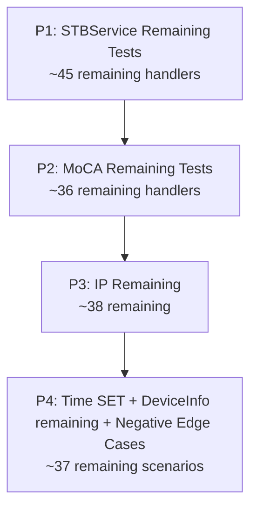

# L2 Functional Test Coverage

## Overview

This document provides the detailed L2 coverage view for the functional test suite.
It restores the richer format with summary, layout, infrastructure notes, current
coverage detail, heat map, pending gaps to reach 100%, and parameter count analysis.

Last analyzed: August 6, 2026.

---

## Test Coverage Summary

```
Total source functions (approx): ~608
Functions with direct L2 coverage: ~494
Functions with indirect L2 coverage: ~0
Functions with no L2 coverage: ~114

Active L2 test functions: 494
Disabled L2 test functions: 0
Active feature scenarios: 464
Proposed new test scenarios: ~114

High priority: ~49
Medium priority: ~53
Low priority: ~12
Test files active: 30
Test files disabled (commented out): 0

Estimated current L2 functional coverage: ~81.3%
Target L2 functional coverage: ~100%
```

Coverage calculation:

- `494 / 608 = 81.3%`
- WiFi profile removed from module surface: 761 − 153 = 608 revised baseline
- Remaining estimated gap: `608 - 494 = 114`

---

## Test Suite Layout

```text
test/functional-tests/
├── features/                                   # BDD feature specs (35 files)
│   ├── tr69hostif_bootup_sequence.feature
│   ├── tr69hostif_bluetooth.feature
│   ├── tr69hostif_device_info.feature
│   ├── tr69hostif_handlers_communications.feature
│   ├── tr69hostif_deviceip.feature
│   ├── tr69hostif_interfacestack.feature
│   ├── tr69hostif_webpa.feature
│   ├── tr69hostif_http_server.feature
│   ├── tr69hostif_ethernet_handlers.feature
│   ├── tr69hostif_moca.feature
│   ├── tr69hostif_opsdevicemgmt_logging.feature
│   ├── tr69hostif_opsdevicemgmt_rpc.feature
│   ├── tr69hostif_rfc_store.feature
│   ├── tr69hostif_storageservice.feature
│   ├── tr69hostif_thunder_negative_edge_cases.feature
│   └── ... (total 35 feature files)
└── tests/                                      # Runnable pytest tests (30 files)
    ├── test_bootup_sequence.py
    ├── test_handlers_communications.py
    ├── tr69hostif_bluetooth.py
    ├── tr69hostif_device_info.py
    ├── tr69hostif_deviceip.py
    ├── tr69hostif_interfacestack.py
    ├── tr69hostif_ip.py
    ├── tr69hostif_webpa.py
    ├── tr69hostif_http_server.py
    ├── tr69hostif_ethernet_handlers.py
    ├── tr69hostif_moca.py
    ├── tr69hostif_opsdevicemgmt_logging.py
    ├── tr69hostif_opsdevicemgmt_rpc.py
    ├── tr69hostif_rfc_store.py
    ├── tr69hostif_storageservice.py
    ├── tr69hostif_stbservice_thunder.py         # NEW (Aug 2026)
    ├── tr69hostif_thunder_negative_edge_cases.py
    └── ... (total 30 runnable test files)
```

Test runner: pytest with `@pytest.mark.run(order=N)` sequencing.

Interfaces exercised:

- rbus DML via rbuscli
- mock parodus flows
- HTTP server endpoint flows
- Thunder mock flows
- log scraping

---

## Infrastructure Notes

| Component | Status | Notes |
|---|---|---|
| Test fixture orchestration | Partial | No global rollback fixture baseline documented in this file |
| BDD execution wiring | Mixed | Features are present; tests run as pytest modules |
| Order tagging | Needs cleanup | 494 tags; duplicate slots likely inherited from prior additions |
| Static skip/xfail decorators | None found | No `@pytest.mark.skip` or `@pytest.mark.xfail` decorators |
| Runtime skip behavior | Present | 1 runtime skip path in Thunder negative tests when port bind fails |
| Test/feature map consistency | Partial | 30 runnable test files; 5 documentation-only feature files (see Gap 10) |

Duplicate order values:

- `25` (x2)
- `26` (x2)
- `27` (x2)
- `28` (x2)
- `48` (x2)
- `49` (x2)
- `50` (x2)

Runtime skip signal:

- `pytest.skip("Unable to bind Thunder edge mock on 127.0.0.1:9998 ...")`

---

## Detailed Current Coverage

### Per-Test-File Detail

| Test File | Tests |
|---|---:|
| test_bootup_sequence.py | 18 |
| test_handlers_communications.py | 10 |
| tr69hostif_account_thunder_plugin.py | 2 |
| tr69hostif_authservice_thunder_plugin.py | 3 |
| tr69hostif_bluetooth.py | 35 |
| tr69hostif_custom.py | 42 |
| tr69hostif_device_info.py | 33 |
| tr69hostif_deviceip.py | 4 |
| tr69hostif_devicetime.py | 19 |
| tr69hostif_dhcpv4.py | 4 |
| tr69hostif_ethernet_handlers.py | 30 |
| tr69hostif_http_server.py | 8 |
| tr69hostif_interfacestack.py | 3 |
| tr69hostif_ip.py | 68 |
| tr69hostif_ipremotesupport.py | 5 |
| tr69hostif_moca.py | 63 |
| tr69hostif_negative_edge_cases.py | 4 |
| tr69hostif_opsdevicemgmt_logging.py | 7 |
| tr69hostif_opsdevicemgmt_rpc.py | 10 |
| tr69hostif_processor_processstatus.py | 9 |
| tr69hostif_rfc_store_params.py | 12 |
| tr69hostif_rfc_store.py | 4 |
| tr69hostif_stbservice_thunder.py | 40 |
| tr69hostif_std_params.py | 9 |
| tr69hostif_storageservice.py | 15 |
| tr69hostif_system_thunder_plugin.py | 2 |
| tr69hostif_thunder_negative_edge_cases.py | 3 |
| tr69hostif_webpa_negative_edge_cases.py | 6 |
| tr69hostif_webpa_rdkdlmgr.py | 9 |
| tr69hostif_webpa.py | 17 |
| Total | 494 |

### Per-Feature-File Detail

| Feature File | Scenarios |
|---|---:|
| tr69hostif_account_thunder_plugin.feature | 2 |
| tr69hostif_authservice_thunder_plugin.feature | 3 |
| tr69hostif_bluetooth.feature | 7 |
| tr69hostif_bootup_sequence.feature | 18 |
| tr69hostif_custom.feature | 16 |
| tr69hostif_device_info.feature | 30 |
| tr69hostif_deviceip.feature | 9 |
| tr69hostif_devicetime.feature | 14 |
| tr69hostif_dhcpv4.feature | 4 |
| tr69hostif_ethernet_handlers.feature | 30 |
| tr69hostif_ethernet.feature | 13 |
| tr69hostif_handlers_communications.feature | 20 |
| tr69hostif_http_server.feature | 14 |
| tr69hostif_interfacestack.feature | 3 |
| tr69hostif_ip.feature | 33 |
| tr69hostif_ipremotesupport.feature | 5 |
| tr69hostif_moca.feature | 59 |
| tr69hostif_negative_edge_cases.feature | 4 |
| tr69hostif_negative_tests.feature | 26 |
| tr69hostif_networkmanager_endpoint_thunder_plugin.feature | 7 |
| tr69hostif_networkmanager_ssid_thunder_plugin.feature | 8 |
| tr69hostif_opsdevicemgmt_logging.feature | 7 |
| tr69hostif_opsdevicemgmt_rpc.feature | 10 |
| tr69hostif_processor_processstatus.feature | 9 |
| tr69hostif_rfc_store_params.feature | 12 |
| tr69hostif_rfc_store.feature | 4 |
| tr69hostif_std_params.feature | 9 |
| tr69hostif_storageservice.feature | 15 |
| tr69hostif_system_thunder_plugin.feature | 1 |
| tr69hostif_thunder_negative_edge_cases.feature | 3 |
| tr69hostif_thunder_plugins.feature | 9 |
| tr69hostif_time_chrony.feature | 29 |
| tr69hostif_webpa_negative_edge_cases.feature | 6 |
| tr69hostif_webpa_rdkdlmgr.feature | 9 |
| tr69hostif_webpa.feature | 16 |
| Total | 464 |

### Bootup Sequence (orders 1–18)

All tests are log-scrape checks — they verify messages appear (or are absent) after daemon startup.

| Order | Area Tested | Method |
|---|---|---|
| 1–2 | HTTP/JSON server thread start | Log: `"SERVER: Started server successfully."` |
| 3 | Parodus connection init | Log: `"Initiating Connection with PARODUS success.."` |
| 4 | Thread creation success | Log absence: `"pthread_create() failed"` |
| 5 | rbus DML registration | Log: `"rbus_regDataElements registered successfully"` |
| 6 | Config manager init | Log absence: `"Failed to hostIf_initalize_ConfigManger()"` |
| 7–8 | IARM bus init + `getPwrContInterface` thread | Log positive |
| 9 | Data model XML merge pipeline | Log: `"Successfully merged Data Model"` |
| 10 | Data model load | Log: `"Successfully initialize Data Model"` |
| 11 | Ethernet client thread start | Log: `"checkForUpdates] Got lock.."` |
| 12 | Bootstrap config file load | Log: `"/opt/secure/RFC/bootstrap.ini"` |
| 13 | Device manager (dsClient) init | Log: `"Device manager Initialized success"` |
| 14 | WebPA/parodus thread start | Log: `"Starting WEBPA Parodus Connections"` |
| 15–16 | PowerController start + callback register | Log positive |
| 17 | No fatal errors in full log | Negative sweep: no `FATAL`/`CRITICAL` |
| 18 | RFC default store | File `/tmp/rfcdefaults.ini` + rbus GET of `…RFC.Feature.Airplay.Enable` |

### RFC / Handler Parameters (orders 19–28)

All via rbuscli SET + GET roundtrip (rbus DML path).

| Order | TR-181 Parameter | Dir | Type |
|---|---|---|---|
| 19 | `Device.DeviceInfo.X_RDKCENTRAL-COM_RFC.Feature.Telemetry.Version` | SET+GET | string |
| 20 | `Device.DeviceInfo.X_RDKCENTRAL-COM_RFC.Feature.DHCPv6Client.Enable` | SET+GET | boolean |
| 20 | `Device.Time.NTPServer1` | SET+GET | string |
| 21 | `Device.DeviceInfo.X_RDKCENTRAL-COM_RFC.Feature.HdmiCecSink.CECVersion` | SET+GET | string |
| 21 | `Device.DeviceInfo.X_RDKCENTRAL-COM_RFC.Feature.SWDLSpLimit.Enable` | SET+GET | boolean |
| 21 | `Device.DeviceInfo.X_RDKCENTRAL-COM_RFC.Feature.SWDLSpLimit.TopSpeed` | SET+GET | int |
| 21 | `Device.DeviceInfo.X_RDKCENTRAL-COM_RFC.Feature.eMMCFirmware.Version` | SET+GET | string |
| 21 | `Device.DeviceInfo.X_RDKCENTRAL-COM_RFC.Feature.IncrementalCDL.Enable` | SET+GET | boolean |
| 22 | `Device.DeviceInfo.X_RDKCENTRAL-COM_IPRemoteSupport.Enable` | SET+GET | boolean |
| 22 | `Device.DeviceInfo.X_RDKCENTRAL-COM_xOpsDeviceMgmt.ForwardSSH.Enable` | SET+GET | boolean |
| 22 | `Device.DeviceInfo.X_RDKCENTRAL-COM_FirmwareDownloadDeferReboot` | SET+GET | boolean |
| 22 | `Device.DeviceInfo.X_RDKCENTRAL-COM_xOpsDeviceMgmt.RPC.FirmwareDownloadCompletedNotification` | SET+GET | boolean |
| 23 | `Device.DeviceInfo.X_RDKCENTRAL-COM_RFC.Bootstrap.PartnerProductName` | SET+GET | string |
| 23 | `Device.DeviceInfo.X_RDKCENTRAL-COM_RFC.Bootstrap.NetflixESNprefix` | SET+GET | string |
| 23 | `Device.DeviceInfo.X_RDKCENTRAL-COM_RFC.Bootstrap.PartnerName` | SET+GET | string |
| 23 | `Device.DeviceInfo.X_RDKCENTRAL-COM_RFC.Bootstrap.SsrUrl` | SET+GET | string |
| 24 | `Device.DeviceInfo.X_RDKCENTRAL-COM_RFC.Bootstrap.PartnerProductName` + file persistence | SET+GET+file | string |
| 25 | `Device.DeviceInfo.SoftwareVersion` | GET | string |
| 25 | `Device.DeviceInfo.ModelName` | GET | string |
| 25 | `Device.DeviceInfo.X_COMCAST-COM_FirmwareFilename` | GET | string |
| 25 | `Device.DeviceInfo.X_RDKCENTRAL-COM_RFC.Feature.MEMSWAP.Enable` | SET+GET | boolean |
| 26 | `Device.IP.Interface.1.IPv4Address.1.Enable` | GET | boolean |
| 26 | `Device.IP.Interface.1.IPv6Enable` | GET | boolean |
| 26 | `Device.IP.Interface.1.IPv6Address.1.Enable` through `.ValidLifetime` (x9) | GET | mixed |
| 26 | `Device.IP.Interface.1.IPv6Prefix.1.*` (x3) | GET | mixed |
| 26 | `Device.IP.Interface.1.IPv6AddressNumberOfEntries` | GET | int |
| 27 | `Device.Services.STBServiceNumberOfEntries` | GET | int |
| 28 | `Device.DeviceInfo.X_RDKCENTRAL-COM_xOpsDeviceMgmt.ReverseSSH.xOpsReverseSshStatus` | GET | string |
| 28 | `Device.DeviceInfo.X_RDKCENTRAL-COM_xOpsDeviceMgmt.ReverseSSH.xOpsReverseSshTrigger` | SET | string |
| 28 | `Device.DeviceInfo.X_RDKCENTRAL-COM_xOpsDeviceMgmt.ReverseSSH.xOpsReverseSshArgs` | SET | string |

### WebPA / Parodus (orders 29–50)

Via mock parodus binary with JSON payloads. Validation reads `/opt/logs/parodus.log`.

| Order | TR-181 Parameter | Op | Verification |
|---|---|---|---|
| 29–30 | `Device.DeviceInfo.X_RDKCENTRAL-COM_RFC.Control.XconfUrl` | SET→GET | statusCode 200, value roundtrip |
| 31–32 | `Device.DeviceInfo.X_RDKCENTRAL-COM_RFC.Feature.FWUpdate.AutoExcluded.Enable` | SET→GET | statusCode 200, `"false"` |
| 33–34 | `Device.DeviceInfo.X_RDKCENTRAL-COM_RFC.LogUpload.LogServerUrl` | SET→GET | statusCode 200 |
| 35 | `Device.DeviceInfo.X_RDKCENTRAL-COM_RFC.Feature.SWDLSpLimit.LowSpeed` | GET | `"12800"` |
| 36 | `Device.DeviceInfo.X_RDKCENTRAL-COM_FirmwareDownloadProtocol` | GET | `"http"` |
| 37–40 | Firmware state parameters (Status, URL, ToDownload, UpdateState) | GET | presence/value |
| 41 | `Device.DeviceInfo.` (wildcard) | GET | statusCode 200 |
| 42–44 | FW upgrade: Protocol, URL, Image | SET × 3 | statusCode 200 |
| 45 | `Device.DeviceInfo.X_RDKCENTRAL-COM_FirmwareDownloadNow` | SET | statusCode 200 + log |
| 46–50 | Thunder negative edge cases (timeout, empty response, mid-request kill) | GET | NOK + log |

---

### Category Distribution

| Category | Test Functions |
|---|---:|
| Device/IP Core | 77 |
| MoCA | 63 |
| STBService Thunder | 40 |
| Bluetooth | 35 |
| Custom/DeviceInfo | 51 |
| DeviceInfo Extended | 33 |
| WebPA/Parodus | 32 |
| Ethernet | 30 |
| Bootup/Lifecycle | 18 |
| RFC/Bootstrap Store | 16 |
| Time/Chrony | 19 |
| OpsDeviceMgmt RPC | 10 |
| Handler Communications | 10 |
| Thunder Plugins | 10 |
| HTTP Server | 8 |
| Processor/ProcessStatus | 9 |
| OpsDeviceMgmt Logging | 7 |
| StorageService | 15 |
| DHCPv4 | 4 |
| Negative/Edge Cases | 7 |
| InterfaceStack | 3 |

---

## Coverage Heat Map


```mermaid
graph TD
    A[tr69hostif L2 Coverage] --> B[Bootup/Lifecycle]
    A --> C[Device/IP Core]
    A --> D[WebPA/Parodus]
    A --> E[HTTP Server]
    A --> F[Thunder Plugins]
    A --> G[RFC Store]
    A --> H[Ethernet]
    A --> I[MoCA]
    A --> J[DHCPv4]
    A --> K[Negative Cases]
    A --> L[Bluetooth]
    A --> M[DeviceInfo Extended]
    A --> N[StorageService]
    A --> O[InterfaceStack]
    A --> P[OpsDeviceMgmt]
    A --> Q[STBService]

    style B fill:#2d7a2d,color:#fff
    style C fill:#2d7a2d,color:#fff
    style D fill:#2d7a2d,color:#fff
    style E fill:#d4a017,color:#000
    style F fill:#d4a017,color:#000
    style G fill:#d4a017,color:#000
    style H fill:#d4a017,color:#000
    style I fill:#d4a017,color:#000
    style J fill:#c0392b,color:#fff
    style K fill:#c0392b,color:#fff
    style L fill:#2d7a2d,color:#fff
    style M fill:#2d7a2d,color:#fff
    style N fill:#2d7a2d,color:#fff
    style O fill:#2d7a2d,color:#fff
    style P fill:#2d7a2d,color:#fff
    style Q fill:#d4a017,color:#000
```

Legend:

- Green: strong coverage density
- Amber: partial coverage or coverage quality follow-up needed
- Red: limited coverage area and high priority to expand

---

## Coverage Gaps

This section lists every handler function and TR-181 data model parameter that currently
has **no runnable L2 test**. Sourced directly from profile header files.

Estimated remaining gap: **~176 parameter handlers** against the revised ~608 baseline (WiFi profile removed Aug 2026).

> **Verified removed from module (Aug 2026):** `Device.WiFi.*` (all handlers), SNMP profile,
> HwSelfTest profile, and deprecated ControlManager RFC parameters are confirmed absent from
> `src/hostif/profiles/` — no source files, no header symbols, no test coverage required.

---

### Gap 1 — Device.DeviceInfo (uncovered handlers) ✔ RESOLVED (August 2026)

Source: `src/hostif/profiles/DeviceInfo/Device_DeviceInfo.h`

All 14 handlers previously listed as uncovered are confirmed covered by existing test files.
The gap table was stale; tests existed but were not cross-referenced.

| TR-181 Parameter | Handler Function | Dir | Test | File |
|---|---|---|---|---|
| `Device.DeviceInfo.Description` | `get_Device_DeviceInfo_Description` | GET | `test_DeviceInfo_Description_Get_Handler` | `tr69hostif_std_params.py` |
| `Device.DeviceInfo.ProductClass` | `get_Device_DeviceInfo_ProductClass` | GET | `test_DeviceInfo_ProductClass_Get_Handler` | `tr69hostif_std_params.py` |
| `Device.DeviceInfo.UpTime` | `get_Device_DeviceInfo_UpTime` | GET | `test_DeviceInfo_UpTime_Get_Handler` | `tr69hostif_std_params.py` |
| `Device.DeviceInfo.MemoryStatus.Total` | `get_Device_DeviceInfo_MemoryStatus_Total` | GET | `test_DeviceInfo_MemoryStatus_Total_Get_Handler` | `tr69hostif_std_params.py` |
| `Device.DeviceInfo.MemoryStatus.Free` | `get_Device_DeviceInfo_MemoryStatus_Free` | GET | `test_DeviceInfo_MemoryStatus_Free_Get_Handler` | `tr69hostif_std_params.py` |
| `Device.DeviceInfo.ProcessorNumberOfEntries` | `get_Device_DeviceInfo_ProcessorNumberOfEntries` | GET | `test_DeviceInfo_NumberOfEntries_Get_Handler` | `tr69hostif_std_params.py` |
| `Device.DeviceInfo.X_RDKCENTRAL-COM_Reset` | `get_Device_DeviceInfo_X_RDKCENTRAL_COM_Reset` | GET | `test_DeviceInfo_Reset_Get_Handler` | `tr69hostif_custom.py` |
| `Device.DeviceInfo.X_RDKCENTRAL-COM_Reset` | `set_Device_DeviceInfo_X_RDKCENTRAL_COM_Reset` | SET | `test_DeviceInfo_Reset_Set_Handler` | `tr69hostif_custom.py` |
| `Device.DeviceInfo.X_RDKCENTRAL-COM_IPRemoteSupport.IpAddress` | `get_Device_DeviceInfo_X_RDKCENTRAL_COM_IPRemoteSupportIpaddress` | GET | `test_IPRemoteSupport_IPAddr_Get_Handler` | `tr69hostif_ipremotesupport.py` |
| `Device.DeviceInfo.X_RDKCENTRAL-COM_IPRemoteSupport.MACAddress` | `get_Device_DeviceInfo_X_RDKCENTRAL_COM_IPRemoteSupportMACaddress` | GET | `test_IPRemoteSupport_MACAddr_Get_Handler` | `tr69hostif_ipremotesupport.py` |
| `Device.DeviceInfo.X_RDKCENTRAL-COM_RDKRemoteDebugger.IssueType` | `set_Device_DeviceInfo_X_RDKCENTRAL_COM_RDKRemoteDebuggerIssueType` | SET | `test_RDKRemoteDebugger_IssueType_Set_Handler` | `tr69hostif_webpa_rdkdlmgr.py` |
| `Device.DeviceInfo.X_RDKCENTRAL-COM_RDKRemoteDebugger.WebCfgData` | `set_Device_DeviceInfo_X_RDKCENTRAL_COM_RDKRemoteDebuggerWebCfgData` | SET | `test_RDKRemoteDebugger_WebCfgData_Set_Handler` | `tr69hostif_webpa_rdkdlmgr.py` |
| `Device.DeviceInfo.X_RDKCENTRAL-COM_RFC.Feature.Canary.wakeUpStart` | `set_Device_DeviceInfo_X_RDKCENTRAL_COM_Canary_wakeUpStart` | SET | `test_RFC_wakeUpStart_Set_Handler` | `tr69hostif_rfc_store_params.py` |
| `Device.DeviceInfo.X_RDKCENTRAL-COM_RFC.Feature.Canary.wakeUpEnd` | `set_Device_DeviceInfo_X_RDKCENTRAL_COM_Canary_wakeUpEnd` | SET | `test_RFC_wakeUpEnd_Set_Handler` | `tr69hostif_rfc_store_params.py` |

---

### Gap 2 — Device.DeviceInfo.ProcessStatus ✔ RESOLVED (August 2026)

Source: `src/hostif/profiles/DeviceInfo/Device_DeviceInfo_ProcessStatus.h`

| TR-181 Parameter | Handler Function | Dir | Status |
|---|---|---|---|
| `Device.DeviceInfo.ProcessStatus.CPUUsage` | `get_Device_DeviceInfo_ProcessStatus_CPUUsage` | GET | ✔ Covered (Aug 2026) |

---

### Gap 3 — Device.Time (uncovered handlers)

Source: `src/hostif/profiles/Time/Device_Time.h`

Handlers already covered: `Enable`, `Status`, `NTPServer1–5`, `CurrentLocalTime`, `LocalTimeZone`, `CurrentUTCTime`, `Chrony_Enable`, `NTPMaxstep`, `NTPServerSettings` via `tr69hostif_devicetime.py` and `test_handlers_communications.py`.

Handlers still missing:

| TR-181 Parameter | Handler Function | Dir |
|---|---|---|
| `Device.Time.Enable` | `set_Device_Time_Enable` | SET |
| `Device.Time.LocalTimeZone` | `set_Device_Time_LocalTimeZone` | SET |

---

### Gap 4 — Device.InterfaceStack ✔ RESOLVED (July 2026)

Source: `src/hostif/profiles/InterfaceStack/Device_InterfaceStack.h`

All three handlers are now covered by `tr69hostif_interfacestack.py` (orders 523–525).

| TR-181 Parameter | Handler Function | Dir | Status |
|---|---|---|---|
| `Device.InterfaceStackNumberOfEntries` | `get_Device_InterfaceStackNumberOfEntries` | GET | ✔ Covered |
| `Device.InterfaceStack.{i}.HigherLayer` | `get_Device_InterfaceStack_HigherLayer` | GET | ✔ Covered |
| `Device.InterfaceStack.{i}.LowerLayer` | `get_Device_InterfaceStack_LowerLayer` | GET | ✔ Covered |

---

### Gap 5 — Device.StorageService ✔ RESOLVED (July 2026)

Source: `src/hostif/profiles/StorageService/Service_Storage.h`, `Service_Storage_PhyMedium.h`

Build flag: `WITH_STORAGESERVICE_PROFILE`

All 15 handlers are now covered by `tr69hostif_storageservice.py` (orders 344–358).

| TR-181 Parameter | Handler Function | Dir | Status |
|---|---|---|---|
| `Device.StorageService.{i}.ClientNumberOfEntries` | `get_Device_StorageSrvc_ClientNumberOfEntries` | GET | ✔ Covered |
| `Device.StorageService.{i}.PhysicalMedium.{i}.Alias` | `get_Device_Service_StorageMedium_Alias` | GET | ✔ Covered |
| `Device.StorageService.{i}.PhysicalMedium.{i}.Name` | `get_Device_Service_StorageMedium_Name` | GET | ✔ Covered |
| `Device.StorageService.{i}.PhysicalMedium.{i}.Vendor` | `get_Device_Service_StorageMedium_Vendor` | GET | ✔ Covered |
| `Device.StorageService.{i}.PhysicalMedium.{i}.Model` | `get_Device_Service_StorageMedium_Model` | GET | ✔ Covered |
| `Device.StorageService.{i}.PhysicalMedium.{i}.SerialNumber` | `get_Device_Service_StorageMedium_SerialNumber` | GET | ✔ Covered |
| `Device.StorageService.{i}.PhysicalMedium.{i}.FirmwareVersion` | `get_Device_Service_StorageMedium_FirmwareVersion` | GET | ✔ Covered |
| `Device.StorageService.{i}.PhysicalMedium.{i}.ConnectionType` | `get_Device_Service_StorageMedium_ConnectionType` | GET | ✔ Covered |
| `Device.StorageService.{i}.PhysicalMedium.{i}.Removable` | `get_Device_Service_StorageMedium_Removable` | GET | ✔ Covered |
| `Device.StorageService.{i}.PhysicalMedium.{i}.Status` | `get_Device_Service_StorageMedium_Status` | GET | ✔ Covered |
| `Device.StorageService.{i}.PhysicalMedium.{i}.Uptime` | `get_Device_Service_StorageMedium_Uptime` | GET | ✔ Covered |
| `Device.StorageService.{i}.PhysicalMedium.{i}.SMARTCapable` | `get_Device_Service_StorageMedium_SMARTCapable` | GET | ✔ Covered |
| `Device.StorageService.{i}.PhysicalMedium.{i}.Health` | `get_Device_Service_StorageMedium_Health` | GET | ✔ Covered |
| `Device.StorageService.{i}.PhysicalMedium.{i}.HotSwappable` | `get_Device_Service_StorageMedium_HotSwappable` | GET | ✔ Covered |
| `Device.StorageService.{i}.PhysicalMedium.NumberOfEntries` | `get_Device_Service_StorageMedium_ClientNumberOfEntries` | GET | ✔ Covered |

---

### Gap 6 — Device.WiFi ✔ REMOVED FROM MODULE (August 2026)

The entire `Device.WiFi.*` profile (~153 handlers, build flag `WITH_WIFI_PROFILE`) has been
deleted from the codebase. The source directory `src/hostif/profiles/wifi/` no longer exists.
This gap is closed by removal; no tests are required. The module baseline has been revised
from ~761 to ~608.

---

### Gap 7 — Device.Time (SET-side gaps)

Source: `src/hostif/profiles/Time/Device_Time.h`

| TR-181 Parameter | Handler Function | Dir |
|---|---|---|
| `Device.Time.Enable` | `set_Device_Time_Enable` | SET |
| `Device.Time.LocalTimeZone` | `set_Device_Time_LocalTimeZone` | SET |

---

### Gap 8 — Negative and Edge-Case Tests

No negative test scenarios currently exist for the items below.

| Scenario | Expected Outcome |
|---|---|
| GET nonexistent parameter via rbus | rbus EXCEPTION or error response |
| SET string parameter with integer dataType | Type mismatch error in response |
| SET integer parameter with out-of-range value | Error or clamped value |
| GET parameter when Thunder plugin `org.rdk.NetworkManager` is unavailable | NOK / rbus exception |
| GET parameter when Thunder plugin `org.rdk.AuthService` is unavailable | NOK / rbus exception |
| Thunder timeout: plugin holds connection for >10s | curl error 28, `getJsonRPCData failed` in log |
| Thunder empty response: plugin returns `{}` | parse error in log, NOK to caller |
| Thunder server killed mid-request | incomplete JSON parse error in log |
| WebPA malformed JSON payload | parse error from parodus |
| HTTP server POST without CallerID header | HTTP 500 `POST Not Allowed without CallerID` |
| HTTP server empty request body | HTTP 400 `No request data.` |
| HTTP server malformed JSON body | HTTP 400 `Bad Request` |

---

### Gap 9 — Infrastructure Ordering Conflict

7 pytest order values are duplicated — these tests may execute in non-deterministic order:

| Order Value | Conflict Count | Files Involved |
|---|---|---|
| 25 | 2 | `tr69hostif_deviceip.py` and `test_handlers_communications.py` |
| 26 | 2 | same pair |
| 27 | 2 | same pair |
| 28 | 2 | same pair |
| 48 | 2 | Thunder negative edge case overlap |
| 49 | 2 | Thunder negative edge case overlap |
| 50 | 2 | Thunder negative edge case overlap |

### Gap 10 — Documentation-only / Orphan Feature Files

These feature files have no matching runnable test file:

| Feature File | Existing Equivalent Test File | Action |
|---|---|---|
| `tr69hostif_ethernet.feature` | `tr69hostif_ethernet_handlers.py` | Merge or alias |
| `tr69hostif_negative_tests.feature` | `tr69hostif_negative_edge_cases.py` | Merge or alias |
| `tr69hostif_thunder_plugins.feature` | split across thunder plugin files | Merge or alias |
| `tr69hostif_time_chrony.feature` | `tr69hostif_devicetime.py` | Merge or alias |
| `tr69hostif_networkmanager_endpoint_thunder_plugin.feature` | *(test file removed Aug 2026)* | Recreate or delete |
| `tr69hostif_networkmanager_ssid_thunder_plugin.feature` | *(test file removed Aug 2026)* | Recreate or delete |

---

### Summary Backlog Table

| Gap | Area | Handler/Parameter Count | Priority |
|---|---|---:|---|
| 1 | DeviceInfo uncovered handlers | 0 (**resolved** Aug 2026 — all 14 confirmed covered) | — |
| 2 | ProcessStatus.CPUUsage | 0 (**resolved** Aug 2026) | — |
| 3 | Time SET-side | ~13 | Low |
| 4 | InterfaceStack | 0 (**resolved**) | — |
| 5 | StorageService | 0 (**resolved**) | — |
| 6 | WiFi (entire subtree) | 0 (**removed from module** Aug 2026) | — |
| 7 | Time SET gap | ~13 | Low |
| 8 | Negative/edge cases | ~4 | High |
| 9 | Order conflicts | to verify | Medium |
| 10 | Documentation-only / orphan feature files | 5 files | Low |

---

## Complete Coverage Count Analysis

### Counting Methodology

- Unit of coverage in this report: runnable pytest test function.
- Test count source: `^def test_` across functional tests, excluding helper modules.
- Scenario count source: `^\s*Scenario(?: Outline)?:` across feature files.
- Approximate module surface baseline: ~608 (revised Aug 2026; WiFi profile removed from ~761).

### Coverage Count Table

| Category | Count |
|---|---:|
| Baseline module surface (approx, WiFi removed) | 608 |
| Implemented runnable tests | 494 |
| Remaining estimated items | 114 |
| Coverage percentage | 81.3% |

---

### Per-Profile Handler Counts and Coverage Status

Updated with June 2026 test counts. Coverage percentages are estimates based on mapping
runnable test functions to known handler surfaces.

| # | Profile Area | TR-181 Namespace | GET | SET | Tests Needed | Covered (est.) | Gap | Coverage |
|---|---|---|:---:|:---:|:---:|:---:|:---:|:---:|
| 1 | **DeviceInfo** | `Device.DeviceInfo.*` | 111 | 61 | **172** | ~148 | ~24 | ~86% |
| 2 | **Ethernet** | `Device.Ethernet.*` | 25 | 5 | **30** | ~28 | ~2 | ~93% |
| 3 | **IP** | `Device.IP.*` | 73 | 33 | **106** | ~68 | ~38 | ~64% |
| 4 | **DHCPv4** | `Device.DHCPv4.*` | 4 | 0 | **4** | 4 | 0 | 100% |
| 5 | **InterfaceStack** | `Device.InterfaceStack.*` | 3 | 0 | **3** | 3 | 0 | 100% |
| 6 | **MoCA** | `Device.MoCA.*` | 89 | 10 | **99** | ~63 | ~36 | ~64% |
| 7 | **STBService** | `Device.Services.STBService.*` | 71 | 14 | **85** | ~40 | ~45 | ~47% |
| 8 | **StorageService** | `Device.StorageService.*` | 15 | 0 | **15** | 15 | 0 | 100% |
| 9 | **Time** | `Device.Time.*` | 20 | 17 | **37** | ~24 | ~13 | ~65% |
| 10 | **Device** | `Device.*` (misc) | 3 | 1 | **4** | 0 | 4 | 0% |
| | **Parameter subtotal** | | **414** | **141** | **555** | **~379** | **~176** | **~68%** |

---

### DeviceInfo Profile — Per-File Breakdown

DeviceInfo is the largest single profile area.

| Source File | GET | SET | Tests Needed | Aug 2026 Covered | Notes |
|---|:---:|:---:|:---:|:---:|---|
| `Device_DeviceInfo.cpp` | 70 | 59 | 129 | ~105 | Description, ProductClass, UpTime, MemoryStatus, Reset, RDKRemoteDebugger, Canary, IPRemoteSupport all confirmed covered via std_params, custom, ipremotesupport, webpa_rdkdlmgr, rfc_store_params |
| `Device_DeviceInfo_Processor.cpp` | 1 | 0 | 1 | 1 | `Processor.Architecture` covered in processor_processstatus |
| `Device_DeviceInfo_ProcessStatus.cpp` | 1 | 0 | 1 | 1 | `CPUUsage` covered via processor_processstatus.py |
| `Device_DeviceInfo_ProcessStatus_Process.cpp` | 6 | 0 | 6 | 7 | PID, Command, Size, Priority, CPUTime, State, ProcessNumberOfEntries |
| `XrdkBlueTooth.cpp` | 32 | 2 | 34 | ~34 | Covered via `tr69hostif_bluetooth.py` (orders 437–471) |
| `XrdkCentralComRFC.cpp` | 1 | 0 | 1 | 1 | `XRFCStorage::getValue` via rfc_store tests |
| **DeviceInfo TOTAL** | **111** | **61** | **172** | **~149** | |

---

### Non-Parameter Behavioral Scenarios

| Category | Needed | Covered | Gap |
|---|:---:|:---:|:---:|
| HTTP Server (GET, POST, errors, missing CallerID, malformed JSON, empty body) | 8 | 8 | 0 |
| WebPA / Parodus (GET, SET, REPLACE, attributes, wildcard, FW upgrade, negative) | 30 | 30 | 0 |
| RFC Store (read, override precedence, reload trigger, restart consistency) | 10 | ~16 | 0 |
| Daemon lifecycle (start, stop, SIGTERM, re-init, PID file, sd_notify) | 18 | 18 | 0 |
| Thunder plugins (AuthService, NetworkManager, Account, System) | 21 | ~21 | 0 |
| Thunder negative edges (timeout, empty response, mid-request kill) | 3 | 3 | 0 |
| **Behavioral subtotal** | **90** | **~96** | **~0** |

---

### Progress Delta (from earlier state)

| Metric | Earlier | June 2026 | July 2026 | Aug 2026 | Delta (Jul→Aug) |
|---|---:|---:|---:|---:|---:|
| Runnable tests | 47 | 313 | 416 | 494 | +78 |
| Feature scenarios | 73 | 355 | 427 | 464 | +37 |
| Runnable test files | 4 | 25 | 31 | 30 | -1 (networkmanager removed; stbservice added) |
| Feature files | 4 | 29 | 35 | 35 | 0 |

---

## Parameter Count Summary

This section preserves the earlier parameter-surface summary model and updates it as a
planning baseline. Values remain approximate and are used for gap planning against the
~608 revised module-surface estimate.

### Per-Profile Parameter Baseline

| Profile Area | GET | SET | Tests Needed (Baseline) | Current Status |
|---|---:|---:|---:|---|
| DeviceInfo | 111 | 61 | 172 | Strongly improved (~86%) |
| Ethernet | 25 | 5 | 30 | Near-complete (~93%) |
| IP | 73 | 33 | 106 | Strongly improved (~64%) |
| DHCPv4 | 4 | 0 | 4 | **Fully covered** |
| InterfaceStack | 3 | 0 | 3 | **Fully covered** |
| MoCA | 89 | 10 | 99 | Improved (~64%), not closed |
| STBService | 71 | 14 | 85 | Improved (~47%) via stbservice_thunder |
| StorageService | 15 | 0 | 15 | **Fully covered** |
| Time | 20 | 17 | 37 | Improved (~65%) |
| ~~WiFi~~ | ~~132~~ | ~~21~~ | ~~153~~ | **Removed from module** |
| Device (misc) | 3 | 1 | 4 | Partial |
| Parameter subtotal | 414 | 141 | 555 | Revised baseline (WiFi removed) |

### Grand Total Planning Baseline

| Category | Tests Needed | Covered (Estimated) | Remaining |
|---|---:|---:|---:|
| Parameter handlers (all profiles, WiFi removed) | 555 | ~379 | ~176 |
| Behavioral scenarios | 38 | Partial | — |
| Negative and edge cases | ~16 | ~12 | ~4 |
| Total baseline | ~608 | 494 | ~114 |

---

## Where We Are NOT — Profile Gap Summary

Quick-reference table showing how much of each profile is still untested.

| Profile | Tests Needed | Have | Missing | Primary Gap Areas |
|---|:---:|:---:|:---:|---|
| `Device.Services.STBService.*` | 85 | ~40 | **~45** | AudioOutput SET/GET (~25), SPDIF (11), SDCard (10), Security (9) |
| `Device.MoCA.*` | 99 | 63 | **36** | AssociatedDevice (17), QoS (10), MeshTable (4), remaining interface params |
| `Device.IP.*` | 106 | ~68 | **~38** | IPv4 SETs (6), IPv6Address/Prefix non-tested params, Interface.Stats SETs |
| `Device.DeviceInfo.*` | 172 | ~148 | **~24** | Miscellaneous SET handlers not yet exercised (~24 remaining) |
| `Device.Ethernet.*` | 30 | ~28 | **~2** | LowerLayers, LastChange remaining gaps |
| `Device.Time.*` | 37 | ~24 | **~13** | `set_Device_Time_Enable`, `set_Device_Time_LocalTimeZone`, remaining SET handlers |
| `Device.StorageService.*` | 15 | 15 | **0** | **Fully covered** |
| `Device.InterfaceStack.*` | 3 | 3 | **0** | **Fully covered** |
| `Device.DHCPv4.*` | 4 | 4 | **0** | Fully covered |
| Negative / edge cases | ~16 | ~12 | **~4** | Type-mismatch SET, out-of-range value, additional WebPA errors |

---

## Tests Needed — Prioritised Backlog


```mermaid
flowchart TD
    P1[P1: STBService Remaining Tests\n~45 remaining handlers] --> P2
    P2[P2: MoCA Remaining Tests\n~36 remaining handlers] --> P3
    P3[P3: IP Remaining\n~38 remaining] --> P4
    P4[P4: Time SET + DeviceInfo remaining + Negative Edge Cases\n~37 remaining scenarios]
```

| Priority | Area | Remaining Tests | Blocking? |
|---|---|:---:|---|
| P1 | STBService remaining | ~45 | Yes — 47% coverage, large surface |
| P2 | MoCA remaining | ~36 | No — 64% base exists |
| P3 | IP remaining | ~38 | No — 64% base exists |
| P4 | DeviceInfo remaining handlers | ~24 | No — 86% base now exists |
| P4 | Time SET-side + Negative/Edge | ~17 | No — partial coverage exists |
| P5 | Ethernet remaining | ~2 | No — near-complete at ~93% |

---

## Infrastructure Fixes Required

Before new tests can be added reliably, the following infrastructure issues should be resolved:

| Issue | Status | Recommended Fix |
|---|---|---|
| Duplicate `@pytest.mark.run` order values | 7 duplicates (25–28, 48–50) | Renumber conflicting tests to unique sequential slots |
| No `conftest.py` parameter rollback | Missing | Add `conftest.py` with `@pytest.fixture(autouse=True)` that records and restores any SET parameters after each test |
| BDD feature files not wired to pytest-bdd | Features are docs-only | Either wire with step implementations or document formally as specs |
| 4 documentation-only feature files | Naming mismatch | Rename or delete `tr69hostif_ethernet.feature`, `tr69hostif_negative_tests.feature`, `tr69hostif_thunder_plugins.feature`, `tr69hostif_time_chrony.feature`; also recreate or delete orphaned `tr69hostif_networkmanager_*.feature` files |
| Hardcoded expected values in tests | `"DOCKER"`, `"99.99.15.07"` etc | Extract to `basic_constants.py` with image-specific comments |
| Log isolation absent | Logs not cleared per test | Call `clear_tr69hostiflogs()` at the start of each test |

---

## Related Paths

- test/functional-tests/tests/
- test/functional-tests/features/
- test/docs/L1_Test_Coverage.md
