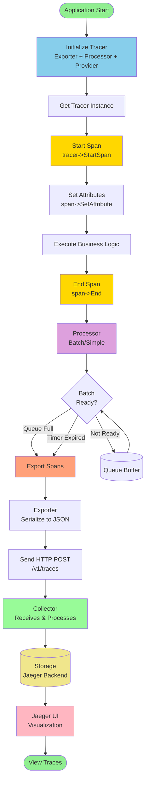

```mermaid
flowchart TD
    Start([Application Start]) --> Init[Initialize Tracer<br/>Exporter + Processor + Provider]
    Init --> GetTracer[Get Tracer Instance]
    GetTracer --> StartSpan[Start Span<br/>tracer->StartSpan]
    StartSpan --> SetAttr[Set Attributes<br/>span->SetAttribute]
    SetAttr --> DoWork[Execute Business Logic]
    DoWork --> EndSpan[End Span<br/>span->End]
  
    
    EndSpan --> Processor[Processor<br/>Batch/Simple]
    Processor --> CheckBatch{Batch<br/>Ready?}
    CheckBatch -->|Queue Full| Export[Export Spans]
    CheckBatch -->|Timer Expired| Export
    CheckBatch -->|Not Ready| Queue[(Queue Buffer)]
    Queue --> CheckBatch
    Export --> Exporter[Exporter<br/>Serialize to JSON]
    Exporter --> HTTP[Send HTTP POST<br/>/v1/traces]
    HTTP --> Collector[Collector<br/>Receives & Processes]
    Collector --> Storage[(Storage<br/>Jaeger Backend)]
    Storage --> UI[Jaeger UI<br/>Visualization]
    UI --> End([View Traces])
    
    style Start fill:#90EE90
    style Init fill:#87CEEB
    style StartSpan fill:#FFD700
    style EndSpan fill:#FFD700
    style Processor fill:#DDA0DD
    style Export fill:#FFA07A
    style Collector fill:#98FB98
    style Storage fill:#F0E68C
    style UI fill:#FFB6C1
    style End fill:#90EE90
```
